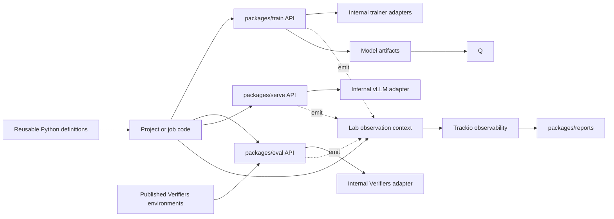

# Post-training platform architecture

Status: target MVP architecture  
Last revised: 2026-07-20

## Purpose

This document defines a small, code-first platform for model onboarding,
serving benchmarks, evaluation, and repeated post-training. Existing scripts
and configuration files are implementation evidence, not compatibility
requirements.

The platform separates four concerns:

1. reusable definitions describe models and proven defaults;
2. jobs compose those definitions into work for one objective;
3. reusable packages execute typed operations;
4. Trackio observes executions and stores their evidence.

The central rule is:

> Git and Python define intent and behavior. Engine packages execute it.
> Trackio records what actually happened.

## Architectural principles

1. **Code first, data when useful.** Jobs, profiles, and package contracts are
   typed Python. TOML or YAML may instantiate a typed config, but no generic
   configuration language controls the platform.
2. **Reuse packages, not runners.** `posttrain.train`, `posttrain.eval`, and
   `posttrain.serve` expose stable project-facing operation APIs. TRL,
   Verifiers, vLLM, and runner or
   adapter objects are replaceable implementation details behind those APIs.
3. **Keep reusable work with its owner.** Train, eval, serve, reports, and
   independently published environment packages have separate release and
   dependency lifecycles and can be consumed by this lab or other projects.
4. **Jobs express objectives, not infrastructure.** A job is a versioned Python
   module containing actions and job-local policy. One job can create many runs
   and can branch from any model artifact.
5. **Profiles are reusable starting definitions.** They do not store results,
   run state, or mutable checkpoint lists.
6. **Artifacts express model lineage.** A new artifact branch does not by
   itself require a new job. Create a new job only for a distinct objective,
   owner, or lifecycle.
7. **Trackio is purely observability.** It stores runs, configuration snapshots,
   metrics, traces, artifacts, and observed lineage. It does not define jobs,
   resolve profiles, schedule work, select winners, or control execution.
8. **Derived results are views.** Reports calculate summaries and comparisons
   from recorded evidence instead of creating another results database.

## System model



The lab injects the Trackio-backed context. Another project can inject its own
observer or no-op context. A job may query prior evidence through
`posttrain.reports`,
but Trackio never becomes the workflow engine.

## Layers

### 1. Shared SDK: `packages/common`

`posttrain.common` contains the lightweight vocabulary used when these reusable packages
are composed into this platform:

- `Job`, `JobAction`, and invocation context;
- model and artifact references;
- execution/observation context protocols and result identity;
- source-revision and provenance types;
- framework-neutral observer, cancellation, and temporary-workspace contracts.

It does not import Trackio, TRL, Verifiers, or vLLM and does not define their
native configuration fields.

### 2. Reusable project-facing packages

| Package | Owns |
| --- | --- |
| `packages/train` | Stable SFT/DPO/RL operations, typed inputs/results, checkpoint behavior, and internal TRL or future framework adapters. |
| `packages/eval` | Stable evaluation operations, typed inputs/results, reusable evaluation programs, and internal Verifiers integration. |
| `packages/serve` | Stable launch/probe/benchmark operations, typed inputs/results, reusable serving profiles, and the internal vLLM integration. |
| `packages/reports` | Read-only evidence queries, versioned calculators, comparisons, and frontend-facing view models. |

Each package is the reusable unit and owns its public contract. Concrete
backend adapters inside it own typed configuration models. There is no
universal trainer, evaluator, or server configuration containing every backend flag.
Heavy dependencies are optional extras or isolated execution environments, for
example `posttrain-train[trl]`, `posttrain-eval[verifiers]`, and
`posttrain-serve[vllm]`.

### 3. Reusable definitions

Reusable definitions are normal importable Python values and factories:

```text
packages/common/.../profiles/       cross-engine model entry points
packages/train/.../profiles/        technique and implementation defaults
packages/eval/.../programs/         general evaluation collections
packages/serve/.../profiles/        backend/family/model serving defaults
packages/serve/.../benchmarks/       workload suites and prompt corpora
```

This keeps ownership explicit. A Qwen vLLM TurboQuant profile ships with the
serve package that implements and tests it. Job code can import it after pulling
that package version; it does not have to reconstruct the profile.

A model profile contains immutable model facts and references to recommended
named definitions. It may expose variants such as standard, MTP, or TurboQuant,
but the backend-native fields remain typed and owned by `packages/serve`.

Python composition replaces generic multi-level YAML inheritance. A definition
may still support `model_copy(update=...)`, a factory argument, or a typed TOML
file when data-only authoring is more convenient.

### 4. Independently published environments

General and domain environments are standalone Verifiers packages. They own
task data, tools, harness behavior, rewards, metrics, validation, dependencies,
and tests. Jobs and reusable eval programs consume qualified package versions.

“General” and “domain-specific” describe curation and use, not different
execution frameworks. A domain environment can be created during a job and
published for reuse without moving its code into the job or eval engine.

### 5. Code-based jobs

A job is an importable Python module with stable identity, metadata, and one or
more explicit actions:

```python
from posttrain.common import ExecutionContext, Job, JobAction
from posttrain.common.profiles import QWEN35_2B
from posttrain.eval import EvaluationRequest, evaluate
from posttrain.serve import BenchmarkRequest, benchmark

JOB = Job(
    id="customer-support/v1",
    version=source_revision,
    name="Select and adapt a support model",
)
SCREEN_FOUNDATIONS = JobAction(
    job_id=JOB.id,
    id="screen-foundations",
    kind="foundation-screening",
)

def screen_foundations(ctx: ExecutionContext) -> None:
    benchmark(ctx, BenchmarkRequest(model=QWEN35_2B, profile="vllm.turboquant_k8"))
    evaluate(ctx, EvaluationRequest(model=QWEN35_2B, program="general.smoke"))
```

The function is ordinary Python: it can loop over candidates, call helpers,
reuse typed definitions, and construct requests conditionally. `apps/lab`
binds the stable job/action identities to an invocation and run attempt; there
is no hidden scheduler or compiled DAG.

A job owns:

- objective, constraints, owners, and success criteria;
- candidate selection and job-local definitions;
- the sequence or branching logic used by its actions;
- thresholds, promotion choices, and decision rationale.

A single action invocation may execute several package operations. Repeating an action creates
new runs under the same job. `invocation_id` correlates runs launched together;
it is not a new hierarchy level.

### 6. Package execution and platform integration

`posttrain.train`, `posttrain.eval`, and `posttrain.serve` can be used directly
by another Python project, CLI, notebook, or service. Their public operation
APIs return typed results and accept an execution context for streaming events,
metrics, traces, artifacts, cancellation, and workspaces. A caller that does
not need observation uses `NullObserver` in that context.

Inside this platform, a job action asks its host context to run a normal package
operation. The host adds an observation envelope that is separate from the
operation's public inputs:

```text
Lab observation envelope
  job_id
  action_id
  invocation_id
  run_kind
  package + operation identity
  resolved public input and internal config
```

`ctx.run(train.sft, ...)` starts Trackio observation and supplies the optional
execution context to `train.sft`. The package validates its inputs, selects its
internal adapter from the concrete config, executes it, and returns its public
result type. Package code does not receive `job_id` and does not require a
`Job` object or Trackio in order to be useful elsewhere.

Changing training frameworks therefore changes the implementation and its
native config behind the `posttrain.train` API, not the job or package-level operation:

```python
ctx.run(train.sft, model=checkpoint, config=trl_config)
ctx.run(train.sft, model=checkpoint, config=torchtune_config)
```

Both executions use the reusable `train.sft` contract and return its public
result shape. Adapter-specific details remain inside the package.

### 7. Trackio observability

Trackio receives an immutable, JSON-safe observation of each execution:

- `job_id`, `action_id`, and optional `invocation_id`;
- run kind and implementation identity/version;
- repository revision and dirty-state digest;
- resolved package-operation inputs and internal implementation config;
- metrics and system telemetry;
- standard inference traces or specialized Verifiers traces;
- consumed and produced artifacts;
- final status and failure information.

Trackio does not store executable Python objects. It stores their resolved wire
representation and source identity. The job source in Git remains authoritative
for intent; Trackio remains authoritative for execution evidence.

### 8. Reports and decisions

`packages/reports` reads Trackio through a stable query boundary and computes:

- run summaries;
- comparisons among runs in one job or across jobs;
- model evidence and regression views;
- artifact lineage;
- durable report snapshots when required.

Trace-level observations and direct run metrics are recorded. Means,
percentiles, rates, totals, and Pareto membership are normally computed.
Human selection and branch decisions remain in job code/documentation and may
be attached as report artifacts for auditability.

## Target repository shape

```text
packages/
  common/
  train/
  eval/
  serve/
  reports/

profiles/
  models/                 typed, importable model definitions

benchmarks/
  inference/
    suites/               token shapes, context, concurrency, repetitions
    corpora/              canonical message records

jobs/
  customer_support/
    job.py                Job and actions
    README.md             objective and human decisions

docs/
  architecture/
  functional/
  decisions/
```

Operation-specific shared definitions live with their owning package. Environment
source lives in separately publishable Verifiers packages.

## Shared versus job-specific

| Concern | Shared | Job-specific |
| --- | --- | --- |
| Job and integration SDK | Types, decorators, observation context | Actions and objective |
| Model entry points | Foundation and promoted model profiles | Selected candidates or exact artifact |
| Training | Reusable package API, internal adapters, and typed profiles | Data, overrides, ordering, hypotheses |
| Evaluation | Reusable package API, general programs, and internal Verifiers adapter | Domain package/config, subset, thresholds |
| Serving | Reusable package API, model profiles, kernels, and internal backend adapters | Workload selection and acceptance criteria |
| Environments | Independently published packages | Selected version and load config |
| Observability | Trackio adapter, schemas, naming conventions | Context tags and retained evidence policy |
| Reporting | Query API and calculators | Cohort, comparison, and decision narrative |

Job-local code should be promoted into a shared owner package when it proves
useful beyond the job. Reuse is a source-code decision, not a Trackio mutation.

## MVP boundaries

The MVP includes:

1. a lightweight code-first job and observation SDK;
2. reusable train, eval, and serve package APIs with one initial internal implementation each;
3. importable model and package-owned train/eval/serve definitions;
4. standalone Verifiers environment packages;
5. code-based jobs with multiple actions and runs;
6. Trackio-only durable observability;
7. read-only computed report views.

The MVP does not include:

- a generic YAML workflow language;
- a universal framework configuration schema;
- a distributed scheduler or compiled DAG;
- public runner objects as the cross-project reuse boundary;
- a custom registry duplicating Python packages, the Hub, or Trackio artifacts;
- automatic model selection or promotion;
- separate hardware/workload profile entity types;
- a second run or results database.

## Architecture documents

- [Layers and ownership](./architecture/layers-and-ownership.md)
- [Profiles and model variants](./architecture/profiles-and-model-variants.md)
- [Evaluation and environments](./architecture/evaluation-and-environments.md)
- [Training and inference](./architecture/training-and-inference.md)
- [Observability](./architecture/observability.md)
- [Trackio architecture](./architecture/trackio.md)
- [Lineage and metadata](./architecture/lineage-and-metadata.md)

## Revision history

- 2026-07-20: Made `posttrain.train`, `posttrain.eval`, and `posttrain.serve` themselves the reusable
  project-facing units; moved framework runners/adapters behind their public
  operation APIs and made the platform observation context injectable.
- 2026-07-20: Made the platform code-first, introduced job actions and typed
  package operations, moved reusable definitions beside their owning packages,
  and made Trackio a pure observability layer rather than an orchestration or
  authoring layer.
- 2026-07-20: Added the inference benchmark-data boundary and read-only reports package.
- 2026-07-19: Defined foundation and promoted model profiles, independent Verifiers environments, and the lifecycle-driven MVP boundary.
