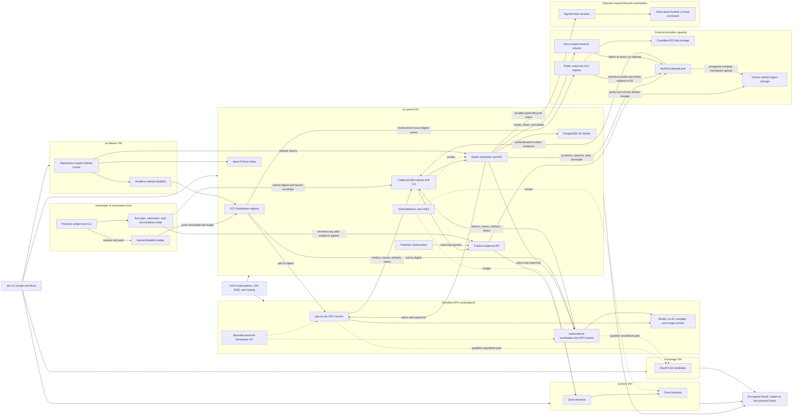
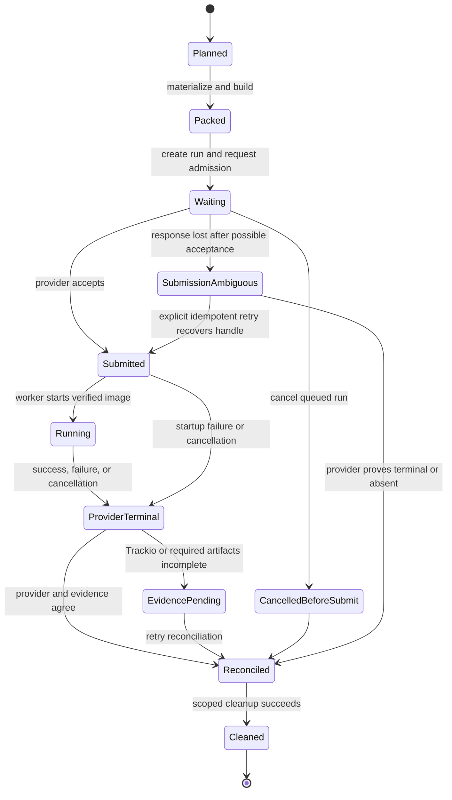
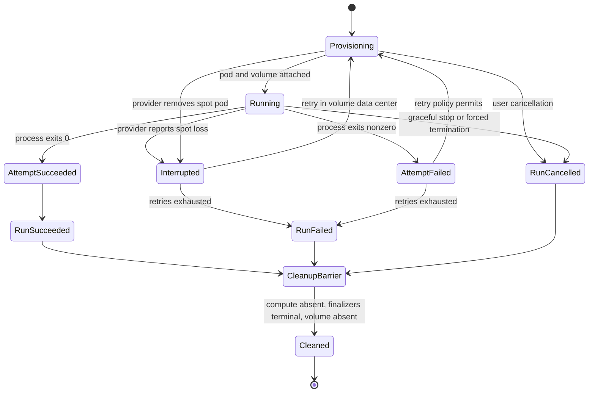
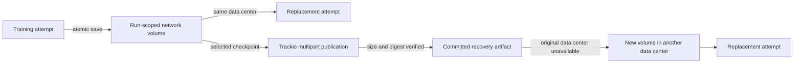
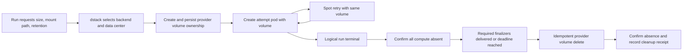

# Infrastructure and job lifecycle

**Status:** current high-level architecture revised on 2026-08-30 from the
Posttrain framework at `841e78aba299972da109b40d1c740404cc4dc42a` and the
adjacent `ai-infra` repository at
`eb4d35cb5a1839f9fb7e3b2256f78dbfbc0d268b`, plus the maintained dstack fork
at `275b81bc725967c8925b5b12d96500dc60a45370`. This is a source/configuration
map, not a live service-health report. Revise this document in place when
service ownership, topology, or the execution lifecycle changes.

The canonical product model remains project -> work package -> run of a job,
with work packages organized into `screen`, `train`, and `qualify`. This
document explains how one such run uses the local infrastructure. It does not
change the frozen product baseline.

## System boundary

Posttrain owns job meaning: catalog resolution, job definitions, project and
work-package configuration, the three-level OCI image model, run identity,
execution manifests, provider-neutral lifecycle, observations, artifacts, and
reconciliation. The `ai-infra` repository owns the operating substrate:
virtual machines, private networking and trust, BuildKit configuration, OCI
and Python registries, dstack, GPU worker enrollment, Trackio deployment,
Doris, Observatory deployment, monitoring, storage candidates, backup, and
retention policy.

The division is deliberate. Infrastructure can schedule and retain any
digest-pinned Posttrain job without deciding what `train.grpo`, `eval.domain`,
or another job kind means. Conversely, the framework can target local Docker
or dstack without importing the concrete infrastructure deployment.

## High-level map

Dashed lines denote operational support or a qualified candidate path rather
than the primary control flow of every job.

## Service and component inventory

| Layer / location | Service or component | Role | Interaction with a normal job | Current architectural status |
| --- | --- | --- | --- | --- |
| Physical host | `dev-v2` Unraid + libvirt | Runs the four dedicated Ubuntu VMs and provides NVMe/array-backed virtual disks | Hosts the service plane; it does not execute Posttrain job code | Authoritative hypervisor for this topology; non-HA |
| Network | UniFi, DHCP reservations, `.lan` DNS, LAN routing | Gives services and workers stable identities and private reachability | Resolves `dstack.lan`, `registry.lan`, `trackio.lan`, and worker hostnames | External network authority; explicit control-host routing overrides are a bounded fallback |
| Developer host | `posttrain` CLI and project | Resolves a work-package job, plans and packs it, creates the run and launch envelope, and manages detached lifecycle commands | Origin of `job plan`, `job pack`, `job run`, status, logs, cancel, reconcile, and cleanup | Framework-owned client/control surface |
| Developer host | `posttrain-builder` Buildx/BuildKit builder | Builds actual-job images with provenance/SBOM and a bounded reusable cache | Pushes the exact job image to `registry.lan` before remote submission | Infrastructure-configured named builder; not a shared scheduling service |
| `ai-control` | Caddy | Private TLS ingress, local CA, hostname routing, Observatory basic auth, and dstack component serving | Front door for dstack, Trackio, registry, Python index, metrics, and Observatory | Shared ingress; credentials and CA remain infrastructure state |
| `ai-control` | dstack | Accepts a digest-pinned image and resource request, selects an eligible GPU worker, starts/stops the task, and retains provider state/logs | Owns remote placement, capacity waiting, startup, cancellation, and provider-terminal state | Authoritative remote scheduler |
| `ai-control` | PostgreSQL | Persists dstack control-plane state | Used indirectly through dstack; jobs never connect to it | dstack-private authoritative database |
| `ai-control` | OCI Distribution registry | Stores immutable framework base images, job-kind images, actual-job images, and release images | Builder pushes; worker pulls the selected image by digest | Authoritative OCI transport; deletion is enabled but must follow scoped retention policy |
| `ai-control` + Cloudflare | External OCI Distribution replica + R2 | Mirrors exact manifests from the LAN registry and serves authenticated public pulls with blob redirects to R2 | A RunPod control plane pulls the same canonical image digest without traversing the LAN for multi-GB blobs | Additive read-only cloud path deployed and canary-qualified; cloud admission must still wait for a verified mirror receipt |
| `ai-control` | Lifecycle hook dispatcher | Persists and delivers typed dstack lifecycle events through generic executors | Notifies site automation after state transitions and runs only bounded pre-provision/pre-run gates | Proposed in ADR 0017; not implemented |
| `ai-control` | devpi | Hosts CarbonTeq development/stable Python packages and mirrors public PyPI | Supplies framework dependencies while images/releases are built; normal packed jobs should not install at runtime | Load-bearing private Python index; released versions are non-volatile |
| `ai-control` | Trackio | Receives run lifecycle, metrics, traces, artifact metadata/lineage, and outcomes through the framework tracking adapter | The running job writes evidence directly; reconciliation reads it back | Default authoritative logical evidence service |
| `ai-control` + artifact storage | Trackio artifact API + S3-compatible blob store | Negotiates resumable multipart uploads, lets a worker send checkpoint bytes directly to short-lived presigned URLs, verifies size and digest, then commits the artifact version and lineage | Provides the durable, cross-provider checkpoint copy independently of the RunPod volume | Separate from the OCI R2 registry; the deployment template defaults to `local` until an externally reachable S3-compatible backend and presign endpoint are configured and qualified |
| `ai-control` | Observatory | Provides read-only Python, HTTP, MCP, report, and frontend views over job-aware Trackio evidence | Lets operators inspect the project -> work package -> run result after and during execution | Production deployment definition; present when an immutable Observatory image is configured |
| `ai-control` | VictoriaMetrics + VMUI | Retains 14 days of bounded infrastructure time series and exposes a lightweight operations UI | Scrapes dstack, service-VM node exporters, and Doris FE/BE every 30 seconds | Infrastructure health plane, separate from run evidence in Trackio |
| `ai-doris` | Apache Doris FE | SQL/query frontend and metadata coordinator for Trackio's Doris engine | Receives Trackio's normalized evidence writes and serves Trackio reads | Authoritative Trackio database frontend in the configured production path; non-HA |
| `ai-doris` | Apache Doris BE | Columnar storage and execution backend for Doris | Stores/query-executes Trackio evidence behind the FE | Authoritative Trackio database backend in the configured production path; non-HA |
| `ai-storage` | RustFS | S3-compatible endpoint for result manifests, blobs, and storage/restore qualification | Infrastructure probes publish and read back results; a selected artifact backend may use S3-compatible blob storage | Pre-1.0 qualification candidate, not yet a second authoritative durable copy |
| Service VMs | node exporter | Exposes host CPU, memory, disk, and OS metrics | No job control; scraped by VictoriaMetrics | Monitoring agent on control, Doris, and storage VMs |
| GPU workstations | dstack runner/shim over SSH fleet | Turns each enrolled workstation into one schedulable GPU block | Pulls and launches the actual-job image, reports state to dstack | Two fixed workers in the current fleet definition |
| GPU workstations | Docker + NVIDIA Container Toolkit | Provides digest-pinned container and CUDA execution | Runs `posttrain-runtime execute` with GPU access | Infrastructure-owned worker runtime |
| GPU workstations | `/var/lib/posttrain` caches and run roots | Retains model downloads, vLLM/compiler caches, checkpoints/scratch, and run-scoped workspace | Avoids embedding large weights in every image and supports resumable execution | Host-local, policy-bounded, not lineage authority |
| GPU workstations | `posttrain-worker-gc` timer | Removes only terminal run workspaces with valid markers after status-specific retention windows | Reclaims scratch after reconciliation while leaving caches and durable evidence alone | Bounded cleanup: 7 days for success, 3 days for failed/cancelled by default |
| RunPod | Attempt pod | Supplies interruptible external GPU capacity and pulls the canonical image before workload hooks run | Runs one attempt; dstack observes provider state, retries interruption, and terminates the pod | Selected first cloud backend; credentials and real provisioning qualification remain pending |
| RunPod | Run-scoped network volume | Retains mutable checkpoints across spot attempts in one Secure Cloud data center | Attached when each attempt pod is created and deleted after the logical-run cleanup barrier | Proposed in ADR 0017; no dstack-owned volume exists yet |
| Operations host | ai-infra hook receiver | Maps signed, allow-listed hook IDs to repository-owned Ansible playbooks or fixed commands | Performs site-specific automation and generic lifecycle reconciliation without changing dstack truth | Proposed; must be independently authenticated and idempotent |
| Optional worker service | Posttrain controller systemd unit | Polls the durable framework run lifecycle for a registered project | Can progress queued/reconciliation work without a foreground CLI | Configured capability, disabled by default in the infrastructure role |
| `ai-release` | GitHub Actions runner | Executes protected candidate and final release workflows only | Builds releases and submits bounded GPU canaries through dstack | Repository-scoped, outbound-only, no automatic PR workloads |
| `ai-release` | Rootless BuildKit + Buildx | Builds release artifacts/images without a privileged Docker daemon | Publishes candidate/final release images to the registry | Release-only builder; separate from the developer's job-image builder |
| Operations host | Nonblocking experiment lease | Serializes infrastructure qualifications or explicitly measured operations | Prevents two operator-run qualifications from contaminating one another | Operational coordination guard, not the ordinary dstack job scheduler |
| Backup plane | Restic repositories on developer and RTX PRO hosts | Encrypts and verifies snapshots of service state, infrastructure state, secrets, and receipts on two physical systems | Protects the control/evidence plane; excludes model weights, caches, full logs, and job packages | Required destruction gate; freshness window is 24 hours |

### Developer and release builders are separate trust domains

The named `posttrain-builder` used by current projects is a per-developer
Docker-container BuildKit daemon. It receives the bounded context produced on
that developer machine, pulls the release-pinned parent through the developer's
network connection when its cache is cold, and pushes only the actual-job
publication. It is not the rootless builder on `ai-release`.

The `ai-release` builder accepts only protected candidate/final workflows and
holds release publication authority. It must not be reused for ordinary job
packing merely to avoid VPN transfer: doing so would mix unreviewed project
contexts, end-user availability and release credentials in one failure domain.

A site may add a third component: a developer job-build service located beside
the registry. That service is optional and separate from `ai-release`. It must
not expose a general BuildKit socket. It accepts only a digest-addressed
Posttrain context, validates its source/data budget and framework release,
selects the framework-owned build definition, publishes into the caller's
project namespace with scoped credentials, and returns the immutable digest and
receipt. With this service, only the bounded context crosses VPN; without it,
the current local-builder path remains correct but its cold parent pull is an
explicit transfer cost.

## General job lifecycle

The image digest identifies immutable job meaning and inputs. The launch
envelope identifies one execution attempt. Re-running the same image therefore
creates a new run without rebuilding merely to change the run ID, target,
timeout, credentials, or mounts.

| Phase | Primary owner | What happens | Durable identity or evidence |
| --- | --- | --- | --- |
| 1. Select and plan | Posttrain project/CLI | Resolve the project, work package, job definition, model/data/environment/inference selections, target constraints, expected artifacts, and observation destination. Validate compatibility without activating the ML backend on the developer machine. | Resolved job meaning, source revision, package inputs, target and evidence plan |
| 2. Materialize and pack | Posttrain execution-pack + data/environment adapters | Materialize bounded datasets, fetch immutable environment sources, build locked wheels, and stage project code, resolved configuration, framework worker, and expected artifact roles. Base weights and mutable checkpoints stay outside the image. | Deterministic package manifest and package key |
| 3. Build and publish | Framework BuildKit adapter using infrastructure builder/registry | Start from the release-pinned universal and job-kind images, add the actual job, run image qualification, push it, and read back the immutable registry digest. | Actual-job image digest, provenance/SBOM, build/publication receipt |
| 4. Create run and admit | Framework execution service | Create the canonical run ID and attempt, bind the image digest to a redacted launch envelope, persist submission intent, and apply provider-appropriate admission. Secrets are referenced by environment-variable name, never serialized into the package. | Run spec, execution request, admission record, submission store, append-only journal |
| 5. Submit and schedule | dstack provider adapter + dstack | Submit idempotently. dstack evaluates resources and host constraints, waits for capacity when configured, chooses a worker, and returns a provider handle. | Framework run ID <-> dstack handle, requested target, assigned worker, provider events |
| 6. Start worker runtime | dstack worker, Docker, registry | Pull the image by digest, attach typed caches/volumes, inject scoped credentials and private-CA trust, then run `posttrain-runtime execute --manifest /opt/posttrain/bundle/.posttrain/job.json`. The runtime verifies the manifest and dependency closure before activation. | Verified worker manifest, image digest, hardware/software context, start event |
| 7. Execute job | Selected job handler and backend adapters | Run data, serve, eval, train, or transform logic. Read base weights from cache; write mutable checkpoints/scratch to typed worker paths; emit through `RunContext`. | Step/request/rollout evidence, native traces, checkpoints, produced artifact refs |
| 8. Persist evidence | Trackio and its selected stores | Trackio receives lifecycle, metrics, traces, artifact metadata and lineage. In the configured path it writes normalized evidence asynchronously to Doris. Blob bytes go through the selected artifact backend; RustFS remains a candidate rather than an assumed durable authority. | Trackio terminal record, Doris rows, artifact refs and consumed/produced lineage |
| 9. Reach provider terminal | dstack | The task succeeds, fails, or is cancelled; dstack finalizes its task state and logs. Cancellation should allow the configured graceful finalization window. | Provider-terminal result and bounded logs |
| 10. Reconcile | Framework execution service | Compare provider-terminal state with Trackio terminal evidence and required artifact roles. Provider success alone is not framework completion. A no-op observer is an explicit exception and makes no durable-evidence claim. | Reconciliation result and atomic terminal marker |
| 11. Inspect and decide | Observatory + project owner | Observatory computes job-aware views over retained evidence. The human or higher-level project workflow accepts, revises, rejects, or branches from produced artifacts. | Read-only views, project decision, artifact lineage into later runs |
| 12. Clean and retain | Framework cleanup, dstack, worker GC, backups | Remove exact disposable provider/workspace state only after reconciliation, retain compact receipts and durable evidence, age out terminal worker directories, and back up the service/control plane. | Cleanup receipt, terminal admission receipt, retained Trackio/Doris evidence, backup evidence |

## Lifecycle state model

`ProviderTerminal` and `Reconciled` are intentionally different. The former
means dstack stopped supervising compute; the latter means Posttrain has enough
consistent provider and evidence state to close the logical run safely.

## The four paths through the infrastructure

| Path | Flow | Authority |
| --- | --- | --- |
| Control | CLI/controller -> framework admission -> dstack -> worker | Posttrain owns logical lifecycle; dstack owns remote placement and task control |
| Image and dependency | devpi/release images -> BuildKit -> OCI registry -> worker Docker | Framework owns image contents and exact digests; infrastructure operates transport, trust, and caches |
| Evidence | job `RunContext` -> Trackio -> Doris -> Observatory | Framework owns evidence contracts; Trackio persists/normalizes; Doris stores; Observatory reads and computes views |
| Operations | node exporters/dstack/Doris -> VictoriaMetrics; VM/control state -> Restic | Infrastructure health and recovery, intentionally separate from experiment evidence |

## Cloud execution, persistent storage, and lifecycle automation

The first external provider is RunPod, integrated through the maintained
dstack fork. This extends the execution substrate; it does not add RunPod or
`ai-infra` concepts to Posttrain's public job model. Posttrain continues to
submit one immutable image, resource constraints, a provider-neutral persistent
workspace request, and retry/retention policy. dstack selects the backend and
owns every provider resource it creates.

### Ownership boundaries

| Concern | Authoritative owner | Extension seam | Must not happen |
| --- | --- | --- | --- |
| Logical job meaning and evidence completion | Posttrain | Provider-neutral storage and retry policy in the execution request | Provider IDs, playbooks, or RunPod settings in reusable framework packages |
| Attempt placement, retry, cancellation, and terminal provider state | dstack core | Backend capability interfaces | A hook declaring a run terminal or inventing a retry |
| Pod and network-volume APIs | dstack RunPod adapter | Typed create, observe, attach, and delete operations | Shell scripts creating untracked provider resources |
| Site preparation and reporting | Operator-owned hook receiver in `ai-infra` | Signed lifecycle webhooks and bounded workload hooks | dstack importing Ansible, Trackio, or repository-local commands |
| Checkpoint production | Training runtime | Periodic atomic writes to the mounted run workspace | Depending on an eviction-time callback for the final checkpoint |
| Checkpoint durability and lineage | Posttrain + Trackio artifact API | Background, verified publication to a configured artifact object store | dstack copying checkpoint bytes or treating a local save as durable publication |
| Trackio reconciliation | Posttrain/`ai-infra` integration | Typed attempt/run lifecycle events with stable correlation IDs | Calling Trackio-specific code from dstack |

RunPod creates the requested container directly. The OCI image is pulled before
a workload hook can execute. Consequently, a workload hook can initialize the
mounted workspace or write application configuration inside the container, but
cannot install host Docker trust, drivers, systemd services, or rescue a failed
image pull. Ansible control hooks remain useful for stable VMs and control-plane
resources; they are not a fictional RunPod host-bootstrap mechanism.

### Attempt and logical-run state

A spot interruption is terminal for one attempt but not necessarily for its
logical run. The dstack server observes RunPod provider state and emits
`attempt.interrupted`; it must not rely on the evicted process to report its own
death. The same run-scoped network volume is attached to the replacement pod,
which constrains the retry to the volume's Secure Cloud data center. SSH loss
is only a fallback classifier when provider state is temporarily unavailable.

There is no guarantee of a last checkpoint at eviction time. Training code
must write checkpoints periodically and atomically to the network volume. The
replacement attempt receives the same logical run ID, a new attempt ID, and a
resume pointer. Trackio reconciliation records the interrupted attempt while
keeping the logical run open until dstack succeeds, exhausts retries, or accepts
cancellation.

### Two-tier checkpoint recovery

Network-volume recovery and Trackio artifact publication are complementary,
not competing storage models:

| Tier | Applies to | Purpose | Recovery behavior |
| --- | --- | --- | --- |
| Mounted run workspace | Required by provider policy for interruptible/spot placement; optional for ordinary on-demand placement | Fast, mutable recovery state within one provider data center | A replacement attempt attaches the same volume and resumes from the newest atomically completed checkpoint |
| Trackio artifact storage | Every workload that publishes checkpoints | Verified durable copy, artifact identity, lineage, and cross-provider portability | A replacement without the original volume downloads the newest verified recovery artifact into a new workspace |

The training runtime first completes an atomic checkpoint in the mounted
workspace. It may then publish selected checkpoints through Trackio in the
background. With Trackio's S3-compatible artifact backend, checkpoint bytes go
directly from the worker to short-lived presigned multipart URLs; Trackio
commits the artifact version only after size and digest verification. This
artifact store is not the OCI registry and does not share the registry's R2
bucket or publication lifecycle.

Checkpoint save cadence and durable publication cadence are separate policy.
Frequent local saves reduce the same-data-center spot-loss window; less frequent
verified publications bound cross-data-center or cross-provider loss without
stalling every training step on a multi-gigabyte upload. A checkpoint is
locally recoverable only after its atomic save completes and durably recoverable
only after Trackio commits the verified artifact. An interrupted upload never
advances the durable recovery pointer.

dstack gives exactly one live attempt the writer lease for a mutable run
workspace. It must not start a replacement writer until the previous allocation
is provider-confirmed absent or fenced; simultaneous writes to one RunPod
network volume can corrupt checkpoint state. The normal retry remains pinned to
the volume's Secure Cloud data center. An explicit portability fallback may
allocate a new volume elsewhere and restore the latest Trackio-verified
checkpoint when same-data-center capacity is unavailable. That fallback may
lose work newer than the durable recovery pointer, but it must never silently
pretend the incomplete local checkpoint was recovered.

### Run-scoped network-volume transaction

The volume record is created in the same durable control plane that owns the
run. It records logical run, mount key, provider/backend, region or data center,
provider resource ID, retention policy, cleanup deadline, and lifecycle state.
A pod is never considered provisioned until its attachment is recorded.

Cleanup is a persisted state machine rather than a terminal shell command. A
completed, failed, or cancelled logical run crosses the cleanup barrier after
compute is absent and required artifact publication has either committed or
reached an explicitly recorded bounded finalization outcome. Required
finalization deliveries may delay deletion only to a bounded deadline. dstack
then marks the volume deleting, invokes the provider delete API idempotently,
confirms absence, and records a receipt. A reconciler retries incomplete
deletion and reports orphaned provider resources after a grace period. An
interrupted attempt does not start volume cleanup while its logical run can
retry.

Named long-lived volumes remain suitable for intentionally shared read-mostly
datasets or caches. Mutable checkpoints default to one run-scoped volume; this
avoids concurrent-writer ambiguity and gives cost and cleanup a single owner.

### Durable lifecycle hooks

dstack records a versioned lifecycle event and its hook-delivery rows in the
same database transaction as the state transition. A dispatcher delivers them
at least once using stable event IDs, idempotency keys, bounded retry, and a
dead-letter state. The primary production executor is a signed webhook. An
optional server-admin command executor may invoke only fixed argument vectors
from protected server configuration, never project-supplied shell text and
never `shell=True`.

The `ai-infra` hook receiver maps allow-listed hook IDs to a repository-owned
Ansible playbook or fixed command. Event payload fields are data, not command
fragments. This permits site-specific behavior without giving dstack knowledge
of inventories, playbook names, Trackio endpoints, certificates, or secrets.

| Phase | Location | Blocking? | Intended use |
| --- | --- | --- | --- |
| `before_provision` | Control | Optional, bounded | External admission or preparation that must precede resource creation |
| `after_provision` | Control | No | Inventory and allocation notification |
| `before_run` | Workload via runner | Optional, bounded | Mount permissions and container-local initialization |
| `attempt.interrupted` | Control | No | Reconcile an evicted attempt and alert operators |
| `attempt.terminal` | Control | No | Attempt-level evidence and accounting |
| `run.terminal` | Control | No | Logical-run finalization and Trackio reconciliation |
| `storage.cleanup.*` | Control | No | Cleanup audit, warning, and cost attribution |

Only `before_provision` and `before_run` may block, and each declares timeout
plus fail-open or fail-closed behavior. Hooks cannot change immutable image or
run identity, provider ownership, terminal truth, or the storage cleanup state
machine.

### Fleet inventory read model

Inventory is a timestamped read model over multiple authorities, not a list of
GPU names with invented availability. The API and CLI return separate sections:

| Section | Meaning | Example source | Required truth labels |
| --- | --- | --- | --- |
| Backends | Configured scheduler integrations and credential health | dstack project config and safe provider probe | configured, disabled, unavailable |
| Retained capacity | Machines the site already owns and enrolls | dstack SSH fleets plus `ai-infra` generated inventory | healthy, busy, offline, stale |
| Provider candidates | Shapes the provider may offer | RunPod catalog | catalog-only, observed availability, price observation time |
| Active allocations | Pods/instances currently tied to attempts | dstack models reconciled with provider APIs | provisioning, running, stopping, missing, interrupted |
| Storage | Named and run-scoped volumes | dstack volume ownership plus provider APIs | attached, retained-for-retry, cleanup-pending, deleting, orphaned |
| Automation | Hook-delivery health | dstack outbox | pending, retrying, delivered, dead-letter |

Every provider-derived record includes `source`, `observed_at`, and freshness.
Unknown, unavailable, and stale are distinct from zero or available. In
particular, a RunPod catalog entry is not displayed as currently available
until a provider availability observation supports that claim.

The most recent retained local qualification snapshot available while this
revision was written is not a live health check:

| Inventory kind | Resource | Recorded hardware/state | Observation |
| --- | --- | --- | --- |
| Retained LAN capacity | `pop-os.lan` | RTX 3070 Ti, 8,192 MiB; healthy and idle | Retained snapshot from 2026-08-25; may be stale |
| Retained LAN capacity | `carbonteq-ai-workstation.lan` | RTX PRO 6000 Blackwell Workstation Edition, 98,304 MiB; healthy and idle | Retained snapshot from 2026-08-25; may be stale |
| Cloud backend | RunPod | No configured backend credential | Unavailable to dstack at this revision |
| Cloud allocations | RunPod pods | None observable through dstack | Unknown, not asserted as zero provider-wide |
| Cloud storage | RunPod network volumes | None owned by dstack | Unknown until credentials and reconciliation exist |

The initial interface is `GET /api/project/{project_name}/inventory` plus
`dstack inventory`, with `capacity`, `allocations`, `storage`, and `automation`
sections. A UI can consume this model later without becoming its authority.

## Invariants and failure boundaries

- dstack never receives an alternate source/data upload for a normal job; the
  digest-pinned actual-job image is the distribution unit.
- An actual-job image contains exact code, configuration, materialized bounded
  datasets, and environment packages. It does not contain credentials, base
  model caches, or mutable checkpoints.
- dstack scheduling and framework admission are separate. dstack owns worker
  capacity and placement; framework state owns idempotency, run identity, and
  the evidence-completion barrier.
- Provider resources created for a run are durably owned by dstack before they
  are exposed to hooks or workload code; hooks cannot create shadow resources.
- A spot interruption is an attempt result. It becomes a logical-run result
  only when retry policy is exhausted or the run is cancelled.
- Spot recovery uses the run-scoped network volume first and a Trackio-verified
  recovery artifact only when the original volume cannot be reused. Neither a
  local save nor an incomplete upload advances the durable recovery pointer.
- One run-scoped volume has at most one unfenced writer attempt.
- Network-volume deletion occurs only through the cleanup barrier, is
  idempotent, and is confirmed against the provider before a cleanup receipt.
- Provider catalog shapes, retained machines, live allocations, and storage
  are separate inventory facts and retain their provenance and freshness.
- PostgreSQL is private dstack state. Doris is Trackio's database. Jobs talk to
  neither database directly.
- VictoriaMetrics answers whether infrastructure is healthy. Trackio and
  Observatory answer what a Posttrain run did and what evidence it produced.
- Trackio/Doris terminal evidence and required artifact roles must agree with
  the provider result before normal cleanup or a completion claim.
- RustFS is shown because it is deployed and qualified as an S3-compatible
  path, but current infrastructure contracts explicitly do not treat it as an
  authoritative off-host durable copy.
- The current topology has single points of failure: one Unraid host, one
  control VM, one Doris FE/BE pair, one registry, and one Trackio service.
  Verified two-host Restic copies protect recovery; they do not make services
  highly available.

## Evidence used to revise this map

Framework ownership and lifecycle are grounded in
`docs/post-training/03-work-and-evidence.md`,
`docs/post-training/04-framework.md`,
`docs/post-training/06-observation-and-lineage.md`,
`docs/plan/framework-oci-job-capsules.md`, and
`docs/plan/dstack-execution-provider.md`.

Checkpoint publication behavior is grounded in the maintained Trackio fork's
`CARBONTEQ_FORK.md` and artifact-storage implementation, the framework Trackio
adapter at
`packages/tracking-trackio/src/posttrain_tracking_trackio/adapter.py`, the TRL
checkpoint callback at
`packages/train/src/posttrain/train/backends/trl/common.py`, and the ai-infra
Trackio environment template at
`../ai-infra/ansible/roles/control/templates/control.env.j2`.

Infrastructure topology and service roles are grounded in the adjacent
repository's `README.md`, `docs/architecture/topology.md`, Compose files under
`ansible/roles/`, worker fleet and role definitions, and the release, builder,
worker, execution-log, and backup runbooks. The retained generated fleet
inventory is used only for the explicitly dated snapshot above; secret state
and live endpoints are deliberately not used as architectural authority.

RunPod constraints are grounded in its
[network-volume](https://docs.runpod.io/storage/network-volumes),
[pod-storage](https://docs.runpod.io/pods/storage/types),
[dstack integration](https://docs.runpod.io/integrations/dstack), and
[Pod API](https://docs.runpod.io/api-reference/pods/GET/pods/podId)
documentation. Network volumes are independent of a pod, data-center-bound,
and attached when creating the pod; container disk is ephemeral, and the
provider pod record exposes lifecycle status. These are external provider
constraints rather than Posttrain product semantics.

## Revision history

- 2026-08-30: added the provider-neutral RunPod extension: attempt-aware spot
  recovery, dstack-owned run-scoped storage and cleanup, durable generic
  lifecycle hooks, ai-infra automation boundary, and truthful fleet inventory.
- 2026-08-30: defined two-tier checkpoint recovery: same-data-center RunPod
  volume reuse for fast spot retry plus independently verified Trackio artifact
  publication for durable and cross-data-center recovery.
- 2026-08-06: created the service inventory, infrastructure map, execution
  lifecycle, state model, authority boundaries, and current candidate/optional
  status markers from the paired framework and infrastructure repositories.
