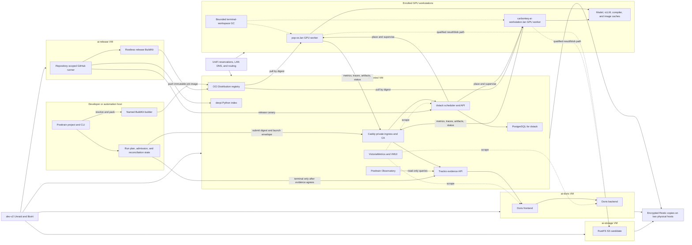
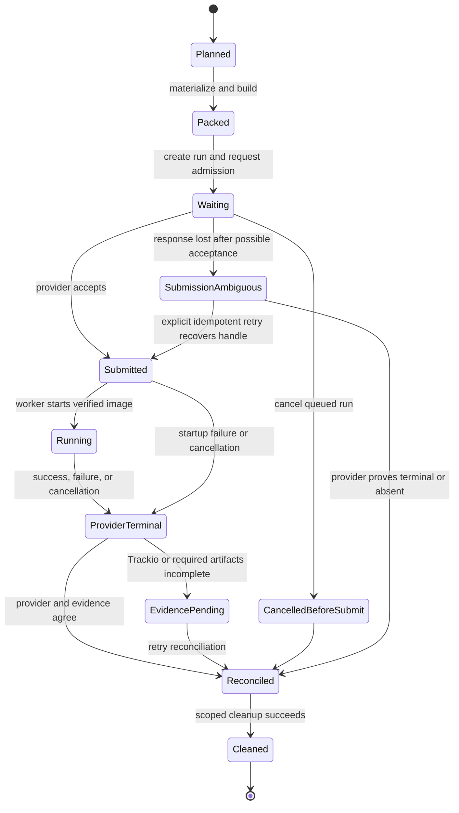

# Infrastructure and job lifecycle

**Status:** current high-level architecture inferred on 2026-08-06 from the
Posttrain framework at `78d329fae89a3448cbe4f89b1744ae684e8e6358` and the
adjacent `ai-infra` repository at
`6462417b0522f49402ff3d6196dd44e6f0707b26`. This is a source/configuration
map, not a live service-health report. Revise this document in place when
service ownership, topology, or the execution lifecycle changes.

The canonical product model remains project -> work package -> run of a job,
with work packages organized into `screen`, `train`, and `qualify`. This
document explains how one such run uses the local infrastructure. It does not
change the frozen product baseline.

## System boundary

Posttrain owns job meaning: catalog resolution, job definitions, project and
work-package configuration, the three-level OCI image model, run identity,
execution manifests, provider-neutral lifecycle, observations, artifacts, and
reconciliation. The `ai-infra` repository owns the operating substrate:
virtual machines, private networking and trust, BuildKit configuration, OCI
and Python registries, dstack, GPU worker enrollment, Trackio deployment,
Doris, Observatory deployment, monitoring, storage candidates, backup, and
retention policy.

The division is deliberate. Infrastructure can schedule and retain any
digest-pinned Posttrain job without deciding what `train.grpo`, `eval.domain`,
or another job kind means. Conversely, the framework can target local Docker
or dstack without importing the concrete infrastructure deployment.

## High-level map

Dashed lines denote operational support or a qualified candidate path rather
than the primary control flow of every job.

## Service and component inventory

| Layer / location | Service or component | Role | Interaction with a normal job | Current architectural status |
| --- | --- | --- | --- | --- |
| Physical host | `dev-v2` Unraid + libvirt | Runs the four dedicated Ubuntu VMs and provides NVMe/array-backed virtual disks | Hosts the service plane; it does not execute Posttrain job code | Authoritative hypervisor for this topology; non-HA |
| Network | UniFi, DHCP reservations, `.lan` DNS, LAN routing | Gives services and workers stable identities and private reachability | Resolves `dstack.lan`, `registry.lan`, `trackio.lan`, and worker hostnames | External network authority; explicit control-host routing overrides are a bounded fallback |
| Developer host | `posttrain` CLI and project | Resolves a work-package job, plans and packs it, creates the run and launch envelope, and manages detached lifecycle commands | Origin of `job plan`, `job pack`, `job run`, status, logs, cancel, reconcile, and cleanup | Framework-owned client/control surface |
| Developer host | `posttrain-builder` Buildx/BuildKit builder | Builds actual-job images with provenance/SBOM and a bounded reusable cache | Pushes the exact job image to `registry.lan` before remote submission | Infrastructure-configured named builder; not a shared scheduling service |
| `ai-control` | Caddy | Private TLS ingress, local CA, hostname routing, Observatory basic auth, and dstack component serving | Front door for dstack, Trackio, registry, Python index, metrics, and Observatory | Shared ingress; credentials and CA remain infrastructure state |
| `ai-control` | dstack | Accepts a digest-pinned image and resource request, selects an eligible GPU worker, starts/stops the task, and retains provider state/logs | Owns remote placement, capacity waiting, startup, cancellation, and provider-terminal state | Authoritative remote scheduler |
| `ai-control` | PostgreSQL | Persists dstack control-plane state | Used indirectly through dstack; jobs never connect to it | dstack-private authoritative database |
| `ai-control` | OCI Distribution registry | Stores immutable framework base images, job-kind images, actual-job images, and release images | Builder pushes; worker pulls the selected image by digest | Authoritative OCI transport; deletion is enabled but must follow scoped retention policy |
| `ai-control` | devpi | Hosts CarbonTeq development/stable Python packages and mirrors public PyPI | Supplies framework dependencies while images/releases are built; normal packed jobs should not install at runtime | Load-bearing private Python index; released versions are non-volatile |
| `ai-control` | Trackio | Receives run lifecycle, metrics, traces, artifact metadata/lineage, and outcomes through the framework tracking adapter | The running job writes evidence directly; reconciliation reads it back | Default authoritative logical evidence service |
| `ai-control` | Observatory | Provides read-only Python, HTTP, MCP, report, and frontend views over job-aware Trackio evidence | Lets operators inspect the project -> work package -> run result after and during execution | Production deployment definition; present when an immutable Observatory image is configured |
| `ai-control` | VictoriaMetrics + VMUI | Retains 14 days of bounded infrastructure time series and exposes a lightweight operations UI | Scrapes dstack, service-VM node exporters, and Doris FE/BE every 30 seconds | Infrastructure health plane, separate from run evidence in Trackio |
| `ai-doris` | Apache Doris FE | SQL/query frontend and metadata coordinator for Trackio's Doris engine | Receives Trackio's normalized evidence writes and serves Trackio reads | Authoritative Trackio database frontend in the configured production path; non-HA |
| `ai-doris` | Apache Doris BE | Columnar storage and execution backend for Doris | Stores/query-executes Trackio evidence behind the FE | Authoritative Trackio database backend in the configured production path; non-HA |
| `ai-storage` | RustFS | S3-compatible endpoint for result manifests, blobs, and storage/restore qualification | Infrastructure probes publish and read back results; a selected artifact backend may use S3-compatible blob storage | Pre-1.0 qualification candidate, not yet a second authoritative durable copy |
| Service VMs | node exporter | Exposes host CPU, memory, disk, and OS metrics | No job control; scraped by VictoriaMetrics | Monitoring agent on control, Doris, and storage VMs |
| GPU workstations | dstack runner/shim over SSH fleet | Turns each enrolled workstation into one schedulable GPU block | Pulls and launches the actual-job image, reports state to dstack | Two fixed workers in the current fleet definition |
| GPU workstations | Docker + NVIDIA Container Toolkit | Provides digest-pinned container and CUDA execution | Runs `posttrain-runtime execute` with GPU access | Infrastructure-owned worker runtime |
| GPU workstations | `/var/lib/posttrain` caches and run roots | Retains model downloads, vLLM/compiler caches, checkpoints/scratch, and run-scoped workspace | Avoids embedding large weights in every image and supports resumable execution | Host-local, policy-bounded, not lineage authority |
| GPU workstations | `posttrain-worker-gc` timer | Removes only terminal run workspaces with valid markers after status-specific retention windows | Reclaims scratch after reconciliation while leaving caches and durable evidence alone | Bounded cleanup: 7 days for success, 3 days for failed/cancelled by default |
| Optional worker service | Posttrain controller systemd unit | Polls the durable framework run lifecycle for a registered project | Can progress queued/reconciliation work without a foreground CLI | Configured capability, disabled by default in the infrastructure role |
| `ai-release` | GitHub Actions runner | Executes protected candidate and final release workflows only | Builds releases and submits bounded GPU canaries through dstack | Repository-scoped, outbound-only, no automatic PR workloads |
| `ai-release` | Rootless BuildKit + Buildx | Builds release artifacts/images without a privileged Docker daemon | Publishes candidate/final release images to the registry | Release-only builder; separate from the developer's job-image builder |
| Operations host | Nonblocking experiment lease | Serializes infrastructure qualifications or explicitly measured operations | Prevents two operator-run qualifications from contaminating one another | Operational coordination guard, not the ordinary dstack job scheduler |
| Backup plane | Restic repositories on developer and RTX PRO hosts | Encrypts and verifies snapshots of service state, infrastructure state, secrets, and receipts on two physical systems | Protects the control/evidence plane; excludes model weights, caches, full logs, and job packages | Required destruction gate; freshness window is 24 hours |

### Developer and release builders are separate trust domains

The named `posttrain-builder` used by current projects is a per-developer
Docker-container BuildKit daemon. It receives the bounded context produced on
that developer machine, pulls the release-pinned parent through the developer's
network connection when its cache is cold, and pushes only the actual-job
publication. It is not the rootless builder on `ai-release`.

The `ai-release` builder accepts only protected candidate/final workflows and
holds release publication authority. It must not be reused for ordinary job
packing merely to avoid VPN transfer: doing so would mix unreviewed project
contexts, end-user availability and release credentials in one failure domain.

A site may add a third component: a developer job-build service located beside
the registry. That service is optional and separate from `ai-release`. It must
not expose a general BuildKit socket. It accepts only a digest-addressed
Posttrain context, validates its source/data budget and framework release,
selects the framework-owned build definition, publishes into the caller's
project namespace with scoped credentials, and returns the immutable digest and
receipt. With this service, only the bounded context crosses VPN; without it,
the current local-builder path remains correct but its cold parent pull is an
explicit transfer cost.

## General job lifecycle

The image digest identifies immutable job meaning and inputs. The launch
envelope identifies one execution attempt. Re-running the same image therefore
creates a new run without rebuilding merely to change the run ID, target,
timeout, credentials, or mounts.

| Phase | Primary owner | What happens | Durable identity or evidence |
| --- | --- | --- | --- |
| 1. Select and plan | Posttrain project/CLI | Resolve the project, work package, job definition, model/data/environment/inference selections, target constraints, expected artifacts, and observation destination. Validate compatibility without activating the ML backend on the developer machine. | Resolved job meaning, source revision, package inputs, target and evidence plan |
| 2. Materialize and pack | Posttrain execution-pack + data/environment adapters | Materialize bounded datasets, fetch immutable environment sources, build locked wheels, and stage project code, resolved configuration, framework worker, and expected artifact roles. Base weights and mutable checkpoints stay outside the image. | Deterministic package manifest and package key |
| 3. Build and publish | Framework BuildKit adapter using infrastructure builder/registry | Start from the release-pinned universal and job-kind images, add the actual job, run image qualification, push it, and read back the immutable registry digest. | Actual-job image digest, provenance/SBOM, build/publication receipt |
| 4. Create run and admit | Framework execution service | Create the canonical run ID and attempt, bind the image digest to a redacted launch envelope, persist submission intent, and apply provider-appropriate admission. Secrets are referenced by environment-variable name, never serialized into the package. | Run spec, execution request, admission record, submission store, append-only journal |
| 5. Submit and schedule | dstack provider adapter + dstack | Submit idempotently. dstack evaluates resources and host constraints, waits for capacity when configured, chooses a worker, and returns a provider handle. | Framework run ID <-> dstack handle, requested target, assigned worker, provider events |
| 6. Start worker runtime | dstack worker, Docker, registry | Pull the image by digest, attach typed caches/volumes, inject scoped credentials and private-CA trust, then run `posttrain-runtime execute --manifest /opt/posttrain/bundle/.posttrain/job.json`. The runtime verifies the manifest and dependency closure before activation. | Verified worker manifest, image digest, hardware/software context, start event |
| 7. Execute job | Selected job handler and backend adapters | Run data, serve, eval, train, or transform logic. Read base weights from cache; write mutable checkpoints/scratch to typed worker paths; emit through `RunContext`. | Step/request/rollout evidence, native traces, checkpoints, produced artifact refs |
| 8. Persist evidence | Trackio and its selected stores | Trackio receives lifecycle, metrics, traces, artifact metadata and lineage. In the configured path it writes normalized evidence asynchronously to Doris. Blob bytes go through the selected artifact backend; RustFS remains a candidate rather than an assumed durable authority. | Trackio terminal record, Doris rows, artifact refs and consumed/produced lineage |
| 9. Reach provider terminal | dstack | The task succeeds, fails, or is cancelled; dstack finalizes its task state and logs. Cancellation should allow the configured graceful finalization window. | Provider-terminal result and bounded logs |
| 10. Reconcile | Framework execution service | Compare provider-terminal state with Trackio terminal evidence and required artifact roles. Provider success alone is not framework completion. A no-op observer is an explicit exception and makes no durable-evidence claim. | Reconciliation result and atomic terminal marker |
| 11. Inspect and decide | Observatory + project owner | Observatory computes job-aware views over retained evidence. The human or higher-level project workflow accepts, revises, rejects, or branches from produced artifacts. | Read-only views, project decision, artifact lineage into later runs |
| 12. Clean and retain | Framework cleanup, dstack, worker GC, backups | Remove exact disposable provider/workspace state only after reconciliation, retain compact receipts and durable evidence, age out terminal worker directories, and back up the service/control plane. | Cleanup receipt, terminal admission receipt, retained Trackio/Doris evidence, backup evidence |

## Lifecycle state model

`ProviderTerminal` and `Reconciled` are intentionally different. The former
means dstack stopped supervising compute; the latter means Posttrain has enough
consistent provider and evidence state to close the logical run safely.

## The four paths through the infrastructure

| Path | Flow | Authority |
| --- | --- | --- |
| Control | CLI/controller -> framework admission -> dstack -> worker | Posttrain owns logical lifecycle; dstack owns remote placement and task control |
| Image and dependency | devpi/release images -> BuildKit -> OCI registry -> worker Docker | Framework owns image contents and exact digests; infrastructure operates transport, trust, and caches |
| Evidence | job `RunContext` -> Trackio -> Doris -> Observatory | Framework owns evidence contracts; Trackio persists/normalizes; Doris stores; Observatory reads and computes views |
| Operations | node exporters/dstack/Doris -> VictoriaMetrics; VM/control state -> Restic | Infrastructure health and recovery, intentionally separate from experiment evidence |

## Invariants and failure boundaries

- dstack never receives an alternate source/data upload for a normal job; the
  digest-pinned actual-job image is the distribution unit.
- An actual-job image contains exact code, configuration, materialized bounded
  datasets, and environment packages. It does not contain credentials, base
  model caches, or mutable checkpoints.
- dstack scheduling and framework admission are separate. dstack owns worker
  capacity and placement; framework state owns idempotency, run identity, and
  the evidence-completion barrier.
- PostgreSQL is private dstack state. Doris is Trackio's database. Jobs talk to
  neither database directly.
- VictoriaMetrics answers whether infrastructure is healthy. Trackio and
  Observatory answer what a Posttrain run did and what evidence it produced.
- Trackio/Doris terminal evidence and required artifact roles must agree with
  the provider result before normal cleanup or a completion claim.
- RustFS is shown because it is deployed and qualified as an S3-compatible
  path, but current infrastructure contracts explicitly do not treat it as an
  authoritative off-host durable copy.
- The current topology has single points of failure: one Unraid host, one
  control VM, one Doris FE/BE pair, one registry, and one Trackio service.
  Verified two-host Restic copies protect recovery; they do not make services
  highly available.

## Evidence used to revise this map

Framework ownership and lifecycle are grounded in
`docs/post-training/03-work-and-evidence.md`,
`docs/post-training/04-framework.md`,
`docs/post-training/06-observation-and-lineage.md`,
`docs/plan/framework-oci-job-capsules.md`, and
`docs/plan/dstack-execution-provider.md`.

Infrastructure topology and service roles are grounded in the adjacent
repository's `README.md`, `docs/architecture/topology.md`, Compose files under
`ansible/roles/`, worker fleet and role definitions, and the release, builder,
worker, execution-log, and backup runbooks. Generated inventory, secret state,
and live endpoints are deliberately not used as architectural authority.

## Revision history

- 2026-08-06: created the service inventory, infrastructure map, execution
  lifecycle, state model, authority boundaries, and current candidate/optional
  status markers from the paired framework and infrastructure repositories.
