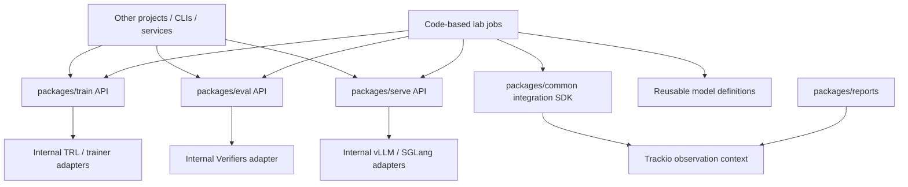

# Layers and ownership

Status: target MVP architecture  
Last revised: 2026-07-20

## Purpose

`train`, `eval`, and `serve` are reusable Python products that can be consumed
by this lab, another repository, a CLI, a notebook, or a service. Their
framework runners and adapters are internal implementation details.

## Dependency direction



Rules:

- consumers import public operations, configs, profiles, and results from
  `train`, `eval`, and `serve`;
- those package APIs do not require the lab's `Job` object or Trackio;
- framework adapters are selected inside their owning package;
- `train`, `eval`, and `serve` do not import one another;
- `common` never imports a heavy execution framework;
- environment packages depend on Verifiers, not on this platform;
- the lab injects Trackio-backed observation through an execution context.

## Stable package API versus internal adapter

```text
project code
  -> train/eval/serve public operation
  -> package-owned validation and lifecycle
  -> internal framework adapter
  -> public typed result
```

The package is the cross-project reuse boundary. It owns lifecycle semantics,
typed inputs/results, reusable profiles, compatibility checks, and
instrumentation hooks. Internal adapters translate those operations to TRL,
Verifiers, vLLM, SGLang, or another framework.

A public operation may accept a backend-specific typed config when backend
behavior matters. That does not make the adapter object the reusable unit.

## Package responsibilities

### `packages/common`

Owns only lab composition and cross-cutting contracts:

- `Job` and action discovery;
- invocation and observable-run identity;
- model and artifact references;
- execution/observation context protocols;
- common statuses and run kinds;
- source and dependency provenance;
- Trackio-backed observation and temporary workspace adapters.

It excludes train/eval/serve behavior, framework-native options, environment
semantics, and report calculations.

### `packages/train`

Public reusable surface:

- `sft`, `dpo`, `rl`, and future training operations;
- typed operation inputs and results;
- typed reusable technique/model profiles;
- checkpoint, recovery, output-selection, and telemetry semantics;
- framework capability errors that are meaningful to callers.

Internal surface:

- TRL adapter as the first implementation;
- future Torchtune or custom-framework adapters;
- translation from public operation/config to framework calls;
- framework-specific callbacks and checkpoint mechanics.

Adding an adapter must not require callers to replace the `train` package API
with direct runner composition.

### `packages/eval`

Public reusable surface:

- `evaluate` and related operations;
- typed inputs/results and reusable general-evaluation programs;
- environment/model compatibility and result semantics;
- trace and native-bundle instrumentation hooks.

Internal surface:

- Verifiers loading and execution;
- model/endpoint adapters;
- JSONL tailing and trace conversion;
- framework-specific runtime details.

The standalone Verifiers package owns its task data, tools, rewards, metrics,
and domain semantics.

### `packages/serve`

Public reusable surface:

- `launch`, `generate`, `probe`, and `benchmark` operations;
- typed inputs/results and backend/family/model profiles;
- inference workload execution and request-observation semantics;
- supported TurboQuant, MTP, kernel, and parallelism features.

Internal surface:

- vLLM and SGLang adapters;
- backend process/API translation;
- cache, scheduler, kernel, and version-specific compatibility work.

A serving profile proven for Qwen is published with `serve` and is immediately
available to any project that installs that package revision.

### `packages/reports`

Owns read-only access to Trackio, versioned calculators, comparisons,
model-lineage views, and frontend-facing view models. It neither executes the
reusable packages nor creates another results store.

## Reusable definitions

Definitions live with the public package that validates them:

| Definition | Owner | Example import |
| --- | --- | --- |
| Model profile | shared `profiles.models` | `QWEN_35_2B` |
| Training profile | `packages/train` | `train.profiles.qwen35.SFT_QLORA` |
| General eval program | `packages/eval` | `eval.programs.GENERAL_SMOKE` |
| Serve profile | `packages/serve` | `serve.profiles.qwen35.VLLM_TURBOQUANT_K8` |
| Inference workload | `benchmarks/inference` | `CONTEXT_CONCURRENCY_MATRIX` |
| Environment | standalone Verifiers package | `org/customer-support@0.4.0` |

Definitions are typed Python objects or factories. TOML/YAML may instantiate a
concrete type but does not form a global registry or inheritance system.

## Jobs as one consumer

A lab job composes the same package APIs another project would use:

```python
@job.action
def qualify(ctx):
    model = ctx.run(train.sft, model=BASE, config=SFT_QLORA).model
    ctx.run(model_eval.evaluate, model=model, program=DOMAIN_HELD_OUT)
    ctx.run(serve.benchmark, model=model, profile=VLLM_BASELINE)
```

`ctx.run` adds job/action/invocation provenance and a Trackio-backed
observation context. It does not replace the package's public operation with a
runner abstraction.

Another project can call the same operations directly and provide its own
execution context, observer, or no-op observer.

## Trackio boundary

Trackio receives resolved operation/config snapshots, source/package versions,
metrics, telemetry, traces, status, and consumed/produced artifacts. It does not
own package APIs, internal adapters, jobs, scheduling, or decisions.

The observation context is dependency inversion: the reusable packages emit
through a small protocol while this platform decides to persist with Trackio.

## Shared versus job-local promotion

```text
job-local helper or config
  -> repeated use and tests
  -> move into the public train/eval/serve package
  -> publish a package version
  -> import from any future project or job
```

Reusable code/config moves to an owner package. Reusable weights become an
immutable artifact and optionally a derived model profile. Trackio performs
neither promotion automatically.

## Dependency lifecycle

Public operation and definition modules remain lightweight. Execution installs
the selected implementation extra:

```text
train[trl]
eval[verifiers]
serve[vllm]
serve[sglang]
```

This keeps project source importable without initializing every CUDA framework
and lets package owners release independently.

## What is deliberately absent

- public runner objects as the cross-project reuse boundary;
- one base class or config schema for every framework;
- a central plugin/config registry;
- YAML-defined workflows;
- hidden DAG construction in decorators;
- a hard Trackio or Job dependency in reusable package APIs;
- a second lineage or results database.

## Revision history

- 2026-07-20: Made `train`, `eval`, and `serve` the reusable cross-project
  units, moved framework runners/adapters behind public operations, and made
  observation context injectable by the consuming host.
- 2026-07-20: Defined code-based jobs, typed definitions, and a pure Trackio observability boundary.
- 2026-07-19: Established independent engine packages, model profiles, and published Verifiers environments.
