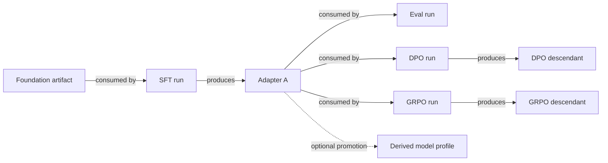

# Lineage and metadata

Status: target MVP architecture  
Last revised: 2026-07-20

## Purpose

This document separates source provenance, artifact lineage, and human
decisions while keeping Trackio an observability layer.

## Sources of truth

| Information | Authority |
| --- | --- |
| Job objective, actions, thresholds, and decisions | versioned job source and documentation |
| Reusable model/train/eval/serve definitions | their owning Python package and Git revision |
| Environment behavior | published Verifiers package version |
| What executed | Trackio run and resolved snapshot |
| Metrics and traces emitted | Trackio |
| Which artifact a run consumed or produced | Trackio run-artifact edges |
| Artifact bytes | Trackio artifact storage or immutable external reference |
| Aggregated evidence | versioned `packages/reports` view |

## Artifact model

An artifact is an immutable input or output. Initial types are:

- `model`;
- `dataset`;
- `environment`;
- `evaluation`;
- `serving-result`;
- `config`;
- `report`.

A model artifact records a stable logical name, immutable version/reference,
content digest where available, family/architecture, artifact form, required
base or parent artifacts, producing run when local, and relevant license or
publication metadata.

Aliases such as `latest` or `selected` aid navigation. Runs always resolve and
record the immutable version.

## Model lineage

Lineage is derived from observed run/artifact relationships:



Rules:

- training or weight transformation creates a descendant model artifact;
- adapter merge and weight quantization create descendants;
- runtime-only kernels, cache quantization, schedulers, or server flags do not;
- trainer recovery checkpoints remain workspace state until explicitly
  promoted;
- every descendant preserves its exact parents and producing run;
- a profile points to an artifact but does not create lineage;
- Trackio records the edges but does not decide which branch to run or promote.

## Jobs and branches

A job is an objective boundary, not a lineage node for every model branch. The
same job may create and compare sibling SFT, DPO, and GRPO descendants when they
serve one objective.

Create a new job when work has a distinct objective, owner, release cadence, or
decision lifecycle—for example a serving team independently optimizing a model
family. When runs in different jobs consume the same artifact, reports can show
the relationship without maintaining a mutable job-parent graph.

`branch_id` and `stage_id` are optional human labels, not core identity. Exact
lineage comes from artifact versions and producing/consuming runs.

## Profile promotion

Training first produces an artifact:

```text
foundation profile -> training run -> adapter/checkpoint artifact
```

When the output becomes a stable reusable entry point, source code adds a
derived model profile referencing that artifact:

```text
artifact + explicit human decision -> derived model profile commit
```

Trackio may retain the supporting report and promotion event, but it does not
edit source definitions or automatically promote the model.

## Data and environment provenance

Training data records:

- immutable source/reference and access policy;
- transformation code revision;
- filtering, mixture, and split configuration;
- produced dataset reference when materialized;
- consuming runs.

A Verifiers environment is identified by qualified package version plus its
load config. Dataset identities used internally are recorded when meaningful.
Private data may remain an access-controlled external reference; lineage does
not require copying its bytes into Trackio.

## Observation identity

An observation is uniquely meaningful only with its complete context.

Evaluation includes exact model artifact, environment package/config, harness
and runtime, sampling, provider/judge versions, and retained traces.

Serving includes exact model artifact, typed serve config, backend/code version,
hardware, workload, prompt shape, context, concurrency, and request traces.

Training includes exact input model/data/environment artifacts, `train` package
and internal backend version, resolved native config, and output artifact.

Changing a required dimension creates another run/observation; it does not
update an old result in place.

## Model evidence view

`packages/reports` computes a model evidence view from:

- artifact metadata and lineage;
- model profiles pointing to the artifact;
- serving and evaluation runs;
- training and transformation history;
- unsupported, failed, missing, or stale combinations.

The view answers what the model is, where it has run, what has been measured,
which descendants exist, and which reusable profile exposes it. It is not a
registry or copied score manifest.

## Required run provenance

Each Trackio run records:

- job module, job/action/invocation IDs;
- source repository revision and dirty digest;
- implementation ID, package version, and schema;
- resolved public operation inputs and internal config;
- consumed immutable artifact versions;
- produced artifacts;
- environment/workload/backend identities;
- execution status, metrics, and traces.

Trackio captures this metadata for observation and query. The executable source
remains in Git and packages.

## Human decisions

Candidate selection, acceptance thresholds, branch hypotheses, checkpoint
promotion, and final rationale remain in the job's Python/README history. A
decision can also be emitted as a report artifact linked to its evidence
population. It is never inferred silently from a moving alias or a metric name.

## What is not needed in the MVP

- mutable descendant arrays in profiles;
- a second model or lineage database;
- manual model-version counters;
- one job per artifact branch;
- automatic `best` promotion;
- copied benchmark scores inside model definitions;
- deployment approval state.

## Revision history

- 2026-07-20: Made artifact edges observed evidence rather than orchestration,
  allowed multiple model branches inside one job, and moved promotion and human
  decisions back to versioned source.
- 2026-07-19: Defined artifact-backed model/data lineage and computed model evidence views.
