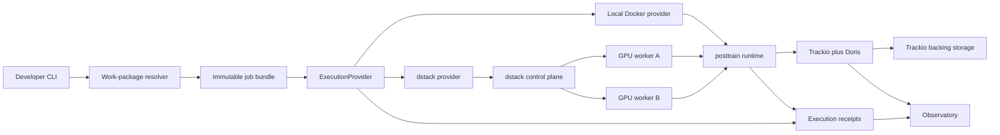

# Proposed dstack execution-provider architecture

> **Packaging revision (2026-07-26):** the provider lifecycle and operational
> findings in this document remain useful, but its directory-bundle transport
> is superseded by
> [`framework-oci-job-capsules.md`](../plan/framework-oci-job-capsules.md).
> Normal local and dstack jobs use one framework-owned actual-job OCI image
> derived from a framework-owned universal base and job-kind image. dstack
> receives no normal `files` payload. Run and attempt values remain in the
> launch envelope rather than the reusable packed-job image.

**Status:** Proposed

**Last revised:** 2026-07-26

**Decision state:** Not yet part of the frozen post-training baseline

**Scope:** Packaging, submitting, observing, and reconciling post-training jobs
across local and dstack-managed GPU workers

**Implementation dependency:** The generic scheduler, lease, journal, and
controller design in this proposal is not approved for implementation. Qualify
the dstack Python SDK directly. dstack already supplies resource-driven
queueing, priority, bounded retry, cron scheduling, persistent run status,
logs, and cancellation. This proposal must be reduced to a thin dstack adapter,
compact submission receipt, and domain evidence reconciliation. Workflow
orchestrators and durable workflow libraries are explicitly out of scope. This
includes DBOS, Hatchet, Prefect, Temporal, Airflow, Kestra, Dagster, Celery,
and equivalent systems.

**Packaging decision:** The framework builds one digest-pinned actual-job OCI
image containing bounded project code, resolved configuration, materialized
datasets, and locked environment wheels. The image derives from
framework-owned universal and job-kind images. The registry and worker caches
distribute one content identity; dstack receives no parallel code/data bundle.
Packaging remains behind the provider-neutral execution contract and does not
introduce another artifact or lineage system.

The canonical product meaning remains defined by
[`docs/post-training/README.md`](../post-training/README.md) and documents 01
through 06 beside it. This proposal supplies an implementation architecture for
the existing execution-host and execution-target boundaries. If implementation
reveals that public product semantics must change, the affected canonical
document must be amended before this proposal is adopted.

## Decision summary

Make dstack a first-class **execution provider** in the post-training framework.
It is not a new job type, trainer, tracking backend, artifact registry, or source
of experiment truth.

The framework will:

- plan and pack an immutable actual-job image from a work package and resolved
  selections;
- translate a provider-neutral execution request into a dstack task;
- submit, inspect, stream logs from, cancel, and collect that task through the
  dstack Python API;
- run the same framework-owned entry point on local and remote workers;
- retain durable attempt and reconciliation records even if execution fails
  before a Trackio run is created; and
- expose one provider-neutral CLI and lifecycle to developers.

The separate local-AI-infrastructure repository will operate dstack itself,
attach machines to its fleets, manage container registries and secrets, and
operate Trackio with its private backing storage. The framework consumes those
services; it does not provision them.

## Goals

1. Develop code and work-package configuration on a developer machine while
   running workloads on either available GPU workstation.
2. Preserve the canonical job, run, work-package, selection, lineage, and
   evidence semantics across local and remote execution.
3. Make a submitted job reproducible from immutable source, runtime, bundle,
   input, target, and provider-binding identities.
4. Support explicit local or dstack provider selection without changing job or
   run semantics.
5. Minimize copied data: bounded task data ships once with versioned
   environment code, base models use immutable references and worker caches,
   and retained model results use Trackio artifacts.
6. Retain useful results and compact execution evidence while cleaning
   containers, scratch data, caches subject to policy, and disposable test
   artifacts.
7. Allow future providers to implement the same contract without importing
   dstack into framework-neutral packages.

## Non-goals

- Replacing Trackio as the experiment evidence system.
- Replacing Trackio as the internal artifact registry and evidence plane.
- Making dstack task YAML a public post-training project format.
- Provisioning the dstack server, workers, DNS, registry, Trackio, Doris, or
  Trackio backing storage from this repository.
- Sending model weights, datasets, checkpoints, caches, or credentials inside a
  job bundle.
- Treating provider acceptance or process exit alone as proof that a run is
  complete.
- Supporting concurrent research experiments in the first implementation.

## Current architecture and gap

The existing framework already has the right product-level concepts:

- `ExecutionTarget` and `RunContext` are provider-neutral and can snapshot
  target revisions, roles, placement, and host constraints.
- Work packages resolve selections before execution.
- Trackio captures experiment evidence, versioned artifacts, and lineage while
  hiding its backing blob storage from framework jobs.

The blocking implementation detail is that the current execution seam is
in-process. `RunExecutor` receives a Python callable, and
`JobDefinition.operation` is also a callable. A closure cannot be serialized as
a durable job identity and reconstructed safely on another machine.

Relevant current seams include:

- `packages/work/src/posttrain/work/contracts.py`
- `packages/work/src/posttrain/work/runner.py`
- `packages/work/src/posttrain/work/execution.py`
- `packages/jobs/src/posttrain/jobs/runtime.py`
- `packages/common/src/posttrain/common/execution.py`
- `packages/common/src/posttrain/common/selections.py`
- `packages/tracking/src/posttrain/tracking/contracts.py`

The provider boundary must therefore replace “invoke this closure elsewhere”
with “execute this stable job-definition ID using this immutable bundle and
resolved run specification.”

## Proposed system



There are three distinct planes:

1. **Control plane:** validates, plans, schedules, stops, and reports current
   workload state. dstack owns this plane for remote execution.
2. **Evidence plane:** stores metrics, traces, versioned outputs, manifests,
   lineage, and compact execution receipts durably. Trackio, Doris, Trackio's
   backing storage, and provider receipts own this plane.
3. **Data plane:** runs the framework-owned command inside a digest-pinned
   runtime image on the selected worker.

## Repository and package ownership

| Concern | Owner |
|---|---|
| Job, run, work-package, and selection semantics | Canonical post-training framework |
| Provider-neutral execution contract and local provider | `packages/execution` |
| dstack request translation and lifecycle adapter | `packages/execution-dstack` |
| Framework remote entry point | `packages/execution` plus the owning job packages |
| User-facing run commands | Framework CLI |
| Experiment metrics and traces | Trackio integration |
| Post-training evidence views | `apps/observatory` |
| dstack server, fleet and worker enrollment | `/home/hammad/projects/ai-infra` |
| OCI registry, Trackio, Doris, Trackio backing storage, credentials and backups | `/home/hammad/projects/ai-infra` |
| Logical hostnames and one-time local-network setup | UniFi/local infrastructure operations |

This proposal deliberately refines the earlier `ops/` boundary. If accepted,
scheduler-specific **deployment** remains infrastructure-owned, but translation
from canonical execution requests into dstack tasks becomes a framework adapter.
The existing ops documentation should be amended only after this proposal is
accepted.

## Package shape

```text
packages/execution/
  src/posttrain/execution/
    contracts.py
    bundles.py
    receipts.py
    service.py
    runtime.py

packages/execution-dstack/
  src/posttrain_execution_dstack/
    adapter.py
    translation.py
    client.py
    states.py
    receipts.py
```

`packages/execution` must not import dstack, Trackio, a trainer, or a serving
backend. `packages/execution-dstack` may depend on the neutral execution
contract and dstack client, but reusable train, eval, serve, data, and common
packages must not depend on it.

`RunSpec` and `ArtifactInput` currently live under tracking despite being
execution-neutral. Adoption should move them to an appropriate neutral package
and temporarily re-export them from the old import path.

## Provider-neutral contract

The contract should express lifecycle operations rather than provider syntax:

```python
class ExecutionProvider(Protocol):
    def plan(self, request: ExecutionRequest) -> ExecutionPlan: ...
    def submit(self, plan: ExecutionPlan) -> ExecutionHandle: ...
    def status(self, handle: ExecutionHandle) -> ExecutionRecord: ...
    def logs(
        self,
        handle: ExecutionHandle,
        cursor: LogCursor | None = None,
    ) -> LogPage: ...
    def cancel(self, handle: ExecutionHandle) -> None: ...
    def collect(self, handle: ExecutionHandle) -> ExecutionResult: ...
```

`ExecutionRequest` contains:

- the canonical `RunSpec`;
- a stable, versioned job-definition ID, never a Python closure;
- job-bundle reference and digest;
- OCI runtime-image digest;
- resolved `ExecutionTarget`;
- timeout, retry, priority, and retention policies;
- immutable input artifact references; and
- required produced-artifact roles.

`ExecutionPlan` contains the provider's feasible candidate offers, their
provider-native identities, current availability, and observed resource
envelopes. It does not select the research experiment or silently relax a
canonical constraint.

`LocalExecutionProvider` becomes the reference implementation. Local and dstack
providers must produce equivalent logical results, though their native receipts
and scheduling details will differ.

### Provider capabilities

Capabilities are inspected, not assumed. They affect admission behavior but do
not change job, run, artifact, or outcome semantics.

| Capability | Local Docker provider | dstack provider |
| --- | --- | --- |
| Same bundle and runtime entry point | Yes | Yes |
| Digest-pinned OCI image | Yes | Yes |
| CPU and GPU execution | Yes, on the current host | Yes, across attached fleets |
| Detached execution surviving CLI exit | Yes, through Docker | Yes |
| Status, bounded logs, cancel, collect | Yes | Yes |
| Resource planning | Current-host preflight | dstack offers and placement |
| Resource-driven queue | No | Yes |
| Priority | No | Yes |
| Automatic infrastructure/task retry | No | Yes |
| Cron start schedule | No | Yes |
| Multi-machine and multi-node placement | No | Yes |

Callers may require capabilities before submission. A request that requires a
queue, retry, schedule, or multi-node placement fails preflight on the local
provider rather than being silently weakened.

## Job bundle

A bundle contains only the information required to reconstruct framework
meaning:

```text
manifest.json
project.toml
work-package.yaml
resolved-selections.json
catalog-overlay/
```

The image-owned `JobPackageManifest` records:

- package schema and framework versions;
- source revision or deterministic worktree-snapshot digest;
- job-definition ID and version;
- universal- and job-kind-image digests;
- hashes of packaged code, dataset, and environment inputs;
- resolved selection snapshots;
- immutable input artifact references;
- expected artifact roles; and
- whether the package is release-promotable.

The package key covers the complete manifest and its referenced packaged
inputs. Run ID, attempt, provider, execution target, mounts, credentials, and
final image digest are excluded to avoid circular identity and allow exact
image reuse.

Two source modes are supported:

- **Release mode:** clean source revision, locked dependencies, and immutable
  runtime-image digest. Results may be promoted.
- **Development mode:** deterministic dirty-worktree snapshot. Results remain
  reproducible but are marked non-promotable until reproduced from committed
  source.

Standard jobs derive from one universal image and a job-kind image. The
actual-job image adds selected project code, configuration, pinned Verifiers
environment wheels, and selected bounded datasets. It does not carry model
weights, caches, mutable checkpoints, final model artifacts, provider
submission code, or credentials.

## Image build and publication

Use Docker BuildKit with Buildx Bake. The framework owns explicit Dockerfiles,
locks, qualification targets, and release receipts for the universal base,
job-kind layers, and actual-job layer. `ai-infra` operates BuildKit, the OCI
registry, registry credentials/retention, worker compatibility, and caches; it
does not choose or build framework image contents. Dagger, Cloud Native
Buildpacks, and Railpack are not part of the training-image path.

The build operation must:

1. resolve or publish an immutable framework universal-image digest;
2. resolve or publish the framework-owned job-kind target;
3. use registry-backed BuildKit cache;
4. run image smoke tests before publication;
5. publish the release tag and capture its immutable digest;
6. emit provenance and SBOM attestations; and
7. write the actual-job digest and full ancestry into the protected pack
   receipt.

dstack consumes the digest-pinned actual-job image. It does not build images or
receive source files for each run; BuildKit cache keeps universal, kind, and job
layers reusable.

The first veRL runtime was characterized by
`/home/hammad/projects/ai-infra/scripts/build-posttrain-verl-runtime` from
`infra/posttrain-verl-runtime/Dockerfile` and `docker-bake.hcl`. Buildx exports
OCI media types with zstd level 3, forces existing layers into that compression
format, publishes SBOM and provenance attestations, removes the local tag, and
then proves a registry pull and import smoke before writing a mode-`0600`
receipt. This remains infrastructure qualification evidence while its generic
base-image behavior is separated from the target framework-owned job layer.
The receipt separates the image source digest, veRL revision,
Verifiers revision, Trackio source revision, Trackio dirty-source digest, and
Trackio wheel digest.

Expensive Python wheels use a BuildKit cache mount. Dynamic source and
provenance arguments are declared only after dependency installation so a
framework-source change does not invalidate the CUDA/PyTorch environment.
Future capability profiles should share a stable CUDA/Torch base and place
veRL-online, TRL training, and evaluation/serving dependencies in separate
upper images. Do not increase Docker's concurrent-download setting merely
because an image is large: first inspect emitted layer sizes and measure a
cold pull. A single large dependency layer cannot benefit from additional
parallel downloads.

## Worker storage topology

The runner owns storage intent through typed `ExecutionMount` values on
`ExecutionRequest`. Mounts do not live in opaque target-placement JSON.
`LocalDockerExecutionProvider` maps them to Docker bind mounts and
`DstackExecutionProvider` maps the same values to dstack instance volumes.
Every run-workspace mount must contain the canonical `run_id` as one path
component.

| Worker path | Container path | Scope | Purpose and retention |
| --- | --- | --- | --- |
| `/var/lib/posttrain/cache/huggingface` | `/root/.cache/huggingface` | shared per worker | Immutable model and bounded dataset materialization; retained across runs |
| `/var/lib/posttrain/cache/vllm` | `/root/.cache/vllm` | shared per worker | vLLM compilation and graph cache; retained across compatible runs |
| `/var/lib/posttrain/cache/torch-inductor` | `/root/.cache/torch-inductor` | shared per worker | Torch Inductor artifacts; retained across compatible runs |
| `/var/lib/posttrain/cache/triton` | `/root/.cache/triton` | shared per worker | Triton compilation artifacts; retained across compatible runs |
| `/var/lib/posttrain/runs/<run_id>` | `/opt/posttrain/run` | one run | Checkpoints, native traces, rollout staging, Ray state, logs, and the materialized result |

The immutable runtime declares the corresponding cache environment variables:
`HF_HOME`, `VLLM_CACHE_ROOT`, `TORCHINDUCTOR_CACHE_DIR`,
`TRITON_CACHE_DIR`, and `POSTTRAIN_RUN_ROOT`. A job does not copy any cache
into its source bundle.

Training finalization runs inside the run workspace. It removes superseded
checkpoints, retains only the configured recovery-checkpoint count, validates
the selected full model or LoRA adapter, writes a retention manifest, publishes
the required model and evidence artifacts through Trackio, finishes the Trackio
run, and then writes `.posttrain-terminal.json`. A daily worker timer removes
only terminal-marked successful workspaces older than seven days and
terminal-marked failed or cancelled workspaces older than three days. An
unmarked workspace is never automatically deleted because it may contain the
only recovery evidence after a hard kill or worker loss.

The current workers use their root NVMe filesystems. The local worker uses XFS
without project quotas and the remote worker uses ext4, so dstack's `disk`
request is an admission/headroom requirement, not a hard directory quota.
Until a dedicated quota-enabled filesystem is provisioned, the system must
record pre/post workspace bytes, enforce the worker free-space floor, keep
experiments serial, and reject a new run whose declared checkpoint budget
would cross that floor. Do not claim hard per-run quotas from this topology.

## Local Docker adapter

The local provider is a first-class runner, not an in-process test fake. It
runs the same framework-owned runtime command, observation contract, and
artifact contract as dstack.

The expected flow is:

1. Inspect the local CPU, RAM, GPU model, VRAM, driver, Docker, NVIDIA runtime,
   disk, and required mount availability.
2. Validate the logical `ExecutionTarget` against that observed host snapshot.
3. Resolve or pull the exact OCI image digest.
4. Create a deterministic container name from the framework attempt ID.
5. Mount only the small job bundle, scratch workspace, and explicitly
   materialized input or cache paths.
6. Start the container detached with framework identity labels and the required
   GPU device request.
7. Recover status, logs, and cancellation through the deterministic container
   name after the CLI exits or restarts.
8. Read the provider exit state, Trackio terminal state, and registered
   Trackio artifact references using the same finalizer as the dstack
   provider.
9. Remove the container and disposable scratch data only after retained
   evidence has been verified.

Release mode always uses a digest-pinned image and immutable bundle.
Development mode may bind a deterministic dirty-worktree snapshot, but the
receipt marks the result non-promotable. It must not mount the live source tree
implicitly.

Local execution does not emulate dstack queueing, priority, retries, schedules,
or fleet selection. Explicitly re-running a failed local attempt creates a new
attempt and preserves the previous receipt.

## dstack adapter

The adapter should use dstack's typed Python API rather than invoking its CLI as
a subprocess. The expected flow is:

1. Translate the neutral request into a dstack `Task`.
2. Request a run plan.
3. Validate the selected offer against the canonical target constraints.
4. Store a redacted plan and provider-binding digest.
5. Apply the accepted plan.
6. Persist the dstack run and job IDs before waiting for execution.
7. Normalize provider status and stream logs through the neutral contract.
8. Reconcile terminal evidence and apply cleanup policy.

The initial compatibility range should be explicit, for example
`dstack>=0.20.29,<0.21`, with the exact version resolved in `uv.lock`.

### Target binding

`ExecutionTarget` must remain logical and reproducible. It must not contain a
dstack server URL, API token, or machine-specific credential.

Project runtime configuration maps a logical target revision to provider
selectors:

```toml
[execution]
provider = "dstack"

[execution.dstack]
project = "main"

[execution.dstack.targets."targets/local-gpu-a@1"]
fleets = ["local-gpu-workers"]
instances = [{ hostname = "gpu-a.lan" }]

[execution.dstack.targets."targets/local-gpu-b@1"]
fleets = ["local-gpu-workers"]
instances = [{ hostname = "gpu-b.lan" }]
```

The run snapshot records both requested and observed placement:

- logical target ID and revision;
- provider-binding digest;
- selected dstack project, fleet, instance, and hostname;
- observed GPU model, count, and VRAM;
- runtime-image and bundle digests; and
- dstack run and job IDs.

Provider settings and tokens come from protected machine or service
configuration, not project configuration committed to source control.

### Resource translation

For unsliced SSH workers, resource requests should normally use minimum ranges
such as `cpu: 2..` and `memory: 16GB..`, combined with explicit GPU vendor,
count, and memory requirements. Exact small CPU counts can incorrectly reject a
full-host offer.

The adapter owns this translation and must preserve the logical target
contract. It should set:

- maximum and graceful-stop durations;
- priority;
- fleet or instance selectors;
- GPU constraints;
- run, job, bundle, and target tags;
- cleanup policy; and
- retries limited initially to `no-capacity` and infrastructure interruption.

Application errors, verifier failures, invalid configuration, out-of-memory
failures, and bad data must not retry automatically unless a later,
job-specific policy explicitly makes them retryable.

## Discarded design: custom scheduling calculation and admission

**Not selected.** This section is retained only as research history from the
earlier proposal. The implementation must use local Docker preflight or dstack
planning, queueing, priority, and retry directly. It must not implement the
calculator, reservation, lease, fencing-token, or admission-controller design
below.

Scheduling has three separate responsibilities:

1. The **research planner** chooses which experiment is worth running. That
   decision belongs to the work package and its evidence loop, not dstack.
2. The framework **admission and scheduling calculator** decides whether the
   chosen run is ready, constructs its resource envelope, and ranks feasible
   targets.
3. dstack performs **provider placement** against live fleets and instances.

This separation prevents infrastructure availability from silently changing
the scientific question while still allowing live capacity to affect where and
when the chosen experiment runs.

### Scheduler inputs

The calculator consumes a versioned `SchedulingRequest` containing:

- run, attempt, project, work-package, stage, and job-definition identities;
- resolved execution-target constraints and any explicit target preference;
- declared CPU, RAM, GPU count, GPU model or capability, VRAM, disk, shared
  memory, and maximum-duration requirements;
- immutable input artifact sizes and known storage locations;
- checkpoint and resume requirements;
- dependency readiness and required predecessor artifact references;
- queue priority and submission timestamp;
- the active concurrency policy;
- current dstack plans and candidate offers;
- current leases and reservations; and
- compatible historical resource and duration observations.

Historical observations are compatible only when their calculator key matches
the dimensions that materially affect the estimate. The initial key should
include job-definition version, model variant, training or evaluation
selection, precision or quantization mode, workload scale, and execution-target
hardware class. A calculator must not borrow an observed peak or duration from
an incompatible run merely because its job kind is the same.

### Resource-envelope calculation

For each resource, the request records both the source and confidence:

```text
required(resource) =
    max(
        declared_minimum,
        static_estimate,
        compatible_observed_peak + safety_headroom
    )
```

The actual implementation uses resource-specific functions rather than adding
unlike values. For example, VRAM headroom may be a percentage plus a fixed
allocator reserve, while disk headroom includes expected checkpoint growth and
temporary materialization. The resulting `ResourceEnvelope` records:

- minimum and preferred resources;
- estimate source run IDs;
- estimation algorithm and version;
- headroom rule;
- confidence (`measured`, `modeled`, or `fallback`);
- hard limits that must never be relaxed; and
- degradations explicitly permitted by the job definition.

If no compatible observation exists, the calculator uses a conservative,
versioned fallback and marks the estimate as uncalibrated. A failed
out-of-memory run may raise a later estimate; it must never lower one.

### Eligibility and ranking

Candidate handling is deterministic and occurs in two passes.

The eligibility pass rejects a candidate when:

- a required predecessor or input artifact is unavailable;
- the concurrency lease cannot be acquired;
- the candidate violates a hard target, GPU, VRAM, CPU, RAM, disk, runtime,
  network, or data-access constraint;
- the required runtime image or artifact store is unreachable;
- the worker is in maintenance, quarantined, draining, or has an unreconciled
  prior attempt that still owns its reservation; or
- the provider plan has changed since the candidate snapshot was calculated.

The ranking pass uses a lexicographic key rather than an opaque weighted score:

1. explicit target preference, if present;
2. lowest predicted finish time;
3. lowest capacity and interruption risk;
4. lowest expected data-transfer time;
5. lowest configured monetary or energy cost;
6. oldest queued request; and
7. stable target ID as the deterministic tie-breaker.

Predicted finish time is:

```text
available_at
+ predicted_startup_and_image_pull
+ predicted_input_staging
+ predicted_runtime
+ predicted_finalization
```

Each prediction retains its value, unit, source, confidence, and estimator
version. Missing values use declared conservative defaults; they are never
coerced to zero. The scheduler receipt stores the complete ordered candidate
list and every rejection reason, allowing later runs to calibrate estimates
without changing the historical decision.

The selected framework priority maps into dstack's bounded `0..100` priority
field. dstack schedules higher-priority runs first and otherwise uses submission
order. The framework must not reimplement dstack's live instance packing:
instead, it ranks logical target candidates, validates the returned run plan,
and lets dstack place the accepted task within the selected fleet or instance
constraints.

For the initial serial policy, `max_active_gpu_runs = 1` is an admission
configuration, not a limitation of the provider contract. Both GPU machines
remain candidates for the admitted run. Later concurrency can be enabled by
changing the versioned admission policy and using resource-scoped reservations
without redesigning jobs or bundles.

### Reservation and submit protocol

Scheduling uses a short-lived, fenced reservation:

1. obtain a scheduling snapshot;
2. calculate and persist the scheduler receipt;
3. acquire a lease with a monotonically increasing fencing token;
4. request a fresh provider plan for the selected target;
5. verify that the plan still satisfies the recorded envelope;
6. submit with the run/attempt idempotency key;
7. persist the provider IDs; and
8. convert the reservation into an active lease.

If any check changes before submission, the reservation is released and the
request is recalculated. A worker process cannot publish or finalize an attempt
using an obsolete fencing token.

## Runtime service bindings

Trackio is the artifact-registry and observation service exposed to the runtime
environment. Its backing object storage is private server configuration. It is
not sent inside the job bundle, copied into the image, or exposed to workers.

The existing Trackio runtime variables are:

- `POSTTRAIN_TRACKIO_SERVER_URL`;
- `POSTTRAIN_TRACKIO_PROJECT`; and
- `TRACKIO_WRITE_TOKEN` when the server requires authenticated writes.

For dstack, sensitive values are project-scoped dstack secrets referenced from
the task `env` property using `${{ secrets.<name> }}`. The dstack server must
have secret encryption enabled. For local Docker, the provider reads the same
variables from the developer environment or a mode-`0600` generated env file
outside the repository and bundle.

The Trackio server owns `TRACKIO_BUCKET_ID` and its bucket credential. Neither
runner receives object-store configuration. The bundle carries run identity,
resolved selections, pinned base-model and Trackio artifact references, and
required output roles. Bounded environment datasets travel inside the
versioned code/image, not as job data. The bundle does not carry service
endpoints, access keys, tokens, model bytes, or an output manifest location.
Provider receipts contain only redacted binding names and endpoint identities.

Registry and model-hub credentials follow the same provider-injected rule.
Secrets must not appear in generated plans, command arguments, receipts, or
logs.

## Remote runtime

Every provider invokes the same stable command:

```text
posttrain-runtime execute \
  --manifest /opt/posttrain/bundle/.posttrain/job.json
```

The runtime:

1. verifies bundle hashes and the runtime-image identity;
2. resolves included project and work-package configuration;
3. checks the resolved selection and target snapshots;
4. materializes immutable input references;
5. creates or resumes the Trackio run;
6. resolves the versioned job definition from the framework registry;
7. executes the job and emits canonical metrics, traces, and events directly
   to Trackio;
8. logs required result directories through Trackio's artifact API and
   persists the resolved `TrackioArtifactRef`;
9. finishes the Trackio run with the canonical outcome;
10. applies checkpoint and scratch-retention policy; and
11. exits with a stable, meaningful result code.

The worker must not reconstruct product meaning from provider environment
variables. Those variables may convey transport details, but the verified
bundle is authoritative.

## Logs

Structured observations originate inside framework and backend code and are
sent to Trackio through `RunContext` and the injected tracking backend.
Container `stdout` and `stderr` are operational logs, not a second observation
protocol.

Initially, local Docker and dstack retain and expose their native bounded logs.
If centralized log retention is required, infrastructure may add a node-level
Vector or Fluent Bit collector, or use dstack's Fluent Bit forwarding support.
No per-job sidecar is required for the first implementation, and a log
collector must not parse text logs to reconstruct metrics or run outcomes.

## Discarded design: execution journal

**Not selected.** The full journal and lease model below is retained only as
research history. The accepted direction uses compact immutable provider
receipts plus explicit finalization. It does not introduce a controller
database or workflow event log.

The normalized state model is:

```text
accepted -> queued -> starting -> running
                                  |-> succeeded
                                  |-> failed
                                  |-> cancelled
                                  `-> lost
```

Provider-native states remain in the receipt for debugging. The adapter maps
them into this smaller stable lifecycle for framework consumers.

An execution journal is required because submission can fail before Trackio
exists, and provider event history is not the durable research record. Each
attempt records:

- submission, run, and attempt IDs;
- bundle, source, image, and provider-binding digests;
- scheduler-policy, estimator, and scheduler-receipt versions;
- selected offer, rejected candidates, reservation, lease, and fencing-token
  identities;
- provider run and job IDs;
- normalized and latest native states;
- Trackio run ID when created;
- provider exit state and artifact-reference count;
- cleanup outcome;
- failure classification; and
- accepted, queued, started, heartbeat, terminal, reconciled, and released
  timestamps.

The journal is compact metadata, not a log or artifact store. Full logs use
bounded retention, Trackio holds experiment evidence and artifact identities,
and Trackio's backing storage holds artifact bytes.

## Discarded design: always-on reconciliation controller

**Not selected.** Reconciliation is an idempotent finalizer invoked by the
local or dstack completion path and by an explicit repair command. There is no
always-on workflow orchestrator or multi-controller lease protocol.

Reconciliation is a durable controller, not a final callback inside the worker.
It repeatedly compares independent observations and converges an attempt toward
a consistent terminal record.

### Authorities and join key

Every write carries the same `(run_id, attempt_id)` and immutable bundle digest.
Each system remains authoritative only for what it actually observes:

| System | Authority |
|---|---|
| Execution journal | Submission intent, attempt identity, scheduler receipt, leases, transitions, and reconciliation actions |
| dstack | Current provider run, job, placement, and termination state |
| Worker heartbeat | Liveness and current execution phase while the process is running |
| Trackio | Metrics, traces, artifact versions and aliases, lineage, evidence events, and observed run status |
| Trackio backing store | Existence of content-addressed artifact bytes; accessed and verified through Trackio |

No source is allowed to overwrite another source's native observation. The
controller derives a framework result from their joined facts.

### Separate outcome and consistency states

The run outcome remains:

```text
succeeded | failed | cancelled | lost | partial
```

Reconciliation has a separate state:

```text
pending -> consistent
        -> inconsistent -> repair_pending -> consistent
        `-> manual_review
```

This distinction is required. For example, a training process may report
success while a required checkpoint is absent. Its provisional outcome is
`succeeded`, but its reconciliation state is `inconsistent`; it cannot be
presented as a qualified success or release the experiment lease.

### Reconciliation triggers

The controller runs:

- after every observed provider or worker transition;
- on a bounded polling interval while an attempt is non-terminal;
- after the terminal grace period;
- during control-service startup for every non-reconciled attempt;
- when stale heartbeats or expired leases are detected; and
- on an explicit `posttrain run reconcile <run-id>` request.

dstack events are copied into compact journal transitions while available, but
polling remains required because events have finite retention and delivery is
not the experiment evidence contract.

Initial polling defaults should be conservative and configurable: reconcile
immediately on an event, poll queued or starting attempts every 10 seconds,
running attempts every 30 seconds, and terminal-but-incomplete attempts with
exponential backoff capped at 60 seconds. A heartbeat becomes stale only after
three expected intervals. These are operating defaults to qualify on the local
cluster, not product semantics; the applied values and policy version are
stored on every attempt.

### Derivation rules

The first implementation uses an ordered decision table:

| Observations | Derived action |
|---|---|
| Provider non-terminal and heartbeat fresh | Keep active; refresh lease |
| Provider queued and reservation valid | Keep queued; recalculate only when the admission timeout expires |
| Provider reports success but Trackio is not yet terminal | Enter finalization grace period |
| Provider reports success; Trackio is terminal; required artifact references resolve | Mark `succeeded` and `consistent` |
| Provider reports success; required evidence remains absent after grace | Mark `partial` and `inconsistent`; preserve all available evidence |
| Provider reports failure | Mark `failed`; finalize Trackio from the provider receipt if safe |
| Cancellation requested and provider plus worker are terminal | Mark `cancelled`; retain partial evidence |
| Provider run is missing and Trackio is not terminal | Mark `lost`; never silently resubmit |
| Trackio is terminal but provider history is unavailable | Preserve Trackio evidence, mark provider evidence missing, and require policy-based consistency classification |
| Digests, attempt IDs, or fencing tokens disagree | Quarantine the attempt for manual review |

The exact table is versioned. Every reconciliation pass stores its input
watermarks, rule version, derived decision, and idempotent repair actions.

### Safe automatic repairs

The controller may:

- refresh provider state and copy compact transition evidence;
- finalize a stale Trackio run using the provider receipt when the terminal
  provider state is unambiguous;
- attach missing artifact references whose bytes and digests already verify;
- retry bounded scratch/container cleanup;
- expire an abandoned reservation; and
- release a lease after all terminal checks pass.

It may not fabricate metrics, infer missing denominators, rewrite native
provider history, delete retained results, or launch another training attempt
without an explicit retry policy. A rerun always creates a new `attempt_id`.

### Idempotency and concurrent controllers

Journal updates use compare-and-swap on an attempt revision. Repair operations
use deterministic action IDs derived from attempt, rule, and target object.
Only the controller holding the current reconciliation lease and fencing token
may commit a transition. Duplicate events, controller restarts, and overlapping
polls therefore converge without duplicating runs or artifacts.

## Completion and cleanup gate

A provider terminal state alone does not complete the framework run. The
reconciliation controller must verify:

1. dstack reports a terminal state;
2. the Trackio run is readable and terminal;
3. required metrics, traces, and artifact references are present;
4. referenced retained artifacts resolve through Trackio at their exact
   versions with matching manifests and digests;
5. checkpoint retention policy has been applied;
6. scratch data and disposable test outputs have been removed;
7. no abandoned container or process remains; and
8. the worker is idle or its remaining workload is accounted for.

Only then is the attempt marked reconciled and the serial experiment lease
released. Failed cleanup is visible and retryable; it must not erase retained
results.

## User experience

Normal developers use framework commands:

```text
posttrain work-package validate <path>
posttrain work-package run <path> --job <job-id>
posttrain run status <run-id>
posttrain run logs <run-id>
posttrain run cancel <run-id>
posttrain run collect <run-id>
posttrain run reconcile <run-id>
```

The provider is selected from project runtime configuration. Developers do not
write dstack YAML for standard jobs. A diagnostic command may export the
generated provider plan:

```text
posttrain run plan <path> --job <job-id> --format dstack-yaml
```

That output is an inspection artifact, not a second source of job semantics.
`status` should show the selected target, queue/admission reason, predicted
start and finish with confidence, provider state, evidence state,
reconciliation state, and any pending repair or cleanup action.

## Failure and recovery rules

- Submission uses a stable idempotency key derived from run and attempt IDs.
- A client restart discovers an existing provider run before resubmitting.
- A lost worker produces a distinct `lost` attempt and retains partial evidence.
- Cancellation is cooperative first, then forced after the configured grace
  period.
- Duplicate terminal callbacks are harmless.
- Manifest publication is atomic and content-addressed.
- Finalization and cleanup can be retried independently of training.
- A new attempt never overwrites the previous attempt's receipt, logs, or
  manifest.
- Object and log retention budgets are set by job class; short qualification
  tests default to aggressive cleanup.

## Delivery sequence

1. Introduce provider-neutral contracts and retain current in-process execution
   only as a unit-test helper.
2. Define and validate the versioned bundle schema and deterministic packer.
3. Implement the framework-owned container entry point.
4. Implement local Docker plan, submit, status, logs, cancel, collect, and
   cleanup operations.
5. Implement dstack plan, submit, status, logs, cancel, collect, and cleanup
   operations.
6. Add compact provider receipts and Trackio artifact finalization.
7. Add provider-neutral CLI commands with explicit `local` and `dstack`
   provider selection.
8. Run local and dstack no-op, cancellation, and CUDA visibility qualification.
9. Run one real standard job locally and on each dstack GPU target.
10. Qualify client restart, worker loss, duplicate submission, and
    failed-cleanup recovery.
11. Add execution-attempt, reconciliation, and cleanup views to Observatory.

The implementation plan for these milestones must use
`docs/templates/PLAN.md`, name all affected repositories, and include real
integration gates in addition to fakes.

## Acceptance criteria

The proposal is ready for adoption when:

- the local and dstack providers pass the same provider contract suite;
- a bundle built on the developer machine runs without source checkout
  assumptions locally and on both dstack GPU workers;
- plan inspection rejects a mismatched GPU or target binding before submission;
- status, bounded logs, cancellation, and collection work after a CLI process
  restart;
- Trackio artifact references and the provider receipt reconcile to one
  run and attempt;
- an early submission failure remains discoverable without a Trackio run;
- compatible observations calibrate duration and resource estimates while
  incompatible runs are excluded;
- retained results survive cleanup while disposable scratch data is removed;
- controller restart and duplicate reconciliation events converge to the same
  terminal state without duplicating artifacts;
- process success with missing required evidence becomes `partial` and
  `inconsistent`, not a clean success;
- secrets do not appear in bundles, generated plans, receipts, logs, or tracked
  files;
- duplicate submission and finalization are idempotent;
- provider packages satisfy import-boundary checks; and
- one real framework job completes and reconciles on each configured machine.

## Open decisions

These choices should be resolved in the implementation plan, not guessed by the
adapter:

1. Which neutral package should own `RunSpec` and `ArtifactInput`?
2. What local Docker and NVIDIA runtime versions form the supported
   compatibility range?
3. What finalization grace periods apply to running and terminal attempts?
4. What exact artifact-retention budgets apply to smoke tests, screening runs,
   training runs, and qualification runs?
5. Which digest and signing policy makes a development bundle promotable after
   reproduction from committed source?

## Research references

- [dstack Python API](https://dstack.ai/docs/reference/api/python/)
- [dstack tasks](https://dstack.ai/docs/concepts/tasks/)
- [dstack secrets](https://dstack.ai/docs/concepts/secrets/)
- [dstack events](https://dstack.ai/docs/concepts/events/)
- [dstack task configuration reference](https://dstack.ai/docs/reference/dstack.yml/task/)

## Revision history

- **2026-07-26:** Marks execution-payload packaging and distribution details as
  provisional pending a neutral, benchmarked selection. Separates high-level
  technology fit from current-infrastructure compatibility.
- **2026-07-26:** Initial proposal. Establishes dstack as a first-class
  execution provider, separates framework and infrastructure ownership, and
  defines packaging, scheduling, runtime, journal, reconciliation, and cleanup
  boundaries.
- **2026-07-26:** Defines deterministic scheduling calculation, resource
  estimation, fenced admission, multi-source reconciliation, repair rules, and
  separate outcome and consistency states.
