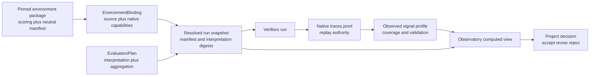

# Proposed evaluation signal and interpretation architecture

**Status:** Proposed

**Last revised:** 2026-08-04

**Decision state:** Ready for product and API review; not approved for implementation

**Scope:** Environment-native rewards, metrics, task dimensions, evaluation score and
success interpretation, aggregation, comparison, and Observatory presentation for
Verifiers-backed evaluation runs and their traces

The canonical product meaning remains defined by
[`docs/post-training/README.md`](../post-training/README.md) and documents 01
through 06 beside it. This proposal refines the existing rules that native
Verifiers traces are evaluation authority, environment packages own reward and
metric meanings, evaluation plans own aggregation and comparison, and
Observatory computes views without becoming a second score store.

Adoption requires a narrow amendment to the frozen API baseline before code is
changed. In particular, the flat `EnvironmentBinding.reward_components` field in
[`05 · APIs`](../post-training/05-apis.md#environmentbinding) is not expressive
enough and should be superseded by the typed contracts proposed here. This
proposal does not move project acceptance thresholds into shared evaluation
plans and does not change the native-trace authority defined in
[`06 · Observation`](../post-training/06-observation-and-lineage.md#verifiers-ingest-notes).

## Decision summary

Represent evaluation meaning in three separate layers:

1. An **environment-native signal manifest** describes what a pinned environment
   can emit: rewards, metrics, dynamic signal families, and task dimensions.
2. A typed **evaluation interpretation** in `EvaluationPlan` chooses the score,
   optional success signal or predicate, breakdown dimensions, component
   presentation, missing-data behavior, and aggregation policy for a run.
3. An **observed signal profile**, computed from retained native traces, records
   actual keys and coverage. It validates declarations and powers Observatory,
   but never replaces the traces.

The separation is deliberate:

- Verifiers does not expose a universal pass/fail field.
- A reward can be continuous or shaped and is not inherently a pass signal.
- Verifiers reward values are already weighted contributions, while metrics are
  unweighted diagnostics.
- Reward functions can inspect task data, so the meaning or scale of one reward
  key can vary by task slice.
- Reward and metric functions can return mappings, so the set of component keys
  can vary across traces.
- Explicit reward predicates are useful for evaluation outcomes, trace cohorts,
  and full-credit rates, but their purpose and authority must be recorded.
- The evaluation plan, not Observatory and not a mutable catalog lookup, decides
  how one run is interpreted.

## Goals

1. Make score, success rate, component charts, and task-slice views reproducible
   from the run snapshot and native traces.
2. Preserve the distinction between environment facts, evaluation policy, and
   project acceptance decisions.
3. Support stable and dynamic Verifiers reward/metric key sets without silently
   treating missing signals as zero.
4. Support categorical and multi-label task dimensions, including task slices
   whose native reward semantics differ.
5. Make comparison eligibility deterministic for runs using the same evaluation
   population and interpretation, while allowing the evaluated models to differ.
6. Produce the same interpretation in local and deployed Observatory instances.
7. Keep independently published environment packages free of posttrain imports.
8. Support explicit reward predicates for evaluation trace filtering without
   conflating a derived cohort with environment-defined task success.

## Non-goals

- Adding pass/fail to Verifiers itself.
- Silently treating `reward > 0`, `reward == 1`, or an observed reward range as
  the pass condition. Explicit, versioned success predicates remain valid when
  they are snapshotted by the eval run.
- Treating rollout completion, truncation, or execution failure as task success.
- Moving accept/revise/reject thresholds into a shared evaluation plan.
- Copying environment scoring code into the framework or Observatory.
- Creating a parallel framework-owned score database.
- Reinterpreting historical runs from the current catalog without recording a
  new, versioned derived view.
- Requiring an environment package to import `posttrain.environment` or
  `posttrain.eval`.

## Boundary with training and GRPO

The same native Verifiers trace shape can appear in evaluation, GRPO, and
on-policy distillation, but that shared evidence format does not give them one
configuration model.

This proposal governs only:

- metadata declared by an environment for evaluation signals and task
  dimensions;
- interpretation snapshotted by an `eval.general` or `eval.domain` run; and
- evaluation and trace views computed by Observatory from those run inputs.

GRPO reward scalarization, algorithm reward, advantage construction, dynamic
group sampling, rollout retention, and GRPO-specific Observatory telemetry stay
under `posttrain.train` and the training run's resolved settings. They are not
fields on `EvaluationPlan`, `NativeSignalManifest`, or evaluation trace-view
metadata. A separate training proposal may reuse the idea of a bounded
expression language, but it must define its own inputs, grain, and evidence.

## Current architecture and evidence

### Framework contracts

The current implementation has most of the necessary seams but not the final
model:

- `packages/environment/src/posttrain/environment/requests.py` defines
  `EnvironmentBinding`, a flat `reward_components` tuple, and the in-progress
  `EvaluationObservation` projection.
- `packages/environment/src/posttrain/environment/catalog_schema.py` decodes
  those values from environment catalog entries.
- `packages/eval/src/posttrain/eval/requests.py` defines `EvaluationPlan` with
  `metrics_and_slices`, `aggregation`, and `comparison`, but the latter fields
  are untyped mappings.
- `packages/work/src/posttrain/work/runner.py::_selection_details` snapshots
  environment observation fields, but currently omits `EvaluationPlan.aggregation`
  and `EvaluationPlan.comparison` from resolved selection details.
- `packages/eval/src/posttrain/eval/results.py::EvaluationPopulation` correctly
  separates attempted, complete, failed, truncated, and missing coverage. These
  are execution/evidence states, not semantic pass/fail.
- `apps/observatory/src/posttrain_observatory/traces.py` currently has heuristic
  reward and success projection. `_wire_success` searches for names such as
  `success` and `correct` and interprets positive numeric values as success.
  That behavior cannot be authoritative across arbitrary environments.
- `apps/observatory/src/posttrain_observatory/service.py` reads the current
  environment observation snapshot, but the interim shape does not distinguish
  reward versus metric namespaces, weighted versus unweighted values, dynamic
  availability, or aggregation policy.

The uncommitted `EvaluationObservation` work is useful prototype evidence, not
the proposed public contract. It puts `primary_metric` and `pass_rate_metric`
on the environment binding, even though selecting the headline score and
success presentation is evaluation-plan policy.

### Pinned Verifiers contract

The executable dependency authority is:

- Verifiers commit
  [`284a868d6a9022109b749710672a0460e8a996d4`](https://github.com/PrimeIntellect-ai/verifiers/tree/284a868d6a9022109b749710672a0460e8a996d4),
  pinned by `packages/eval/pyproject.toml` and `uv.lock`;
- environment packages at
  [`carbonteq-ai/verifiers-environments@017ac72f543f79f48400cbb4cb641d6df4c3adfa`](https://github.com/carbonteq-ai/verifiers-environments/tree/017ac72f543f79f48400cbb4cb641d6df4c3adfa),
  also pinned by the package manifest and lockfile.

At the pinned Verifiers revision:

- `@reward` records a scalar or a mapping of named values in `Trace.rewards`;
- `@metric` records a scalar or mapping in `Trace.metrics`;
- `@group_reward` may add a reward contribution after sibling rollouts are
  available;
- configurable judges may add more named rewards;
- `Trace.reward` is the sum of `Trace.rewards.values()`; and
- values in `Trace.rewards` are weighted contributions, not necessarily raw
  component scores.

The relevant upstream contracts are the pinned
[`Task`](https://github.com/PrimeIntellect-ai/verifiers/blob/284a868d6a9022109b749710672a0460e8a996d4/verifiers/v1/task.py),
[`Trace`](https://github.com/PrimeIntellect-ai/verifiers/blob/284a868d6a9022109b749710672a0460e8a996d4/verifiers/v1/trace.py),
and
[`decorators`](https://github.com/PrimeIntellect-ai/verifiers/blob/284a868d6a9022109b749710672a0460e8a996d4/verifiers/v1/decorators.py).

Verifiers does not define `Trace.passed`, `Trace.success`, or a universal
evaluation-level pass rate. `Trace.is_completed`, `Trace.has_error`, and
`Trace.is_truncated` describe execution outcome, not answer correctness.

## Terms

| Term | Meaning |
| --- | --- |
| Native signal | One value emitted by the environment in `rewards`, `metrics`, or a framework-known trace field |
| Reward contribution | A value in `Trace.rewards`; already multiplied by its Verifiers reward weight |
| Metric | An unweighted value in `Trace.metrics`; never implicitly included in total reward |
| Score | The evaluation plan's selected scalar for ranking or summarizing rollouts |
| Semantic success | The success signal or predicate explicitly snapshotted by the eval run |
| Execution outcome | Complete, error, or truncated; independent from semantic success |
| Pass rate | Mean of the declared semantic-success value over its eligible population |
| Environment outcome | A named, environment-owned predicate such as full credit (`reward == 1`) that has canonical task meaning |
| Analysis cohort | A plan-owned predicate used to filter or segment evidence without claiming native pass/fail semantics |
| Project acceptance | A project-owned threshold or decision over evaluation evidence; not a trace field |
| Task dimension | A declared categorical, ordinal, numeric, or multi-label task-data field used for breakdowns |
| Signal coverage | Number of eligible traces on which a signal was actually present and valid |

## Proposed architecture



### Ownership

| Concern | Owner |
| --- | --- |
| Task interaction and reward/metric implementation | Independently published environment package using Verifiers |
| Native signal and task-dimension meaning | Environment package, described through a neutral manifest tied to its immutable revision |
| Serializable environment source, activation, and declared capabilities | `posttrain.environment` plus catalog binding |
| Score, success, breakdown, missing-data, and aggregation selection | `posttrain.eval.EvaluationPlan` |
| Native trace retention and Verifiers adaptation | Internal `posttrain.eval` adapter |
| Complete resolved-input snapshot | Work-package runner and execution package |
| Actual signal coverage and schema validation | Rebuildable eval projection over native traces |
| Scorecards, pass rates, slices, and comparisons | Observatory's versioned read calculators |
| Acceptance thresholds and accept/revise/reject | Project/work-package policy |

Environment packages remain independent. A package may ship a small JSON
manifest as package data or expose it through a dependency-neutral Python
function returning JSON-compatible data. It must not import this monorepo. The
framework binding validates and snapshots the manifest. During migration, a
catalog entry may carry an equivalent declaration, but it must name its source
as `catalog` and runtime qualification must compare it with observed traces.

## Contract 1: environment-native signal manifest

The environment manifest describes possible native outputs. It does not choose
the headline score or decide whether a project accepts a model.

Illustrative typed shape:

```python
@dataclass(frozen=True, slots=True)
class SignalRef:
    namespace: Literal["trace", "reward", "metric"]
    name: str


@dataclass(frozen=True, slots=True)
class NativeSignal:
    ref: SignalRef
    label: str
    description: str
    value_kind: Literal["binary", "continuous", "count"]
    availability: Literal["always", "conditional", "dynamic"] = "always"
    range: tuple[float | None, float | None] | None = None
    semantics_vary_by: tuple[str, ...] = ()


@dataclass(frozen=True, slots=True)
class NativeSignalFamily:
    namespace: Literal["reward", "metric"]
    pattern: str
    label_template: str
    value_kind: Literal["binary", "continuous", "count"]


@dataclass(frozen=True, slots=True)
class NumericPredicate:
    operator: Literal["eq", "gt", "gte", "lt", "lte", "between"]
    value: float
    upper: float | None = None
    tolerance: float = 0.0


@dataclass(frozen=True, slots=True)
class NativeOutcome:
    id: str
    label: str
    description: str
    source: SignalRef
    predicate: NumericPredicate


@dataclass(frozen=True, slots=True)
class TaskDimension:
    id: str
    label: str
    source: str
    cardinality: Literal["single", "multi"]
    value_kind: Literal["categorical", "ordinal", "numeric"]
    transform: Literal["identity", "prefix_before_colon"] = "identity"


@dataclass(frozen=True, slots=True)
class NativeSignalManifest:
    schema_version: Literal["evaluation-signals/v1"]
    signals: tuple[NativeSignal, ...]
    signal_families: tuple[NativeSignalFamily, ...] = ()
    outcomes: tuple[NativeOutcome, ...] = ()
    dimensions: tuple[TaskDimension, ...] = ()
```

The namespace is mandatory. `reward.correct` and `metric.correct` are distinct.
The reserved `trace.reward` source means the Verifiers weighted total; it is not
another component declaration.

`semantics_vary_by` states that the same numeric field has environment-defined
meaning that differs across a dimension. For example, Reasoning Gym's
`reward.native_reward` can identify `generator` because each generator owns its
native scoring rule.

An environment outcome gives a bounded predicate canonical task meaning. It can
refer to a binary signal, but it can also declare that `reward == 1` means full
task success or that `reward >= 0.8` satisfies an environment-authored rubric.
This is useful information rather than a forbidden inference because the
environment owns, versions, and describes it.
Equality is exact when `tolerance` is zero; environments that produce
numerically approximate scores must declare a non-zero tolerance rather than
relying on UI rounding.

Dynamic mappings are described as signal families. They may be displayed as
components with observed coverage, but an environment outcome must use one
exact signal rather than a wildcard. If success implementations differ by
slice, the environment should still expose one stable canonical outcome or
binary metric across those slices. If it cannot, the plan has no global pass
rate.

### Manifest provenance

Every resolved manifest snapshot records:

- environment binding ID and revision;
- package, repository, source commit, and subdirectory;
- manifest source: `package` or transitional `catalog`;
- manifest schema version and canonical digest; and
- activation digest.

This prevents a mutable UI or catalog from changing the meaning of a completed
run.

## Contract 2: evaluation interpretation

`EvaluationPlan` selects how native evidence should be interpreted for one
reusable evaluation plan. The model remains a run input.

Illustrative typed shape:

```python
@dataclass(frozen=True, slots=True)
class SignalSelector:
    source: SignalRef
    missing: Literal["error", "exclude"]


@dataclass(frozen=True, slots=True)
class EnvironmentOutcomeSuccess:
    outcome_id: str
    missing: Literal["error", "exclude"] = "error"


@dataclass(frozen=True, slots=True)
class BasicExpression:
    language: Literal["posttrain-eval-expr/v1"]
    ast: Mapping[str, JsonValue]


@dataclass(frozen=True, slots=True)
class PredicateSuccess:
    id: str
    label: str
    expression: BasicExpression
    missing: Literal["error", "exclude"] = "error"


type SuccessDefinition = EnvironmentOutcomeSuccess | PredicateSuccess


@dataclass(frozen=True, slots=True)
class AnalysisCohort:
    id: str
    label: str
    expression: BasicExpression


@dataclass(frozen=True, slots=True)
class AggregationPolicy:
    rollout_reducer: Literal["mean"] = "mean"
    task_reducer: Literal["mean"] = "mean"
    slice_dimension: str | None = None
    slice_weighting: Literal["micro", "macro"] = "micro"


@dataclass(frozen=True, slots=True)
class EvaluationInterpretation:
    score: SignalSelector
    success: SuccessDefinition | None
    cohorts: tuple[AnalysisCohort, ...]
    breakdowns: tuple[str, ...]
    components: tuple[SignalRef, ...]
    aggregation: AggregationPolicy
```

### Basic expression support

The authoring surface may accept readable expressions such as:

```text
reward.answer_correct == 1
reward.native_reward >= 0.8
metric.parse_success == 1 and not trace.truncated
dimension.generator == "graph_coloring"
```

An expression engine may parse and execute this syntax internally, but its raw
dialect must not become the durable run contract. Planning compiles every
expression into a versioned, typed, canonical AST such as:

```yaml
language: posttrain-eval-expr/v1
expression:
  op: and
  args:
    - op: gte
      left: {ref: reward.native_reward}
      right: {literal: 0.8}
    - op: not
      arg: {ref: trace.truncated}
```

The v1 allowlist is deliberately small:

- qualified references to declared rewards, metrics, trace execution fields,
  and task dimensions;
- scalar literals;
- `eq`, `ne`, `gt`, `gte`, `lt`, `lte`, and bounded `between` comparisons;
- `and`, `or`, `not`, and `exists`; and
- explicit missing-value behavior from the surrounding success/filter contract.

It excludes function calls, loops, attribute reflection, dynamic imports,
filesystem/network access, clocks, randomness, regular expressions, and
unbounded collection operations. Observatory evaluates the canonical AST in its
Python service and sends results to the frontend; the browser does not implement
a second authoritative evaluator.

An external expression library is therefore an implementation adapter, not the
public format. It is acceptable only if it can evaluate the full allowlist with
deterministic typing and missing-value semantics, can be pinned and tested, and
can consume the canonical AST without changing its meaning. Otherwise the
framework should evaluate this small AST directly.

The first version deliberately supports the small expression allowlist above,
not arbitrary code or per-slice score-source switching. Scoring logic remains
in the environment. A success definition either selects a named
environment-owned outcome or declares a signal and predicate directly in the
evaluation plan. A plan-owned cohort may use a predicate such as `reward > 0`
for filtering, but it only changes the eligible denominator; Observatory uses
the run's success definition for the numerator. The plan may not recreate the
verifier in YAML.

The plan also owns an explicit comparison policy, including required population
identity and interpretation compatibility. It does not own a model ID or a
project threshold.

### Score, success, and acceptance are different

```text
native reward or metric
        │
        ├── score selection ──► mean / slice score in Observatory
        │
        ├── run-declared success signal/predicate ──► configured pass rate
        │
        └── task dimensions/cohort predicate ──► evaluation filtering

computed evidence + project threshold ──► accept / revise / reject
```

A continuous score can coexist with binary success. AutomationBench is the
canonical example: partial credit is useful for score distribution, while
strict task completion is useful for pass rate.

## Contract 3: resolved run interpretation

Before execution, the complete interpretation is materialized into the run's
resolved inputs. The snapshot contains values, not only catalog references:

```yaml
evaluation:
  contract:
    id: posttrain.eval.verifiers-observation
    schema_version: 1
  plan_id: automationbench-public-v1
  plan_revision: "1"
  environment_id: automationbench-public-v1
  environment_revision: 017ac72f543f79f48400cbb4cb641d6df4c3adfa
  signal_manifest:
    schema_version: evaluation-signals/v1
    digest: sha256:...
    source: package
    signals: [...]
    outcomes: [...]
    dimensions: [...]
  interpretation:
    score:
      source: {namespace: reward, name: partial_credit}
      missing: error
    success:
      outcome_id: task_success
      missing: error
    breakdowns: [domain]
    components:
      - {namespace: reward, name: partial_credit}
      - {namespace: metric, name: assertions_passed}
    aggregation:
      rollout_reducer: mean
      task_reducer: mean
      slice_dimension: domain
      slice_weighting: micro
  native_evidence:
    schema_id: verifiers.trace
    schema_version: v1
    producer_revision: 284a868d6a9022109b749710672a0460e8a996d4
  interpretation_digest: sha256:...
```

`packages/work/src/posttrain/work/runner.py` must serialize the complete plan,
including aggregation and comparison. Observatory must use this snapshot and
must not resolve the current catalog entry for a completed run.

### Versioned schema discovery

Observatory knows the supported contract schemas in code, but discovers which
one applies from the completed run's resolved-input snapshot. The authority
order is:

1. `evaluation.contract.id` and `schema_version` select the contract reader;
2. the embedded signal manifest and interpretation supply the run's semantics;
3. `native_evidence` selects the trace decoder and records the producing
   Verifiers revision; and
4. the retained native traces supply the observed values.

`job_kind` and `job_definition` help route and diagnose the run, but they are
not sufficient schema authority. A later job definition or current catalog
entry cannot change the meaning of an existing run.

The versions serve different purposes:

| Version | Owned by | Meaning |
| --- | --- | --- |
| Eval observation contract | Framework run writer | Shape and semantics of the resolved eval metadata envelope |
| Signal-manifest schema | `posttrain.environment` contract | Shape used to declare native signals, outcomes, and dimensions |
| Expression language | `posttrain.eval` contract | Operators, references, typing, and missing-value behavior |
| Native evidence schema and producer revision | Verifiers adapter | Wire shape of retained traces and exact producer implementation |
| Calculator version | Observatory | Rebuildable aggregation/projection implementation; never changes run inputs |

### Observatory schema-reader registry

Observatory uses an explicit registry rather than conditionals scattered across
the service and frontend:

```python
class EvaluationContractReader(Protocol):
    contract_id: str
    schema_version: int

    def decode(
        self,
        resolved_inputs: Mapping[str, JsonValue],
    ) -> NormalizedEvaluationContract: ...


EVALUATION_CONTRACT_READERS = {
    ("posttrain.eval.verifiers-observation", 1): EvaluationContractV1Reader(),
    ("posttrain.eval.verifiers-observation", 2): EvaluationContractV2Reader(),
}
```

Each reader performs three bounded operations:

1. validate its exact persisted schema;
2. normalize it into Observatory's current internal evaluation model; and
3. retain provenance identifying the source contract version and any explicit
   compatibility conversion.

A reader may upcast an older representation into the canonical internal model,
but it must not invent information that the old run did not record. Missing
success, dimensions, or aggregation policy remains missing and is presented as
such.

The normalized internal model is the only input to Observatory's evaluation
service, HTTP API, MCP surface, report calculators, and frontend. Schema-version
branches do not leak into charts or React components.

Target implementation seams are:

- `packages/work/src/posttrain/work/runner.py` writes the complete versioned
  contract envelope into resolved inputs;
- a new
  `apps/observatory/src/posttrain_observatory/evaluation_contracts.py` owns the
  reader registry and version-specific decoders;
- `apps/observatory/src/posttrain_observatory/models.py` owns the normalized
  internal evaluation contract;
- `apps/observatory/src/posttrain_observatory/traces.py` owns native trace-wire
  decoding and observed signal projection; and
- `apps/observatory/src/posttrain_observatory/service.py` requests a normalized
  contract from the registry before calculating any evaluation view.

### Unsupported and legacy schemas

If the contract ID or version is unknown, Observatory:

- reports `unsupported_schema` with the exact ID and version;
- keeps raw run metadata and native traces inspectable when their wire decoder
  is supported;
- does not guess score, success, slices, or pass rate; and
- does not silently fall back to the newest reader.

Runs created before the versioned envelope are handled by a dedicated legacy
reader. It may recover raw rewards and metrics from recognizable Verifiers
traces, but any inferred labels are visibly legacy and non-comparable. It never
consults the current catalog to manufacture the missing run contract.

### Compatibility rollout

Schema rollout follows reader-before-writer ordering:

1. ship and qualify the new Observatory reader alongside existing readers;
2. deploy it everywhere that reads the tracking namespace;
3. enable the framework writer for the new schema version;
4. qualify one real run through local and deployed Observatory; and
5. retain the old reader for at least the evidence-retention lifetime of runs
   using that schema.

Removing a reader is an explicit compatibility and retention decision, not
ordinary refactoring.

## Contract 4: observed signal profile

The observed profile is a versioned, rebuildable calculation over the complete
native trace population. For every exact signal key it reports:

- eligible trace count;
- present and valid count;
- missing count;
- non-finite or wrong-type count;
- observed minimum and maximum;
- whether a declared binary signal remained in its binary domain; and
- the slices on which it appeared.

For dynamic families it additionally reports the union of observed keys and
coverage per key. Missing keys are never filled with zero.

The profile has a calculator version, trace-population digest, manifest digest,
and interpretation digest. It may be cached as a report artifact, but native
`traces.jsonl` remains replay authority.

Qualification behavior:

| Condition | Result |
| --- | --- |
| Required score signal missing | Run evidence is partial; no score aggregate |
| Signal required by the run's success definition is missing | Run evidence is partial for configured pass rate; score may remain available |
| Optional component missing | Component displays its actual coverage |
| Binary declaration emits another value | Contract violation, not a failed task |
| Undeclared exact signal observed | Retain it and flag manifest drift |
| Dynamic-family key observed | Retain it and report per-key coverage |
| Trace error or truncation | Preserve execution outcome; apply the plan's eligible-population rule, never invent success |

## Aggregation and task slices

The plan must state the denominator and weighting used by every computed view.

### Micro aggregation

Each eligible rollout contributes equally. This is appropriate when tasks share
one score meaning and the selected task distribution is itself the intended
population.

### Macro aggregation

Compute the within-slice mean, then weight each selected slice equally. This is
appropriate for balanced capability coverage when slice sizes differ or when a
native score has generator-specific semantics.

### Multi-label dimensions

For a multi-label dimension, one trace contributes to every applicable slice.
Slice counts therefore do not sum to the run population. Observatory must label
the dimension as multi-label and must not present its values as a partition.
IFEval instruction families require this behavior.

### Repeated rollouts

The aggregation policy distinguishes rollout reduction from task reduction.
When `num_rollouts > 1`, Observatory first computes the declared task-level
reducer, then computes micro or macro population summaries. It must not treat
every repeated rollout as an independent task unless the plan explicitly uses
rollout-grain analysis.

## Comparison eligibility

The comparison CTA may offer runs only when their job kind and evaluation
contract are compatible. Models may differ; that is the primary comparison use
case.

Hard compatibility keys:

- same eval job kind (`eval.general` or `eval.domain`);
- same environment package source and immutable revision;
- same task selection, split, subset, seeds, and task budget, or an explicitly
  declared common population intersection;
- same inference-relevant evaluation protocol and sampling policy;
- same signal-manifest digest;
- same score and configured success definitions;
- same cohort definitions when comparing a cohort-specific view;
- same missing-data and eligible-population rules;
- same rollout/task reducers and slice weighting; and
- complete enough trace synchronization for the requested comparison.

Contextual differences such as model ID, model revision, inference binding, MTP
use, concurrency, and execution target remain visible. Some affect capability
or latency interpretation without necessarily making the semantic evaluation
population incompatible. The comparison service should classify each field as
`required_equal`, `allowed_difference`, or `warning`, rather than hard-coding a
single opaque equality check.

## Worked examples

### GSM8K: binary score and pass rate coincide

The pinned environment emits `reward.correct`, a binary value.

```yaml
native_signals:
  signals:
    - ref: {namespace: reward, name: correct}
      label: Correct
      description: Final numeric answer matches the reference answer
      value_kind: binary
      availability: always
  outcomes:
    - id: correct
      label: Correct
      description: Final numeric answer is correct
      source: {namespace: reward, name: correct}
      predicate: {operator: eq, value: 1}

interpretation:
  score:
    source: {namespace: reward, name: correct}
    missing: error
  success:
    outcome_id: correct
  breakdowns: []
  components: []
  aggregation:
    rollout_reducer: mean
    task_reducer: mean
    slice_weighting: micro
```

Observatory may label the aggregate both “accuracy” and “pass rate” because the
environment declares the `correct` outcome and the plan selects it. It does not
infer that equivalence from the signal name or observed values.

### IFEval: prompt pass rate plus instruction diagnostics

The pinned environment emits:

- `reward.strict_prompt_accuracy`, binary and true only when all strict
  instructions pass;
- `metric.strict_instruction_accuracy`, fractional within the current prompt;
- `metric.loose_instruction_accuracy`, fractional within the current prompt;
- `metric.loose_prompt_accuracy`, binary; and
- a variable-length `instruction_id_list` in task data.

```yaml
native_signals:
  signals:
    - ref: {namespace: reward, name: strict_prompt_accuracy}
      label: Strict prompt accuracy
      value_kind: binary
      availability: always
    - ref: {namespace: metric, name: strict_instruction_accuracy}
      label: Strict instruction accuracy
      value_kind: continuous
      range: [0, 1]
      availability: always
    - ref: {namespace: metric, name: loose_instruction_accuracy}
      label: Loose instruction accuracy
      value_kind: continuous
      range: [0, 1]
      availability: always
  outcomes:
    - id: strict_prompt_success
      label: Strict prompt success
      description: Every strict instruction on the prompt passed
      source: {namespace: reward, name: strict_prompt_accuracy}
      predicate: {operator: eq, value: 1}
  dimensions:
    - id: instruction_family
      label: Instruction family
      source: task.data.instruction_id_list
      cardinality: multi
      value_kind: categorical
      transform: prefix_before_colon

interpretation:
  score:
    source: {namespace: reward, name: strict_prompt_accuracy}
    missing: error
  success:
    outcome_id: strict_prompt_success
  breakdowns: [instruction_family]
  components:
    - {namespace: metric, name: strict_instruction_accuracy}
    - {namespace: metric, name: loose_instruction_accuracy}
  aggregation:
    rollout_reducer: mean
    task_reducer: mean
    slice_dimension: instruction_family
    slice_weighting: micro
```

Prompt pass rate and instruction-level accuracy are not interchangeable. A
prompt containing four instructions can have strict instruction accuracy `0.75`
and strict prompt success `0`. Because instruction family is multi-label, the
slice counts can exceed the number of prompts.

### AutomationBench: partial credit is not pass rate

The pinned v1 task emits one reward and four metrics:

```yaml
native_signals:
  signals:
    - ref: {namespace: reward, name: partial_credit}
      label: Partial credit
      value_kind: continuous
      range: [0, 1]
      availability: always
    - ref: {namespace: metric, name: task_completed_correctly}
      label: Task completed correctly
      value_kind: binary
      availability: always
    - ref: {namespace: metric, name: assertions_passed}
      label: Assertions passed
      value_kind: count
      availability: always
    - ref: {namespace: metric, name: assertions_scored}
      label: Assertions scored
      value_kind: count
      availability: always
    - ref: {namespace: metric, name: assertions_excluded}
      label: Assertions excluded
      value_kind: count
      availability: always
  outcomes:
    - id: task_success
      label: Task completed correctly
      description: Every scored assertion required by the task passed
      source: {namespace: metric, name: task_completed_correctly}
      predicate: {operator: eq, value: 1}
  dimensions:
    - id: domain
      label: Domain
      source: task.data.domain
      cardinality: single
      value_kind: categorical

interpretation:
  score:
    source: {namespace: reward, name: partial_credit}
    missing: error
  success:
    outcome_id: task_success
  breakdowns: [domain]
  components:
    - {namespace: metric, name: assertions_passed}
    - {namespace: metric, name: assertions_scored}
    - {namespace: metric, name: assertions_excluded}
  aggregation:
    rollout_reducer: mean
    task_reducer: mean
    slice_dimension: domain
    slice_weighting: macro
```

The current flat `reward_components` declaration incorrectly mixes
`partial_credit` with metrics such as `task_completed_correctly` and
`assertions_passed`. The proposed namespaces remove that ambiguity. Assertion
counts have different denominators per task, so Observatory presents them as
diagnostics and does not average raw counts into a quality score without an
explicit calculator.

### Reasoning Gym: one key with slice-dependent semantics

The pinned adapter emits `reward.native_reward` and `metric.native_score`, both
delegating to the selected generator's native scorer. Some generators are
binary; others award shaped or fractional credit.

```yaml
native_signals:
  signals:
    - ref: {namespace: reward, name: native_reward}
      label: Native reward
      description: Generator-defined score for the current task
      value_kind: continuous
      availability: always
      semantics_vary_by: [generator]
    - ref: {namespace: metric, name: native_score}
      label: Native score
      value_kind: continuous
      availability: always
      semantics_vary_by: [generator]
  dimensions:
    - id: generator
      label: Generator
      source: task.data.generator
      cardinality: single
      value_kind: categorical

interpretation:
  score:
    source: {namespace: reward, name: native_reward}
    missing: error
  success: null
  breakdowns: [generator]
  components:
    - {namespace: metric, name: native_score}
  aggregation:
    rollout_reducer: mean
    task_reducer: mean
    slice_dimension: generator
    slice_weighting: macro
```

Observatory shows mean native reward and generator breakdowns, but no pass rate.
Macro weighting prevents a generator with more sampled tasks from dominating
the headline capability view. The UI must disclose that native reward semantics
vary by generator.

### Dynamic reward components

An environment may return a mapping whose keys depend on the task or enabled
judge:

```yaml
native_signals:
  signal_families:
    - namespace: reward
      pattern: "judge.*"
      label_template: "Judge: {key}"
      value_kind: continuous

interpretation:
  score:
    source: {namespace: trace, name: reward}
    missing: error
  success: null
  components:
    - {namespace: reward, name: "judge.*"}
```

The headline uses `trace.reward`, the authoritative sum of all weighted reward
contributions. Component charts show the observed keys and `N/M` coverage. A
missing judge component is not zero. A wildcard cannot be used as the success
source.

## Evaluation filtering and configured pass rates

**Evaluation filtering** narrows the eligible trace population by dataset,
task slice, model, category, difficulty, declared cohort, or success status.
**Configured pass rate** applies the eval run's declared success signal or
predicate to that eligible population:

```text
configured pass rate = passing eligible traces / eligible evaluated traces
```

Filtering chooses the denominator. The snapshotted success definition chooses
the numerator. Observatory must not derive a different success rule from signal
names, arbitrary reward values, or the observed reward range.

The bounded predicate vocabulary has three evaluation-related contexts, which
must remain separate:

| Context | Example | Meaning and owner |
| --- | --- | --- |
| Environment outcome | `partial_credit == 1` | Canonical task success, owned and versioned by the environment |
| Evaluation cohort | `difficulty == "hard"` | A named filter segment, owned by the evaluation plan; it changes the eligible population |
| Configured success | `answer_correct == 1` or `reward >= 0.8` | The eval run's explicit pass condition, owned by the resolved evaluation plan |
| Project acceptance | pass rate `>= 0.8` | Model decision threshold, owned by the project |

### Evaluation filtering example

An evaluation plan can define useful filters and a configured success predicate
without changing the environment's reward implementation:

```yaml
interpretation:
  score:
    source: {namespace: reward, name: native_reward}
    missing: error
  success:
    id: full_credit
    label: Full credit
    expression: reward.native_reward == 1
  cohorts: []

view_filter:
  dimension: generator
  equals: graph_coloring
```

After filtering Reasoning Gym to `generator = graph_coloring`, Observatory
computes the configured pass rate as full-credit graph-coloring traces divided
by eligible evaluated graph-coloring traces. If the eval run has no declared
success definition, Observatory shows filtered score and trace distributions but
no pass rate.

## Observatory behavior

### Overview

The evaluation overview consumes the resolved interpretation and observed
profile in this hierarchy:

1. population and evidence completeness;
2. declared headline score;
3. configured pass rate only when the eval run declares a valid success signal
   or predicate;
4. score distribution and task-slice breakdowns;
5. reward contributions and diagnostic metrics, clearly separated;
6. latency, token, thinking, response-length, and tool-call distributions when
   present; and
7. configuration and lineage, including task budget, rollouts, concurrency,
   sampling, inference binding, MTP, environment revision, manifest digest, and
   interpretation digest.

The generic trace projection may normalize wire shapes, but it cannot infer
semantic success. The current `_wire_success` heuristic should remain only as a
legacy-display hint, labeled `inferred`, and must not power an authoritative pass
rate or comparison.

### Historical runs

Historical behavior is strict:

- if a run snapshots an interpretation, use it;
- if a run has native signals but no interpretation, show raw score/reward and
  mark pass rate `not declared`;
- do not consult the current environment catalog to reinterpret that run; and
- an analyst may create a derived reinterpretation that records calculator
  version, source run, manifest, policy, and digest. It is visibly distinct from
  the original run contract.

This rule makes local and deployed Observatory behavior consistent. Deployment
changes calculators and presentation code, not the meaning stored with a run.

## Validation and failure behavior

### Static planning

Detached planning can validate without importing Verifiers or the environment:

- referenced score, outcome, cohort, component, and breakdown IDs exist in the
  snapshotted manifest;
- semantic success either selects a named environment outcome or declares one
  exact signal and bounded predicate in the evaluation plan;
- success and cohort expressions compile to the versioned allowlisted AST,
  reference declared fields, and have valid operand types;
- dynamic families are used only where allowed;
- aggregation dimensions exist and have compatible cardinality; and
- comparison policy is internally consistent.

### Runtime preflight

Inside the packed execution environment:

- load the package-provided manifest when present;
- verify its digest against the resolved snapshot;
- confirm activation and the pinned environment revision; and
- fail before model calls if a required package manifest conflicts with the
  resolved binding.

### Post-run qualification

Calculate the observed signal profile over native traces and test declared
coverage, types, ranges, and binary domains. Signal contract failure produces
partial or invalid evaluation evidence; it is not converted into a model score
of zero.

## Migration

### Phase 1: approve product meaning

1. Review this proposal with the four worked environments.
2. Amend `05 · APIs` to replace flat `reward_components` with native signal and
   task-dimension declarations and to type `EvaluationPlan.interpretation`.
3. Amend `06 · Observation` to define declared interpretation, observed signal
   coverage, and the prohibition on catalog-time reinterpretation of old runs.

### Phase 2: introduce typed contracts

1. Add the native manifest and canonical basic-expression contracts under
   `posttrain.environment`.
2. Add typed interpretation, aggregation, and comparison contracts under
   `posttrain.eval`.
3. Preserve `reward_components` and the interim `observation` field only as
   deprecated decode compatibility.
4. Snapshot the contract ID/version, complete plan, manifest, expression
   language, and native-evidence schema in resolved run inputs.

### Phase 3: publish package-owned manifests

1. Add dependency-neutral manifests to the separately packaged GSM8K, IFEval,
   AutomationBench, Reasoning Gym, MMLU-Pro, and Math Python environments.
2. Test manifest declarations against actual v1 task traces.
3. Advance the immutable `verifiers-environments` pin only after the external
   repository is committed, published, and qualified.

### Phase 4: switch Observatory

1. Add the versioned contract-reader registry and normalized internal model.
2. Add the observed signal-profile calculator and conformance tests.
3. Replace authoritative heuristic pass-rate projection with run-declared
   success.
4. Separate reward contribution and metric presentation.
5. Add micro/macro, multi-label, missing-coverage, and repeated-rollout support.
6. Add comparison filtering by population and interpretation compatibility.

### Phase 5: remove compatibility fields

After all catalog entries and retained qualification fixtures use the new
contract, remove `reward_components`, `EvaluationObservation`, and authoritative
uses of heuristic success. Keep legacy raw-trace display support.

## Acceptance criteria

The proposal is implemented only when all of the following are demonstrated:

1. A resolved run snapshot contains the contract ID/version, exact native
   manifest, expression language, native-evidence schema, interpretation,
   aggregation, comparison, and their digests.
2. GSM8K and IFEval compute pass rate only from the success definition retained
   in their resolved eval-run inputs.
3. AutomationBench simultaneously shows partial-credit score and strict pass
   rate without treating its metrics as reward contributions.
4. Reasoning Gym shows no generic pass rate and supports macro generator views.
5. A dynamic component fixture reports per-key coverage without zero filling.
6. A binary-signal contract violation is reported as evidence invalidity, not a
   task failure.
7. IFEval instruction-family counts are visibly multi-label and need not sum to
   the run population.
8. Repeated rollouts are reduced at task grain according to the plan.
9. Editing the current catalog does not change a completed run's local or
   deployed Observatory interpretation.
10. Compatible models can be compared under the same population and
    interpretation; incompatible runs explain the exact mismatch.
11. Native `traces.jsonl` can rebuild every displayed score, rate, slice, and
    coverage value.
12. `uv run lint-imports` confirms environment packages remain independent and
    reusable packages retain their dependency boundaries.
13. Filtering Reasoning Gym to `generator = graph_coloring` recomputes the
    configured pass rate over that eligible subset without changing the success
    predicate.
14. Observatory reads version-1 and version-2 fixtures through separate readers
    and produces equivalent normalized meaning where the source contracts are
    semantically equivalent.
15. An unknown contract version exposes raw evidence plus `unsupported_schema`
    and never guesses a score or pass rate.
16. Enabling a new writer version is blocked until its deployed Observatory
    reader has passed local and live compatibility qualification.

## Required tests

| Surface | Tests |
| --- | --- |
| `posttrain.environment` | Manifest schema, namespaces, dynamic families, outcomes, expressions, dimensions, canonical digest |
| `posttrain.eval` | Expression compilation, selector and cohort validation, configured success predicates, environment outcome selection, micro/macro aggregation, missing policy, comparison compatibility |
| Work runner | Full resolved serialization and stable interpretation digest |
| Verifiers adapter | Native trace preservation, reward/metric namespace fidelity, package-manifest preflight |
| Observatory contract readers | Exact-version decoding, normalized upcasts, unknown-version behavior, legacy non-invention |
| Observatory service | No heuristic authoritative pass rate, coverage, multi-label slices, repeated rollouts, normalized-contract-only behavior |
| Observatory frontend | Reward versus metric labeling, no-pass state, coverage labels, comparison incompatibility reasons |
| Environment packages | Real trace contract tests for GSM8K, IFEval, AutomationBench, Reasoning Gym, MMLU-Pro, and Math Python |
| Integration | Disposable local runs whose native artifacts rebuild the same local and deployed API views |

## Risks and mitigations

| Risk | Mitigation |
| --- | --- |
| Package manifest drifts from scoring code | Tie it to the package revision and validate against real traces in package CI and runtime qualification |
| Config becomes another verifier language | Limit expressions to comparisons, boolean composition, declared references, and existence checks; keep scoring code in the environment |
| Expression engine changes meaning across versions | Persist a canonical versioned AST, pin the evaluator, and run conformance vectors against every implementation |
| Observatory drops support for retained runs | Reader-before-writer rollout, compatibility fixtures per schema, and retention-bound reader removal |
| Current job/catalog reinterprets old evidence | Treat the resolved run envelope as authority; job kind is routing only |
| Dynamic keys make comparisons unstable | Require exact headline signals or `trace.reward`; display dynamic keys with coverage and manifest drift |
| Shaped rewards are mislabeled as accuracy | Require a run-declared success signal or predicate for configured pass rate; expose `semantics_vary_by` |
| Useful evaluation filtering is blocked by semantic caution | Make named evaluation cohorts first-class while keeping them distinct from environment outcomes |
| Old runs change when catalogs change | Read only resolved run snapshots; version any later reinterpretation |
| Metrics are summed into reward | Preserve namespaces and label reward values as weighted contributions |
| Macro and micro results are confused | Store policy in the interpretation digest and label every aggregate with weighting and denominator |
| Environment packages become framework-coupled | Use dependency-neutral package data or JSON-returning exports; framework performs adaptation |

## Open review questions

1. Should package-owned manifests be mandatory immediately, or should one
   release permit catalog-owned declarations with runtime trace validation?
2. Should the first version expose only `mean` reducers, as proposed, or also
   define median/quantile reducers now?
3. Should a project be allowed to override plan aggregation in a work package?
   The recommended answer is only through a new resolved plan revision so
   comparison identity remains explicit.
4. Should `trace.reward` be exposed as a built-in `trace` selector or represented
   as a reserved derived signal? The recommended answer is a built-in selector
   because it is native Verifiers trace behavior.
5. Should legacy heuristic success be shown at all? The recommended answer is
   yes only as a visibly inferred, non-comparable hint during migration, never as
   authoritative pass rate.
6. Which expression runtime should implement `posttrain-eval-expr/v1`? Adoption
   should follow a separate compatibility and security qualification; the
   persisted AST and conformance vectors must remain engine-independent.

## Recommended decision

Approve the three-layer model and the explicit distinction between score,
semantic success, and project acceptance. Require exact run snapshots and
provider-neutral package manifests. Keep the first interpretation language
small: exact signal selection, named environment outcomes, allowlisted basic
expressions, declared task dimensions, missing policy, and micro/macro mean
aggregation. Make evaluation cohorts explicit. Defer arbitrary expressions and
per-slice score-source switching unless a qualified environment demonstrates
that a stable native signal cannot represent its semantics. Keep GRPO and other
training policy outside this evaluation contract.

## Revision history

- 2026-08-04: Added the versioned resolved-run contract envelope, Observatory
  schema-reader registry, normalized internal model, legacy/unsupported behavior,
  and reader-before-writer compatibility rollout.
- 2026-08-04: Replaced ambiguous derived hit-rate wording with evaluation
  filtering and configured pass rates; allowed run-declared success predicates
  and specified an engine-independent canonical basic-expression AST.
- 2026-08-04: Removed GRPO/DAPO filtering and training-observability policy from
  scope; retained expressions only for evaluation outcomes and trace cohorts.
- 2026-08-04: Clarified that reward predicates are supported for
  environment-owned outcomes and evaluation cohorts; only silent promotion of
  a heuristic predicate to native pass/fail is prohibited.
- 2026-08-04: Initial proposal based on the pinned Verifiers v1 contracts,
  current framework/Observatory implementation, and GSM8K, IFEval,
  AutomationBench, and Reasoning Gym environment behavior.
