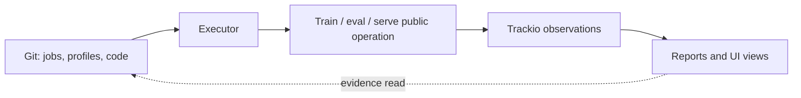

# Trackio observability architecture

Status: target MVP architecture  
Last revised: 2026-07-20

## Purpose

Trackio is the platform's durable observability layer. It answers what ran,
with which resolved inputs, what it emitted, and which artifacts it consumed or
produced.

Trackio is not the platform's authoring or execution model. Jobs, actions,
profiles, environment packages, reusable package operations, internal adapter
selection, branching, and acceptance policy remain in versioned Python code.

## Boundary



Trackio stores a wire-safe record of execution. It never imports or evaluates
the source objects that produced that record.

### Trackio owns

- run identity, lifecycle, and searchable configuration snapshots;
- scalar and system metrics;
- standard inference traces and specialized Verifiers traces;
- immutable artifact metadata, aliases, and bytes/references;
- consumed/produced run-artifact relationships;
- query APIs and observability UIs.

### Trackio does not own

- `Job` or action definitions;
- a profile/config registry or inheritance engine;
- package behavior and internal adapter selection;
- scheduling, retries, stage progression, or branch control;
- environment discovery semantics;
- selection thresholds, promotion policy, or human decisions;
- executable Python source.

## Observable hierarchy

The source model and the observable model are related but distinct:

```text
Source code                         Trackio
-----------                         -------
Job(id)                    ->       group and config.job_id
@job.action                ->       config.action_id
one action invocation      ->       config.invocation_id on N runs
one observed package call  ->       one run
request/sample/rollout     ->       one trace
input/output reference     ->       consumed/produced artifact edge
```

For the MVP, all work uses one Trackio project namespace, `lab`. This allows
reports to compare foundation models, serving work, evaluations, and model
descendants without cross-project joins. Trackio's project is a storage
namespace, not a product-level workflow object.

Every run recorded by this lab has a mandatory `job_id`, represented as the
Trackio group and copied into searchable configuration. Trackio does not create or validate the job; it
only records the source identity supplied by the executor.

## Job, action, invocation, and run

- **Job:** a versioned Python definition for one objective or workstream.
- **Action:** one named entry point in that job, such as `screen_foundations`,
  `train_sft`, or `evaluate_checkpoint`.
- **Invocation:** one call of an action. It correlates all requests submitted
  together and has no independent lifecycle store.
- **Run:** one independently observed package operation or attempt.

A lab job can contain many run kinds and many repetitions. A model branch may stay
inside the same job. A new job is created only when the objective, owner, or
lifecycle is meaningfully separate.

## Run kinds

Initial run kinds are:

- `model-onboarding`;
- `serving-benchmark`;
- `general-eval`;
- `domain-eval`;
- `sft`;
- `dpo`;
- `rl`;
- `model-transformation`;
- `comparison-report`.

`run_kind` is a searchable field, not a group or hierarchy level.

## Run configuration snapshot

The host serializes each public package operation and resolved internal config,
then records an immutable JSON-safe snapshot:

```text
schema_version
job_id
job_module
action_id
invocation_id
run_kind
implementation_id
implementation package/version
source repository commit and dirty digest
resolved model and artifact identities
resolved implementation-owned config
environment/workload/sampling identities
hardware and software context
```

Frequently queried dimensions remain top-level. The complete typed payload is
nested under `resolved`. Secrets and signed URLs are excluded.

The snapshot is evidence, not a reusable profile. Repeating a lab run from the
same snapshot still goes through job and package code and creates a new run.

## Metrics and traces

Record measurements once at the lowest trustworthy grain:

```text
Run
  ├── direct run metrics and system telemetry
  └── traces
        └── trace metrics and indexed attributes

traces + run metrics -> computed run/job/model views
```

| Grain | Persisted examples |
| --- | --- |
| Trace | TTFT, latency, token counts, reward, environment metric, correctness, error/truncation state |
| Run | training loss by step, learning rate, GPU series, scheduler/cache counters, unreconstructable population counters |
| Job/model | No direct raw metric surface; values are computed views over selected runs and traces |

Do not copy a trace measurement into run metrics merely to expose a summary.
Mean reward, p95 latency, throughput, error rate, totals, and Pareto membership
are computed properties when the underlying population is retained.

Materialized computations are allowed only as rebuildable caches or durable
report artifacts. They record calculator version, source population, filters,
grouping, sampling/warmup policy, time window, denominator, and missing-data
policy.

Initial metric namespaces are:

```text
train/*
system/*
serve/backend/*
serve/request/*
eval/rollout/*
eval/environment/*
tracking/*
```

## Inference traces

Ordinary inference requests use `trackio.Trace`. A trace belongs to one run and
contains the request/response messages, optional tool calls, stable external
request identity, workload case, warmup/measured phase, timing, token counts,
finish state, and error metadata.

The CarbonTeq fork should support idempotent external identity with uniqueness
on `(run_id, trace_type, external_id)`. A separate inference trace class is not
required.

## Verifiers traces

`trackio.VerifiersTrace` is retained because a Verifiers rollout contains a
message graph, alternate branches, model calls, tools, rewards, environment
metrics, phase timings, stop conditions, and errors that cannot be represented
losslessly as a linear chat trace.

The Verifiers adapter:

1. validates completed JSONL records against the pinned Verifiers schema;
2. streams them in idempotent batches during evaluation;
3. stores searchable projected messages and selected metadata;
4. stores selected numeric trace metrics in a queryable projection;
5. preserves the complete native record for the Verifiers rollout UI;
6. attaches the native evaluation directory as an artifact for replay.

Trackio exposes a parallel Verifiers rollout UI with branch navigation, rewards,
environment metrics, calls/tools, phase timing, stop/error state, and a link to
the producing run. It does not render an unrestricted raw payload.

Native `traces.jsonl` remains the replay authority. Partial synchronization is
reported but does not invalidate an otherwise successful evaluation.

## Artifacts and observed lineage

Trackio records immutable artifacts or external references and the runs that
consume or produce them:

```text
base model artifact
  -> consumed by SFT run
  -> produces adapter artifact
  -> consumed by eval, serve, DPO, or GRPO runs
```

These edges are the durable observed lineage. Trackio does not decide that a
checkpoint should be promoted, start a new branch, create a job, or rewrite a
profile. Those decisions remain code and human policy.

## Reports and computed views

`packages/reports` provides the stable read boundary:

| View | Population | Examples |
| --- | --- | --- |
| Trace | one request or rollout | transcript, timing, reward, tools, errors |
| Run summary | one run's traces and direct metrics | throughput, percentiles, mean reward, success/error rates |
| Job comparison | explicitly selected job runs | candidate, checkpoint, backend, or environment comparisons |
| Model lineage | artifacts plus all eligible runs | descendants, regressions, known serving/eval evidence |

Calculators declare eligible run kinds, grouping dimensions, and denominators.
Trackio itself does not define a universal score or pass/fail rule.

## Execution workspace

Frameworks may require files for trainer recovery, Verifiers JSONL, logs, or
artifact staging:

1. the executor starts the Trackio run;
2. it creates a temporary workspace keyed by run ID;
3. the implementation streams metrics and traces;
4. required outputs are promoted through Trackio artifacts;
5. the run is finalized;
6. the workspace is removed or retained under an explicit recovery policy.

The filesystem is not a parallel run registry and does not retain another
authoritative metadata/config/results bundle.

## Storage boundary

The CarbonTeq Trackio fork uses embedded Turso by default with stdlib SQLite as
a compatibility fallback. Artifact bytes remain behind Trackio's artifact
storage interface so local or object storage can evolve independently.

`packages/common` is the narrow write adapter. Engine packages may use native
Trackio trace APIs for specialized logging. `packages/reports` is the read-only
query boundary. No package mirrors Trackio data into another source of truth.

## Worked lifecycle

```text
Trackio project: lab

Job: customer-support-v1
  action screen_foundations
    invocation 01 -> Qwen serving runs, LFM serving runs, general eval runs
  action train_sft
    invocation 02 -> SFT run producing adapter A
    invocation 03 -> SFT run producing adapter B
  action evaluate_checkpoint
    invocation 04 -> domain/general eval runs consuming adapter A
  action branch_from_checkpoint
    invocation 05 -> DPO and GRPO runs consuming adapter A

Job: qwen-serving-enablement
  action optimize
    invocation 06 -> vLLM/SGLang/TurboQuant/MTP benchmark runs
```

The second job exists because serving enablement is a separate owned
workstream—not merely because a model artifact branched.

## Implementation gaps

Current code predates this target and must not be treated as compatibility:

- the local run directory duplicates Trackio state;
- `TrackedRun` permits missing jobs and groups by run kind;
- the generic resolver treats unrelated schemas as one profile family;
- serving benchmarks do not yet emit one standard trace per measured request;
- eval summaries materialize values that should normally be computed;
- reports depend too directly on physical SQLite tables;
- the CarbonTeq fork still needs trace-metric projection and complete Verifiers UI/storage support.

## Revision history

- 2026-07-20: Defined a Trackio run as the host observation of a reusable
  package operation and kept internal framework adapter selection outside
  Trackio.
- 2026-07-20: Recast Trackio as a pure observability boundary, separated
  source-level job/action/invocation concepts from Trackio runs, allowed model
  branches within a job, and retained metrics, traces, artifacts, and observed
  lineage as its responsibilities.
- 2026-07-20: Defined trace/run recording grains, computed report views,
  Verifiers traces, Turso storage, and temporary workspaces.
