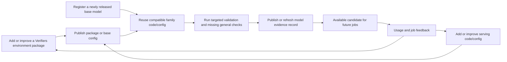
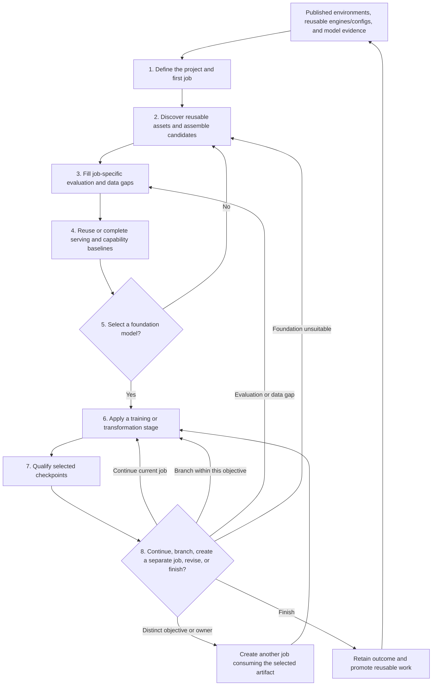

# Post-training project and job lifecycle

Status: working product model  
Last revised: 2026-07-20

## Purpose

This document describes two connected lifecycles:

1. a continuous **platform reuse lifecycle** that adds published environments, serving knowledge, reusable configs, and model evidence before any particular job needs them;
2. a **post-training project lifecycle** composed of mandatory jobs that discover
   those assets, fill only their specific gaps, and produce improvements that
   may return to the platform.

A **project lifecycle is specific to one post-training problem**. Its goals,
thresholds, model choice, training sequence, and final stop decision are not
global platform policy. Within it, a **job** is one bounded objective or
workstream, and every execution run belongs to exactly one job. A job can
contain several attempts and model branches when they answer that objective.

The **platform is cumulative**. It provides model lineage, serving, published evaluation environments, model evidence records, data preparation, training techniques, observability, and comparison tools that many jobs can compose differently. A new job should not rebuild a general environment or serve config merely because another team created it first.

## Reuse legend

Each lifecycle artifact is marked using one of these levels:

| Level | Meaning |
| --- | --- |
| **Shared** | Designed to be reused directly across jobs. |
| **Conditional** | Reusable when important context matches, such as model family, domain, hardware, or data contract. |
| **Job-specific** | Represents the objective, judgment, or evidence of one job and should not become global policy. |

Job-specific work can later become shared, but only after its assumptions are understood and it has proved useful in another job.

## Four kinds of reuse

“Reuse” means different things for different artifacts. The platform must distinguish them:

| Reuse mode | Example | What a later job does |
| --- | --- | --- |
| **Reuse a definition** | A versioned AgencyBench-style taskset or long-context needle test | Run the same definition against another model without rebuilding it. |
| **Reuse an implementation** | A vLLM launcher, Verifiers harness, runtime, or report generator | Invoke the same implementation with compatible inputs. |
| **Extend and validate a base config** | A serve config proven on a Gemma or Qwen model family | Use it as the starting config for a compatible new model and validate the changed assumptions. |
| **Reuse an observation** | A throughput result or general-capability score | Reuse it only when the exact model artifact, definition version, and relevant execution context still match. |

This distinction is important. A serving configuration may transfer to a related model even though its old throughput measurement does not. A general taskset can be reused for every new model even though every model needs its own resulting observation.

## Continuous platform reuse lifecycle

This work happens independently of a product fine-tuning job. Serving,
evaluation, and model-enablement owners use their own maintenance/onboarding
jobs to continuously expand the set of ready-to-use choices.



### General environment onboarding

A general evaluation environment—such as an agency benchmark, long-context retrieval test, reasoning taskset, or safety check—is published once as an independently versioned Verifiers package. A reusable eval config can reference it, and it can then be run against:

- newly released raw models;
- alternative sizes or quantizations;
- candidate foundations during a job;
- trained checkpoints for regression detection.

Adding the environment and running it are different operations. The environment definition is shared; each model run produces a model-specific observation.

### Serving capability onboarding

Serving work should accumulate at several levels:

- backend implementation, such as vLLM or SGLang support;
- model-architecture or family compatibility;
- family/model base configs, including useful hardware and workload defaults;
- model-specific overrides and optimization settings;
- benchmark observations.

If a serve base config already works for a related Gemma or Qwen model, a new model should extend it and override only what changed. The serving owner validates compatibility and benchmarks the new model; they do not recreate the launcher or every setting from scratch. Concrete hardware, request shape, and concurrency remain recorded run inputs rather than separate profile entities.

### Base-model onboarding

When a new model is released, the platform can evaluate it before a fine-tuning job selects it:

1. register the immutable model artifact and family metadata;
2. discover compatible serve configs, harnesses, and general evaluation configs;
3. validate inherited serving support and record necessary overrides;
4. run a smoke program, selected capability categories, or the full general program;
5. retain native serving and Verifiers evidence;
6. publish a cumulative model evidence record.

The depth of onboarding is incremental. A model may first have a serving smoke result and a small general subset, then gain additional category evidence over time.

### Model evidence record

A model evidence record is the platform’s reusable view of what is already known about one immutable model artifact. It includes references to:

- identity, family, architecture, size, quantization, license, and context limits;
- supported serve configs and model-specific overrides;
- serving observations by hardware and workload;
- general capability observations by taskset and program version;
- known harness, runtime, and training compatibility;
- limitations, failures, and evidence freshness.

The record is not a copied results folder, configuration profile, or universal model score. It is a cumulative index over versioned source observations. A fine-tuning job queries it and runs only the missing, stale, or job-specific work.

## Post-training project lifecycle at a glance



The order describes decision flow, not a requirement that teams work serially. For example, serving, environment, and data owners may prepare their assets in parallel.

## Stage 1: define the project and first job

### Goal

Describe the improvement being attempted and the constraints under which the result will be judged.

### Job decisions

- What behavior should improve?
- Who or what will use the resulting model?
- What failures are unacceptable?
- What serving hardware, latency, throughput, and concurrency constraints apply?
- How much broad-capability regression is acceptable?
- What licensing, model-size, data, or operational restrictions apply?

### Platform capabilities required

- job identity and ownership;
- structured objectives, constraints, and success criteria;
- links to related or previous jobs;
- decision and assumption recording.

### Outputs and reuse

| Output | Reuse level | Why |
| --- | --- | --- |
| Job objective and thresholds | Job-specific | They describe this product problem. |
| Constraint template | Shared | Other jobs ask the same classes of questions. |
| Hardware or deployment requirement | Conditional | Reusable when another job targets the same operating context. |
| Domain vocabulary and failure taxonomy | Conditional | Often useful across related jobs. |

## Stage 2: discover reusable assets and assemble candidates

### Goal

Start from what the platform already knows, then build a credible candidate set without repeating model enablement, serving setup, or general evaluation work.

### Job decisions

- Which existing model evidence records satisfy the job’s hard constraints?
- Are there promising models that have only partial evidence?
- Which serve base configs already support the model family and target hardware?
- Which general capability categories have already been measured?
- Which existing domain tasksets, datasets, and training recipes may apply?
- Which prior observations are still valid for this job’s context?

### Platform capabilities required

- searchable model evidence records;
- discoverable foundation and promoted derived model profiles;
- immutable model identity and artifact references;
- model-family, architecture, quantization, and compatibility metadata;
- discovery of serve/eval base configs, published environments, datasets, and recipes;
- observation coverage and freshness views;
- compatibility matching rather than exact-name matching alone;
- candidate-set construction without copying weights or results.

This stage should make absence visible. “No result” must remain distinguishable from “failed,” “unsupported,” and “not yet run.”

### Outputs and reuse

| Output | Reuse level | Why |
| --- | --- | --- |
| Model evidence record | Shared | It is designed to support future selection work. |
| Foundation or derived model profile | Shared | It gives later jobs a stable, configured starting point. |
| Model artifact definition | Shared | Any later job can reference the same immutable model. |
| Model-family compatibility knowledge | Shared | Serving and training support carries across jobs. |
| Existing serve base config | Conditional | It transfers when architecture and backend assumptions remain compatible, then is validated in the target run context. |
| Existing general observations | Conditional | They transfer only with the exact model and evaluation context. |
| Candidate set | Job-specific | It reflects this job’s constraints and available evidence. |
| Evidence-gap list | Job-specific | It describes what this job still needs to know. |

## Stage 3: fill job-specific evaluation and data gaps

### Goal

Add only the evaluation and data pieces that the job needs but the platform does not already provide. This may include creating a new domain-specific Verifiers environment package as part of the job.

### Job decisions

- Which existing general capability categories matter for this job?
- Which problem-specific scenarios represent real success and failure?
- Does an existing domain taskset already express those scenarios correctly?
- Which examples are available for training, validation, and held-out evaluation?
- Which scenarios require deterministic verification, an LLM judge, tools, a simulated user, or a sandbox?
- Which missing capability is job-local, and which should immediately be treated as a platform contribution?

### Platform capabilities required

- versioned general evaluation programs composed from reusable tasksets;
- Verifiers `TaskData`, `Task`, and `Taskset` packages for executable scenarios;
- compatible harness and runtime selection;
- deterministic verifiers, judges, rewards, and observational metrics;
- source-data ingestion and transformation;
- explicit training, validation, and held-out splits;
- taskset validation, local debugging, and native trace capture;
- a path for publishing a broadly useful environment through Verifiers or contributing reusable code/config to the appropriate train/eval/serve package.

Verifiers is the shared task-level abstraction. A problem evaluation is a configured run of a taskset, not a second dataset and scoring implementation inside the evaluation application.

### Outputs and reuse

| Output | Reuse level | Why |
| --- | --- | --- |
| Selected general evaluation categories | Job-specific | The selection reflects this job’s risks. |
| General evaluation tasksets | Shared | Their definitions are independent of this job. |
| Domain environment package | Conditional | It may originate in this job, then be published independently and reused wherever the same domain semantics apply. |
| Harness implementation | Shared | It describes how a class of model or agent operates. |
| Runtime implementation | Shared | Local, container, and remote execution are platform concerns. |
| SFT or preference dataset | Conditional | Reusable when objective, license, and data contract match. |
| Dataset loader or transformation | Conditional | Often reusable even when the resulting dataset is job-specific. |
| Evaluation thresholds | Job-specific | Passing scores depend on this job’s requirements. |

## Stage 4: reuse or complete serving and capability baselines

### Goal

Assemble sufficient comparable evidence for every viable candidate, reusing valid observations and running only missing, stale, or job-specific checks.

For each candidate, the stage answers three questions in order:

1. **Can it operate?** Reuse a matching serving observation or extend a compatible serve base config and validate it on the new model. Benchmark fit, reliability, latency, throughput, concurrency, and memory when evidence is missing.
2. **Is it generally capable enough?** Reuse matching general observations and run only the missing or stale capability subsets.
3. **Does it have task potential?** Run the problem-specific Verifiers tasksets, unless an exact observation already exists for the same model and taskset version.

### Platform capabilities required

- reusable vLLM and SGLang serving targets;
- inheritance of serve base configs across compatible models and model-family variants;
- explicit hardware, request-shape, context, and concurrency fields in each resolved run config;
- serving benchmark execution and backend-native diagnostics;
- Verifiers evaluation execution against an inference endpoint;
- coverage and gap analysis across models and evaluation categories;
- preservation of resolved evaluation configuration and native traces;
- normalized summaries that link to native serving or Verifiers artifacts;
- comparison across model versions under compatible contexts;
- updating the cumulative model evidence record with newly produced evidence.

### Outputs and reuse

| Output | Reuse level | Why |
| --- | --- | --- |
| Inference engine integration | Shared | It supports many models and jobs. |
| Model-family serve config or optimization | Conditional | It is inherited for a compatible model, then validated rather than rebuilt. |
| Concrete hardware/workload inputs | Job-specific | They express this job's operating requirement; the resulting observation is reusable only when the full context matches. |
| General capability baseline | Conditional | Useful elsewhere when the model and evaluation version are unchanged. |
| Domain capability baseline | Conditional | Useful for later jobs using the same taskset version. |
| Updated model evidence record | Shared | It reduces work for later jobs considering the same model. |
| Candidate comparison and interpretation | Job-specific | It combines evidence according to this job’s priorities. |

## Stage 5: select the foundation model

### Goal

Choose the model version from which the post-training branches will begin.

### Job decisions

- Which constraints are hard gates?
- Which trade-offs are acceptable?
- Is a weaker but faster model preferable to a stronger but impractical one?
- Is the evidence sufficient, or must candidates, workloads, or tasksets be revised?

### Platform capabilities required

- comparable evidence views;
- filtering that prevents materially different contexts from being mixed;
- coverage views that expose missing or stale evidence without penalizing it as a failed score;
- direct navigation from the job’s candidate view to each cumulative model evidence record;
- explicit selection, rejection, and rationale records;
- ability to revisit the decision later.

### Outputs and reuse

| Output | Reuse level | Why |
| --- | --- | --- |
| Selected foundation model | Job-specific | Selection is made for this objective. |
| Selection rationale | Job-specific | Metrics do not define a universal winner. |
| Candidate evidence | Conditional | Other jobs may reuse observations when their contexts match. |
| Newly completed model-profile evidence | Shared | It becomes available to every later job considering that exact model. |
| Comparison and decision tooling | Shared | Every job needs it. |

## Stage 6: apply a training or transformation stage

### Goal

Consume one immutable model version and produce one or more possible descendants.

A stage may apply:

- supervised fine-tuning;
- DPO or another preference method;
- online RL using a Verifiers environment;
- corrective SFT after RL;
- quantization or another weight-changing transformation.

The lifecycle does not prescribe a sequence such as `SFT -> RL -> SFT`. Each job composes the stages it needs.

### Platform capabilities required

- a common training-stage input/output and lineage contract;
- technique-owned configuration and execution for SFT, DPO, RL, and future methods;
- data or taskset compatibility validation;
- recovery checkpoints and resume support;
- metric, event, resource, and failure logging;
- promotion of selected checkpoints into immutable model versions.

Recovery checkpoints are operational state. They become lifecycle artifacts only when intentionally selected for evaluation or branching. A promoted artifact receives a derived model profile only when it should become a stable starting point for later jobs or independent serving/evaluation work.

### Outputs and reuse

| Output | Reuse level | Why |
| --- | --- | --- |
| Technique implementation | Shared | SFT, DPO, and RL execution should serve many jobs. |
| Technique recipe | Conditional | Reusable for similar model size, data, and hardware. |
| Exact stage configuration | Job-specific | It represents one hypothesis within one job. |
| Trainer recovery checkpoint | Job-specific | It exists to resume this run. |
| Promoted model checkpoint | Conditional | It may become a foundation for a related job. |
| Derived model profile | Conditional | Created only when the promoted artifact is intentionally reusable as a configured starting point. |
| Training metrics and samples | Job-specific | They explain this stage, though reporting tools are shared. |

## Stage 7: qualify selected checkpoints

### Goal

Determine what changed and whether a checkpoint should become a branch point or selected outcome.

Qualification normally proceeds in this order:

1. run the problem-specific Verifiers tasksets;
2. compare with the checkpoint’s parent and the raw foundation baseline;
3. run general regression checks;
4. re-run serving checks when weights, quantization, output shape, or inference behavior may have changed;
5. inspect traces and important failure slices rather than relying only on aggregate scores.

### Platform capabilities required

- evaluation of any immutable checkpoint, independent of its training run;
- reuse of the same taskset versions used for the baseline;
- parent, sibling, and foundation comparisons;
- regression policies configured by the job;
- trace inspection and failure analysis;
- links from every observation to the exact model and evaluation definition.

### Outputs and reuse

| Output | Reuse level | Why |
| --- | --- | --- |
| Verifiers taskset and verifier improvements | Conditional | Reusable when they correct general domain semantics. |
| General regression program | Shared | The program can protect many jobs. |
| Checkpoint observations | Conditional | Reusable under the same model, taskset, and execution context. |
| Pass/fail judgment | Job-specific | Thresholds and trade-offs belong to the job. |
| Failure-analysis tools | Shared | Trace and slice inspection are platform capabilities. |

## Stage 8: continue, branch, revise, or finish

### Goal

Use checkpoint evidence to choose the next action while preserving all useful ancestry.

The team may:

- continue the current technique;
- apply another technique to the same checkpoint within the current job;
- create sibling model branches from the same artifact with different data,
  environments, or settings;
- return to any earlier selected model version and branch again;
- create another job when the next work has a distinct objective, owner, or
  lifecycle;
- improve the taskset, verifier, or dataset and re-establish affected baselines;
- revisit foundation selection;
- finish with a selected outcome.

Changing an evaluation environment creates a new evaluation definition. Results from different versions remain visible but are not silently treated as directly comparable.

### Platform capabilities required

- a directed model-lineage graph;
- branching from any promoted model version;
- environment, dataset, and evaluation-definition versioning;
- decision records linking evidence to the next action;
- job closure without deleting unsuccessful runs or branch evidence;
- optional promotion of a reusable descendant into a derived model profile;
- publication of reusable work through the owning train/eval/serve package or Verifiers environment package.

### Outputs and reuse

| Output | Reuse level | Why |
| --- | --- | --- |
| Continue, branch, or stop decision | Job-specific | It advances this objective or hands an artifact to a distinct job. |
| Model lineage | Shared | Descendants can be discovered and reused by later jobs. |
| Selected final model | Conditional | It may seed another related job. |
| Derived model profile | Conditional | It exposes a selected descendant as a reusable starting point without copying its lineage. |
| Improved serving, training, data, or environment component | Conditional | Promote it after its assumptions and compatibility are documented. |
| Lessons and failure patterns | Conditional | They can improve future recipes and tasksets. |
| Lifecycle and comparison tooling | Shared | Every job uses the same mechanics. |

## Minimum platform abstractions

The lifecycle suggests a small set of durable concepts. These are product concepts, not yet a commitment to particular classes, tables, or configuration files.

| Concept | Responsibility | Typical reuse |
| --- | --- | --- |
| **Project** | Product-level initiative; not required to map to a Trackio project. | Project-specific instance; shared structure. |
| **Job** | Mandatory bounded objective/workstream grouping its actions and execution runs. | Job-specific instance; shared structure. |
| **Action** | Named code entry point that invokes one or more reusable package operations for a job. | Reusable SDK; job-specific behavior. |
| **Invocation** | One call of an action, used to correlate the observed runs it creates. | Execution-specific correlation. |
| **Engine packages** | Provide independently versioned `common`, `train`, `eval`, and `serve` implementations. | Shared. |
| **Model profile** | Identifies a loadable foundation or promoted descendant and references recommended engine configs. | Shared starting point. |
| **Typed package profile** | Provides reusable settings owned by the corresponding train, eval, or serve package. | Shared or conditional. |
| **Model version** | Identifies immutable weights or adapters and their lineage. | Shared. |
| **Model evidence record** | Indexes cumulative compatibility and evidence for one immutable model artifact. | Shared view; observations remain context-bound. |
| **Serving target** | Connects an inference implementation to compatible models and hardware. | Shared or conditional. |
| **Run context** | Records hardware, request shape, concurrency, and other concrete execution inputs. | Evidence-bound. |
| **Verifiers environment package** | Owns executable task data, behavior, tools, scoring, validation, and dependencies. | Independently published and versioned. |
| **Evaluation config** | Groups published environment references for a general category or domain question. | Shared or job-specific. |
| **Data asset** | Identifies training corpora, preference data, sources, splits, and transformations. | Shared or conditional. |
| **Training run** | Applies one technique to one model version inside a job and may produce descendants. | Shared contract; job-specific execution. |
| **Observation** | Links a model and exact definition to native evidence and summarized measurements. | Conditional on matching context. |
| **Decision record** | Explains selection, rejection, branching, or stopping. | Job-specific. |

## How job work becomes reusable

Not every useful experiment should immediately become a platform abstraction. Reuse should mature through evidence:

```text
Job-local implementation
        ↓ used successfully again
Reusable candidate
        ↓ assumptions, compatibility, tests, and ownership documented
Published package, engine release, or shared base config
```

Reusable work enters the platform in two ways:

- **proactive onboarding:** an evaluation owner publishes an environment, a serving owner improves engine code/config, or a model owner profiles a new release before a job requests it;
- **job-driven promotion:** a job reveals a useful environment, config improvement, transformation, or recipe that is then published through its owning mechanism.

Promote a piece when:

- another job needs the same behavior;
- its job-specific assumptions can be made explicit;
- it has a stable input/output contract;
- it can be tested independently;
- an owner can evolve it without coordinating every consumer.

Keep it job-specific when it encodes the job’s objective, threshold, trade-off, or one-off hypothesis.

## Reusable platform pieces by stage

| Stage | Platform support | Most reusable pieces |
| --- | --- | --- |
| Define job | Job context, requirements, decisions | Templates and taxonomies |
| Discover assets and candidates | Reference discovery, model evidence, coverage and compatibility | Model records, serve configs, prior observations |
| Fill job-specific gaps | Tasksets, verifiers, judges, data transformations | General tasksets, harnesses, runtimes, domain environments |
| Reuse or complete baselines | Serving and Verifiers execution, gap analysis, traces | Serving integrations/configs, environment packages, new model evidence |
| Select foundation | Evidence views and decision records | Comparison tooling |
| Train or transform | Reusable training package operations, checkpoints, observability | Technique implementations and validated recipes |
| Qualify checkpoints | Re-evaluation, regressions, trace analysis | Tasksets, regression programs, analysis tooling |
| Branch or finish | Lineage, branching, promotion | Improved shared components and selected model descendants |

## Product rules

- The lifecycle belongs to code-defined jobs; the platform does not impose one global selection policy.
- General environments are published and versioned independently, then referenced across model onboarding, foundation selection, and checkpoint regression evaluation.
- Domain-specific environments may be created during a fine-tuning job; they remain standalone Verifiers packages and can serve both evaluation and supported online-RL workflows.
- Newly released models can be profiled through a reusable model-onboarding job using a smoke program, selected capability subsets, or a full general evaluation program.
- A model evidence record accumulates references to evidence; it does not replace native observations or assign a universal model score.
- Compatible serve base configs are extended and validated for new models rather than recreated from scratch.
- Every operation consumes identifiable, versioned inputs.
- General and domain evaluations use Verifiers tasksets for task execution and native traces.
- Serving load testing remains a separate capability because it measures the inference system rather than task correctness.
- Results are reusable only when their model, definition, and relevant execution context match.
- Missing, unsupported, failed, stale, and not-yet-run evidence are different states.
- Runtime-only serving optimizations create new serving observations; weight-changing optimizations create new model versions.
- Recovery checkpoints are not automatically promoted into lifecycle model versions.
- Model artifacts do not automatically become profiles; only descendants intentionally promoted for reuse receive derived profiles.
- Shared parameters establish identity and comparability; technique-specific and backend-specific settings remain locally owned.
- Unsuccessful branches and rejected candidates remain useful evidence.

## Open product questions

- What is the minimum job definition required before model screening begins?
- What evidence should a newly released model receive before it appears as a generally available candidate?
- How do serve base configs declare family-level compatibility and the validation required by a new variant?
- Which general capability subsets define initial, standard, and comprehensive model evidence coverage?
- What makes an evaluation environment ready to establish a trustworthy baseline?
- What qualifies a trainer checkpoint for promotion into a model version?
- When should a promoted model artifact receive a derived profile for reuse?
- Which general capability checks are mandatory after each type of training stage?
- Which compatibility information must a reusable capability publish?
- What evidence is required before job-local work is promoted into the shared platform?
- When an environment changes, which earlier model versions must be re-evaluated?

## Revision history

- 2026-07-20: Defined jobs as objective/workstream boundaries that may contain
  several actions, runs, and artifact branches; reserved new jobs for distinct
  objectives or ownership and added action/invocation concepts.
- 2026-07-20: Distinguished the project lifecycle from mandatory bounded jobs;
  this earlier revision's one-job-per-branch rule is superseded above.
- 2026-07-19: Added foundation/derived model profiles as reusable lifecycle entry points while keeping ordinary adapters and checkpoints in artifact lineage.
- 2026-07-19: Simplified reuse around published Verifiers packages, four engine packages, reusable base configs, concrete run context, and computed model evidence records.
- 2026-07-19: Added the continuous platform reuse lifecycle, proactive general-environment and model onboarding, cumulative model evidence, serve-config inheritance, and evidence-gap reuse rules.
- 2026-07-19: Reframed the document as a post-training job lifecycle; added required platform capabilities and explicit reuse classification at every stage.
- 2026-07-19: Defined raw-model selection, staged training, checkpoint evaluation, and branching as one product lifecycle.
