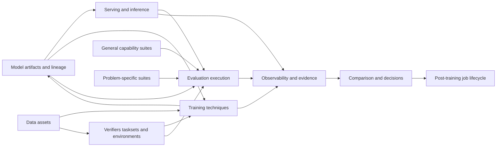

# Product capabilities and user needs

Status: working draft for product iteration  
Last revised: 2026-07-20

## Purpose

This document defines the reusable product capabilities the lab should support.
It stays above repository layout, schemas, CLIs, and library choices. “User
need” below is product language; **job** is reserved for the platform's bounded,
code-defined objective/workstream.

The system is not one fixed fine-tuning pipeline. It is a collection of independently improvable capabilities that meet through a small shared context: the exact model version, problem, execution context, and producing or consuming run.

The reusable software units are the `train`, `eval`, and `serve` packages.
Jobs, CLIs, notebooks, and other projects should be able to call their public
operations. Framework runners and adapters are implementation details inside
those packages.

## Product domains and user needs

### 1. Post-training job lifecycle

**User need:** When I have a fine-tuning problem, I want to move from candidate selection through repeated training and evaluation while retaining the reason for every choice.

The product should let a team:

- define the target behavior, constraints, and success criteria;
- screen several raw-model candidates;
- select, reject, continue, stop, or branch with an explicit decision;
- start a new stage from any selected prior model version;
- see the evidence available at each decision point.

The detailed journey is documented in [Post-training job lifecycle](./finetuning-lifecycle.md).

### 2. Model artifacts and lineage

**User need:** When any team works with a model, I want everyone to refer to the exact same immutable version and understand where it came from.

The product should support:

- raw models, quantized variants, adapters, merged outputs, and selected checkpoints;
- cumulative model evidence records that index known serving support and general capability evidence;
- parent-child lineage across training and weight-changing optimization;
- branches from any selected prior version;
- a distinction between recovery checkpoints and promoted model versions;
- attachment of serving, evaluation, and training evidence to the exact version used.

### 3. Serving and inference

**User need:** When I own inference, I want to make a model run well for a defined hardware and workload target without changing evaluation or training code.

The product should let the serving team:

- bring up a model through a supported engine such as vLLM or SGLang;
- declare whether a model and optimization are supported;
- publish family- or architecture-level serve base configs that compatible models can extend and validate;
- iterate on engine settings, quantization, speculative decoding, TurboQuant, and custom kernels;
- define realistic request shapes and concurrency as explicit run inputs;
- measure fit, reliability, throughput, time to first token, inter-token latency, and memory;
- compare an optimization with a reproducible baseline;
- publish a reusable inference target that evaluation or manual probing can consume.

Serving owns execution quality. It does not own model-capability judgments.

### 4. General capability evaluation

**User need:** When I compare raw models or check a trained checkpoint for regressions, I want stable broad-capability evidence that is independent of a single fine-tuning problem.

The product should let the general-eval owner:

- organize evaluations into independently versioned categories;
- compose a smoke program and more complete programs from versioned Verifiers tasksets;
- run a full program or selected capability subsets when a new base model is released;
- configure the appropriate harness and execution context for each taskset;
- run the same program against any compatible model version and inference target;
- retain per-category results rather than only one aggregate score;
- define regression checks for trained checkpoints;
- evolve a category without copying task data or scoring into the eval layer.

These programs are platform capabilities, not job-local setup. Jobs select the relevant categories and reuse existing model observations when the model, taskset, and execution context match.

Example categories may include reasoning, knowledge, instruction following, coding, safety, and robustness. The exact taxonomy remains a product decision.

### 5. Task environments and problem-specific evaluation

**User need:** When I own a fine-tuning problem, I want one executable definition of its scenarios that can evaluate models, provide RL experience, and evolve independently of trainers.

For model-behavior work, Verifiers combines the concepts we previously called a task dataset, environment, verifier, and task-evaluation implementation:

- **TaskData** is one immutable, typed task row, including prompts, references, files, timeouts, and resource needs.
- **Task** supplies behavior for that row: setup, tools, user simulation, stop conditions, metrics, rewards, validation, and cleanup.
- **Taskset** loads or generates tasks and exposes load-time configuration such as dataset, split, seed, and size.
- **Environment** composes a loaded taskset with a compatible harness and runtime into executable rollouts.
- **Trace** is the native result containing calls, messages, state, rewards, metrics, and errors.

The product should let the problem or environment team:

- define success metrics and failure slices for the target problem;
- package and version a self-contained taskset as an independent Verifiers package;
- load source datasets or generate procedural tasks through that taskset;
- maintain training and held-out splits through taskset configuration;
- keep scoring and verification with the task behavior that gives them meaning;
- attach tools, simulated users, setup, validation, and cleanup where needed;
- run compatible tasksets with different harnesses or runtimes;
- run repeated samples when pass rate or variance matters;
- compare raw baselines, checkpoints, and sibling branches;
- test tasks and verifiers without launching a training run;
- compose deterministic checks, model judges, per-rollout rewards, group rewards, and diagnostic metrics;
- distinguish training rewards from observational metrics;
- inspect and retain native traces;
- use the same taskset configuration for standalone evaluation and online RL;
- publish and install environments through Verifiers/Prime rather than a platform-owned package catalog.

Problem-specific evaluation is therefore a **run of a taskset**, not a second implementation beside the environment. A domain evaluation program may group several tasksets, but it should reference them rather than duplicate their datasets or scoring.

### 6. Data assets

**User need:** When I prepare SFT, preference, evaluation, or RL data, I want it reusable and attributable without coupling it to one training command.

The product should support two distinct data needs:

- **training corpora:** supervised examples and preference pairs used directly by SFT or DPO;
- **environment task data:** source records loaded into typed Verifiers `TaskData` by a taskset for evaluation or RL.

Across both, the product should support:

- versioned sources and transformations;
- explicit train, validation, and held-out splits;
- task metadata and important evaluation slices;
- provenance from derived data back to its sources and transformation;
- validation of the contract expected by a technique or taskset.

We should not introduce a generic local task-dataset schema in front of `TaskData`. Dataset cards can document sources, but the executable task contract belongs to the taskset.

### 7. Training techniques

**User need:** When I own a training technique, I want to apply it to a compatible model and data or environment input, produce branchable outputs, and improve the technique independently.

The initial techniques are:

- **SFT:** train from supervised examples and produce selected checkpoint candidates;
- **preference optimization, including DPO:** train from comparison or preference data;
- **online RL:** collect rollouts from versioned environments, consume rewards, and update the policy;
- **corrective stages:** apply a later technique to any earlier selected output, including SFT after RL.

Every technique should expose its own meaningful controls and metrics while participating in the same model-lineage and run-observability capabilities. The product should not force all technique settings into one universal trainer configuration.

### 8. Observability and reproducibility

**User need:** When a run succeeds, fails, or produces a surprising model, I want to understand what happened without requiring the owning team’s local knowledge.

The product should capture:

- resolved inputs and parameters;
- model, data, environment, suite, harness, runtime, and code versions as applicable;
- hardware and software context;
- lifecycle events, failures, and resource measurements;
- training metrics, serving measurements, evaluation scores, and selected examples;
- artifacts produced and consumed by each run;
- enough rollout or trace detail to diagnose environment and verifier behavior.

Observability is shared infrastructure, but each domain owns the meaning of its specialized metrics.

### 9. Comparison and decision support

**User need:** When I must choose a model or next training branch, I want relevant evidence brought together without forcing it into one score.

The product should let a user:

- compare raw candidates under the same hardware, workload, and suites;
- compare a checkpoint with its parent and raw baseline;
- inspect task improvement alongside general regressions;
- compare serving implementations for the same model artifact;
- filter results by compatible contexts instead of mixing incomparable runs;
- record the reason a model, checkpoint, or branch was selected.

Pareto analysis may be one later view, but it is not the organizing goal.

## Shared context between domains

Teams need common references, not one giant shared configuration. The minimum cross-domain context is:

- **problem identity:** which fine-tuning objective or product scenario this work supports;
- **model identity:** the exact immutable input model and its lineage;
- **run identity:** the operation that produced an observation or artifact;
- **definition identity:** the exact suite, taskset, environment, dataset, or workload version used;
- **execution context:** relevant hardware, software, code, and random-seed information;
- **relationship:** which artifacts and runs were consumed and produced.

Parameters specific to vLLM, SGLang, SFT, DPO, a verifier, or a task remain owned by that domain. Each run snapshots both the shared context and its domain-specific resolved parameters.

## Capability relationships

“Evaluation execution” runs Verifiers environments and preserves their native
traces. General and domain-evaluation owners may curate different collections,
while taskset authors own the executable data and scoring contract. These are
separate user capabilities over one substrate, not separate evaluation
frameworks.

## Initial product scope

The first useful slice should prove these workflows:

1. Compare several raw model versions using the same explicitly recorded hardware and workload inputs.
2. Run categorized general checks and one problem-specific Verifiers taskset against the survivors.
3. Select one starting model and retain the decision evidence.
4. Apply SFT or RL and promote selected checkpoints as lineage branches.
5. Re-run the task evaluation, a general regression suite, and serving checks where relevant.
6. Reuse the exact same Verifiers taskset and task configuration for evaluation and online RL.
7. Inspect all produced and consumed artifacts, resolved parameters, metrics, and traces.

Deferred until repeated workflows justify them: automated promotion policies, a universal plugin registry, a scheduler, formal governance, and a single composite model score.

## Open product questions

- Which general capability categories belong in the initial smoke and standard suites?
- What is the first problem-specific scenario that should prove taskset, harness, runtime, and verification reuse?
- Which environment packages should our teams publish to the Environment Hub, and which existing packages should we consume?
- What minimum trace data is useful enough to retain for evaluation and RL on local hardware?
- Which compatibility declarations are required before a model, technique, environment, or serving optimization can be composed?
- Which evidence is mandatory before selecting a raw model or promoting a checkpoint?

## Research basis

- [Current Verifiers architecture on GitHub](https://github.com/PrimeIntellect-ai/verifiers/blob/main/docs/v1/architecture.md)
- [Current taskset guide on GitHub](https://github.com/PrimeIntellect-ai/verifiers/blob/main/docs/v1/tasksets.md)
- [Current evaluation guide on GitHub](https://github.com/PrimeIntellect-ai/verifiers/blob/main/docs/v1/evaluation.md)
- [Verifiers source repository](https://github.com/PrimeIntellect-ai/verifiers)

## Revision history

- 2026-07-20: Made train/eval/serve package operations the reusable product
  units across projects rather than framework runner objects.
- 2026-07-20: Reserved “job” for the code-defined objective/workstream and
  renamed product job stories to user needs to avoid hierarchy ambiguity.
- 2026-07-19: Clarified that environments are independent Verifiers packages and that hardware/workload are resolved run inputs rather than profile entities.
- 2026-07-19: Revised evaluation around Verifiers' unified TaskData, Task, Taskset, Environment, and Trace model; removed the duplicate product boundary between problem evaluation and environments.
- 2026-07-19: Added the initial product-domain and jobs map, including independently owned general evaluation, problem evaluation, environments, verification, training techniques, serving, and observability.
