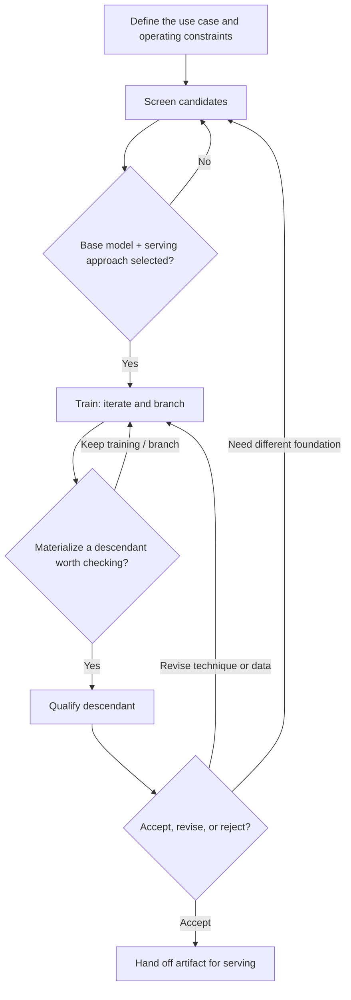

# 01 · Post-Training Workflow


> **Frozen baseline (2026-07-21).** Product authority: [post-training README](./README.md). Prefer implementation-plan / code changes over redesigning this doc unless explicitly unfrozen.

Most post-training fails as process, not as algorithms. Teams pick a model or
trainer too early, skip operating constraints, train without baselines, and
treat every checkpoint as progress.

This document is a mental model for producing finetunes as **branchable,
evidence-backed descendants** of a foundation model. It describes how work
should proceed and what humans decide at each gate. It does not require a
particular trainer, inference engine, evaluation library, host, or platform.

Read this first. Later documents explain how to organize repeated work and,
only then, when a shared framework becomes worthwhile.

## Two scopes of work

Not everything belongs to a single use-case project.

| Scope | What lives here | Examples |
| --- | --- | --- |
| **Framework-shared** | Assets the framework maintains for reuse across projects | Foundation models, inference recipes, general capability baselines, shared environments and suites |
| **Project** | One use case and its decisions | Operating constraints, domain tasks, training branches, acceptance thresholds |

Framework-shared work exists so projects do not repeat foundation characterization.
A new project should **consume** known models, recipes, and baselines, and only
re-run what its constraints or domain make newly necessary.

How that split is recorded is defined in
[02 · Primitives](./02-primitives.md) and
[03 · Work and Evidence](./03-work-and-evidence.md).

## The decision loop



There are three **stages** for work packages: **`screen`**, **`train`**, and
**`qualify`**. General evaluation, domain evaluation, and similar practices are
optional jobs inside those stages — or reused from framework-shared assets —
not extra stages.

| Stage | Primary question | Primary output |
| --- | --- | --- |
| `screen` | Which foundation model and serving approach should this project start from? | Selected base model + serving approach |
| `train` | Which techniques and branches produce promising descendants? | Materialized descendant artifact(s) |
| `qualify` | Does a chosen descendant meet task, regression, and serving expectations? | Accept / revise / reject decision plus evidence |

The **project brief** (problem, constraints, thresholds) sits on the project. It
is not a stage.

**Selection is not a stage.** Accepting a qualified descendant and handing it to
serving is a project decision and an artifact handoff. Serving itself may live
in another package or system; this workflow’s job is to produce evidence-backed
finetune outputs, not to operate production serving.

## Why screen, then train, then qualify

Start from a problem and a set of models worth trying. **Screen first**: can a
candidate operate under this project’s constraints, and is it worth training?
Once a base is chosen, **train** — iterate and branch. When a descendant is
worth keeping, **qualify** it against domain, regression, and serving
expectations before handoff.

`train` produces candidates. `qualify` answers whether a materialized
descendant is good enough. Keep them separate so training packages are not
forced to carry every check, and so qualification evidence stays comparable
across branches.

Practices such as general and domain evaluation are **jobs you may include**
when they help the stage’s question — including inside `screen` or `qualify`.

Examples of optional extent:

- One clear contender already characterized in framework-shared assets →
  `screen` may be minimal (confirm project constraints) or almost empty if
  shared evidence already answers the gate.
- Several contenders → `screen` may add `serve.benchmark`, and optionally
  `eval.general` / `eval.domain`, to choose a base.
- A `train` package may be thin (train only) or include light diagnostics;
  deeper acceptance checks belong in `qualify`.
- A `qualify` package may be minimal (domain + smoke) or extensive (domain,
  general regression, full serve benchmark).

## 1. Define the use case (project brief)

Start with the behavior to improve, not with a preferred model or algorithm.
Record:

- representative users, tasks, tools, and operating conditions
- important failure cases and evaluation slices
- latency, throughput, concurrency, context, memory, hardware, and cost needs
- model-size, deployment, licensing, privacy, and data restrictions
- required task improvement and acceptable general-capability regression

Numeric thresholds belong to the project. Prefer framework-shared models and
recipes that already match these constraints.

> **Example:** An automation assistant may require reliable structured tool
> calls, 32K input context, concurrency four on the target GPU, and a defined
> maximum rate of invalid actions.

## 2. Screen (`screen`)

A contender combines:

- an immutable model or weight-quantized variant (often framework-shared)
- an inference binding for that variant (engine + sampling + target; often
  framework-shared)
- the target hardware
- a representative workload for *this* project’s prompt/output/context/concurrency needs

**Always relevant:** load reliability and operating fit (context, concurrency,
memory, latency/throughput gates the project cares about).

**Optionally relevant:** general capability comparison when multiple contenders
remain plausible; domain probes when the use case needs an early task signal
before training. Skip what framework-shared evidence or a single-contender
situation already makes unnecessary.

Remove candidates that fail hard operating constraints. When several survive,
compare as a **Pareto set**, not a single score. The gate is: **select a base
model and serving approach for training** (or decide none are viable).

## 3. Train (`train`)

After a base is selected, training is where the team iterates and branches.

A post-training recipe is an ordered, branchable sequence of techniques:

```text
SFT -> GRPO
SFT -> DPO -> GRPO
SFT -> GRPO -> corrective SFT
SFT-A ─┬─> DPO
       └─> GRPO
```

Each step consumes one exact model descendant plus versioned data or an
environment. It produces recovery checkpoints; the owner materializes
checkpoints worth keeping as immutable artifacts.

`train` work packages focus on producing descendants. They may include light
diagnostics, but acceptance against project gates belongs in **`qualify`**.
Sibling branches are sibling `train` packages linked by artifacts.

## 4. Qualify (`qualify`)

When a materialized descendant is worth checking, open a `qualify` work
package. Typical order:

1. held-out domain evaluation and important traces
2. compare with parent and relevant baselines
3. general regression subset when regression risk matters
4. serving compatibility smoke; broader serve benchmark when serving behavior
   may have changed

Decide explicitly: accept (hand off for serving), revise (back to `train` or
data/environment), or reject. Comparing several finalists can be one `qualify`
package with multiple candidate runs.

## Evidence practices (not stages)

These are reusable practices and job kinds, not workflow stages:

| Practice | Typical jobs | Often owned at |
| --- | --- | --- |
| Serving measurement | `serve.benchmark`, `serve.smoke` | Framework-shared recipes + project constraints |
| General capability eval | `eval.general` | Framework-shared baselines; project may subset or re-check |
| Domain / task eval | `eval.domain` | Usually project; environments may be framework-shared |

They commonly appear in `screen` and `qualify` packages, and sometimes lightly
in `train`.

## Principles

- Separate framework-shared assets from project decisions.
- Screen for a base, train to produce descendants, qualify before handoff.
- Skip optional evidence when shared results or a single contender already
  answer the gate.
- Treat training as ordered and branchable inside `train`.
- Distinguish recovery checkpoints, materialized descendants, and qualify
  decisions.
- Keep thresholds and accept/revise/reject decisions with the project.
- Produce serving-ready artifacts; do not treat “selection” as a stage.

## What this workflow deliberately does not decide

- a universal model score or automatic winner
- a fixed SFT-to-DPO-to-RL sequence
- mandatory general or domain jobs on every package
- automatic checkpoint promotion or automatic qualify-to-serve promotion
- which rewards, thresholds, or stopping policies a project must adopt
- which trainer, inference engine, environment library, or host must be used
- how production serving is operated after a descendant is handed off

## When repeated work needs a system

A team can run this loop once with notebooks, scripts, and tribal knowledge.
Teams that run it across many projects need shared model catalogs, recipes,
baselines, lineage, and comparable evidence — that is, a **framework**.

Continue with [02 · Primitives](./02-primitives.md), then
[03 · Work and Evidence](./03-work-and-evidence.md).
