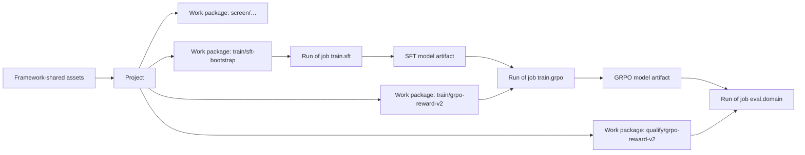

# 03 · Work and Evidence


> **Frozen baseline (2026-07-21).** Product authority: [post-training README](./README.md). Prefer implementation-plan / code changes over redesigning this doc unless explicitly unfrozen.

The [workflow](./01-workflow.md) describes *what to decide and in what order*.
The [primitives](./02-primitives.md) define the selectable inputs jobs bind
(model variant, dataset selection, environment binding, inference binding,
training selection, evaluation plan, workload, execution target). This document
describes *how to organize the work and evidence* once a team runs that loop
more than once.

This is still a practice document. It does not require a particular product or
host.

## Core model

```text
Framework-shared assets (models, recipes, baselines, suites, environments, …)

Project (use case)
  └── Work package (@ stage: screen | train | qualify)
        └── Run (of a Job)
```

- **Framework-shared** assets are maintained once and reused across projects.
- **Project** holds one use case and its decisions.
- **Stage** is `screen`, `train`, or `qualify`.
- **Work package** is one stage-tied body of work; the team chooses job extent.
- **Job** is a reusable typed definition (`train.sft`, `eval.domain`, …).
- **Run** is one execution of a job.
- **Artifacts** link runs across packages and projects. Package order is not
  lineage.



| Concept | Meaning |
| --- | --- |
| Framework-shared asset | Catalog entry and evidence reused across projects |
| Project | One model-improvement use case and its decision boundary |
| Stage | `screen`, `train`, or `qualify` |
| Work package | One coherent body of work at a stage; team-chosen job extent |
| Job | Reusable typed definition of work (the job kind) |
| Run | One observed execution of a job |
| Artifact | Immutable input or output consumed or produced by a run |
| View | Computed interpretation of compatible evidence |

| Concern | Authoritative relationship |
| --- | --- |
| Shared reuse | Framework-shared assets and their evidence |
| Work grouping | Project and work-package membership |
| Execution identity | Run and job-kind identity |
| Model lineage | Consumed and produced artifact edges |
| Interpretation | Explicit views and human decisions |

## Framework-shared versus project

| Framework-shared | Project |
| --- | --- |
| Foundation model variants and inference bindings | Which models are in scope for *this* use case |
| Base-catalog workloads, targets, recipes, baselines | Project overlays and work-package bindings |
| Shared evaluation plans and environments | Domain tasksets, thresholds, package extent |
| Shared job definitions | Which optional jobs to enable |

Projects should **reference** framework-shared assets by identity and version.
Re-run shared work only when assumptions change (new hardware, new model
revision, new recipe, invalidated baseline) or when the project’s constraints
are outside what the framework already measured.

Framework-shared evidence is not automatically project evidence. A project view
must show whether it consumed shared results, re-ran them, or skipped them.

## Project

A project is the durable boundary for one model-improvement use case. It owns:

- the product objective and typed operating constraints, including serving
  context, throughput, latency, and reliability requirements when applicable
- the people responsible for the outcome
- related work packages and their evidence
- which framework-shared assets were consumed
- cross-package branch and qualify decisions
- the descendant artifact(s) accepted for serving handoff

> **Example:** `zapier-automation-agent` consumes framework Qwen/LFM model
> variants and inference bindings, runs a project `screen` package under its
> concurrency/context gates, `train` packages for SFT and GRPO branches, then
> `qualify` packages before handoff.

A project is not a single execution and does not prescribe a fixed pipeline. If
the objective, owner, or decision lifecycle changes substantially, start a new
project and keep referencing framework-shared assets.

## Stages

| ID | Label | Primary question | Primary output |
| --- | --- | --- | --- |
| `screen` | Screen | Which base model and serving approach should this project start from? | Selected base + serving approach |
| `train` | Train | Which techniques and branches produce promising descendants? | Materialized descendant artifact(s) |
| `qualify` | Qualify | Does a chosen descendant meet task, regression, and serving expectations? | Accept / revise / reject plus evidence |

Stage fixes the **decision gate**, not the mandatory job list.

- A `screen` package may be minimal when framework baselines and recipes already
  answer the gate, or extensive when several contenders must be compared.
- A `train` package focuses on producing descendants; light diagnostics are
  optional; acceptance checks belong in `qualify`.
- A `qualify` package may be minimal (domain + smoke) or extensive (domain,
  general regression, full serve benchmark).

**Not stages:** general evaluation, domain evaluation, and final “selection.”
Those are jobs, practices, or decisions. Serving after handoff may be another
package or system.

An `eval.domain` run inside `qualify/grpo-reward-v2` does not invent a `domain`
stage. It supports that package’s question.

## Work package

A work package is a bounded body of work at one stage. It is not one scheduler
task or one process.

A work package has:

- a stable identity and readable purpose
- one owning project
- one primary stage (`screen`, `train`, or `qualify`)
- an owner and decision question
- a team-chosen set of jobs and runs — from minimal to extensive
- optional references to framework-shared assets it consumes
- an explicit status or conclusion when the work is complete

### Choosing a work-package boundary

Create a new work package when one or more of these changes:

- the question being answered
- the primary stage
- the owner or decision boundary
- the evidence needed to reach a conclusion
- the branch of work is intended to be evaluated independently

Do not create a new work package merely because:

- a run is retried
- a seed or candidate configuration changes within the same comparison
- light diagnostics are added beside training for the same train question
- the team adds or removes jobs while answering the same question

Two SFT seeds can remain in `train/sft-bootstrap`. Qualifying that descendant
is `qualify/sft-bootstrap` (or a shared `qualify/finalists` package), not more
`train` jobs pretending to be acceptance.

### Extent is local; views respect that

- A **stage view** asks whether `screen`, `train`, or `qualify` has enough
  evidence for its gate — not whether every package ran the same jobs.
- A **work-package view** summarizes only its runs; absent job kinds are
  **not run**, not zeros.
- A **project view** shows framework-shared assets consumed, packages under
  each stage, and open decisions.
- A **framework catalog view** shows shared models, recipes, and baselines and
  where projects have reused them.

## Jobs and job kinds

| Job kind | Purpose | Common stage(s) |
| --- | --- | --- |
| `data.prepare` | Build or validate supervised or preference data | `train` |
| `train.sft` | Supervised fine-tuning | `train` |
| `train.dpo` | Preference optimization | `train` |
| `train.grpo` | Online RL with GRPO | `train` |
| `train.sampo` | Multi-turn tool-agent RL with SAMPO | `train` |
| `eval.general` | Broad capability or regression evaluation | `screen` and/or `qualify` (optional in `train`) |
| `eval.domain` | Held-out domain / environment evaluation | `screen` and/or `qualify` (optional in `train`) |
| `serve.benchmark` | Serving capacity and latency measurement | `screen` and/or `qualify` |
| `serve.smoke` | Lightweight serving compatibility check | usually `qualify` |
| `model.transform` | Quantize, merge, export, or otherwise transform a model artifact | either |

Job kinds may grow. A new kind must declare typed inputs, outputs, status
semantics, and compatibility assumptions. Backends are adapters behind the
kind, not alternate kinds.

## Runs

A **run** is one observed execution of a job. Every run should record:

- framework-shared asset references when consumed
- the project and work package
- the work package’s stage
- the job kind and implementation version
- resolved inputs and configuration
- outputs and status
- consumed and produced artifacts
- metrics, events, traces, resources, and failures appropriate to the job kind
- source, dependency, model, data, environment, hardware, and sampling context

Repeating a job creates another run. Do not overwrite previous evidence in
place.

### Execution admission

Detached execution may apply an admission policy before a provider receives a
run. Admission is framework lifecycle state, not a scheduler replacement:
providers still own placement, startup, and provider-native queuing after
submission.

For providers that do not schedule across clients themselves (local Docker),
the research policy admits at most one active run for one exact worker
placement (`host:<canonical hostname>`). Different physical workers may
execute independently. That singular ledger is **machine-scoped** so two
projects on the same laptop share one placement map; project
`.posttrain/state` still owns submission and run receipts, not the
cross-project lock.

Self-scheduling providers (today: dstack) already decide exclusivity across
every client. Posttrain does not hold a host placement for them: each run
keys only itself (`run:<run_id>`), so nothing queues behind another posttrain
process while the provider's own scheduler remains authoritative. A configured
provider capacity-wait window may retry only a pre-start no-capacity event; it
must not retry an interruption or runtime error because either can repeat user
code without a new framework attempt. Queue inspection distinguishes framework
admission from provider-native capacity waiting and reports the requested
logical target and host constraints separately from the assigned hostname.

A waiting run retains its immutable execution plan and evidence destination,
can be inspected or cancelled by canonical `run_id`, and must not contact a
provider until its placement is admitted. Terminal provider state does not
release a host placement; consistent retained-evidence reconciliation is the
release barrier. When a project explicitly selects the no-op observer,
terminal provider evidence is the admission barrier and the reconciliation
must say that no durable evidence was asserted. Cleanup must preserve a
successful untracked workspace whenever the run declares required output
roles.

The admission ledger lives under a machine root (`POSTTRAIN_ADMISSION_ROOT`,
else `/var/lib/posttrain` when writable, else `$XDG_STATE_HOME/posttrain`).
Run observations and artifacts remain durable through the selected tracking
provider. A CLI restart must be able to restore waiting plans without
replanning or changing their package, provider, target, or evidence identity.
A provider submission exception retains the worker placement in quarantine
with an ambiguous `submission_failed` entry and the original submit intent.
This is necessary because the provider may have accepted the deterministic run
before its response was lost. A process-scoped submission claim prevents
concurrent provider calls and is released automatically if the CLI process
dies; recovery then retries the same run and idempotency key explicitly.
Read-only status and unrelated enqueue operations never recover or submit work
as a side effect. The active admission snapshot may retain only a bounded
terminal window, but pruning must first write a compact mode-protected receipt
containing the run, placement, provider, image, timestamp, and terminal
admission state.

### Run role

**Job kind** answers *what executed*. **Run role** answers *why this run exists
in this work package*.

| Role | Meaning |
| --- | --- |
| `primary` | Directly answers the package’s main question |
| `candidate` | Produces or measures one option in a comparison |
| `qualification` | Checks whether an output meets task requirements |
| `regression` | Checks behavior that should not degrade unexpectedly |
| `compatibility` | Confirms that an artifact works with an expected runtime or interface |
| `diagnostic` | Investigates a failure or surprising result |

## Artifacts and model lineage

An artifact is an immutable input or output: model weights or adapters,
datasets, environments, evaluation bundles, serving results, and similar.

```text
framework-shared foundation model
  -> project screen (may only reference shared evidence)
  -> train.sft run -> SFT artifact
       -> train.grpo run -> GRPO artifact
       -> qualify runs consume GRPO artifact
```

### Checkpoint versus artifact

A recovery checkpoint is trainer state for resume. When the owner selects a
checkpoint for qualification or further training, materialize it as an
immutable model artifact.

### Candidate, retained, and handoff

Candidate, retained, and rejected are decisions about artifacts — not artifact
types and not stages. Using an artifact in another package does not promote it.
**Accept after `qualify` and hand off to serving** is a project decision that
names a descendant artifact; it is not a `select` stage.

## Catalog entries, recipes, and environments

Preferred vocabulary is in [02 · Primitives](./02-primitives.md):

- **Model variant** — exact weights (BF16, AWQ/Q4, adapter, …)
- **Inference binding** — backend + engine config + sampling + purpose for a
  variant (not a separate “engine profile”)
- **Execution target** — device / VRAM / placement
- Other **catalog entries** — datasets, environments, eval plans, workloads,
  recipes (base catalog or project overlay)
- A **recipe** — reusable work-package template with typed seats
- An **environment** — Verifiers (or compatible) task + verification binding

A work package binds catalog refs. A run records exact resolved selections.
Results do not belong inside catalog entries or recipes.

## Views

| View | Example question |
| --- | --- |
| Framework catalog view | Which models have current recipes and general baselines? |
| Work-package view | Did reward-v2 improve the task without unacceptable regression? |
| Stage view | Has this project selected a base (`screen`)? Produced descendants (`train`)? Accepted any (`qualify`)? |
| Project view | What is complete, what was reused from the framework, which decisions remain open? |
| Model-lineage view | How does this descendant compare with its parent and siblings? |
| Serving capacity run view | Which measured concurrency point best satisfies the snapshotted project requirements, and why? |
| Serving Pareto view | Which comparable contenders remain non-dominated under the same project requirements, representative workload, and target? |

Views must expose missing, failed, unsupported, stale, **not-run**,
**reused-from-framework**, and incomparable evidence. Do not invent a fixed job
mix per stage. Serving eligibility and Pareto membership are computed views;
they are not written by `serve.benchmark` or stored as catalog results.

## Naming

```text
framework-shared:   models/qwen3.5-2b, recipes/vllm-qwen-8gb, baselines/general-v1

project_id: zapier-automation-agent

work_package_id: <stage>/<purpose>
  screen/project-contenders
  train/sft-bootstrap
  train/grpo-reward-v2
  qualify/grpo-reward-v2
  qualify/finalists
```

Use a version suffix when the package’s question or evidence needs change, not
for every source commit.

Readable run names may combine job kind and variant:

```text
train.sft:qwen-2b-seed-1
eval.domain:qwen-2b-sft-step-800
serve.smoke:qwen-2b-sft-step-800
```

## Worked example

```text
Framework-shared
├── models: Qwen3.5-2B, LFM2.5-1.2B-Thinking
├── recipes: vLLM standard / TurboQuant / …
└── baselines: general capability results for those models

Project: zapier-automation-agent

├── Work package: screen/project-contenders
│   ├── serve.benchmark — under project concurrency/context gates
│   ├── eval.general — optional; skipped if shared baseline + one contender suffice
│   └── eval.domain — optional early probe
│
├── Work package: train/sft-bootstrap
│   ├── data.prepare
│   ├── train.sft — seed 1
│   └── train.sft — seed 2
│
├── Work package: qualify/sft-bootstrap
│   ├── eval.domain
│   ├── eval.general — regression subset
│   └── serve.smoke
│
├── Work package: train/grpo-reward-v2
│   └── train.grpo
│
└── Work package: qualify/grpo-reward-v2
    ├── eval.domain
    ├── eval.general
    └── serve.smoke
```

When the project accepts after `qualify`, it names a descendant artifact for
serving handoff. Serving may continue in another package or system.

## Invariants

- Framework-shared assets are versioned and reusable; projects reference them
  explicitly.
- Every run belongs to exactly one work package.
- Every work package belongs to exactly one project and declares stage
  `screen`, `train`, or `qualify`.
- A work package may contain several job kinds and roles; extent is local.
- One run executes one job kind.
- Repeating work creates a new run rather than changing old evidence.
- Immutable artifact relationships, not package ordering, define model lineage.
- General/domain evaluation and serving checks are jobs — not additional stages.
- Serving handoff is a decision after `qualify`, not a stage.
- Views mark absent jobs as not run and shared reuse as reused-from-framework.

## Anti-patterns

- Re-running framework baselines and recipes on every project without a changed
  assumption
- Treating framework-shared evidence as project evidence without recording the
  reference
- Collapsing `qualify` back into every `train` package as if acceptance were
  automatic
- Adding stages for every evidence practice (general, domain, select)
- Using package names as a substitute for artifact lineage
- Creating a new work package for every retry or seed inside one comparison
- Treating every trainer checkpoint as a promoted model
- Building views that silently fill missing, failed, or not-run evidence

## From discipline to infrastructure

A small team can honor this vocabulary with careful naming and retained
artifacts. Publishing framework-shared models, recipes, and baselines across
projects is exactly when stable identity, configuration snapshots, and
attributable observation earn their keep.

Continue with [04 · Framework](./04-framework.md).
