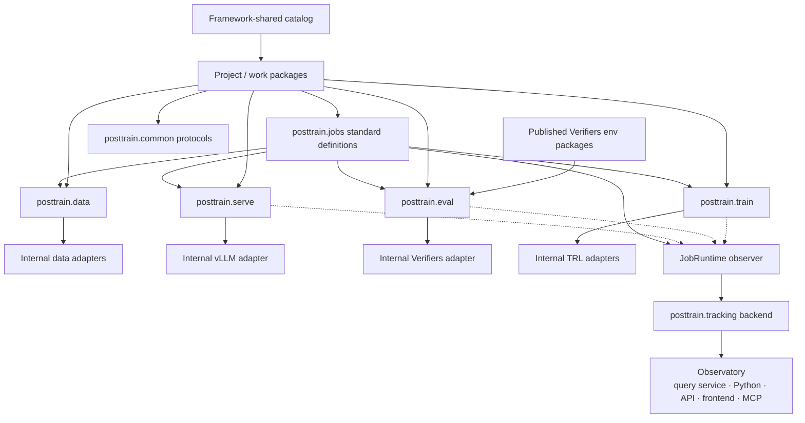

# 04 · Framework


> **Frozen baseline (2026-07-21).** Product authority: [post-training README](./README.md). Prefer implementation-plan / code changes over redesigning this doc unless explicitly unfrozen.

The [workflow](./01-workflow.md) is the methodology.
The [primitives](./02-primitives.md) are what a developer selects.
The [work and evidence model](./03-work-and-evidence.md) is how that work is
packaged and recorded.

This document describes the **framework as a developer experience**: which
Python packages exist, what each may own, how they depend on each other, and
how a developer composes a project from screen through train and qualify.

The framework does not invent a new post-training methodology. It makes the
workflow and primitives **importable, versioned, and replaceable at the
backend** so Carbonteq AI (and other consumers) can repeat projects without
rewriting glue.

The local lab (`apps/lab`) is the **reference project and qualification
suite**. It is not the product boundary or a required dependency. Ordinary
projects compose framework-shipped standard jobs through `posttrain`, while a
notebook or service may still call the same capability packages directly.

Normative API detail lives in [05 · APIs](./05-apis.md).
This document is the DX and package map.

## What a developer should feel

A developer working in this framework should be able to:

1. **Pick primitives** — exact model variants, datasets, environments, inference
   bindings, training selections, evaluation plans, workloads, execution targets
2. **Compose a work package** — in ordinary Python, for stage `screen`, `train`,
   or `qualify`
3. **Call typed operations** — `serve.benchmark`, `train.sft`, `eval.domain`, … without
   importing TRL, vLLM, or Verifiers types into project code
4. **Record evidence automatically** — resolved selections, artifacts, metrics,
   traces on every run
5. **Branch from artifacts** — hand a materialized model variant into the next
   package without copying tribal notebook state
6. **Reuse framework-shared catalogs** — foundations, inference bindings,
   baselines, recipes — and only specialize what the project needs

If the happy path requires knowing trainer internals, editing Trackio schemas,
or treating directory order as lineage, the framework DX has failed.

## System shape

```text
Framework-shared catalog          Project code (use case)
  model variants                    work packages + decisions
  inference bindings                thresholds, shortlists, extent
  datasets / envs / eval plans      recipe bindings
  recipes / job definitions
  baselines
                 │
                 ▼
        Standard jobs (composition)
          posttrain.jobs
                 │
                 ▼
        Capability packages (public APIs)
          posttrain.data
          posttrain.serve
          posttrain.eval
          posttrain.train
          posttrain.tracking
                 │
                 ▼
        Internal adapters (private)
          Hub/format adapters · vLLM · Verifiers · TRL · …
                 │
                 ▼
        Tracking (selected by job runtime)
          Trackio or W&B backend · lineage · metrics · traces
                 │
                 ▼
        Observatory product
          Python · API · custom frontend · MCP
```



## Packages and boundaries

| Package | Public role | Must not own |
| --- | --- | --- |
| `packages/common` | Cross-cutting identities, artifact refs, execution/observation protocols, statuses | Train/eval/serve behavior, backend options, env semantics, report math |
| `packages/catalog` | Versioned framework base catalog resources, project discovery, manifest-controlled overlay loading | Capability execution, project decisions, runtime artifact lineage |
| `packages/data` | Dataset contracts, prepare/materialize, format import/export, trace→SFT projection | Training loops, tokenization tied to one model, serving, Trackio requirement |
| `packages/serve` | Inference bindings as runnable operations: benchmark, smoke; representative and controlled capacity evidence | Training, Verifiers scoring, project thresholds or eligibility |
| `packages/eval` | Evaluation plans as runnable operations (`general`, `domain`); Verifiers adapter retains native traces | Trainer APIs, vLLM engine ownership, promotion policy, parallel score schema |
| `packages/train` | Training operations: SFT, DPO, GRPO, on-policy distillation (+ transform); backend-neutral rollout contracts and private trainer adapters | Environment task ownership, eval suite authorship, Trackio UI |
| `packages/tracking` | Provider-neutral run lifecycle, raw evidence read contracts, normalized evidence models | Provider SDKs, product presentation, execution policy, “winner” selection |
| `packages/tracking-trackio` / `tracking-wandb` | Concrete writer and reader adapters | Job-specific view semantics |
| `packages/work` | Recipe/work-package contracts, YAML loading, catalog resolution, preflight, and thin run execution | Concrete job definitions, backend policy, scheduling, project decisions |
| `packages/jobs` | Framework-shipped standard job definitions, dataset/environment wiring, and default `JobRuntime` construction | Project thresholds, scenario policy, or capability implementation |
| `packages/execution` | Provider-neutral launch contracts, immutable job-package identity, lifecycle, reconciliation, and cleanup | dstack SDK calls, Docker commands, job semantics |
| `packages/execution-pack` | Framework job-package planning and materialization across project code, environment sources, datasets, and image levels | Provider scheduling, registry operation, environment semantics |
| `packages/execution-buildkit` | BuildKit adapter, immutable image publication, qualification, and protected receipts | Choosing job inputs or owning infrastructure services |
| `packages/runtime-images` | Shipped container definitions (base, job-kind, actual-job), runtime profiles and locks, and the per-release manifest pinning published base/kind digests | Building or pushing images, registry credentials, project or job selection |
| `packages/execution-local` / `execution-dstack` | Local Docker and dstack launch adapters over the same digest-pinned actual-job image | A second code/data upload protocol |
| `apps/cli` | Primary `posttrain` command: project initialization and install, diagnostics, catalog/work-package execution, and Observatory bring-up | Capability semantics, provider storage logic, project decisions |
| `apps/lab` | Reference project and qualification suite: scenario policy, backend integration tests, and hardware release gates | Being imported by ordinary projects or owning the standard job contract |
| `apps/observatory` | Dedicated read product: telemetry definitions, query/intelligence service, Python API, HTTP API, MCP, frontend, materialized reports, and versioned serving-capacity interpretation | Provider storage queries, execution, mutation of runs, or “winner” selection |
| `apps/release` | Framework-owner release tooling: building the base and job-kind images, publishing them to the framework's public registry, and regenerating the pinned image manifest | Being a dependency of `posttrain`, project or job semantics, site registry policy |
| Env packages (e.g. AutomationBench) | Published Verifiers environments | Importing lab or train/serve packages |

### Dependency rules (DX contracts)

1. **Project code** imports execution APIs from `data` / `serve` / `eval` /
   `train` / `tracking`, Observatory read APIs for analysis, and protocols from
   `common`.
2. **`train`, `eval`, and `serve` do not import one another.** Composition
   happens in project/work-package code (or a thin recipe module), not inside
   capability packages.
3. **`data` does not import** train, eval, serve, or the lab.
4. **Capability packages do not import** `apps/lab`, Trackio, or W&B as a hard
   dependency. Observation is an injected context/protocol from `common`;
   provider lifecycle and reads live behind `tracking` contracts.
5. **Adapters are internal.** Swapping TRL for a future verl adapter, or
   swapping vLLM, must not change the public job-kind meaning of `train.sft`,
   `train.distill`, or `serve.benchmark`.
6. **Environment packages depend on Verifiers**, not on this monorepo’s
   execution packages. Verifiers owns live task interaction and native
   trajectories used by eval, GRPO, and on-policy distillation.
7. **Observatory is read-only** with respect to execution state.
8. **Observatory's frontend, MCP, HTTP, Python, and report exports use one query
   service and one set of job telemetry definitions.** They do not maintain
   separate metric lists or health rules.
9. **`work` composes but does not define capability meaning.** It owns
   contracts, resolution, validation, and thin execution only.
10. **`jobs` is the cross-capability composition layer.** It may depend on
    `data`, `train`, `eval`, `serve`, `tracking`, and `work`; those capability
    packages do not depend on it or on one another.
11. **Standard jobs wire existing adapters and bridges.** Declarative dataset
    selections resolve through `posttrain.data`; environment-backed GRPO,
    distillation, and evaluation resolve through the existing Verifiers
    integration. Projects change catalog bindings rather than rebuilding that
    glue.
12. **Standard definition ids cannot be shadowed.** A project entry may add a
    new versioned definition or unshipped factory, but may not replace a
    framework definition with different semantics under the same id.
13. **The framework owns all job-image semantics.** It publishes a universal
    base, job-kind images, and actual-job images. Infrastructure operates
    BuildKit, the OCI registry, dstack, workers, credentials, caches, and
    retention; it does not choose or build framework job contents. The
    universal base and job-kind images are published once per framework
    release and their digests ship inside the distribution, so an installed
    framework carries both the definitions that produced those images and the
    exact identity it expects to find. Consumers pull them; they build only
    when a published digest is unreachable and they opt in explicitly. A
    kind image whose recorded lock digest disagrees with the installed
    framework's own lock is drift, and the framework must fail rather than
    run on it. Publishing a release is an owner operation and is not reachable
    from the consumer CLI; consumers may pull, mirror, or — only where neither
    is reachable — rebuild from the shipped definitions, and a rebuilt image
    that does not match the pinned digest must be reported as unverified
    rather than silently accepted.
14. **The actual-job OCI image is the normal distribution unit.** It contains
    exact framework/project code, resolved configuration, materialized
    datasets, and every selected environment package. Providers receive its
    digest and a launch envelope; they do not receive a parallel code/data
    bundle.
15. **Environment activation is a worker concern.** Catalog loading retains a
    serializable source plus declarative activation or, when required, a real
    package-exported factory reference. Packing may combine several
    full-commit Git sources, and the runtime activates each environment only
    after its locked wheel is installed in the actual-job image.

### Observatory distribution boundary

`apps/observatory` is application source, not a library that every team embeds.
The supported runtime artifact is one immutable OCI image containing the Python
service, compiled frontend, HTTP API, Streamable HTTP MCP endpoint, report
exports, and Trackio/W&B readers. Teams normally use a centrally hosted URL;
the same image supports self-hosting through Docker Compose and, when needed, an
OCI-distributed Helm chart.

Remote integrations use versioned HTTP/MCP contracts. A future
`posttrain-observatory-client` wheel may provide a typed Python client, CLI, and
local stdio bridge, but it must not duplicate telemetry definitions, provider
SDKs, or analysis logic. Provider credentials stay in server-side deployment
secrets.

### Mapping primitives → packages

| Primitive | Primary owner | Notes |
| --- | --- | --- |
| Model variant | `common` refs + catalog modules; materialization via `train` / `model.transform` | Identity is cross-cutting; weights produced by train/transform jobs |
| Dataset selection | `data` | Train consumes; does not own |
| Environment binding | Published env packages + `eval`/`train` bindings; packed by `execution-pack` | Env package owns task semantics; framework owns immutable delivery |
| Inference binding | `serve` | Eval/train may *consume* a generation endpoint without owning vLLM |
| Training selection | `train` | Algorithm-specific seats stay here |
| Evaluation plan | `eval` | Plans reference envs; model under test is a run input |
| Workload | `serve` (definitions) | Shared across screen candidates |
| Execution target | `common` / catalog | Recorded on every GPU-bound run |

## Layers of ownership

| Layer | Developer writes / publishes | Example |
| --- | --- | --- |
| Framework core (`common` + contracts) | Rarely; extend carefully | Run status, artifact reference types |
| Capability package | New operation or adapter behind stable API | TRL GRPO adapter, vLLM binding helper |
| Standard jobs (`posttrain.jobs`) | Stable seats mapped to capability operations | `train/trl-grpo@1` |
| Framework-shared catalog | Reusable variants, bindings, plans, recipes, baselines | `models/qwen-2b@bf16`, `inference/…`, `evals/general-compact@1` |
| Published environment | Verifiers env package release | `automationbench_v1` |
| Project | Work packages, bindings, thresholds, accept/revise/reject | `projects/background-memory-agent/...` |
| Project entry (optional) | Extra definitions or unshipped factories | `configure(runtime)` hook |
| Job runtime | Standard definitions, observer, workspace, scratch | Trackio-backed project execution |

Capability packages own **backend-native fields** inside their public configs
when those fields matter to callers (e.g. vLLM engine options on an inference
binding). Framework core does not absorb every backend knob into one mega-schema.

Project serving requirements enter run snapshots through project/work-package
composition; they are not operation seats. The serve package measures bounded
workload points without interpreting those requirements. Observatory applies a
versioned calculator to the retained evidence and the exact requirement
snapshot, keeping execution independent of project policy.

## Developer playthrough

Below is the intended DX for a project such as `background-memory-agent`. Names
are illustrative; the shape is normative.

### 0. Start from catalog, not from a trainer

```text
# Read / import framework-shared selections
models/qwen-2b@bf16
models/qwen-2b@awq-int4
inference/qwen-2b-bf16-vllm-standard@2
inference/qwen-2b-awq-vllm@1
workloads/memory-recall-32k-c2@1
hardware/rtx3070ti-8gb@1
evals/general-compact@1          # optional if baselines already published
```

Project code does not begin inside TRL config files.

### 1. Screen work package

Developer authors a `screen/…` work package (or instantiates a screen recipe):

```text
bindings:
  candidates: [(model_a, inference_a), (model_b, inference_b)]
  workload: workloads/memory-recall-32k-c2@1
  target: hardware/rtx3070ti-8gb@1

jobs:
  - serve.benchmark  # once per candidate
```

**Calls.** `posttrain.serve.benchmark(context, request)` (or equivalent job
runner) with resolved inference binding + workload + target.

**Feels like.** Typed request in, typed result + metrics/traces out. No vLLM
engine class in the project file.

**Decides.** Starting model variant + inference binding for later packages.

### 2. Train work package

```text
bindings:
  starting_model: models/qwen-2b@bf16
  training_data: datasets/memory-sft-v3@<digest>
  training_selection: project/memory-sft-qlora-v1
  target: hardware/rtx3070ti-8gb@1

jobs:
  - data.prepare     # optional
  - train.sft
```

**Calls.** `posttrain.data…` then `posttrain.train.sft(...)`.

**Feels like.** Seats from [02 · Primitives](./02-primitives.md) filled explicitly.
Checkpoint policy is part of the training selection; materializing a descendant
is an explicit step (or explicit nomination), not a folder side effect.

**Produces.** `models/qwen-memory-sft@<digest>` artifact reference for the next
package.

### 3. Qualify work package

```text
bindings:
  model: models/qwen-memory-sft@<digest>
  plan: evals/memory-heldout@2
  inference: inference/qwen-memory-qual@1
  target: hardware/rtx3070ti-8gb@1

jobs:
  - eval.domain
  - serve.smoke      # optional / triggered
```

**Calls.** `posttrain.eval.domain(...)` (or `.general`) then maybe `posttrain.serve.smoke(...)`.

**Feels like.** Evaluation plan does not embed the model identity; the run binds
the model. Verifiers stays behind `eval`; native traces are the evidence;
thresholds stay in the project.

**Decides.** Accept / revise / reject in project code (human or recorded
decision object) — not a hidden metric threshold inside `eval`.

### 4. Branch (GRPO) and qualify again

New `train/…` package binds policy model + environment + rollout inference
binding + GRPO training selection. New `qualify/…` package binds the descendant.
Lineage is artifact parent links, not package naming.

### 5. Inspect evidence

```text
posttrain.tracking → normalized raw run, metric, trace, and artifact evidence
Observatory        → run/package/stage/lineage views plus Python analysis,
                     report exports, API, MCP, and frontend
```

Views mark missing, failed, not-run, and reused-from-framework evidence. They
do not invent winners.

## Project versus direct-library DX

| Concern | Direct library DX (`train`/`eval`/`serve`/`data`) | Project DX (`posttrain`) |
| --- | --- | --- |
| Import | Add only the capability package needed | Installed project includes `posttrain.jobs`; no lab dependency |
| Composition | Caller builds typed requests explicitly | Standard definitions bind catalog seats to operations |
| Observation | Optional protocol; no-op allowed | `JobRuntime` selects Trackio by default; W&B remains conforming |
| Discovery | Explicit Python imports | CLI discovers `.posttrain` and an optional project entry |
| Audience | Scripts, notebooks, embedded services | Ordinary project developers |

`apps/cli` is distributed as `posttrain` and owns the stable command surface.
`posttrain init --template sft|grpo` writes an installable project and installs
its dependencies unless explicitly suppressed for nested automation.
`posttrain work-package run ... --job ...` constructs a default `JobRuntime`;
no `--host` is required. `posttrain observatory up` starts the read product for
the discovered project's tracking configuration.

`apps/lab` remains useful for code-defined qualification scenarios and backend
release gates without becoming a compatibility requirement for other projects.

A notebook that only needs serving benchmarks should depend on `posttrain.serve`
(+ `common` protocols), not on the full lab application.

## Framework-shared catalog DX

Publish once in the **base catalog**, reference everywhere via the **composed
catalog** resolve API ([05 · APIs](./05-apis.md#catalog)).
Projects add **overlays** for job- or project-local selections without forking
lookup logic in every config.

Portable repositories keep tracked project configuration under `.posttrain/`:
`project.toml` declares project identity and paths, `catalog/` contains
overlays, and `work_packages/` contains stage compositions. Ignored
machine-local scratch, recovery, cache, and provider files live under
`.posttrain/state/`. The framework global catalog is loaded from the versioned
`posttrain-catalog` distribution, not copied into each project. Project
overlays may add proprietary entries or deliberately replace a global id.
Publishing a new global entry requires a catalog package release.

Global and project dataset/environment entries are pointers until first use.
Static work-package validation and detached planning check their immutable
source metadata, seat types, and compatibility without importing the selected
runtime package. Dataset inputs needed for a bounded execution bundle
materialize idempotently under `.posttrain/state/`. Explicit local
materialization commands verify an installed pinned environment package, while
detached local or remote execution performs native environment preflight inside
the selected runtime image immediately before the operation starts. Dataset
source kinds include immutable Hugging Face revisions,
project-relative JSONL/Parquet sources, and NeMo JSONL via `source.kind: nemo`.
Supervised format names are the adapter literals `auto`, `messages`,
`prompt-completion`, `alpaca`, and `sharegpt`; preference formats use the
literals already exposed by `posttrain.data` (`auto`, `trl`, `tulu`,
`nemo-ranked`).

Model serving is authored as **two catalog families** (plus target), not one
profile:

| Family | Holds | Example |
| --- | --- | --- |
| `model` | Weight artifacts (BF16, AWQ/Q4, adapters) | `models/qwen-2b@awq-int4` |
| `inference` | Backend + `engine` + sampling + purpose + target | `inference/qwen-2b-awq-vllm-screen@1` |
| `target` | Device / VRAM / placement | `hardware/rtx3070ti-8gb` |

Engine-level knobs (KV cache, TP, speculative, mem util) live on the inference
binding’s `engine` field. Weight quantization lives on the model variant.

| Catalog kind | Examples | Invalidation |
| --- | --- | --- |
| Model variants | Foundation BF16; AWQ/GPTQ/GGUF-Q4 descendants | New weights or `model.transform` |
| Inference bindings | Standard screen; FP8-KV screen; colocated rollout | Backend version, engine, sampling, or purpose change |
| Workloads | 32K c2 memory-recall | Shape or measure set change |
| Execution targets | `rtx3070ti-8gb` | Policy change |
| Evaluation plans | `general-compact`, domain held-out plans | Suite/env revision |
| Recipes | `sft-bootstrap@2`, `qualify-domain@1` | Slot or job-definition change |
| Baselines | Published general results for a model+binding+plan | Only comparable under matching context |

Project DX:

- Prefer **catalog ids** in YAML/Python bindings over copy-pasting engine settings.
- Put shared foundations in **base**; put project datasets, experimental bindings,
  and one-off overrides in the **project overlay**.
- Always resolve through one composed catalog for the project scope; overlay
  wins on the same id; resolved runs record which layer supplied each entry.
- When constraints fall outside a published binding, add a versioned overlay (or
  base release) rather than silently editing shared defaults.
- New Q4/AWQ weights → publish/select a **model** entry, then bind an
  **inference** entry that points at it (do not stuff quant into `engine`).

## Extending the framework (developer paths)

| Goal | Where to work | What stays stable |
| --- | --- | --- |
| New foundation model | Catalog model variant + inference binding(s) | Job kinds |
| New Verifiers env | Published env package + eval plan / train seats | `eval`/`train` public APIs |
| New training technique | `train` job kind + definition + adapter | Run/artifact contracts |
| New inference engine | Internal adapter behind `serve` | Inference binding fields that callers already use |
| New tracking backend | Implement writer + reader contracts and conformance suite | Capability packages and job views |
| New observability surface | Consume normalized job views | Tracking backends and telemetry definitions |
| New project | Work packages + bindings + decisions only | Prefer existing recipes/catalog |

For `train.distill`, the reusable boundary is deliberate: Verifiers supplies a
fresh exact-token environment trajectory; `packages/train` validates and
projects it into a backend-neutral distillation batch; a private TRL adapter
performs teacher scoring and optimization; a standard job resolves the
project's student, teacher, environment, bindings, and targets; Observatory
interprets the run evidence. `apps/lab` supplies qualification scenarios only.
PrimeRL is research input, not a framework backend. A future verl adapter
consumes the same batch contract without importing TRL semantics into the
public request.

## Non-goals (DX)

The framework does not require developers to:

- learn one mega-config that mixes trainer, env, and serve fields
- open Trackio to define behavior
- import the lab or author a host factory for standard jobs
- accept automatic checkpoint promotion or automatic “winners”
- put project thresholds inside shared eval plans
- import `train` from `serve` or `eval` from `train`

## Relationship to architecture and contracts

- **This document** — developer-facing package map and playthrough.
- **[05 · APIs](./05-apis.md)** — typed selections, job operations, and config-first surface.
- **`docs/architecture/*`** — target implementation structure; reconcile to this
  baseline rather than the reverse.

## Reading order

1. [01 · Workflow](./01-workflow.md)
2. [02 · Primitives](./02-primitives.md)
3. [03 · Work and Evidence](./03-work-and-evidence.md)
4. **04 · Framework**
5. [05 · APIs](./05-apis.md)
6. [06 · Observation, Artifacts, and Lineage](./06-observation-and-lineage.md)
