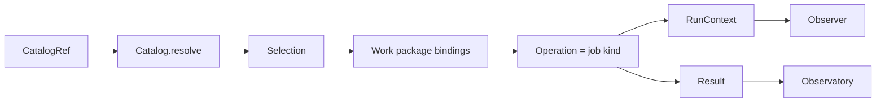

# 05 · APIs


> **Frozen baseline (2026-07-21).** Product authority: [post-training README](./README.md). Prefer implementation-plan / code changes over redesigning this doc unless explicitly unfrozen.

Target **public surface** of the framework: how developers name selections,
resolve them from a catalog, invoke job kinds, and read evidence.

Derived from [01](./01-workflow.md)–[04](./04-framework.md). Existing code is
**not** the contract. Implementation converges here.

## Naming stack (normative)

One idea → one noun. Do not invent parallel vocabularies in the API.

| Noun | Meaning | Not |
| --- | --- | --- |
| **Selection** | Concrete value of one primitive family (02) | “Profile”, untyped config blob |
| **CatalogRef** | `{family, id}` pointer into the composed catalog | A second type system per family |
| **Seat** | Named slot a job kind requires (`starting_model`, …) | Free-form kwargs |
| **Job kind** | Stable semantic id (`train.sft`, `serve.benchmark`) | The Python function alone |
| **Job definition** | Versioned implementation of exactly one job kind | Adapter class name as public API |
| **Operation** | Public function that realizes a job kind (`train.sft(…)`) | “Job API” as a separate product layer |
| **Request / Result** | Inputs and evidence for one operation call | Control-plane decisions |
| **Run** | One observed execution of one job definition | Work package |
| **Work package** | Stage-tied bindings + which jobs to run | Python package / catalog package |
| **RunContext** | Operation-facing identity, observer, workspace | Backend handle or Trackio import |
| **JobRuntime** | Resolved definitions, catalog, tracking, and scratch used to execute jobs | A trainer or provider SDK |
| **ProjectExecutionRequest** | Project-scoped inputs used to construct a job runtime | One operation request |
| **ProjectEntry** | Optional hook that adds custom definitions or factories | Required host factory |

```text
CatalogRef  --resolve-->  Selection  --bind seats-->  Work package
                                                        │
                                              for each enabled job
                                                        ▼
                              RunContext + Request  -->  Operation  -->  Result
                                                        │
                                                        ▼
                                                     Observer / Observatory
```

### Selection type names (align with 02)

| Primitive (02) | Public type | Catalog `family` |
| --- | --- | --- |
| Model variant | `ModelVariant` | `model` |
| Dataset selection | `DatasetSelection` | `dataset` |
| Environment binding | `EnvironmentBinding` | `environment` |
| Inference binding | `InferenceBinding` | `inference` |
| Training selection | `SFTSettings` \| `DPOSettings` \| `GRPOSettings` (kind-specific) | `training` |
| Evaluation plan | `EvaluationPlan` | `evaluation` |
| Workload | `Workload` | `workload` |
| Execution target | `ExecutionTarget` | `target` |

Rules:

1. **Selections are values**, not “refs.” A `CatalogRef` resolves *to* a selection.
2. **Training is kind-specific.** There is no shared `TrainingSelection` mega-type
   that also carries `job_kind`. The job kind lives on the run / request; settings
   types live in `posttrain.train`.
3. **Artifact identity** for lineage is the selection’s stable id (plus digest /
   revision). Do not introduce a parallel `ModelRef` type for the same thing.
4. Prefer catalog ids in configs; inline selections are allowed for one-offs and
   must validate as the same types.

## Design stance

### Config-first, dual authoring

Primary developer artifact: **named bindings** (which catalog entries fill which
seats, which jobs run). Author as **YAML + schema** or **typed Python**; both
validate into the same models. Neither is a second platform language.

Jobs return evidence. They do **not** accept / revise / reject descendants.

### Small surface

- seats are explicit and typed
- every run stores the **resolved** selections (`source_layer` included)
- backends stay behind capability packages
- `train` / `eval` / `serve` do not import each other
- tracking readers and Observatory are read-only

### Internal framework

Reusable across Carbonteq projects. Prefer a first-party module over plugin
hooks. No third-party marketplace SDK.

## API layers

| Layer | Developer touches | Lives in |
| --- | --- | --- |
| Selections | Typed primitive values | `common` (+ settings types in owning package) |
| Catalog | `open` / `resolve` / `list` | `common` + catalog modules |
| Operations | `data.prepare`, `serve.benchmark`, `train.sft`, … | `data`, `serve`, `eval`, `train` |
| Composition | Recipe, work-package bindings | project + thin helpers |
| Standard jobs | Stable seat-to-operation definitions and default runtime | `jobs` |
| RunContext | Identity, observer, workspace | job runtime injects; protocol in `common` |
| Evidence | Query raw runs/artifacts; compute job-aware views | raw contracts in `tracking`; product queries and views in Observatory |



## Primary project CLI

The `posttrain` distribution is the primary command for repository and
remote-server workflows. It coordinates the public APIs in this document; it
does not introduce new selection, work, run, artifact, or evidence types.

```text
posttrain init [PATH] --template sft|grpo [--project-id ID] [--no-install]
posttrain version
posttrain doctor
posttrain project show
posttrain catalog list [--family FAMILY]
posttrain catalog show FAMILY ID
posttrain catalog validate
posttrain dataset validate DATASET_ID
posttrain work-package validate PATH
posttrain work-package run PATH --job JOB_ID
posttrain observatory up [--port PORT]
```

Project and catalog commands load the same `ProjectLayout`, `CatalogRef`, and
composed `Catalog` values used by Python callers. Work-package commands validate
all seats and catalog references before opening a run or invoking an operation.
Commands return zero on success, one for expected project or contract failures,
and two for invalid command syntax. The primary CLI is built with Typer; that is
an implementation detail and does not change the public noun surface. Readable
terminal output is the default; `--json` provides deterministic automation
output.

Initialization writes the project layout and an installable project package,
then creates the project environment and installs dependencies. There is no
separate `posttrain sync` command. Work-package execution builds a default
`JobRuntime` from framework standard definitions and project tracking config;
`--host` / `--entry` remain temporary compatibility overrides only.

`posttrain-lab` remains the reference-project command for concrete
qualification jobs. Its fixed scenario names are not the portable CLI contract.

## Selections

Field lists are the minimum contract; they may grow without breaking the seat
model. Semantics stay in [02 · Primitives](./02-primitives.md).

### `ModelVariant`

Exact loadable weight state. Weight quantization (AWQ, GPTQ, GGUF Q4, …) is a
**new variant**, not an inference setting. See
[02 · model variant](./02-primitives.md#model-variant).

| Field | Role |
| --- | --- |
| `id` / `revision` or `digest` | Stable identity |
| `artifact_uri` | Where weights live |
| `form` | foundation \| adapter \| merged \| weight-quantized \| … |
| `weight_precision` | bf16 \| fp16 \| int4 \| … (materialized) |
| `quantization` | Optional method/scheme metadata when `form` is weight-quantized |
| `parent` | Optional parent `ModelVariant` |
| `renderer_contract` | Chat/tool/reasoning contract id |
| `capabilities` | Context, modality claims |
| `provenance` | Source / producing run |

### `DatasetSelection`

| Field | Role |
| --- | --- |
| `id` / `digest` | Immutable snapshot when materialized |
| `kind` | supervised \| preference \| prompt-task \| … |
| `split` | train \| val \| heldout \| named slice |
| `schema_version` | Example contract |
| `provenance` | Upstream + transforms |
| `environment_compatibility` | Optional env revision for task-shaped data |

Packing, tokenization, and render max lengths belong on **training settings**,
not on the dataset.

### `EnvironmentBinding`

| Field | Role |
| --- | --- |
| `id` / `revision` | Env/taskset identity |
| `package` | Published Verifiers (or compatible) package |
| `split` / subset | Task selection for this binding |
| `parameters` | Task-meaningful timeouts/limits |
| `reward_components` | Declared raw signal names (meanings owned by env) |

### `InferenceBinding`

How a `ModelVariant` generates tokens or scores existing token sequences for a
purpose. Replaces the old “inference / serve profile” idea. Engine-level config
is a **field** (`engine`), not its own catalog family. See
[02 · inference binding](./02-primitives.md#inference-binding).

| Field | Role |
| --- | --- |
| `id` / `revision` | Binding identity when catalogued |
| `model` | `ModelVariant` (or catalog ref resolved to one) |
| `backend` | Engine kind + version (e.g. `vllm@…`) |
| `renderer` | Renderer contract |
| `engine` | Backend-owned runtime settings (KV cache, TP, speculative, mem util, …) |
| `sampling` | Defaults for generation or token scoring for this purpose |
| `target` | `ExecutionTarget` |
| `purpose` | screen \| eval \| rollout \| teacher-score \| smoke \| handoff |

`engine` schema is owned by the `serve` (or colocated train) adapter for that
`backend`. Changing engine or sampling → new binding revision; same model
variant. Changing on-disk weight quant → new `ModelVariant`, then a binding that
points at it.

Illustrative composition:

```text
ModelVariant          models/qwen-2b@awq-int4
InferenceBinding      inference/qwen-2b-awq-vllm-screen@1
  model ────────────► models/qwen-2b@awq-int4
  backend             vllm@…
  engine              { gpu_memory_utilization, kv_cache, … }
  sampling            { temperature, max_tokens, … }
  target              hardware/rtx3070ti-8gb
  purpose             [screen, eval]
```

### Training settings (`SFTSettings`, `DPOSettings`, `GRPOSettings`, `OnPolicyDistillationSettings`)

Owned by `posttrain.train`. **Algorithm + learning schedule only** — not vLLM
topology, not mandatory QLoRA.

Also first-class (cataloguable where useful):

| Type | Role |
| --- | --- |
| `ParameterUpdatePlan` | Discriminated: full \| LoRA \| QLoRA \| quantization-aware |
| `TrainingBinding` | Train backend, update plan, normalized train parallelism/runtime, namespaced backend options, train `ExecutionTarget` |

`TrainingBinding.runtime` uses backend-neutral names wherever two trainers share
the same concept (for example global batch size, node count, devices per node,
parameter offload, and optimizer offload). `TrainingBinding.backend_options` is
the explicit escape hatch for trainer-native settings. A backend adapter
translates normalized values into its native vocabulary; native overrides must
not replace selected model, data, environment, target, or artifact identities.
| `QuantizationPlan` | Recipe + calibration + formats; offline PTQ and/or QAT |

Reward **weights** live in algorithm settings; reward **meanings** live on the
environment. Rollout engine knobs live on `InferenceBinding.engine`.

Request seats assemble model, data/env, settings, training binding, and (for
online RL) inference binding. Train target and rollout target **may differ**.

Async GRPO policies are **out of MVP scope**.

### `EvaluationPlan`

| Field | Role |
| --- | --- |
| `id` / `revision` | Plan identity |
| `environments` | Env bindings / suite composition (one cell → one Verifiers run) |
| `inference_requirements` | Compatible binding constraints |
| `sampling` | Repetition, seeds, limits |
| `metrics_and_slices` | Required measures (projected from traces) |
| `aggregation` | Coverage / missing-evidence rules |
| `comparison` | Parent / foundation / baseline policy |

The model under test is **not** part of the plan; it is a seat on the eval
request.

Verifiers mapping (implementation target): each enabled plan cell becomes an
`EnvConfig` from the env package, merged with client/sampling/budget from the
request into Verifiers `EvalConfig`, then `run_eval` → native traces. See
[02 · Verifiers-backed eval evidence](./02-primitives.md#verifiers-backed-eval-evidence)
and [06 · Verifiers ingest](./06-observation-and-lineage.md#verifiers-ingest-notes).

### `Workload`

Request shapes, concurrency, warmup/repeat policy, required operating measures.

### `ExecutionTarget`

Device class, memory, placement, host constraints — recorded on every GPU-bound
run.

## Catalog

One **logical** catalog at resolve time: published **global catalog** + zero or
more **project overlays**.

```text
Global (framework-shared package resource)
  + Overlay(s) (project / work-package)
        │
        ▼
  Catalog.resolve(CatalogRef) -> Resolved[Selection]
```

| Rule | Meaning |
| --- | --- |
| Single read API | `catalog.resolve(ref)` only (no dual base-then-project lookup in configs) |
| Overlay wins | Same id in overlay replaces base |
| Scope | Usually project-scoped so overlays do not leak |
| Provenance | Snapshot records `source_layer: base \| overlay` (+ overlay id); `base` is the serialized name for the global layer |
| No silent global mutation | Publishing a shared entry requires a catalog package release |
| First-use materialization | Dataset pointers materialize idempotently into project state; environment bindings verify an installed pinned package |

```text
CatalogRef
  family: model | dataset | environment | inference | training
          | evaluation | workload | target | recipe
  id: str                    # e.g. models/qwen-2b@bf16

Resolved[T]
  ref: CatalogRef
  value: T                   # Selection of that family
  source_layer: base | overlay
  overlay_id: str | None

Catalog
  open(base, overlays, scope) -> Catalog
  resolve(ref) -> Resolved[Selection]
  contains(ref) -> bool
  list(family=None) -> [CatalogRef]
```

YAML / Python configs emit `CatalogRef`s (or inline selections). The job runtime
resolves before calling operations.

```yaml
bindings:
  starting_model: { family: model, id: models/qwen-2b@bf16 }
  training_data: { family: dataset, id: datasets/memory-sft-v3@<digest> }
```

Declarative dataset entries use existing `posttrain.data` adapter vocabulary:

```yaml
dataset:
  datasets/support-sft@1:
    revision: "1"
    source:
      kind: huggingface        # or jsonl | parquet | nemo
      repo: org/support-conversations
      revision: <immutable-revision>
      split: train
    format:
      kind: messages           # auto | messages | prompt-completion | alpaca | sharegpt
```

NeMo project files use `source.kind: nemo` with a project-relative JSONL
`path`. Supervised NeMo entries use format `messages` (or `auto`); preference
entries use format `nemo-ranked` (or `auto`). Materialization routes through
`supervised_from_nemo` / `preferences_from_nemo` and caches the same canonical
HF-normalized JSONL used by other sources.

Environment entries bind a pinned Verifiers package and factory. Standard
GRPO, distillation, and evaluation definitions build the existing environment
bridges from the resolved `EnvironmentBinding`; projects do not supply a
parallel dataset seat for environment-only GRPO.

## RunContext

Every operation takes a `RunContext` injected by the `JobRuntime` (or directly
by a library caller):

| Concern | Expectation |
| --- | --- |
| Identity | `project_id`, `work_package_id`, `run_id`, `job_kind`, job definition version |
| Observer | Optional sink for metrics, traces, artifacts, status |
| Workspace | Temp paths; durable evidence via observer/artifacts |
| Cancellation | Cooperative cancel |

Capability packages must not import Trackio or W&B. The job runtime injects an
observer opened by a provider-neutral tracking backend; projects may select
Trackio, W&B, no-op, or another conforming implementation. Trackio remains the
default local backend.

The observer is the operation-facing emission surface. Run start/finish,
provider translation, durable reads, and artifact materialization live behind
`posttrain.tracking` contracts. The framework's `run_id`, `work_package_id`,
logical metric step, artifact identity, and outcome remain authoritative;
provider IDs, groups, row numbers, and states are storage metadata.

## Operations (job kinds)

An **operation** is the public function for a **job kind**. Naming rule:

```text
job kind          package.operation
──────────        ─────────────────
data.prepare   →  posttrain.data.prepare
serve.benchmark→  posttrain.serve.benchmark
serve.smoke    →  posttrain.serve.smoke
eval.general   →  posttrain.eval.general
eval.domain    →  posttrain.eval.domain
train.sft      →  posttrain.train.sft
train.dpo      →  posttrain.train.dpo
train.grpo     →  posttrain.train.grpo
train.distill  →  posttrain.train.distill
model.transform→  posttrain.train.transform   # or dedicated owner when split
```

Each call:

1. accepts a **typed request** (resolved seats + settings)
2. validates compatibility
3. uses / creates run identity via `RunContext`
4. executes through an internal adapter
5. returns a **typed result** (status, artifacts, summaries; traces via observer)

### Requests are seat-shaped

```text
# serve.benchmark
ServeBenchmarkRequest
  inference: InferenceBinding
  workload: Workload
  target: ExecutionTarget          # if not already fixed on the binding

# eval.domain / eval.general
EvaluateRequest
  model: ModelVariant
  plan: EvaluationPlan
  inference: InferenceBinding      # how tokens are produced for this eval
  target: ExecutionTarget

# train.sft
SFTRequest
  model: ModelVariant
  data: DatasetSelection
  settings: SFTSettings
  training: TrainingBinding          # includes update plan + train target

# train.grpo
GRPORequest
  policy: ModelVariant
  reference: ModelVariant | None
  environment: EnvironmentBinding
  settings: GRPOSettings             # algorithm only
  training: TrainingBinding          # train target (may differ from rollout)
  inference: InferenceBinding        # rollouts; owns rollout target
  quantization: QuantizationPlan | None   # when QAT

# train.distill
OnPolicyDistillationRequest
  student: ModelVariant
  teacher: ModelVariant                    # frozen; scores student token ids
  environment: EnvironmentBinding          # Verifiers task interaction
  settings: OnPolicyDistillationSettings   # fully on-policy algorithm only
  training: TrainingBinding                # student update + train target
  rollout_inference: InferenceBinding      # current-student generation
  teacher_inference: InferenceBinding      # exact-token teacher scoring
  quantization: QuantizationPlan | None    # when student update requires it
```

`train.grpo` is environment-only in the current API. A work package binds an
`EnvironmentBinding` reference; it does not bind a dataset, prompt collection,
or exact task-id list. Category filters, deterministic sampling, and task or
interaction budgets belong to the versioned environment binding. The host may
project the environment's resolved tasks into the trainer's internal rollout
dataset shape, but that projection is an adapter detail and never becomes a
second public GRPO seat. Concrete task identities are retained in Verifiers
traces for replay.

`train.distill` accepts only fresh, consume-once trajectories generated by the
current student through the bound Verifiers environment. The rollout binding
must select the student and declare purpose `rollout`; the teacher binding must
select the teacher and declare purpose `teacher-score`. Preflight verifies an
immutable tokenizer fingerprint covering ordered vocabulary and special-token
ids. Historical traces and teacher-generated completions are not accepted by
this operation.

Do not require `training.target == inference.target`. Colocation is a work-package
choice.

Do not pass a `GenerationHandle` as a public seat across packages. If eval or
train needs live generation, the **host** (or work-package runner) may start
serve-side generation and pass an opaque, host-owned endpoint descriptor that
satisfies the inference seat — capability packages still speak
`InferenceBinding`, not foreign handles.

### Package surfaces

```text
posttrain.data
  prepare(ctx, DatasetPrepareRequest) -> DatasetPrepareResult

posttrain.serve
  benchmark(ctx, ServeBenchmarkRequest) -> ServeBenchmarkResult
  smoke(ctx, ServeSmokeRequest) -> ServeSmokeResult

posttrain.eval
  general(ctx, EvaluateRequest) -> EvaluateResult
  domain(ctx, EvaluateRequest) -> EvaluateResult
```

`EvaluateResult` points at the retained **native Verifiers evaluation artifact**
(at least `traces.jsonl` + resolved config) and sync stats. Per-rollout detail
lives in observer `VerifiersTrace` records and/or that artifact — not as a
framework-owned parallel score table. Plan-level views in Observatory aggregate
those traces with explicit missing-evidence states.

```text
posttrain.train
  sft(ctx, SFTRequest) -> TrainResult
  dpo(ctx, DPORequest) -> TrainResult
  grpo(ctx, GRPORequest) -> TrainResult
  distill(ctx, OnPolicyDistillationRequest) -> TrainResult
  transform(ctx, TransformRequest) -> ModelVariant   # weight-quant / merge / …
```

`TrainResult` includes recovery checkpoint identities, metric summaries, and an
optional nominated `ModelVariant` when materialization policy says so. Online
RL and on-policy distillation rollouts use the same Verifiers trace authority
as eval when an environment is bound. A distillation result also summarizes
teacher scoring and identifies the fresh policy revision and consumed batch
ids; these summaries do not replace the native trace artifact.

### Status vocabulary

Every result carries one of at least:

`succeeded` | `failed` | `cancelled` | `unsupported` | `partial`

Missing evidence is never coerced to numeric zero.

## Work composition

Thin by design. Projects stay ordinary Python / YAML.

### Recipe

```text
Recipe
  id, revision, stage
  seats: { name -> SelectionFamily }     # what must be bound
  jobs: [ { kind, definition, optional? } ]
  expected_artifacts: [...]
```

### Job definition

```text
JobDefinition
  id, kind
  description                              # stable human-readable purpose
  seats: { name -> expected Selection type }
  operation
```

The description is authored with the versioned definition and copied into each
run snapshot. Evidence readers do not resolve mutable definition text later.

Framework-shipped definitions live in `posttrain.jobs` and include stable ids
for SFT, DPO, GRPO, on-policy distillation, evaluation, serving smoke/benchmark,
and model transform. They resolve catalog seats, invoke existing data adapters
or Verifiers bridges where required, then call the public capability operation.
They do not freeze project learning rates, datasets, environments, targets, or
acceptance policy.

```text
standard_definitions() -> { definition_id: JobDefinition }
```

Projects customize standard jobs through bindings. A `ProjectEntry` may add a
new versioned definition or an unshipped factory, but cannot shadow a standard
definition id with different semantics.

### Work package

```text
WorkPackage
  project_id
  work_package_id
  stage: screen | train | qualify
  description                              # stage-level purpose
  recipe: CatalogRef | inline Recipe
  bindings: { seat -> CatalogRef | Selection }
  enabled_optional_jobs: [...]
  metadata: notes, labels                 # not job outcomes
```

The work-package description is project-authored and copied into every run in
the package. It complements decision questions in metadata; it is not a result,
status, or conclusion.

### Optional runner

```text
run_work_package(ctx, WorkPackage) -> WorkPackageResult
```

Resolves catalog refs, validates seats per job kind, runs enabled jobs, returns
per-job results. Convenience only — not a workflow engine and not a decision
system.

### Project runtime

```text
ProjectExecutionRequest
  project_layout
  catalog
  tracking
  optional entry

ProjectEntry
  configure(runtime) -> None

JobRuntime
  catalog
  definitions
  tracking
  scratch

build_job_runtime(
  ProjectExecutionRequest,
  tracking=None,
  extra_definitions=None,
) -> JobRuntime
```

`JobRuntime` is the preferred public name for the resolved execution registry.
`ProjectExecutionRequest` and `ProjectEntry` describe project composition
without making “host” a developer concept. Existing `WorkPackageHost*` symbols
remain additive compatibility aliases during migration.

## Evidence, tracking, and Observatory

| Concept | Rule |
| --- | --- |
| Artifact | Immutable selection identity (model, dataset, eval bundle, …) + parent links |
| Metric | Named value at lowest trustworthy grain; correlated to run |
| Trace | High-cardinality payload via observer; not jammed into scalars |
| Run snapshot | Resolved selections + job definition version + code revision + target |

```text
posttrain.tracking  # provider-neutral lifecycle and raw evidence reads
  get_run(run_id) -> RunRecord
  list_runs(filter) -> [RunRecord]
  metric_series(run_id, names) -> [MetricSeries]
  traces(run_id, query) -> TracePage
  artifacts(run_id) -> ArtifactSet

posttrain_observatory  # dedicated read product and query/intelligence service
  get_job_telemetry_schema(job_kind) -> JobTelemetryDefinition
  get_run_view(run_id) -> RunView
  get_run_alerts(run_id) -> [RunAlert]
  get_run_delta(run_id, cursor) -> RunDelta
  compare_runs(run_ids) -> RunComparison
  work_package_view(work_package_id) -> WorkPackageView
  stage_view(project_id, stage) -> StageView
  lineage_view(model: ModelVariant) -> LineageView
  serving_pareto_view(project_id, screen_work_package_id) -> ParetoView
  export_report(view, format) -> MaterializedReport
```

Views must expose `missing` | `failed` | `unsupported` | `not_run` |
`reused_from_framework` | `incomparable`. No report API picks a production winner.

Each supported job kind has one versioned `JobTelemetryDefinition` owned by
Observatory and describing summary fields, chart series, health rules,
comparison keys, trace sections, and artifact roles. Python, HTTP, report
exports, the custom frontend, and MCP tools consume the same query service.
`get_run_delta` returns projection changes and alerts, not an unbounded stream
of raw provider rows.

## Config layout (illustrative)

```text
<project>/
  .posttrain/
    project.toml           # identity, tracking, optional entry, paths, state policy
    catalog/               # tracked project overlay
      datasets/...
      inference/...
    work_packages/
      screen_contenders.yaml
      train_sft_bootstrap.yaml
      qualify_sft.yaml
    state/                 # ignored scratch/cache/recovery/provider state
  pyproject.toml           # installed project and pinned environment packages
  project_entry.py         # optional escape hatch; absent on the happy path
```

Prefer directory name `work_packages/` (not `packages/`) so it does not collide
with Python packages. The framework base catalog is a versioned package
resource; `.posttrain/catalog/` contains project overlays only. Durable
artifacts remain observer/backend values and do not derive identity from
`.posttrain/state/`.

## Validation

Before side effects, operations (or the resolver) check:

- required seats present for the job kind
- renderer/tokenizer alignment across model, dataset, inference, env
- execution target compatible with binding claims
- dataset kind matches training kind

Failures are typed validation errors when possible.

## Extensibility (first-party)

| Need | Path |
| --- | --- |
| New model / inference / workload / target | Catalog entry |
| New environment | Publish env package; `EnvironmentBinding` |
| New evaluation plan | Catalog `evaluation` entry |
| New dataset | `data.prepare` → `DatasetSelection` |
| New technique | New job kind + settings type + adapter in `train` |
| New engine | Adapter inside `serve` / `train`; keep request seats stable |
| New tracking backend | Implement writer and reader contracts; pass logical conformance tests |
| New run view / MCP surface | Extend the shared job telemetry definition and normalized view service |

Non-goals: plugin discovery, user-defined job kinds without a package change,
entry-point backend swapping, a generic operator-graph API.

## Non-goals

- universal training config shared by SFT/DPO/GRPO without kind-specific seats
- automatic checkpoint promotion
- project thresholds inside shared evaluation plans
- Trackio as a required dependency of capability packages
- W&B as a required dependency of capability packages
- provider-specific SQL/API calls in Observatory services or consumers
- cross-imports between `train`, `eval`, and `serve`

## Relationship to other docs

| Doc | Role |
| --- | --- |
| [02 · Primitives](./02-primitives.md) | What selections mean |
| [03 · Work and Evidence](./03-work-and-evidence.md) | Packaging and lineage |
| [04 · Framework](./04-framework.md) | Packages and DX |
| **05 · APIs** | Public names and call shapes |
| [06 · Observation](./06-observation-and-lineage.md) | Metrics, traces, artifacts, wiring |

## Reading order

1. [01 · Workflow](./01-workflow.md)
2. [02 · Primitives](./02-primitives.md)
3. [03 · Work and Evidence](./03-work-and-evidence.md)
4. [04 · Framework](./04-framework.md)
5. **05 · APIs**
6. [06 · Observation, Artifacts, and Lineage](./06-observation-and-lineage.md)
