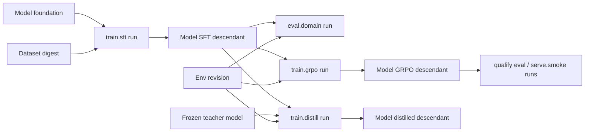
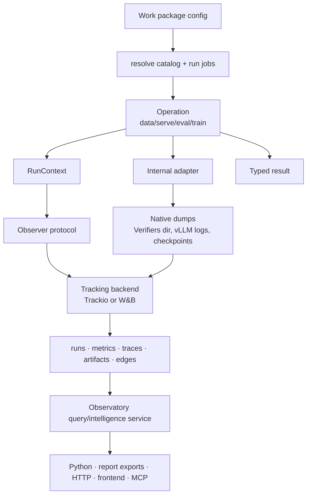

# 06 · Observation, Artifacts, and Lineage


> **Frozen baseline (2026-07-21), tracking amendment 2026-07-22.** Product
> authority: [post-training README](./README.md). Prefer implementation-plan /
> code changes over redesigning this doc unless explicitly unfrozen.

[05 · APIs](./05-apis.md) defines what developers configure and call. This
document defines **what the system produces** and how that evidence is wired:
metrics, traces, artifacts, and lineage.

Existing Trackio / Verifiers work is useful reference. The **authoritative
grouping model** is now project → work package → run, not the older
job/action/invocation hierarchy alone. Implementation should converge here.

## Boundary

```text
Git / configs / packages                 Tracking backend (Trackio default)
-------------------------                 ----------------------------------
Work package bindings                     Run identity + status
Primitive selections + job APIs           Resolved config snapshot
Adapters (TRL, vLLM, Verifiers, …)        Metrics, traces, artifacts
Human / project decisions                 Consumed/produced edges (lineage)
```

The observer records evidence. It does **not** define work packages, resolve
catalogs, schedule jobs, choose descendants, or encode accept/reject policy.

`posttrain.common` owns the operation-facing observation protocol. Capability
packages emit through an injected `RunContext`. `posttrain.tracking` owns the
provider-neutral run lifecycle, raw evidence readers, and normalized evidence
models. `apps/lab` (or another host) selects a Trackio or W&B adapter; Trackio
is the default local backend. Observatory owns job telemetry definitions,
computed views, Python analysis, report exports, HTTP, MCP, and the custom
frontend as one read-only product.

## Observable hierarchy

```text
Project (product use case)
  └── Work package (stage-tied grouping: screen | train | qualify)
        └── Run (one job API execution / attempt)
              ├── metrics (run grain and/or on traces)
              ├── events (checkpoint, artifact, sync, …)
              ├── traces (request / rollout grain)
              └── artifact edges (consumed / produced)
```

| Level | Observability role | Stored as |
| --- | --- | --- |
| **Project** | Query/filter scope for one use case | Searchable field on every run (`project_id`) |
| **Work package** | Primary **grouping** for related heterogeneous runs | Provider group = `work_package_id`; also in snapshot |
| **Run** | One observed execution of one job kind | One observer run record |
| **Trace** | One request or one env rollout inside a run | Trace record linked to exactly one run |
| **Artifact** | Immutable bytes/ref + metadata | Artifact store + consumed/produced edges |

Optional correlation (not new hierarchy levels):

| Field | Use |
| --- | --- |
| `batch_id` / `invocation_id` | Runs launched together (e.g. all screen candidates in one sweep) |
| `job_kind` | `serve.benchmark`, `train.grpo`, `eval.domain`, … |
| `job_definition` | Versioned implementation id |
| `run_attempt` | Retry index for the same logical request |

A provider's own project namespace (for example a Trackio database or W&B
entity/project) remains a **host storage namespace**, not the product
`project_id`.

## What a run always records

Every run snapshot MUST include:

- `project_id`, `work_package_id`, `stage`
- `run_id`, `job_kind`, `job_definition` (+ package/version)
- source revision (git commit / dirty digest)
- **resolved** primitive selections (catalog refs expanded; `source_layer` base|overlay)
- execution target and relevant software/hardware context
- status: `succeeded` | `failed` | `cancelled` | `unsupported` | `partial`
- produced artifact refs and consumed artifact refs
- pointers to attached trace populations and native dump artifacts when present

## Measurement grain

| Scope | Persist or compute | Examples |
| --- | --- | --- |
| **Trace** | Persist | Per-request TTFT; per-rollout reward; truncation/error flags |
| **Run** | Persist | Loss/LR by step; GPU series; scheduler/cache counters; irreducible population counters |
| **Work package** | Compute (Observatory) | Comparisons across runs in one package |
| **Project / lineage** | Compute (Observatory) | Stage completeness; descendant regressions; Pareto sets |

Record a value **once** at the lowest trustworthy grain. Do not also persist
p95, mean, rate, total, or Pareto membership as a second source of truth when
they can be calculated from retained traces/runs.

Materialized aggregates are allowed only as rebuildable report caches/artifacts
that cite calculator version, population, filters, sampling/warmup policy,
denominator, and missing-data policy.

## Metrics

### Envelope

Every metric point carries at least:

| Field | Role |
| --- | --- |
| `name` | Namespaced metric id (see catalogs below) |
| `value` | Scalar (or small fixed vector where the backend requires it) |
| `step` / `time` | Trainer step, or wall time / request index as appropriate |
| `run_id` | Owning run |
| `tags` | Optional indexed dims (phase=warmup\|measured, slice=, device=) |

High-cardinality text does **not** belong in metrics — use traces.

### Namespaces

```text
system/*           host/GPU/process telemetry shared across job kinds
serve/request/*    per-request scalars (usually on InferenceTrace; may mirror sparingly)
serve/backend/*    engine/scheduler/cache/speculative counters on the run
serve/run/*        irreducible run-level serve counters (attempted, measured, failed)
train/*            trainer step series and technique-native series
train/rl/*         GRPO/online-RL specific series
train/distill/*    on-policy distillation and teacher-scoring series
eval/rollout/*     per-rollout scalars (usually on VerifiersTrace)
eval/environment/* env-native diagnostics projected for query
eval/run/*         irreducible eval population counters
data/*             prepare/validation counters
tracking/*         observer/sync health (ingest lag, dropped traces, …)
```

Capability packages own names under their namespace. `system/*` and
`tracking/*` are shared.

### System telemetry (`system/*`)

Recorded on GPU-bound runs when available:

| Metric | Notes |
| --- | --- |
| `system/gpu_vram_used_bytes` | Series or peak |
| `system/gpu_utilization` | Optional |
| `system/cpu_percent` | Optional |
| `system/wall_time_s` | Run duration |
| `system/process_rss_bytes` | Optional |

System series are run grain unless clearly per-request (rare).

### Serve metrics

**On each `InferenceTrace` (request grain):**

| Metric / field | Notes |
| --- | --- |
| `serve/request/ttft_ms` | Time to first token |
| `serve/request/itl_ms` | Inter-token latency (mean or distribution fields as schema allows) |
| `serve/request/e2e_ms` | End-to-end latency |
| `serve/request/input_tokens` | |
| `serve/request/output_tokens` | |
| `serve/request/truncated` | boolean / reason |
| `serve/request/error` | boolean / class |
| `serve/request/warmup` | tag: exclude from measured population |

**On the run (`serve/backend/*`, `serve/run/*`):**

| Metric | Notes |
| --- | --- |
| `serve/backend/kv_cache_*` | Cache usage / hits as engine exposes |
| `serve/backend/scheduler_*` | Queue/scheduling counters |
| `serve/backend/speculative_*` | Acceptance rates when enabled |
| `serve/backend/peak_vram_bytes` | |
| `serve/run/requests_attempted` | Population denominator |
| `serve/run/requests_measured` | Non-warmup successes |
| `serve/run/requests_failed` | |
| `serve/run/requests_unsupported` | Config/engine rejected |

Emit run-level serve scalars as **one metric batch** per finalized benchmark
point when possible (columnar observation), not fake sequential steps. Tag each
batch with the workload identity, cohort, sweep index, concurrency, inference
binding, and execution target. A versioned serving-result artifact may retain
the complete ordered sweep and safe point failures, but it must not retain
project eligibility or a selected model.
Throughput and latency percentiles are **computed** from measured traces +
`serve/run/*` denominators.

### Eval metrics

**On each `VerifiersTrace` (rollout grain):**

| Metric / field | Notes |
| --- | --- |
| `eval/rollout/reward` | Scalar or primary reward |
| `eval/rollout/reward/<component>` | When env exposes components |
| `eval/rollout/success` | Task success from the eval run's required, snapshotted success definition |
| `eval/rollout/truncated` | |
| `eval/rollout/error` | |
| `eval/rollout/num_tool_calls` | |
| `eval/rollout/num_model_calls` | |
| `eval/environment/*` | Env-native diagnostics worth indexing |

**On the run (`eval/run/*`):**

| Metric | Notes |
| --- | --- |
| `eval/run/rollouts_attempted` | Denominator |
| `eval/run/rollouts_complete` | |
| `eval/run/rollouts_failed` | |
| `eval/run/rollouts_truncated` | |
| `eval/run/coverage_missing` | Tasks/slices with no evidence |

Mean reward, success rate, truncation rate by slice are **computed views**.
Every evaluation run declares success, but only traces containing a valid
configured signal enter the pass-rate denominator. Errors, truncations, and
missing signals retain their execution/evidence state instead of becoming
semantic failures. Training rollout views do not acquire this evaluation-only
pass/fail contract merely because they retain the same native trace shape.

Evaluation environments declare native task facets as independent dimensions.
Evaluation plans may select versioned compound breakdowns across those
dimensions, such as problem type by difficulty. Observatory groups the
structured dimension values from the run snapshot; it does not concatenate
them into a new task identity or infer combinations from today's catalog. Each
compound group reports observed count, pass-rate denominator, errors, and
truncations alongside reward and configured pass rate. Missing or multi-valued
dimensions follow the snapshotted breakdown policy rather than an
Observatory-specific heuristic.

### Train metrics (SFT / DPO)

**Run / step series (`train/*`):**

| Metric | Notes |
| --- | --- |
| `train/loss` | |
| `train/learning_rate` | |
| `train/epoch` | |
| `train/global_step` | |
| `train/grad_norm` | When available |
| `train/tokens_per_s` | Optional |
| `train/samples_per_s` | Optional |
| `train/checkpoint_saved` | Event-linked counter/flag at step |
| `train/dpo/*` | Preference-specific (margin, chosen/rejected rewards, …) |

### Train metrics (GRPO / online RL)

Includes SFT-like series plus:

| Metric | Notes |
| --- | --- |
| `train/rl/reward_mean` | From rollout population or trainer |
| `train/rl/reward_std` | |
| `train/rl/kl` | |
| `train/rl/entropy` | When available |
| `train/rl/group_size` | Config echo or observed |
| `train/rl/advantage_*` | Technique-native |
| `train/rl/clip_fraction` | When applicable |
| `train/rl/rollouts_per_step` | |

Per-rollout rewards also live on `VerifiersTrace`; do not require duplicating
every rollout reward into `train/rl/*` unless the trainer only exposes aggregates.

For `train.sampo`, the native rollout evidence additionally preserves sampled
assistant-turn token spans, stable anchor-state keys, and whether sparse
terminal reward projection was used. Step metrics record episode-advantage and
turn-advantage summaries, anchor-group sizes, the sequence importance ratio,
and dynamic-filter candidate/retained counts. These are evidence about the
selected SAMPO semantics, not a second environment reward definition.

### Train metrics (on-policy distillation)

Includes the common `train/*` step series plus:

| Metric | Notes |
| --- | --- |
| `train/distill/loss` | Teacher/student divergence optimized at the step |
| `train/distill/reverse_kl` | Sampled-token reverse-KL component |
| `train/distill/scored_tokens` | Student-generated tokens scored by the teacher |
| `train/distill/teacher_latency_ms` | Teacher scoring latency for the batch |
| `train/distill/teacher_failures` | Irreducible scoring failure count |
| `train/distill/policy_revision` | Config/event field identifying the fresh student weights, not a scalar series |
| `train/distill/policy_mismatch_kl` | Optional diagnostic only; never retroactive importance correction |

Verifiers rewards remain trace-level environment evidence and evaluation
signals. They are not converted into the distillation objective. Sampling
log-probabilities and batch/policy identity are retained as evidence that a
trajectory came from the current student, even though the first distillation
loss does not use them as importance weights.

### Data metrics (`data/*`)

| Metric | Notes |
| --- | --- |
| `data/examples_in` | |
| `data/examples_out` | |
| `data/examples_dropped` | |
| `data/validation_errors` | |
| `data/transform_version` | Tag / label |

### Tracking / sync health (`tracking/*`)

| Metric | Notes |
| --- | --- |
| `tracking/traces_written` | |
| `tracking/traces_dropped` | |
| `tracking/trace_sync_partial` | e.g. Verifiers native vs projected mismatch |
| `tracking/artifact_upload_failures` | |

## Events

Discrete occurrences distinct from continuous metric series:

| Event | Typical job | Payload (min) |
| --- | --- | --- |
| `run_started` / `run_finished` | all | status, timestamps |
| `checkpoint_saved` | train | path/step, recovery-only flag |
| `checkpoint_materialized` | train/transform | checkpoint snapshot view, model kind, parent when a model view enters lineage |
| `artifact_published` | any | artifact kind + ref |
| `trace_ingest_batch` | eval/rl/serve | counts, idempotent range |
| `validation_failed` | any | typed error class |
| `unsupported_config` | serve/train | which seat/setting |

Events are queryable and may attach to the run timeline. They do not replace
metrics or traces.

## Failures and evidence states

### Run status

`succeeded` | `partial` | `failed` | `cancelled` | `unsupported`

### Evidence states (views / reporting)

Also surface when aggregating:

| State | Meaning |
| --- | --- |
| `not_run` | Job optional or not enabled in the work package |
| `stale` | Inputs changed; prior run no longer comparable |
| `missing` | Expected evidence absent |
| `incomparable` | Population/context mismatch |
| `reused_from_framework` | Catalog baseline cited, not re-executed |

`unsupported`, `stale`, and `not_run` are **not** failed scores. Never coerce
them to zero metrics.

Failures MUST record typed error class + safe message; no secrets in snapshots.

## Trace taxonomy

| Kind | Type name (illustrative) | When | Authority |
| --- | --- | --- | --- |
| Inference | `InferenceTrace` | Serve benchmark/smoke; non-Verifiers generation | Standard request/response/timing schema |
| Verifiers | `VerifiersTrace` | Domain/general env eval; GRPO/online rollouts; on-policy distillation rollouts | Native graph + rewards/tools; UI can specialize |
| Train sample | `TrainSampleTrace` (optional) | Sparse SFT/DPO examples | Only if policy retains samples |

Rules:

- Every trace links to **exactly one run**.
- Shared execution context lives on the **run**; per-request/rollout fields live
  on the **trace**.
- Do not dual-write Verifiers rollouts as both a lossy inference trace and a
  Verifiers trace unless an explicit derived projection is versioned.
- Idempotent upsert keys (external rollout/request id) are allowed for retry-safe
  ingestion.

### Trace retention

Resolved per run (job or work-package default):

- `full` — retain all eligible traces
- `sampled` — deterministic rate + seed; still retain error / verification-failure
  / truncation traces by default

Aggregates MUST describe the full population, not only retained traces.

### Verifiers ingest notes

For env-backed **eval**, **online RL**, and **on-policy distillation**, evidence
is Verifiers-native first:

```text
run_eval / colocated rollout
  -> native dir: traces.jsonl, config.toml, logs
  -> stream completed rows as VerifiersTrace (observer)
  -> retain native dir as evaluation (or rollout) artifact
  -> project bounded eval/* / train/rl/* aggregates for dashboards
  -> Observatory + optional data.supervised_from_verifiers read traces
```

| Store | Role |
| --- | --- |
| Native `traces.jsonl` (+ config) | **Replay authority** — full messages, tools, rewards, metrics, timing, errors |
| Observer `VerifiersTrace` | Queryable, idempotent ingest of completed rollouts (`trace_type=verifiers`) |
| `eval/*` / `train/rl/*` / `train/distill/*` scalars | Summaries only; must cite population and sync completeness |
| `evaluation` artifact | Durable pointer to the native bundle for the run |

Rules:

1. Native `traces.jsonl` (or equivalent) remains replay authority.
2. Adapter streams completed rollouts as idempotent `VerifiersTrace` records.
3. Selected numeric fields project into `eval/rollout/*`, `eval/run/*`, or
   `train/rl/*` — never invent scores for missing rollouts.
4. Complete native directory attaches as an `evaluation` artifact when useful.
5. Partial sync is reported via `tracking/trace_sync_*` / evidence state
   `missing` without coercing gaps to zero.
6. Do not dual-write the same rollout as both a lossy `InferenceTrace` and a
   `VerifiersTrace` unless a versioned derived projection is explicit.
7. Task `@reward` / `@metric` meanings stay in the env package; Observatory reads
   them from traces.

Prototype note: current `posttrain.eval.evaluate` already follows this pattern
(factory → `EnvConfig` → `EvalConfig` → `run_eval` → sync + artifact). Baseline
names (`EvaluationPlan`, `eval.general` / `eval.domain`) are the target surface;
the ingest contract above is stable either way.

## Outputs by job family (summary)

| Job family | Metrics | Traces | Artifacts / lineage |
| --- | --- | --- | --- |
| Serve | `serve/request/*`, `serve/backend/*`, `serve/run/*`, `system/*` | `InferenceTrace` | optional serving-result; consume model |
| Eval | `eval/rollout/*`, `eval/run/*`, `system/*` | `VerifiersTrace` | eval bundle; consume model |
| Train SFT/DPO | `train/*`, `system/*` | optional `TrainSampleTrace` | checkpoints → materialized model |
| Train GRPO | `train/*`, `train/rl/*`, `system/*` | `VerifiersTrace` (rollouts) | same + env-linked provenance |
| Train distill | `train/*`, `train/distill/*`, `system/*` | `VerifiersTrace` (fresh student rollouts) | child model + student/teacher/env provenance |
| Data | `data/*` | — | dataset artifact + source edges |
| Transform | timing/size | — | new model artifact + parent |

## Artifacts

Immutable inputs/outputs with metadata. Initial kinds:

| Kind | Examples |
| --- | --- |
| `model` | Foundation, adapter, merged, weight-quantized descendant |
| `dataset` | Materialized supervised/preference/task snapshots |
| `environment` | Optional pinned env bundle ref (usually package revision is enough) |
| `evaluation` | Eval bundle / native Verifiers dump |
| `serving-result` | Benchmark dump, logs |
| `config` | Optional frozen resolved snapshot artifact |
| `report` | Optional materialized view (must cite calculator + population) |

Aliases (`latest`, `selected`) are navigation only. Runs always record
immutable digests/revisions.

### Checkpoint vs artifact

Recovery checkpoints are trainer state for exact resume. A retained
`training-checkpoint` artifact is still recovery state: it is not a
`ModelVariant` and does not create a model-lineage edge. The producing training
run may publish a paired model view at the same complete snapshot step:
`model-adapter` for LoRA/QLoRA or `model-weights` for a full-parameter update.
Only that loadable model view enters model lineage and can be consumed by a
new train branch, eval, or serve run. The pair shares an immutable
`checkpoint_snapshot_id`, while each view keeps its own artifact kind,
manifest, compatibility descriptor, and provider version.

Publishing the pair is an output action of the original training run and does
not create a separate materialization run for ordinary projection. A
`model.transform` run remains required when merging, quantizing, exporting, or
resharding changes representation or needs dedicated resources. The packing
phase can validate and carry this policy but cannot produce future learned
weights.

## Execution workspace

Adapters may need local files (checkpoints, Verifiers JSONL, logs, staging):

1. host opens the observer run
2. host creates a temporary workspace keyed by `run_id`
3. adapter streams metrics, events, and traces
4. durable outputs are published as artifacts / edges
5. run finalizes with status
6. workspace is deleted unless an explicit recovery policy retains it

The filesystem is not a parallel run registry.

## Security and redaction

- Never store secrets, tokens, or signed URLs in resolved snapshots or metrics.
- Apply work-package / project retention and redaction to prompts and user data.
- Keep high-cardinality payloads in trace storage, not scalar metric tables.
- Preserve diagnostic error context without indiscriminate payload copying.

## Lineage

Lineage is **only** consumed/produced artifact edges on runs (plus parent fields
on model artifacts). Work-package order is not lineage.



Rules:

- Weight-changing transforms create new model artifacts; runtime inference
  knobs do not.
- Eval/serve runs consume models; they do not create model lineage unless a
  transform job runs.
- Cross-package lineage is normal (train package produces; qualify package
  consumes).
- Observer stores edges; it does not decide what to run next.

## Wiring



### Emitter responsibilities

| Component | Emits |
| --- | --- |
| Host / runner | Run open/close, identity fields, resolved snapshot, status |
| `serve` adapter | Inference traces + operating metrics; optional serving-result artifact |
| `eval` adapter | Verifiers traces (+ optional inference projection only if versioned); eval artifacts |
| `train` SFT/DPO adapter | Step metrics; checkpoint events; materialize → model artifact edges |
| `train` GRPO adapter | Step metrics; Verifiers traces for rollouts; materialize → model artifact |
| `train` distillation adapter | Divergence/teacher metrics; fresh Verifiers traces; consumed student/teacher/env edges; materialize → model artifact |
| `data` adapter | Dataset artifact + provenance edges |
| `tracking` data source | No writes while reading; normalized raw evidence |
| Observatory | Job-aware views and read-only Python/report/HTTP/frontend/MCP surfaces |

### Work package as observability group

From an observability UX/query perspective:

- **Open a work package** → see all runs (train + eval + serve) for that
  question/stage.
- **Open a run** → metrics series + trace list + artifacts.
- **Open a model artifact** → lineage graph + runs that consumed/produced it.
- **Open a project** → packages by stage; completeness via views (not-run/missing
  explicit).

## Views (produced, not stored raw)

Observatory computes normalized views from `posttrain.tracking` data sources and
may materialize versioned reports from those same views:

| View | Built from |
| --- | --- |
| Run view | Single run record + traces/artifacts |
| Work-package view | All runs with that `work_package_id` |
| Stage view | Packages/runs for `project_id` + `stage` |
| Lineage view | Artifact edges around a `ModelVariant` |
| Serving capacity run view | One `serve.benchmark` sweep + request traces + snapshotted project requirements |
| Serving Pareto view | Comparable screen `serve.benchmark` runs under the same representative workload/corpus, requirement snapshot, target, and calculator version |

Views must mark `not_run`, `failed`, `missing`, `reused_from_framework`,
`incomparable`.

One versioned `JobTelemetryDefinition` per job kind supplies the summary fields,
charts, health conditions, trace sections, artifact roles, and comparison keys
used by Python, the custom frontend, and MCP. A backend reader normalizes its
physical records before these definitions are applied. Missing evidence remains
`missing`; no consumer substitutes zero.

Serving-capacity eligibility is a read-time interpretation. Observatory chooses
the highest-throughput point that satisfies the snapshotted context, latency,
failure-rate, and evidence-completeness requirements, then compares its
aggregate output-token throughput with the project minimum. Controlled
exact-token diagnostics and representative prompt populations remain separate
views and are never silently combined.

Trackio stores standard and Verifiers traces as native queryable records. The
first W&B adapter may retain the same logical trace envelopes in a typed output
artifact and advertise that live trace reads are unavailable. Native Verifiers
output remains the replay authority in either case.

## Relationship to older Trackio extensions

| Older concept | Current mapping |
| --- | --- |
| Trackio group ≈ job_id | Group ≈ **`work_package_id`**; also store `project_id` |
| action / invocation | Optional `batch_id`; not required for MVP hierarchy |
| `trackio.Trace` | `InferenceTrace` |
| `trackio.VerifiersTrace` | `VerifiersTrace` for eval **and** online-RL rollouts |
| Job as lineage | **Artifact edges** remain lineage; work package is grouping only |

W&B maps `work_package_id` to its group and `job_kind` to job type for
navigation, but normalized readers use the framework fields stored in the run
snapshot. Provider group, step, status, and artifact version values never become
the framework's logical identities merely because a backend exposes them.

## Non-goals

- Observer-defined workflow or promotion
- Persisting every derived aggregate as source-of-truth metrics
- One trace schema for inference and Verifiers
- Treating recovery checkpoints as lineage without materialization
- Using package folder order as lineage

## Reading order

1. [01 · Workflow](./01-workflow.md)
2. [02 · Primitives](./02-primitives.md)
3. [03 · Work and Evidence](./03-work-and-evidence.md)
4. [04 · Framework](./04-framework.md)
5. [05 · APIs](./05-apis.md)
6. **06 · Observation, Artifacts, and Lineage**
