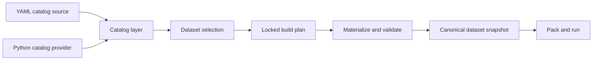

# Dataset authoring and materialization

Status: implemented design

This document explains how Posttrain should register, build, verify, and package
datasets. It is written for developers adding data to a Posttrain project or to
one of the framework packages. The associated implementation work is described
in [Python dataset authoring and reproducible materialization](../plan/python-dataset-authoring-and-materialization.md).

The design keeps one catalog while allowing two ways to author catalog entries:
YAML for straightforward declarations and typed Python for datasets that need
composition or custom processing. Both forms produce the same catalog values,
follow the same overlay rules, and use the same materialization pipeline.

## The developer experience

A developer should be able to choose the simplest authoring form that expresses
the dataset honestly.

Use YAML when the dataset is already available as an immutable Hugging Face
revision, project-relative JSONL or Parquet, a NeMo JSONL export, or another
supported declarative source. Use Python when producing the dataset requires
filtering, joining, normalization, deterministic sampling, redaction, or another
reviewable transformation.

In both cases the workflow is the same:

1. Register a versioned dataset selection in the project catalog.
2. Validate the catalog without downloading or executing the dataset.
3. Materialize the selection explicitly, or let job packaging materialize it on
   first use.
4. Record the exact source revisions, build identity, output digest, and schema
   in the materialization manifest.
5. Package the immutable materialization with the job that consumes it.

The catalog does not run data processing, and a builder does not mutate the
catalog.



## Four concepts

### Dataset selection

A dataset selection is the versioned catalog value chosen by a work package. It
states the semantic data kind, schema, exact source or build recipe, split,
format, provenance, and access policy. It is safe to resolve during catalog
validation and detached job planning.

A selection may point directly at already materialized records or describe how
Posttrain must build those records. It does not contain an activated Python
function, an open network connection, or loaded dataset rows.

### Dataset source

A source identifies immutable input data. Supported source values include a
pinned Hugging Face dataset revision, a project-relative file, a package
resource, and another dataset snapshot. Every external source must identify an
immutable revision or content digest before it can be included in a reproducible
job package.

### Build recipe

A build recipe is a deterministic transformation from declared inputs to
canonical records. A Python recipe is represented in the catalog by an
importable `module:callable` reference and declarative inputs. The callable is
loaded only during explicit materialization.

### Materialization

A materialization is the canonical JSONL or Parquet output produced from a
selection. It has a content digest and a manifest. It is cached under ignored
project state for local reuse and copied into an actual-job image when a run
requires it. Durable publication, when needed, uses an artifact store rather
than treating the local cache as the artifact of record.

## One catalog, two authoring forms

YAML and Python are authoring frontends for the same `CatalogLayer` and
`DatasetSelection` models. They are not separate registries and do not have
different precedence rules.

### YAML

A dataset that only selects and adapts an immutable upstream source remains
compact:

```yaml
dataset:
  datasets/support-sft@1:
    revision: "1"
    kind: supervised
    split: train
    schema_version: messages-v1
    provenance:
      upstream: org/support-conversations@8d4c0f7d2a7b5f0d9ef0d43a7cb50f4da28f4fb1
    access:
      licenses: [Apache-2.0]
      classification: internal
    source:
      kind: huggingface
      repo: org/support-conversations
      revision: 8d4c0f7d2a7b5f0d9ef0d43a7cb50f4da28f4fb1
      split: train
    format:
      kind: messages
```

YAML may also describe a built dataset. The builder remains an inert reference
during catalog loading:

```yaml
dataset:
  datasets/support-sft-reviewed@2:
    revision: "2"
    kind: supervised
    split: train
    schema_version: messages-v1
    provenance:
      upstream: org/support-conversations@8d4c0f7d2a7b5f0d9ef0d43a7cb50f4da28f4fb1
      transformation: support-review-v2
    access:
      licenses: [Apache-2.0]
      classification: internal
    source:
      kind: built
      builder:
        kind: python
        target: support_agent.datasets.support_sft.build:build
      inputs:
        raw:
          kind: huggingface
          repo: org/support-conversations
          revision: 8d4c0f7d2a7b5f0d9ef0d43a7cb50f4da28f4fb1
          split: train
        review_policy:
          kind: package-resource
          resource: support_agent.datasets.support_sft.resources:review-policy.json
      expected_content_sha256: <digest-after-review>
    format:
      kind: messages
```

### Python

Python is appropriate when several definitions share typed helpers or when a
dataset has a non-trivial build recipe. Registration stays declarative even
though it is authored in Python:

```python
from posttrain.catalog import CatalogEntries
from posttrain.data import (
    BuiltDatasetSource,
    DatasetAccessPolicy,
    DatasetProvenance,
    DatasetSelection,
    HuggingFaceDatasetInput,
    PackageResourceInput,
    PythonDatasetBuilder,
)

SUPPORT_SFT_REVIEWED = DatasetSelection(
    id="datasets/support-sft-reviewed@2",
    revision="2",
    kind="supervised",
    split="train",
    schema_version="messages-v1",
    provenance=DatasetProvenance(
        upstream=("org/support-conversations@8d4c0f7d2a7b5f0d9ef0d43a7cb50f4da28f4fb1",),
        transformation="support-review-v2",
    ),
    access=DatasetAccessPolicy(
        licenses=("Apache-2.0",),
        classification="internal",
    ),
    source=BuiltDatasetSource(
        builder=PythonDatasetBuilder(
            target="support_agent.datasets.support_sft.build:build",
        ),
        inputs={
            "raw": HuggingFaceDatasetInput(
                repo="org/support-conversations",
                revision="8d4c0f7d2a7b5f0d9ef0d43a7cb50f4da28f4fb1",
                split="train",
            ),
            "review_policy": PackageResourceInput(
                resource="support_agent.datasets.support_sft.resources:review-policy.json",
            ),
        },
        expected_content_sha256="<digest-after-review>",
    ),
    format="messages",
)


def entries() -> CatalogEntries:
    return CatalogEntries(datasets=(SUPPORT_SFT_REVIEWED,))
```

The provider returns complete catalog entries. It must not perform field-level
patching of entries declared elsewhere. Keeping each entry atomic makes
`posttrain catalog show` sufficient to explain the resolved result.

### Catalog layer manifest

A catalog layer declares its authoring sources explicitly and in order:

```yaml
schema_version: 2
layer_id: support-agent-v1
sources:
  - kind: yaml
    path: datasets.yaml
  - kind: python
    provider: support_agent.catalog:entries
```

The layer loader converts each source to typed entries and rejects duplicate
catalog IDs within the layer. Normal base and overlay composition happens only
after the layer is complete. The resolved run snapshot continues to record the
layer that supplied each selection.

Python providers are explicit; installed packages do not silently add catalog
entries through ambient entry-point discovery.

## Registration is pure

Catalog loading must remain safe during editor checks, `posttrain catalog
validate`, work-package validation, and detached job planning. A Python catalog
provider may construct immutable values and call small validation helpers. It
must not:

- download or open a dataset;
- execute a dataset builder;
- import CUDA, a trainer, vLLM, Verifiers, Trackio, or W&B;
- read credentials or depend on machine-local state;
- write files or mutate a process-global registry.

A provider that cannot be imported produces an error naming the layer, provider
reference, and expected project package. A provider that returns an unsupported
object fails before any dataset is materialized.

## Python builders

A builder is a module-level callable with a narrow interface:

```python
from collections.abc import Iterable, Mapping
from posttrain.data import DatasetBuildContext


def build(ctx: DatasetBuildContext) -> Iterable[Mapping[str, object]]:
    for row in ctx.records("raw"):
        normalized = normalize_and_review(row, ctx.resource("review_policy"))
        if normalized is not None:
            yield normalized
```

`DatasetBuildContext` exposes only resolved declared inputs, a temporary work
directory, and deterministic metadata. Source fetching and cache management are
framework responsibilities. Builders do not receive catalog or tracking
objects and should not fetch undeclared network resources.

Only importable module-level callables are supported. Lambdas, closures,
notebook cells, and arbitrary file execution are rejected because their code
identity cannot be packaged and replayed reliably.

Materialization runs the builder in a child Python process. This prevents
builder imports and temporary global state from leaking into catalog loading or
the calling CLI. The selected project environment supplies the builder's Python
dependencies. Input resolution may use the network when a declared source is
not cached; the transformation itself receives local, digest-checked inputs.

## Reproducible identity

Posttrain records three related identities rather than treating a version label
as proof that the bytes are unchanged.

The selection identity is the catalog ID and revision. It describes the data's
meaning and is what a work package binds.

The build key is a digest over the normalized selection, declared input
identities, builder target, project or distribution source snapshot, dependency
lock, and materializer schema version. It decides whether a local cache entry
can be reused.

The content digest is calculated from the canonical output bytes. It identifies
the exact dataset snapshot consumed by a run.

The materialization manifest records at least:

- selection ID, revision, kind, split, and schema version;
- build key and materializer schema version;
- builder target and code snapshot digest when a builder is present;
- every input source, revision, split, digest, and license;
- declared transformation parameters;
- canonical output format, record count, byte size, and content digest;
- parent dataset or source-run references;
- creation time as informational metadata, excluded from deterministic
  identity.

Changing code, inputs, transformation parameters, or canonicalization produces
a different build key. If the resulting bytes change, they also produce a new
content digest. A published or checked-in dataset recipe may declare
`expected_content_sha256`; verification fails when the rebuilt bytes differ.

## Materialization behavior

`posttrain dataset materialize` resolves inputs, builds if necessary, validates
the semantic dataset schema, writes canonical output and its manifest to a
temporary directory, and atomically promotes the completed directory into
`.posttrain/state/cache/datasets/<build-key>/`.

An interrupted build never appears as a valid cache hit. Repeating the command
with unchanged inputs reuses the completed cache. Job packaging copies the
verified materialization into the actual-job image and includes its manifest in
the package identity.

`posttrain dataset verify` rebuilds into a temporary location and compares the
result with `expected_content_sha256` or a packaged materialization manifest. It
does not update catalog files, package resources, or project state. A selection
without an expected digest can be materialized, but it cannot be claimed as a
reproducible checked-in resource until that digest is reviewed and locked.

The primary commands are:

```text
posttrain catalog validate
posttrain catalog show dataset datasets/support-sft-reviewed@2
posttrain dataset materialize datasets/support-sft-reviewed@2
posttrain dataset verify datasets/support-sft-reviewed@2
```

Readable output includes the source layer, build key, content digest, record
count, cache path, and whether the build was created or reused. `--json` exposes
the same fields for automation.

## Package ownership

`posttrain.catalog` owns catalog-layer discovery, YAML decoding, explicit Python
provider loading, duplicate detection, and base/overlay composition. It never
executes builders.

`posttrain.data` owns dataset selections, source and builder references,
canonical supervised and preference schemas, source adapters, materialization,
manifests, and verification. Its lightweight record-materialization module may
also be used by another capability package for a package-owned record
collection.

`posttrain.execution-pack` owns the project source snapshot and the immutable
job package. It supplies the code snapshot digest used in the build key and
copies verified materializations into the job image.

`posttrain.jobs` resolves dataset seats and hands materialized, validated data
to training operations.

`posttrain.serve` owns serving workload and prompt-corpus meaning. It may reuse
the record materialization support from `posttrain.data`, but a serving prompt
corpus remains part of a `Workload`; it does not become a public training
dataset seat.

`apps/cli` owns user-facing commands. Capability packages expose importable
APIs rather than adding package-specific console scripts.

## Source layout conventions

Project configuration remains under `.posttrain/`, while executable Python
belongs in the project's installable package:

```text
<project>/
  .posttrain/
    catalog/
      layer.yaml
      datasets.yaml
    work_packages/
    state/                         # ignored runtime state
  src/support_agent/
    catalog.py                     # pure Python catalog provider
    datasets/
      support_sft/
        __init__.py
        definition.py              # typed selection
        build.py                   # transformation callable
        resources/                 # reviewed package-owned inputs
  tests/
    datasets/
      support_sft/
```

Framework packages use the same shape under their owning package. A
package-owned serving corpus, for example, belongs beside its serving workload:

```text
packages/serve/src/posttrain/serve/benchmarks/
  general_serving/
    __init__.py
    definition.py
    build.py
    resources/
      first_party.jsonl
      general-serving-v1.jsonl
      general-serving-v1.manifest.json
```

`definition.py` remains import-safe. `build.py` owns transformation behavior.
`resources/` contains reviewed inputs or generated package data. Tests mirror
the owned module and cover both schema validation and reproducibility.

Permanent package behavior does not live in a repository-root `scripts/` or
`tools/` directory. A user-facing operation belongs in `apps/cli`; reusable
behavior belongs in an importable package; framework release behavior belongs
in `apps/release`; qualification scenarios belong in `apps/lab`. A temporary
migration may exist while it is being executed, but it is removed when the
migration finishes.

## Serving prompt populations

The serving-capacity corpus illustrates why authoring, materialization, and
semantic ownership are separate.

`general-serving-v1` is produced from pinned GSM8K and HumanEval revisions plus
reviewed first-party prompts. Its Python builder performs deterministic
normalization and SHA-256 selection. The resulting records are consumed by a
serving workload, so the corpus definition belongs in `posttrain.serve` and its
identity remains nested in the `Workload` selection.

The builder uses `posttrain.data` materialization support for input resolution,
canonical output, manifest generation, and verification. Package maintenance
uses the main CLI:

```text
posttrain workload materialize workloads/general-serving-32k-sweep@1 \
  --output packages/serve/src/posttrain/serve/benchmarks/general_serving/resources
posttrain workload verify workloads/general-serving-32k-sweep@1
```

Ordinary benchmark execution loads the packaged, digest-checked records and
does not require network access or the Hugging Face `datasets` dependency.

## Compatibility and migration

Catalog layer schema version 1 remains readable for one compatibility window.
Schema version 2 adds ordered YAML and Python sources. Existing YAML entries do
not need to be rewritten merely to adopt Python providers elsewhere in the
same project.

The existing `source.kind: built` form using `python-file`, a project-relative
path, and `runpy` remains readable during that window. New definitions use an
importable Python builder target. A warning points to the package layout and
replacement declaration. Removal happens only after job planning, packing,
and cache-rebuild tests cover the new path.

The existing `posttrain dataset validate` command remains a deprecated alias
for `posttrain dataset materialize` during the same window because its current
behavior already performs materialization.

The serving corpus moves only after the generic verifier reproduces the exact
checked-in digest and category counts. Once parity is demonstrated, the
package-specific console entry point and its standalone argument parser are
removed.

## Deliberate limits

This design does not introduce a second catalog, automatic entry-point
discovery, decorator-driven global registration, a generic dataflow graph, or
arbitrary code execution during catalog loading.

It does not make rendering, tokenization, packing, or maximum sequence length
part of canonical dataset identity. Those remain choices of the consuming
training selection unless a separately versioned derived dataset is
materialized.

It does not classify Verifiers task populations as public GRPO datasets, and it
does not classify serving prompt corpora as training datasets. Shared
materialization mechanics do not erase the semantic boundary of the consumer.
