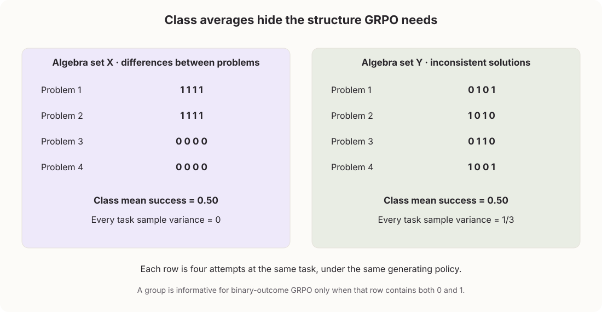
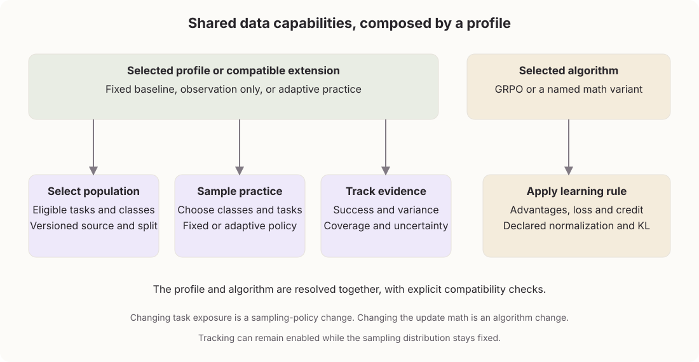

# Adaptive task discovery and practice

**Theoretical proposal · Version 2 · 12 September 2026**

**Status:** research draft for review; public contracts remain proposed.

**Source context:** the [original proposal](configurable-curriculum-and-data-preparation.md) records Posttrain revision 3f3fdd95f5aec290b315f1669db08e78895539fe. This version specifies a proposed sampling policy; it does not certify its implementation or training results.

## 1. The hidden cost of a fixed mixture

### 1.1 Average reward can hide missing skills

An LLM trained on a shuffled pool of math problems can show rising average reward while remaining weak at geometry and probability.

Suppose a 10,000-problem collection contains 7,000 arithmetic problems and 1,000 each in algebra, geometry, and probability. Uniform record sampling gives arithmetic 70% of the task budget. An evaluation with the same proportions can improve through arithmetic gains alone:

| Category within the collection | Share of problems | Earlier success | Later success |
| --- | --- | --- | --- |
| Arithmetic | 70% | 60% | 95% |
| Algebra | 10% | 40% | 40% |
| Geometry | 10% | 10% | 10% |
| Probability | 10% | 30% | 30% |
| Overall, weighted by collection share | 100% | 50% | 74.5% |

Overall success rises from 50% to 74.5%, although three categories make no progress. Per-class measurements show which skills improved and which stayed weak.

Class assignments also make coverage explicit. Geometry can receive practice even when the source collection contains few geometry problems. The reference shares should match the intended use; equal shares are one reasonable baseline. Per-task adaptation can work without semantic categories, but it cannot report or preserve category-level coverage by itself.

### 1.2 Classes expose imbalance

Assigning classes and sampling each equally gives every category 25% of the task budget. Separate measurements reveal how the student responds.

Those fixed shares can become poorly matched to training. Arithmetic may be reliably solved, algebra improving, probability inconsistent, and geometry repeatedly unsuccessful. Each still receives the same budget.

Useful allocation depends on the tasks inside each class. Algebra might receive plenty of practice while the sampler repeats two familiar problems and leaves hundreds untouched. Class coverage alone cannot prevent this concentration.

The lowest score is not enough. An all-failure group gives vanilla GRPO no relative outcome signal, while sampling only mixed-success problems can neglect coverage. A small controller can combine coverage with observed signal; success and progress measurements then test whether its choices actually help.

### 1.3 Discovery needs its own allocation

The proposed controller selects classes and individual tasks. Most selections favor tasks expected to produce useful differences between fresh answers. A discovery reserve guarantees that unseen tasks also reach generation.

An unseen task inherits a provisional prediction from its class. If representative arithmetic tasks are mostly solved already, discovery shifts toward other classes. Arithmetic retains coverage because that prediction can be wrong. Once a task has its own observations, those outcomes increasingly determine its priority.

Two settings govern different decisions: class exploration preserves a base component in class selection; task discovery reserves actual selections for unseen task identities. The candidate values are 20% for each. They overlap: one unseen geometry task can both broaden task coverage and check a neglected class.

All groups in an optimizer step use different tasks, including groups generated in refill rounds. Repetition across steps remains useful when the updated student still produces reward contrast. The curriculum is evaluated on final performance and total cost, including discarded groups and reference observations.

Each task has a problem statement, a class, and an outcome checker:

| Class | Concrete task | What counts as success |
| --- | --- | --- |
| Arithmetic | What is 15% of 80? | The answer is 12 |
| Algebra | Solve $3x+5=20$ | The answer is $x=5$ |
| Geometry | A rectangle has perimeter 30 and length 9. What is its area? | The width is 6 and the area is 54 square units |
| Probability | A bag holds 3 red and 2 blue balls. Draw two without replacement. What is the probability both are red? | The answer is $3/10$ |

A class contains varied problems: algebra includes one-step equations and systems of equations. These examples use answer checks; proof or process claims require suitable verifiers.

~~~text
Task inventory: classes, stable task IDs, source families
                         |
Controller: class forecasts + task evidence + discovery ledger
                         |
                  Select a new batch
              /                       \
    Reserved discovery             Other practice
      unseen tasks              useful or overdue tasks
              \                       /
               Unique task groups for this step
                         |
                Generate fresh attempts
                         |
                    Verify outcomes
                         |
        All candidate evidence returns to controller
                         |
        Selected algorithm retains groups and updates model
                         |
       Next step: tasks may repeat with the updated student
~~~

*Figure 1. For OLMo-style active sampling, evidence also returns before each refill at the same model weights. The step's task exclusions and discovery ledger persist across those rounds. The algorithm owns retention and the model update.*

## 2. Classes form the sampling tree

The hierarchy is the path the sampler follows to reach a concrete problem. The smallest useful form needs only task classes:

~~~text
Math training population
  ├── class: arithmetic
  │     ├── What is 15% of 80? → repeated student solutions
  │     └── What is 3/4 of 28? → repeated student solutions
  ├── class: algebra
  │     ├── Solve 3x + 5 = 20 → repeated student solutions
  │     └── Solve x + y = 7 and x - y = 1 → repeated student solutions
  ├── class: geometry
  │     ├── Find a rectangle's area → repeated student solutions
  │     └── Find an angle in a circle → repeated student solutions
  └── class: probability
        ├── Draw two red balls without replacement → repeated student solutions
        └── Find the probability of at least one six → repeated student solutions
~~~

The sampler allocates groups across classes, then draws problems within each class.

Broader LLM mixtures can organize those categories into a tree. Every node is still represented internally as a class:

~~~text
Training population
  ├── class: mathematical reasoning
  │     ├── child class: arithmetic
  │     ├── child class: algebra
  │     ├── child class: geometry
  │     └── child class: probability
  ├── class: coding
  │     ├── child class: implementation
  │     ├── child class: debugging
  │     └── child class: test reasoning
  └── class: reading comprehension
        ├── child class: factual retrieval
        ├── child class: inference
        └── child class: summarization
~~~

A category is represented internally as a class. Every node uses this abstraction, whether it represents mathematics, algebra, or linear equations. The manifest records the tree and any explicit budgets. A flat list of classes is sufficient.

A class can also be constructed from two or three stable task dimensions. For example:

~~~text
topic = algebra
skill = linear-equation
response_form = numeric

class_id = algebra / linear-equation / numeric
~~~

Use only `topic = algebra` when finer cells are too sparse. Version the mapping and merge rare combinations where needed.

Initially, assign each task to one sampling class and keep other labels as analysis slices. If tasks can belong to more than one class, normalize path probabilities so multiple labels do not multiply the task's budget.

The manifest stores class identity; run state stores the student's performance, observation windows, and inference conditions.

The minimum input is runnable tasks with stable references, class assignments, and meaningful outcomes. Without outcome evidence, fixed coverage remains possible but performance-driven allocation does not.

## 3. Vanilla GRPO under adaptive sampling

One problem is a task; one generated solution is an attempt. GRPO compares a group of $G$ fresh attempts at the same task under one frozen generating policy. A batch contains $M$ groups from $M$ distinct tasks. The $G$ attempts within a group deliberately share a task; separate groups within the same optimizer step do not. Rewards are normalized within each task's group.

If four attempts fail, succeed, fail, and succeed, the successes receive positive relative credit and the failures negative credit. Identical rewards provide no outcome preference among attempts.

Let $i$ identify the task, $j$ an attempt in its group, and $r_{ij}$ the valid reward for that attempt. First calculate the group's average reward $\bar r_i$, its sample variance $s_i^2$, and the standardized relative advantage $A_{ij}$:

$$
\bar r_i=\frac{1}{G}\sum_{j=1}^{G}r_{ij},
\qquad
s_i^2=\frac{1}{G-1}\sum_{j=1}^{G}(r_{ij}-\bar r_i)^2,
\qquad
A_{ij}=\frac{r_{ij}-\bar r_i}{s_i+\epsilon}.
$$

Here $s_i$ is the sample standard deviation and $\epsilon$ stabilizes division. Each attempt's advantage applies to its sampled policy tokens, following outcome-GRPO in [DeepSeekMath](https://arxiv.org/html/2402.03300v3#S4.SS1.SSS2).

GRPO compares token probabilities under the updated model $\pi_\theta$ and generating model $\pi_{\theta_{\mathrm{old}}}$. Clipping limits the surrogate incentive for large changes; a reference-model penalty discourages drift.

For sampled token $a_{ij\ell}$ at token position $\ell$ with context $h_{ij\ell}$, the probability ratio is:

$$
u_{ij\ell}(\theta)=
\frac{\pi_\theta(a_{ij\ell}\mid h_{ij\ell})}
{\pi_{\theta_{\mathrm{old}}}(a_{ij\ell}\mid h_{ij\ell})}.
$$

Let $T_{ij}$ be the number of eligible policy tokens in attempt $j$, $\varepsilon$ the clipping width, $\beta$ the reference-penalty weight, and $k_{ij\ell}$ the selected token-level KL estimator. The clipped objective, averaged across $M$ groups and their attempts, is:

$$
J_t(\theta)=
\frac{1}{M}\sum_i\frac{1}{G}\sum_j
\frac{1}{T_{ij}}\sum_{\ell=1}^{T_{ij}}
\left[
\min\left(u_{ij\ell}A_{ij},
\operatorname{clip}(u_{ij\ell},1-\varepsilon,1+\varepsilon)A_{ij}\right)
-\beta k_{ij\ell}
\right].
$$

Tools, observations, and padding are excluded from $T_{ij}$ and are not policy targets.

Before each generation request, the controller freezes its evidence-derived scores. It selects tasks sequentially without replacement within the optimizer step; each draw's distribution is conditional on earlier selections. The curriculum retains the GRPO update, including constant-reward groups. OLMo-style retention is addressed separately in Section 8.

When testing adaptive allocation, keep $G$, generation settings, and the learning rule fixed.

## 4. Student performance is measured, not assigned

### 4.1 Repeated attempts reveal usable signal

Start with the base class mixture and sample tasks within each class.

For a four-attempt group, $G=4$:

| Task | Observed rewards | Mean success | Sample variance | Interpretation |
| --- | --- | --- | --- | --- |
| A: calculate 15% of 80 | 1, 1, 1, 1 | 1.00 | 0 | All observed attempts succeeded |
| B: solve $3x+5=20$ | 0, 1, 0, 1 | 0.50 | 1/3 | A mixed group with relative outcome signal |
| C: find the rectangle's area from its perimeter and length | 0, 0, 0, 0 | 0.00 | 0 | All observed attempts failed |

Task B has advantages approximately $[-0.866,0.866,-0.866,0.866]$. Tasks A and C both have zero outcome advantages. A reference-KL term may still contribute to their update, but neither group supplies a task-reward preference.

Four attempts establish neither mastery nor impossibility. Mean and variance must be interpreted together.

For binary success $y_{ij}\in\{0,1\}$ with group mean $\bar y_i$, the sample variance is:

$$
s_i^2=\frac{G}{G-1}\bar y_i(1-\bar y_i).
$$

The sample-variance factor $G/(G-1)$ allows values above the Bernoulli population-variance bound of 0.25.

### 4.2 Variation has two meanings

Two algebra classes can each average 50% success yet offer different learning signals. In X, half the tasks always succeed and half always fail. In Y, every task succeeds independently half the time.

Within-task variation measures differences between attempts at one problem. Between-task variation measures differences between problem success rates. For reward $Y$ in class $c$:

$$
\operatorname{Var}(Y\mid c)=
\mathbb E_{i\mid c}[\operatorname{Var}(Y\mid i)]
+\operatorname{Var}_{i\mid c}(\mathbb E[Y\mid i]).
$$

X has zero within-task variance and between-task variance 0.25; Y has the reverse. Their total variance is identical, but only Y produces mixed outcome groups. These are idealized population patterns, not conclusions from four attempts.

Retain task/group identity to measure within-task variation. Pooled class variance loses that distinction, and finite-sample variance of task means also contains estimation noise.

*Figure 2. The scheduler needs grouped observations as well as class averages and pooled variance.*

### 4.3 Informative groups are counted directly

Report informative groups directly: "80 of 100 groups contained different rewards." For outcome-GRPO, these groups provide a relative reward signal. Mark a group when its reward range exceeds a meaningful threshold:

$$
z_i=\mathbf 1\left[\max_j r_{ij}-\min_j r_{ij}>\tau_r\right].
$$

For binary rewards, use $\tau_r=0$: a group is informative when it contains both success and failure. For continuous rewards, $\tau_r$ is a declared meaningful difference, chosen with verifier noise in mind.

For independent binary attempts with task success probability $p_i$:

$$
\Pr(z_i=1)=1-p_i^G-(1-p_i)^G.
$$

At $G=4$, the probability is 0.875 for $p_i=0.5$, about 0.0394 for $p_i=0.99$, and also about 0.0394 for $p_i=0.01$. Once again, informativeness alone cannot distinguish mastered tasks from unsuccessful ones.

$\Phi_c$ estimates informative-group frequency on the class reference population. It measures available reward contrast, not expected learning gain; noisy verifiers can also produce contrast.

### 4.4 Performance estimates age

Observed performance changes while task identity stays stable:

| Observation window | Successful attempts | Interpretation |
| --- | --- | --- |
| Early training | 2/20 | Low observed success, with uncertainty |
| Later training | 14/20 | Higher observed success; assess comparable evidence before declaring progress |
| Further training | 19/20 | High observed success; not by itself a mastery declaration |
| Long gap since observation | No fresh attempts | Current performance needs reassessment |

Estimate current success from valid attempts in a recent window. Optional age weights emphasize newer observations:

$$
\widehat p_i(t)=
\frac{\sum_{o\in\mathcal W_i(t)}w_o(t)y_o}
{\sum_{o\in\mathcal W_i(t)}w_o(t)},
\qquad w_o(t)\ge0.
$$

Here an observation $o$ is a valid attempt at task $i$, $y_o$ is its success indicator, and $\mathcal W_i(t)$ contains compatible observations in the configured window. Uniform weights give an ordinary success fraction; decreasing weights implement a declared decay policy. If no positive-weight observations remain, the estimate is unavailable, not zero.

Record window boundaries, task/model revisions, inference/verifier conditions, counts, age, and uncertainty. A window spanning checkpoints estimates recent performance; frozen-checkpoint probes estimate the current student. Missing or invalid scores are excluded.

Short windows respond quickly but are noisy; long windows can hide recent change. Decay reduces old evidence's influence without making it fresh. Uncertainty methods must account for weights and dependence; exact unweighted binomial intervals apply only to a compatible probe design (Section 5.4).

Success, variation, progress, coverage, and freshness serve distinct purposes. Compare performance on consistent populations so that a shift toward easier-to-solve tasks cannot appear as learning.

## 5. Evidence for curriculum decisions

The controller should not act on raw averages alone. It needs evidence that answers three questions for each class: how the current student performs, whether that performance is changing, and whether the observations are fresh enough to trust.

Training rollouts provide cheap evidence because they already happen during optimization. They are also biased by the sampler: once the controller changes exposure, the observed tasks no longer represent the original class population. Reference probes repair that problem by measuring the current student on a declared comparison population.

### 5.1 Separate training evidence from reference probes

Training telemetry records every executed group's class, task, policy revision, outcomes, variance, costs, validity, and selection probability.

Reference probes evaluate the current student on a fixed-design class population without updating the model from those rollouts.

Record model, task, verifier, generation, starting-state, and environment conditions. Changes in these conditions or environmental randomness can alter outcomes independently of learning.

Adaptive sampling changes the population represented by training telemetry. Reference probes support comparable progress estimates. Without representative evidence, allocation can remain heuristic, but mastery and saturation remain uncertain.

Three populations have distinct purposes:

| Population | Use |
| --- | --- |
| Adaptive training population | Parameter updates and immediate telemetry |
| Controller reference population | Progression, forgetting, and sampling decisions |
| Final held-out qualification population | Final assessment; never used to tune the controller |

A fixed panel supports paired comparisons; a refreshable portion checks broader coverage and panel-specific overfitting. Both follow declared source-family splits. Repeated attempts at one task do not count as many independent tasks.

### 5.2 Reference-weighted class estimates

Average tasks according to the reference design. Two equally weighted tasks with success rates 100% and 0% give 50%, regardless of how often training revisits the first.

For a uniformly sampled panel $P_c$ of $n_c$ distinct tasks, estimate class success $\widehat\mu_c$, mean within-task variance $\widehat V_c$, and informative-group frequency $\widehat\Phi_c$:

$$
\widehat\mu_c(t)=\frac{1}{n_c}\sum_{i\in P_c}\bar y_i(t),
\quad
\widehat V_c(t)=\frac{1}{n_c}\sum_{i\in P_c}s_i^2(t),
\quad
\widehat\Phi_c(t)=\frac{1}{n_c}\sum_{i\in P_c}z_i(t).
$$

Use declared reference weights for a nonuniform design. Summarize at the task/window level before aggregation so repeated visits do not dominate.

Keep recent-window estimates separate from lifetime exposure counts.

### 5.3 Progress, forgetting, uncertainty

These measurements support evaluation and later controller experiments. The sampler in Section 7 uses predicted grouped contrast for allocation; these measurements assess whether that choice improves learning.

An algebra gain from 50% to 65% is 15 percentage points. A gain interval of +5 to +25 supports improvement; −5 to +25 is inconclusive; −15 to −5 supports forgetting.

For comparable observations separated by $L$ decision intervals:

$$
\widehat\Delta_c(t)=\widehat\mu_c(t)-\widehat\mu_c(t-L).
$$

With a matched panel, compute per-task changes:

$$
d_i=\bar y_i(t)-\bar y_i(t-L),
\qquad
\widehat\Delta_c=\frac{1}{n_c}\sum_i d_i.
$$

A simple large-sample interval is:

$$
\widehat\Delta_c\ \pm\
z_{1-\alpha/2}\frac{s_d}{\sqrt{n_c}}.
$$

Use tasks, or source families for related tasks, as the independent units. Small, skewed, or clustered samples need a suitable task/family interval method. Zero sample error in a small all-success panel does not establish certainty.

Let $[L^\Delta_c,U^\Delta_c]$ be that interval. Define bounded progress and forgetting signals:

$$
P_c=\operatorname{clip}\left(\frac{\max(0,L^\Delta_c)}{\delta_P},0,1\right),
\qquad
F_c=\operatorname{clip}\left(\frac{\max(0,-U^\Delta_c)}{\delta_F},0,1\right).
$$

$\delta_P$ and $\delta_F$ are changes large enough to count as full-strength signals. Progress and forgetting are separated rather than counting negative change twice through an absolute-progress term.

Report uncertainty, task coverage, and observation age separately. A wide interval, a narrow sample of task families, and old evidence describe different limitations. The base controller does not compress them into another priority score.

Pointwise confidence intervals do not guarantee validity across repeated adaptive decisions. Predeclare decision frequency and use sequential methods or adjusted error budgets when stronger guarantees are needed.

### 5.4 Binary probes need boundary-aware intervals

Four successes are insufficient to establish 95% reliability. Exact binomial intervals provide one boundary-aware option for a compatible binary probe design.

For a simple reference design, independently draw task occurrences from the fixed class population at a frozen checkpoint and designate the first rollout in each group as the success probe. Those designated outcomes estimate the same population success probability as the all-attempt mean, using less information but a simple Bernoulli observation model. Use exact binomial intervals for that designated success count and for the mixed-group indicators. Report distinct-task/source coverage separately; repeated identities do not increase coverage because another occurrence was drawn.

For $x=n$ successes, the two-sided confidence interval with error level $\alpha$ has lower endpoint $(\alpha/2)^{1/n}$, not 1. For $x=0$, its upper endpoint is $1-(\alpha/2)^{1/n}$. Interior counts use the corresponding beta-distribution quantiles. If the sampling design or dependence assumptions differ, use an interval appropriate to that design instead of calling these exact.

A conservative progress interval is $[L^\mu_{\mathrm{now}}-U^\mu_{\mathrm{before}},\ U^\mu_{\mathrm{now}}-L^\mu_{\mathrm{before}}]$, with error budget split between the two success intervals. It does not require independence between the two rounds. Paired task-level methods may be more efficient, but need their own boundary handling.

For 256/256 designated successes, the 95% lower bound is about 0.9857. Two all-success rounds using 97.5% intervals yield a conservative 95% progress interval of about $[-0.0170,0.0170]$, inside a 0.02 flatness band. The probe budget constrains which decisions the evidence can support.

## 6. Solved tasks, missing evidence, and useful repetition

A task that repeatedly succeeds needs less outcome-GRPO practice. A task that repeatedly fails also supplies little reward contrast, but remains an unresolved weakness. The controller records success and variance separately so those cases remain distinguishable.

| Evidence about a task | Meaning for selection |
| --- | --- |
| Never selected in this run | Eligible for discovery; use the class prediction provisionally |
| A few valid groups | Combine the task's outcomes with the class prediction |
| Repeated recent mixed groups | Candidate for further practice across optimizer steps |
| Repeated recent all-success groups | Lower predicted reward contrast; retain occasional reassessment |
| Repeated recent all-failure groups | Lower predicted contrast, with an unresolved failure recorded |
| Old, missing, or invalid observations | Current performance is uncertain; do not record a measured zero |

The sampler does not need a binary "learned" flag. Repeated all-success groups reduce predicted contrast gradually. Four successes do not establish mastery, and model updates elsewhere can change the task's behavior. Assessment thresholds belong to the project's evaluation and stopping rules.

Class evidence also informs tasks that have never been attempted. If many distinct, representative arithmetic tasks are consistently solved, an unseen arithmetic task is less promising for reward contrast. This lowers its discovery priority without asserting that the student has solved it. A contrary observation at that task can override the class prediction.

If a class has almost no predicted contrast, its adaptive allocation becomes small and class coverage supplies occasional checks. When every eligible class has zero scores, the rule falls back to base class sampling and task reassessment. That fallback does not prove the training phase is complete or guarantee useful updates. Stopping or expanding the inventory remains a separate project decision.

Parent reports retain child-class results and distinct-task coverage. Repeating one arithmetic problem a hundred times cannot establish that a hundred arithmetic problems are learned.

## 7. Predicting and allocating useful practice

### 7.1 Class coverage and task discovery

Class exploration asks where evidence may be missing or misleading. Task discovery asks which problems have never been tried. Productive classes need discovery too: finding another useful algebra task can be more valuable than repeatedly generating answers to the same one.

| Control | What it protects | Candidate value |
| --- | --- | --- |
| Class exploration, $\epsilon_c$ | A base component in class selection, even when predicted contrast is low | 0.20 |
| Task discovery, $\delta$ | Selections of tasks never previously selected during this run | 0.20 |

For ten candidate groups, two slots are reserved for unseen tasks while sufficient unseen inventory remains. The other eight may reuse tasks from earlier steps. The controller avoids repeating a task within the step while distinct eligible tasks remain. At startup, all ten can be unseen.

These percentages do not add to 40% of compute. Each discovery slot also makes a class choice. Both controls use cumulative ledgers across initial batches and refill requests, and their positions are scheduled independently. A slot can therefore be both new-task discovery and class coverage without making the two controls identical. Neither controls the composition of the retained optimizer batch.

### 7.2 What class evidence predicts

An all-success group and an all-failure group both provide no within-group learning signal. For every observed group $g$ of task $i$, record the admission event

$$
z_{ig}=\mathbf 1[\operatorname{Var}(r_{ig})>\varepsilon].
$$

The threshold $\varepsilon$ must match the algorithm's useful-group condition. For OLMo 3 today it is positive reward standard deviation. This definition works for continuous verifier rewards: four identical rewards of 0.2 produce $z=0$, while $[0,0.4,0,0.4]$ produces $z=1$.

Class evidence estimates whether another task from the class will produce useful variance. Let $z_i^{\mathrm{new}}$ be the result of task $i$'s first generated group. Each distinct task contributes exactly one class observation, so later practice cannot make one task stand in for an entire class:

$$
\alpha_c=1+\sum_{i\in c}z_i^{\mathrm{new}},\qquad
\beta_c=1+\sum_{i\in c}(1-z_i^{\mathrm{new}}).
$$

The posterior mean $\mu_c=\alpha_c/(\alpha_c+\beta_c)$ estimates yield. Its standard deviation $\sigma_c$ records sample uncertainty. Discovery uses an optimistic index

$$
d_c=\min(1,\mu_c+\lambda\sigma_c),
$$

with $\lambda=1$ in the first implementation. Two useful tasks among five observed tasks give $\operatorname{Beta}(3,4)$: mean 42.9% and standard deviation 17.5%. Two among one hundred give $\operatorname{Beta}(3,99)$: mean 2.9% and standard deviation 1.7%. The small sample therefore keeps receiving discovery opportunities; the large sample supports a lower allocation without assigning zero probability.

Ongoing discoveries add observations from the current student. Older discoveries can become stale as model weights change, so the controller records their model revision and the proposal leaves decay or fixed-reference calibration as an evidence-policy extension. Class coverage continues to test conclusions that the adaptive index would otherwise neglect.

### 7.3 A task corrects its class prediction

A useful task must satisfy two conditions: the next group should plausibly contain different rewards, and past variance should represent a repeatable signal rather than a single lucky draw. The task score models both.

Let $s_{ig}$ be the reward sum and $n_{ig}$ the number of valid attempts in an observed group. A task starts with a weak success-rate prior from the first observations of other tasks in its class. Exclude the task itself and keep the prior strength fixed at $\kappa=2$:

$$
a_i=\kappa m_{c,-i}+\sum_g w_gs_{ig},\qquad
b_i=\kappa(1-m_{c,-i})+\sum_g w_g(n_{ig}-s_{ig}).
$$

Under this Beta posterior, the probability that the next group of $G$ binary rewards is mixed is

$$
v_i=1-\frac{(a_i)_{G}}{(a_i+b_i)_{G}}
      -\frac{(b_i)_{G}}{(a_i+b_i)_{G}},
$$

where $(x)_G$ is the rising factorial. This term falls when recent rewards approach all-success or all-failure.

A second posterior uses the observed useful-group events $z_{ig}$. It has the same fixed-strength class prior and recency weights:

$$
\tilde\alpha_i=\kappa\mu_{c,-i}+\sum_g w_gz_{ig},\qquad
\tilde\beta_i=\kappa(1-\mu_{c,-i})+\sum_g w_g(1-z_{ig}).
$$

The practice score is

$$
u_i=v_i\frac{\tilde\alpha_i}{\tilde\alpha_i+\tilde\beta_i}.
$$

The first factor predicts contrast from the reward level; the second calibrates that prediction against observed variance. Four identical rewards of 0.2 therefore do not look useful merely because their mean is intermediate. Linear recency weights sum to the number of retained history groups, so newer outcomes matter more without inflating the effective sample count. The fixed class-prior strength prevents a class with one hundred observations from overpowering a task's own recent behavior. Persistent verifier noise can still produce a high score and must be detected through progress evaluation.

### 7.4 Counting unseen tasks across small requests

Keep a run-wide count $N$ of committed candidate-group selections. For a request of $B$ groups, reserve

$$
D(N,B)=\lfloor\delta(N+B)\rfloor-\lfloor\delta N\rfloor
$$

discovery slots. With $\delta=0.2$, any ten-group request owes two. Five successive one-group requests owe one collectively. Splitting a request into refill rounds cannot erase fractional allocation.

With sufficient unseen tasks and completed execution of those selections, the first $N$ candidates include at least $\lfloor\delta N\rfloor$ new task identities. The shortfall from the ideal fractional target is less than one group. This does not guarantee a new task in every small request.

A task leaves the unseen pool when its selection is committed, even if generation later fails or OLMo rejects its group. Record selection and execution separately; an unexecuted reservation is not successful training exposure. Retries preserve the same selection identity. Extra new tasks during startup count as additional discovery, but do not prepay future reserved slots.

Keep the set $S_k$ of tasks selected in optimizer step $k$. Every initial or refill selection excludes $S_k$. Clear that set only when the optimizer step ends. The discovery count and lifetime seen set continue across steps and checkpoint recovery.

### 7.5 Selecting a class and a task

Select reserved discovery slots first. Discovery draws use unseen tasks outside $S_k$. For every remaining slot with both unseen and familiar tasks available, compare their current expected yields. Let $\bar d_U$ be the mean class discovery index across classes with unseen tasks, and let $\bar u_F$ be the mean task score across eligible familiar tasks. Select an additional unseen task with probability

$$
P(\text{additional discovery})=\frac{\bar d_U}{\bar d_U+\bar u_F}.
$$

Otherwise select familiar practice. This makes $\delta$ a guaranteed discovery floor rather than a ceiling: startup can use entirely new tasks, and a saturated familiar pool can release more budget to discovery. If either pool is empty, use the other. Recompute eligibility after every draw.

The class discovery index $d_c$ directs unseen-task selection toward classes with higher observed yield or greater uncertainty. Ordinary practice uses the mean task score $u_i$ among eligible familiar tasks. These values describe the current candidate pool rather than unbiased class performance.

For a draw, let $E$ be its eligible task pool, $\mathcal C_E$ the classes with tasks in that pool, and $b_E(c)$ the base class weights renormalized over $\mathcal C_E$. Let $a_c(E)$ be $d_c$ for discovery, or the mean of $u_i$ over eligible familiar tasks. Define the adaptive distribution

$$
A_E(c)=\frac{b_E(c)a_c(E)}
{\sum_{d\in\mathcal C_E}b_E(d)a_d(E)}.
$$

Class coverage has its own cumulative quota

$$
C(N,B)=\lfloor\epsilon_c(N+B)\rfloor-\lfloor\epsilon_cN\rfloor.
$$

Choose exactly $C(N,B)$ positions in the request for the base distribution $b_E$; other positions use $A_E$. Seeded random placement makes the coverage schedule independent of the discovery schedule. Over many candidates the marginal class distribution approaches $\epsilon_cb_E+(1-\epsilon_c)A_E$, while every recorded draw retains its actual conditional probability.

For each draw, record whether it used the base coverage component or the adaptive component:

| Slot and component | Choice within the selected class |
| --- | --- |
| Discovery, either component | Draw from unseen tasks using the base within-class weights; class evidence cannot distinguish unseen tasks with identical metadata |
| Ordinary practice, adaptive component | Draw proportional to $b(i\mid c)u_i$ over eligible familiar tasks |
| Ordinary practice, coverage component | Reassess the eligible task least recently attempted; break ties randomly |
| Ordinary practice with no usable task scores | Use the same reassessment order |

The coverage component therefore supplies both class coverage and task reassessment without a third percentage. It revisits old all-success and all-failure tasks while adaptive practice concentrates on useful contrast. No permanent solved-state exclusion is required. Further successful reassessments reduce the adaptive score; the proposed rule does not add a separate exponential backoff schedule.

For discovery, draw uniformly among unseen tasks in the chosen class when no task features distinguish them. For adaptive practice, draw proportional to $u_i$. For coverage practice, choose the least recently attempted eligible task. A class with no unseen tasks cannot receive a discovery slot but remains eligible for reassessment. Log the component, eligible pool, scores, and conditional probability for every draw.

### 7.6 Saturation, exhaustion, and finite runs

| Situation | Result |
| --- | --- |
| A class's tasks are mostly solved | Lower discovery forecast and lower familiar-task scores; retain class coverage |
| One task contradicts its class prediction | Its fresh outcomes raise or lower its own score; use representative evidence before changing the entire class estimate |
| A class consistently fails | Low predicted contrast can reduce allocation; report the unresolved weakness separately |
| Evidence becomes stale | Weaken or expire the prediction and obtain reassessment; do not preserve a high score indefinitely |
| A class has no unseen tasks | Exclude it from discovery, keep it eligible for ordinary practice |
| The entire unseen inventory is exhausted | Redirect unfillable discovery slots to reassessment; record the unmet novelty allocation and exhaustion point |
| Too few distinct tasks remain in this step | Record the capacity shortfall and allow a repeated candidate; selection diversity does not invalidate the optimizer step |
| Every class has little useful contrast | Fall back to coverage and reassessment; further compute may have little training value |

Step-wide exclusions are a best-effort sampling policy. If the eligible inventory is exhausted, record the repeated identity and continue. Do not relabel the repeat as discovery or assume an expanded inventory has the same identity as the original release.

The sampler needs no final run length. It uses completed evidence, cumulative discovery accounting, and current eligibility. Longer runs continue from that state; they do not automatically converge to mastery. Positive coverage, useful learning updates, reliable measurements, and limited interference are separate assumptions. In a small run, class exploration may still miss a class by chance even while the task-discovery quota is met.

## 8. Initial batches and refill rounds

There are two selection boundaries. The controller chooses the initial candidate tasks for every supported profile. For a profile with active retention, it also chooses replacement candidates after completed groups have been scored. Those refill choices can react to new outcomes while the generating model stays fixed.

For vanilla GRPO, generate the selected groups and update from them according to the declared algorithm, including constant-reward groups. For OLMo-style active sampling, retain groups according to that profile, request only the missing groups, and stop at its declared refill bound. The controller supplies candidates; it does not decide retention or alter advantage normalization.

~~~text
Start optimizer step k; keep model weights fixed during candidate generation.
Restore or initialize the step's selected-task set.

For the initial request, then each algorithm-requested refill:
  Determine the number of missing groups.
  Reserve unseen-task slots using the cumulative discovery count.
  Freeze the current evidence-derived predictions for this request.
  Select classes and tasks, excluding every task already selected in step k.
  Commit selections and advance the discovery ledger.
  Generate G fresh attempts per task.
  Record all outcomes, costs, invalid evidence, and task identities.
  Refresh task predictions and eligible class evidence.
  Let the selected algorithm retain groups and decide whether another refill is needed.

Apply the algorithm's model update when its batch is ready.
Checkpoint model, controller, sampler, evidence positions, and discovery accounting.
Advance to the next optimizer step; familiar tasks become eligible again.
~~~

All generated groups supply evidence, including rejected groups. Retained-only observations would hide consistently solved and failed tasks and distort the class forecast.

Persist the lifetime seen set, discovery count, current step exclusions, random state, task evidence, class estimates, and last-attempt ordering. Snapshot them at a compatible model/recovery boundary. A file backend can serialize updates through a queued single writer; a checkpoint must flush earlier writes before publishing a snapshot. Restore must not reset the unseen inventory or forgive discovery allocation.

Separate reference probes use a declared, counted observation budget. They supply comparable success and progress measurements and may calibrate class predictions. They do not silently consume the training discovery reserve. Observe-only profiles retain their inherited sampler while recording the same available evidence.

## 9. Examples of selection and correction

[Play the task-pool simulation](simulations/task-discovery-v2.html). Each request fills three lanes: **discovery**, **practice**, and **recheck**. Their percentages show actual candidate shares, before any retention filter. The lanes fill together, followed by generation, observation, and the model update. Small class charts show candidate allocation over completed steps.

In the task pool, tile color shows normalized within-group variance from orange (0) through neutral (0.5) to green (1). A purple bar shows observed mean reward, equal to success rate for these binary outcomes. An all-success task and an all-failure task both have orange tiles, but full and empty bars respectively. Alternating constant groups can give a half-full reward bar with zero within-group variance. Grey with a dash means no recent evidence. Bars animate between measurements, including decreases; observed reward need not rise smoothly. Selection uses an outline, independent of both measurements. Select any task for its forecast and recent history.

Discovery includes reserved and additional unseen tasks. At startup it can occupy all ten slots even when only two are reserved. Recheck is the realized reassessment share, not a separate configured quota; class coverage and exhausted discovery slots can produce those picks. Class coverage versus adaptive class selection is recorded separately. Play advances a whole selection request before the remaining stages; "Next model step" moves directly to the next update or bounded failure. Replay preserves the exact seeded history.

### 9.1 Discovery shifts away from a mostly solved class

The bottom of the simulation panel contains aligned histories controlled by the same replay. Stacked columns show each class's share of selected candidates, including refills and the current partial step. Four separate success charts use identical 0–100% scales. Their values summarize recent sampled outcomes at observation events; future steps stay blank and missing evidence creates gaps. Changes in the sampled population can affect success rates, so these are not fixed-population evaluations or evidence of a causal effect from allocation.

Consider two classes that have each produced two useful tasks. Five distinct tasks have been observed from class A and one hundred from class B:

$$
(\alpha_A,\beta_A)=(3,4),\qquad
(\alpha_B,\beta_B)=(3,99).
$$

Class A has a 42.9% posterior mean and 17.5% posterior standard deviation, giving a discovery index of 60.4%. Class B has a 2.9% mean and 1.7% standard deviation, giving an index of 4.6%. Adaptive discovery therefore favors A because its estimated yield is higher and the small sample is less conclusive. The cumulative coverage component continues to select B occasionally.

In a ten-group request, two slots are reserved for discovery. These probabilities distribute those two slots across classes. They do not require fractional tasks or a task from each class in every request.

### 9.2 A new task overrides its class prediction

Arithmetic task A17 inherits a low useful-group forecast from its class. Discovery selects it anyway through the remaining class probability. Its answers include both successes and failures.

One group gives limited evidence, but it raises A17's own forecast relative to the class prior. A17 becomes eligible for ordinary practice at the next optimizer step. It cannot be selected again in a refill of the current step. More mixed outcomes strengthen its priority; repeated all-success groups eventually reduce it.

This behavior allows useful exceptions inside apparently saturated classes. It also prevents one surprising task from immediately promoting every unobserved task in that class.

### 9.3 The first selection and later refills share one ledger

With $\delta=0.2$ and an initially zero candidate count:

| Request | Candidate groups requested | Reserved unseen tasks | Cumulative candidates | Cumulative reserved discovery |
| --- | --- | --- | --- | --- |
| Initial batch | 8 | 1 | 8 | 1 |
| First refill | 2 | 1 | 10 | 2 |
| Second refill | 3 | 0 | 13 | 2 |
| Third refill | 2 | 1 | 15 | 3 |

This table describes candidate requests, not a claim that a particular run needs three refills. If enough unseen tasks exist, three of the fifteen selections are reserved discovery. Startup or familiar-pool exhaustion can make the actual number of new tasks larger.

All fifteen task IDs differ if the requests belong to one optimizer step and enough distinct tasks remain. A discarded discovery group still counts as generated discovery; it consumed compute and supplied evidence. Its rejection does not justify recycling the same task in the next refill while another eligible task exists. If the inventory is exhausted, a recorded repeat is preferable to failing the run.

### 9.4 Diversity and efficiency must be reported together

| Measurement | What it reveals |
| --- | --- |
| Unique tasks per step, including refills | Whether same-step duplication is actually prevented |
| New tasks per request and cumulative discovery shortfall | Whether the discovery rule survives variable request sizes |
| Unique tasks and source families per class | Whether coverage reaches beyond a few examples or near duplicates |
| Cross-step task counts and last-attempt gaps | Whether ordinary practice is concentrated or reassessment is neglected |
| Predicted versus observed mixed-group rates on discovery tasks | Whether class predictions help route exploration |
| Proposed, executed, valid, retained, and optimized groups | Where compute and data are lost |
| Tokens, verifier cost, and time for all candidates | Whether a higher retention rate produces real savings |
| Fixed-population success and per-class progress | Whether useful-looking groups improve the student |

The reserve counts task groups, not tokens or wall-clock time. Expensive exploratory tasks can consume more than 20% of compute. A cost-aware priority would be a separately evaluated extension.

### 9.5 Simulation boundaries

The [v2 simulator](simulations/task-discovery-v2.html) contains 64 tasks in four classes, a target batch of ten groups, and four attempts per group. Its hidden learner and observed controller state are separate. The controller cannot read the true task success probabilities; an optional inspection view reveals them only to the reader.

| Assumed learner | Behavior to inspect |
| --- | --- |
| Steady learning (default) | Tasks start at 10%–88% solve probability, varying within and across classes; useful practice gradually improves them |
| Different starting abilities | Task probabilities range from 15% to 88%, with one shared learning rate |
| Learning follows signal | Uses the same starting tasks; larger observed within-group contrast produces a larger assumed learning gain |
| Different learning speeds | Uses the same starting abilities, with slow, medium, and fast task-specific learning rates |
| Mostly solved class | Twelve arithmetic tasks start at 99.5% success, while four remain less solved; discovery can find useful exceptions |
| Transfer unlocks geometry | Algebra practice raises initially low geometry success, including on unseen tasks |
| Arithmetic regresses | A synthetic change after update 10 reduces arithmetic success; the controller needs new observations to detect it |
| Variance without learning | Probability tasks remain at 50% success despite practice and can attract unproductive allocation |
| Everything is solved | Constant successes yield no outcome contrast; active retention stops at its bound if it cannot fill a batch |

The ordinary-learning presets appear first, with stress cases in a separate menu group. Each answer is a probabilistic outcome: a task with 70% success probability can still fail in a particular group. The controller sees those outcomes, not the underlying probability. The inspection toggle reveals assumed solve probabilities and the gain at the last model update without feeding those values to selection.

Within a step, answers are independent Bernoulli draws at fixed task probabilities. A model update moves each practiced mixed-outcome task toward 99.5% success at its assigned rate and supplies a smaller gain to other tasks in the same class. Steady learning and different starting abilities use rate 0.14; different learning speeds uses 0.07, 0.14, or 0.28 per task.

For the signal-dependent preset, let the group's observed success fraction be $\bar y_i$ and its normalized contrast be $z_i=4\bar y_i(1-\bar y_i)$. The assumed direct task update is

$$
p_i^{\mathrm{next}}=p_i+0.14(0.995-p_i)z_i.
$$

Two successes in four attempts give $z_i=1$; one or three give $z_i=0.75$; constant outcomes give zero direct gain. Shared class gains are also scaled by this contrast in that preset. The other ordinary presets apply their direct learning rate whenever a group is mixed. This comparison isolates a different response to observed signal, rather than changing both the initial task population and the learning rule.

The probabilities are synthetic learner state, not controller forecasts. Transfer, regression, and irreducible noise modify the stress cases. No neural network or GRPO gradient is computed: real standardized advantages do not imply that learning gains are proportional to raw variance.

For the illustrative estimator, each distinct task contributes only its first group to the class forecast. Each familiar task combines a fixed-strength class prior with up to four recency-weighted groups. Its score multiplies the posterior probability of a mixed next group by the empirical useful-group rate, matching Section 7.3. This smoothing is unrelated to either exploration budget. Expiring class evidence can restore uncertainty even when old results were consistently successful.

Vanilla mode uses every generated group in its update. OLMo-style mode retains mixed groups and permits at most four candidate rounds; failure to reach ten retained groups ends the run without an update for that incomplete step. Both modes preserve step uniqueness and cumulative discovery accounting. Selection, execution, and optimized-group counts are distinct. The engine checks exercise these invariants, but do not establish a learning advantage.

The [existing mechanism walkthrough](simulations/curriculum-machinery.html) illustrates evidence returning to a controller. It uses scripted selections and does not implement this version's step uniqueness, discovery accounting, or predictive class model.

The [existing simulation script](simulations/curriculum_feedback.py) and [results](simulations/curriculum_feedback_results.json) compare fixed balancing with an earlier mixed-group sampler. They contain no heterogeneous task inventory within each class and cannot validate task discovery or the class prior. The [original proposal](configurable-curriculum-and-data-preparation.html#9-allocation-and-simulation) retains that player and its assumptions.

The [controller policy experiment](simulations/controller-policy-analysis.md) runs the real Python controller against a shuffled without-replacement baseline over 40 paired seeds. It finds lower candidate cost in four of five synthetic profiles and a loss when fresh tasks are uniformly useful and familiar tasks saturate immediately. The row-level CSV and JSONL are generated beside the report.

A comparative evaluation should vary class-label quality and inventory size in addition to the visual presets. Compare fixed discovery with class-guided discovery under identical candidate budgets and matched total cost. The visual model omits reference-probe costs, token costs, correlated answers, and real model generalization. Its trajectories explain selection behavior; they do not establish gains over another sampler.

## 10. Profile settings

A profile selects the task population, sampling policy, and evidence preset. The two user-facing exploration controls have separate meanings; individual classes do not require their own discovery percentages.

~~~yaml
profile:
  extends: olmo@<revision>
  curriculum:
    manifest: math-tasks@<immutable-revision>
    controller: predictive-task-discovery@1
    mode: adaptive
    scope: classes-and-tasks
    base_mixture: uniform-classes
    class_exploration: 0.20
    task_discovery: 0.20
    evidence: class-and-task-prediction@1

algorithm:
  id: grpo
  math_revision: <compatible-explicit-revision>
~~~

These names describe a proposed profile, not the current framework schema. OLMo composition retains its declared algorithm settings and active-retention rules; a vanilla-GRPO experiment selects a compatible vanilla profile.

| Setting or policy requirement | Effect |
| --- | --- |
| Class exploration | Base component in each eligible class draw; probability-based coverage |
| Task discovery | Cumulative reserved count of unseen-task selections; candidate-level allocation |
| Base mixture | Intended class weights and within-class base weights; equal classes by default |
| Evidence preset | Prior family, representative class fitting, task update, evidence age, uncertainty, and fallback behavior |
| Decision boundaries | Initial selection for all profiles; every completed refill round for profiles with active retention |
| Step uniqueness | Required across initial and refill candidates; not an optional exploration knob |
| Inventory exhaustion | Explicit reassessment fallback and reported novelty shortfall |

The evidence preset owns its statistical requirements and exposes resolved values for reproducibility. Prior strength and recency require calibration; they are not inferred from the remaining training budget. Invalid or unsupported combinations must fail clearly.

Defaults resolve from manifest, inherited profile, controller preset, and explicit compatible overrides. Record the resolved settings and their provenance. Formula changes require a new policy revision; a numerical override changes the run's configuration identity.

Generation group size, verifier retries, retention bounds, and model-update mathematics retain their existing owners. Reference probes and project stopping criteria have separate budgets and contracts. Observation-only mode preserves the inherited sampler and rejects sampling overrides that would change it.

## 11. Profiles and algorithms remain separate

A run combines a practice profile with a learning algorithm. The profile determines which tasks are eligible, how they are sampled, and which evidence the controller maintains. The algorithm determines how generated experience changes model parameters.

| Layer | Responsibility | Math example |
| --- | --- | --- |
| Data selection | Define the eligible population and class mapping | Use the training split; group problems by topic; exclude held-out families |
| Sampling | Allocate groups across classes and choose tasks | Use class predictions, a discovery ledger, and step-wide task exclusions |
| Evidence | Preserve task-group outcomes and estimate current behavior | Separate variation across solutions to one problem from differences across problems |
| Profile | Configure compatible selection, sampling, evidence, retention, and controller policies | Add class adaptation to a vanilla or OLMo-style profile |
| Algorithm | Define reward transformation, advantages, loss, normalization, clipping, and credit | Vanilla GRPO or an explicitly named weighted-GRPO variant |

*Figure 3. Selection, sampling, and evidence are reusable framework capabilities. A profile configures them; the learning algorithm remains separately identifiable.*

### 11.1 Shared capabilities

Profiles compose shared selection, sampling, and evidence capabilities with an optional versioned controller.

Evidence requirements depend on the learning rule; SFT needs separate rollouts to supply outcome-GRPO statistics.

### 11.2 Profile extensions preserve algorithm identity

Select the class-and-task discovery profile with GRPO, or compose it with an OLMo-style profile while retaining that profile's resolved learning rule.

Adaptive exposure changes the training population. Keeping advantages, clipping, masks, and KL unchanged preserves the learning rule, but does not make the resulting training equivalent to a fixed mixture.

The shared sampler chooses candidates before each generation request and can use earlier refill outcomes from the same fixed-policy step. Active retention may filter groups after outcomes arrive. Track both populations; retained-only statistics can hide constant-reward groups.

If ten algebra and ten geometry groups yield eight retained algebra groups and two geometry groups, a 50/50 proposal becomes an 80/20 update population. Report both shares and all generation costs. One owner enforces the resolved refill bound.

Extensions declare their scope, overrides, and compatibility with base retention and mathematical settings. The resolved profile exposes the resulting behavior.

### 11.3 Weighted updates are algorithm variants

Weighting each algebra group's update changes the gradient even for an unchanged batch. This requires a separately identified algorithm variant.

For example, doubling a group's clipped policy contribution while leaving KL unchanged changes its relative penalty. Apply a class coefficient after normalization:

$$
\widetilde A_{ij}=h_c(t)A_{ij},\qquad h_c(t)>0.
$$

For example, choose history-only bounded coefficients:

$$
h_c(t)=h_{\min}+(h_{\max}-h_{\min})
\operatorname{clip}(v_P P_c+v_F F_c,0,1).
$$

All members of a group share the coefficient; it is frozen before the batch and is not differentiated through. The weighted surrogate is:

$$
J_t^{\mathrm{weighted}}=
\frac1M\sum_i
\left[h_{c(i)}(t)\,L_i^{\mathrm{clip}}(\theta)
-\beta K_i(\theta)\right].
$$

$L_i^{\mathrm{clip}}$ is the group-averaged clipped policy term from Section 3 and $K_i$ its group-averaged KL term. This variant changes the update, so it must have an explicit algorithm identity and independent validation. Scaling rewards before normalization would generally cancel; this formula deliberately operates afterward.

For a frozen controller and finite population, the expected policy term becomes:

$$
\sum_i q_t(i)h_{c(i)}L_i
=Z_t\sum_i q'_t(i)L_i,
\quad
q'_t(i)=\frac{q_t(i)h_{c(i)}}{Z_t},
\quad
Z_t=\sum_i q_t(i)h_{c(i)}.
$$

Thus much of the weighting resembles further resampling plus a scale change. Combining it with adaptive sampling can double-emphasize the same class. Keeping KL unweighted also changes relative KL pressure by class. Finite batches, optimization, and the KL population prevent treating the full procedures as automatically identical.

Evaluate this weighting with the data profile held fixed to test whether it adds value beyond sampling.

## 12. Transfer to other algorithms

The controller consumes a declared evidence summary and proposes exposure. The chosen algorithm owns data eligibility, its learning signal, and any internal admission/filtering.

| Algorithm or existing recipe | Reusable curriculum parts | Signal or constraint that differs |
| --- | --- | --- |
| SFT | Class allocation, coverage, progress, rehearsal | Requires accepted targets; use validation improvement and declared loss summaries, not outcome variance as a substitute for learning signal |
| DPO | Class/pair exposure, coverage, held-out progress | Requires genuine preference pairs; one correct answer is insufficient |
| GRPO | Full base recipe | Fresh same-task groups and chosen group normalization |
| DAPO | Outer class/task allocation | Internal dynamic sampling changes which proposed groups are retained |
| OLMo3 profile in current code | Shared selection, outer exposure, and evidence history | Preserve declared active retention; identify normalization separately in the resolved learning rule |
| GDPO | Class allocation and structured evidence summaries | Independent reward-component normalization; scalar total variance can hide useful component variation |
| SAMPO | Class allocation and competence/rehearsal | Hierarchical episode/turn credit needs native state and turn identity |
| CAPO | Exposure and task competence | Requires critiques aligned to current sampled tokens; local error evidence differs from outcome variance |
| On-policy distillation | Task allocation and probe-based progress | Requires fresh student trajectories and compatible teacher token scores |

Task identity, step uniqueness, discovery accounting, and class coverage can transfer independently of the reward estimator. The predictive mixed-group policy requires meaningful binary grouped outcomes and a calibrated class/task model. Other algorithms must supply their own signal interpretation; successful answers alone do not establish that their learning signal is exhausted. Appendix B retains progress-based scheduling as a separate experiment.

Every profile should report proposed groups, executed groups, valid groups, retained groups, and optimized groups. If class $c$ is proposed with probability $q(c)$ and retained with probability $a(c)$, its approximate retained share under a stationary acceptance model is:

$$
q_{\mathrm{retained}}(c)=
\frac{q(c)a(c)}{\sum_{c'}q(c')a(c')}.
$$

Real retention may depend on the individual task and outcome; this class-level formula is an explanatory approximation. It shows why an outer 20% share does not guarantee 20% of updates after inner filtering.

[DAPO](https://arxiv.org/abs/2503.14476) supplies the relevant algorithmic distinction. Its dynamic sampling should not be silently added to the vanilla-GRPO baseline. Bounded invalid-evidence admission and reward-based filtering are different operations.

On-policy trajectories do not imply an unchanged task objective. Adaptive exposure optimizes on $q_t$, while final assessment may target $\rho$. Correcting the task distribution would require explicit importance weights such as $\rho(i)/q_t(i)$ under adequate support and the actual sampling law. The base curriculum does not include that correction, and it does not solve outcome-dependent retention automatically.

## 13. Merits and limits

The proposal guarantees counted task discovery while inventory is available and prevents repeated task identities within an optimizer step. Better learning and lower cost remain hypotheses. Class predictions may improve discovery efficiency, or may wrongly suppress a productive subset.

The main limitations:

- A class prior can be wrong. Poor class boundaries and a narrow discovery sample can hide productive tasks; measure calibration and retain coverage.
- Task IDs can overstate diversity when many tasks are near duplicates. Report source-family coverage as well as unique IDs.
- Variation is not causal learning value. Mixed rewards can come from stochastic tools, verifier noise, or reward gaming.
- Progress attribution is incomplete. Improvement in class A may come from training class B. A class-specific gain-per-cost score is a heuristic unless interventions establish attribution.
- The controller changes its own observations. Without representative reassessment, success and progress estimates can become artifacts of sampling.
- Sparse-reward failure remains possible. A student with no successful trajectories may need different supervision, budgets, or task scaffolds; sampling alone does not guarantee escape.
- Class boundaries can be poor. Broad classes can hide heterogeneous tasks; fine classes can make estimates too sparse. More dimensions are not automatically better.
- Control can oscillate. Fast reweighting and stale evidence can repeatedly move allocation between classes.
- Probe cost can exceed savings. Statistical confidence, breadth, and cheap operation are a tradeoff.

Learning-progress and forgetting-based scheduling have precedent in [Teacher-Student Curriculum Learning](https://arxiv.org/abs/1707.00183). Its teacher is a selection mechanism, not a required large language model. That supports the separation here, without proving gains in these environments.

A useful sequence of comparisons is:

| Comparison | What it isolates |
| --- | --- |
| Uniform tasks vs fixed class balancing | Whether semantic balancing helps at all |
| Fixed class balancing vs adaptive classes | Value of the outer controller |
| Class adaptation vs class and task adaptation with step uniqueness | Value of task-level decisions without repeated groups at fixed weights |
| Fixed discovery vs class-guided discovery at the same 20% reserve | Whether class predictions find useful unseen tasks sooner |
| Direct task statistics vs class-to-task prediction | Whether partial pooling helps beyond the discovery and uniqueness rules |
| Discovery and coverage on small variable refills | Whether quota carry, eligibility, and exhaustion remain correct |
| Informativeness-only vs competence/progress/coverage controller | Whether richer state avoids zero-variance and noise traps |
| Controller with/without reference probes | Bias control versus probe expense |
| Same adaptive profile with GRPO vs the optional weighted-GRPO variant | Whether modifying credit adds beyond sampling |
| Short vs long observation windows; uniform vs age-decayed history | Responsiveness, uncertainty, and stale-evidence effects |
| Later: identical base recipe with/without teacher enrichment | Incremental teacher value |

Use a fixed final task population, repeated seeds where feasible, and separate per-class outcomes. Compare both final performance at matched total cost and cost to reach a predeclared target. Include failed attempts, discarded groups, probes, verification, and all optional teacher work.

For claims about a broad parent class, retain critical-child requirements. A rising training reward, a higher fraction of mixed groups, or a lower loss is not by itself successful curriculum learning.

## 14. Curriculum manifest

A separate preparation job publishes a curriculum manifest containing task references, class assignments, optional parent-child mapping, splits, and evidence compatibility. The provisional operation name is `data.prepare_curriculum`.

In the class-only path:

~~~text
Existing tasks + class mapping
    → validate inventory, identities, splits, and class coverage
    → publish immutable curriculum manifest
    → many training runs initialize their own student state
~~~

Existing valid class assignments allow deterministic indexing and validation without teacher generation.

Three objects remain separate:

| Object | Changes when |
| --- | --- |
| Immutable manifest/data release | Task source, class mapping, splits, targets, or published enrichment changes |
| Versioned recipe/controller policy | Sampling rules, thresholds, signals, or compatibility changes |
| Run-owned student state | The student produces outcomes and the controller makes decisions |

Student observations, predictive distributions, and discovery history do not mutate the shared release. Two students can use the same manifest and derive different curricula.

The manifest covers the task inventory, including unresolved tasks. It may reference an SFT dataset when accepted existing demonstrations are present. Class labels alone do not create SFT targets.

Publication records source identities, output digests, producer run, class coverage, missing fields, and compatibility. An interrupted preparation can retain work, but cannot present an incomplete release as complete. The system should reuse the existing dataset materialization manifest for content identity and native traces for execution evidence rather than create duplicate stores.

## 15. Teacher enrichment

A teacher can add verified demonstrations, annotations, or task variants to the prepared data.

### 15.1 Teacher labels are provenance

External labels and other models' measurements remain provenance. They neither initialize student success estimates nor control allocation. Teacher outcomes describe that teacher's conditions.

Calibrate the actual student after preparation or SFT. Classes and accepted targets are reusable; performance estimates belong to the student's run.

### 15.2 Teacher generation as data preparation

When teacher generation is useful, extend preparation:

~~~text
Original task
    → one selected teacher attempts it in the declared environment
    → acceptance is checked
    → accepted solution and native trace are retained
    → optional retrospective metadata and training projections are created
    → a new immutable release is published
~~~

One teacher can solve and annotate in separate recorded calls. Prefer independent acceptance checks; self-verification can repeat the solver's errors.

Teacher outputs may add demonstrations, observed operations, candidate dependencies, resource profiles, or independently validated task variants. A retrospective outline is an interpretation of a solution, not verified internal reasoning or a proven prerequisite graph.

Budget repeated teacher attempts explicitly. One accepted solution supplies a demonstration, not a pass-rate curve or p90 cost estimate. Retain failures for audit; validate any use as preference negatives.

### 15.3 Teacher outputs enter declared channels

| Enrichment | Entry point |
| --- | --- |
| Accepted demonstrations | Optional SFT before the online curriculum |
| Suggested operations or dimensions | A revised class mapping, evaluated against the simpler mapping |
| Candidate prerequisites | Soft exposure preferences or explicit scaffold experiments |
| Resource profile | Later cost diagnostics or a compatible cost objective |
| Validated variants | Expanded task inventory with inherited source-family split |

Teacher-selected passages, intermediate answers, and solution summaries must not leak into ordinary student rollouts. Supplying them creates a declared scaffolded task. Derived tasks require their own usable input and target/verifier, and remain in the source family's split.

Saved teacher completions can support SFT; they are not fresh student trajectories for GRPO or on-policy distillation. Student history still begins with calibration of the actual starting model, including after SFT.

## 16. Reliability before efficiency

High success can leave room for lower resource use. Measure efficiency as an additional objective with its own progress criteria.

Efficiency can use a project budget, frozen successful student history, or optional compatible teacher evidence. It does not require a teacher. Choose costs appropriate to the task: unnecessary tool calls, generated tokens, or another measurable operating burden. Final-answer length is not a substitute for completeness.

For binary acceptable outcomes, a bounded scalar example is:

$$
R=g(1+\lambda E),\qquad
g\in\{0,1\},\quad E\in[-1,1],\quad0\le\lambda<1.
$$

Every accepted rollout then has a greater raw reward than a valid failed rollout. This is a raw-ordering guarantee, not a guarantee that training retains accuracy.

When every rollout succeeds, group standardization can cancel $\lambda$:

$$
A_j=
\frac{\lambda(E_j-\bar E)}
{\lambda s_E+\epsilon}
\approx\frac{E_j-\bar E}{s_E}.
$$

Thus turning a coefficient from zero to a small positive value can introduce a substantial normalized signal. This issue is analyzed in [Training Language Models to Reason Efficiently](https://arxiv.org/html/2502.04463v1#S5.SS4). Efficiency activation needs an algorithm-specific experiment; confidence that "the bonus is only 10%" is not enough.

GDPO additionally normalizes components before weighting. A signed gated cost channel can rank a failed rollout at zero above an inefficient accepted rollout with a negative component. Nonnegative gated utility avoids that particular reversal, but does not guarantee priority in the combined normalized update. The [GDPO paper](https://arxiv.org/html/2601.05242v1#S3.SS2) discusses component weighting and conditioned rewards.

Freeze cost references before the interval using them. Record tokenizer and measurement conventions; unavailable reasoning-token counts remain unavailable. Teacher cost is an observed strategy, not an optimum that the student must match.

Report quality and cost independently on a fixed population, including costs of failed attempts. A model that fails expensive cases can look cheaper among its successes. Add separate cost-progress criteria if defining efficiency saturation; preserve the original success criteria.

## 17. Framework boundaries and decisions

Selection, sampling, and variance tracking should be shared framework capabilities configured by profiles. Runs record the resolved profile and a separate algorithm revision. This is a theoretical policy specification. Adoption into public contracts requires a narrow canonical-baseline amendment; the proposal is not evidence of an implemented or qualified controller.

| Existing boundary | Role in this proposal |
| --- | --- |
| Environment binding | Own task meaning, class exposure, task resolution, and verification |
| Standard job composition | Wire preparation and compatible curriculum/training selections |
| Data materialization | Publish immutable inventories and optional supervised/preference projections |
| Shared selection, sampling, and evidence capabilities (proposed) | Resolve eligible populations, allocate exposure, and calculate population-aware grouped statistics |
| Profile composition (proposed) | Reuse or extend these capabilities with visible overrides and compatibility constraints |
| Training algorithm | Own fresh-trajectory requirements, normalization, clipping, and credit |
| Run evidence | Retain actual outcomes, controller state, and allocation history |
| Observatory | Explain the decisions through read-only views |

The public GRPO input remains the environment. A curriculum manifest must not silently become a second public prompt-dataset seat. A future implementation must establish a compatible way for the environment-owned task population to honor the allocation policy.

The current source includes separate dynamic/active group-sampling settings for DAPO and OLMo3, as well as structured reward paths. Their presence is useful evidence of boundaries, not proof that this controller is implemented or that every combination is qualified.

Relevant sources at the inspected checkpoint:

- [Canonical workflow](../../post-training/01-workflow.md), [primitives](../../post-training/02-primitives.md), and [work/evidence](../../post-training/03-work-and-evidence.md).
- [Framework ownership](../../post-training/04-framework.md), [public APIs](../../post-training/05-apis.md), and [observation/lineage](../../post-training/06-observation-and-lineage.md).
- [Training profiles](../../../packages/train/src/posttrain/train/profiles.py), [structured advantage construction](../../../packages/train/src/posttrain/train/reward_advantages.py), and [standard jobs](../../../packages/jobs/src/posttrain/jobs/definitions.py).
- [Dataset materialization](../../post-training/dataset-management.md) and [native-trace-to-SFT projection](../../../packages/data/src/posttrain/data/adapters/verifiers.py).
- [GDPO/CAPO plan](../../plan/gdpo-capo-dual-backend-support.md), whose qualification boundaries remain separate from this proposal.

Before implementation, resolve:

1. Adopt selection, sampling, and variance tracking as reusable framework capabilities, with class-only metadata as the minimum categorization.
2. Separate the resolved profile from algorithm identity; select the initial base/reference distributions and fixed-$G$ profile with vanilla GRPO.
3. Test the minimal controller against fixed balancing and a learning-progress alternative at matched total cost; select numerical defaults only after sensitivity and failure-case evaluation.
4. Compare the combined policy with step uniqueness and an explicit discovery reserve against fixed discovery and class-only baselines. Evaluate the class prior separately from the accounting fixes.
5. Evaluate the sampling-profile extension, including compatibility with existing profiles, before adopting a separate update-rule algorithm variant.
6. Add teacher preparation and efficiency only as measured extensions; keep current student performance grounded in its own observations.

Any new public contract or preparation job requires a canonical-baseline amendment before implementation.

## Appendix A. Notation reference

| Symbol | Meaning |
| --- | --- |
| $c$ | A task class; $c_0$ denotes a parent class in an aggregate calculation |
| $i$ | A concrete task, including its relevant starting state |
| $j$ | An attempt within a same-task group |
| $\ell$ | An eligible sampled-token position |
| $t$ | A curriculum decision interval |
| $k$ | An optimizer step; $\theta_k$ is the student state at that step |
| $M$ | Number of task groups in a training batch |
| $G$ | Number of fresh attempts at the same task in one group |
| $r_{ij}$ | Valid task reward for attempt $j$ at task $i$ |
| $y_{ij}$ | Binary success indicator for that attempt |
| $q_t$ | Generic exposure distribution; the v2 sampler records a conditional law for each eligible draw |
| $b$ | Fixed base distribution used for coverage and fallback |
| $\rho$ | Fixed reference population or its normalized weights |
| $\widehat\mu_c$ | Estimated success for class $c$ on the reference population |
| $\widehat V_c$ | Estimated mean within-task reward variance for class $c$ |
| $\widehat\Phi_c$ | Estimated frequency of informative, nonconstant groups in class $c$ |
| $\widehat\Delta_c$ | Estimated change in class performance across comparable observations |
| $P_c,F_c$ | Bounded progress and forgetting signals for the optional algorithm experiment |
| $\epsilon$ | Numerical stabilizer in the GRPO advantage formula |
| $\epsilon_c$ | Class coverage mixture weight; candidate value 0.2 |
| $\delta$ | Run-wide discovery fraction; candidate value 0.2 |
| $N,B,D(N,B)$ | Committed candidate count, next request size, and discovery slots due |
| $S_k$ | Tasks already selected in optimizer step $k$ |
| $\mathcal F_c,\mathcal F_i$ | Predictive distribution of task success probability for a class or individual task |
| $u_c^{\mathrm{new}},u_i$ | Predicted mixed-group rate for unseen class tasks or a familiar task |
| $E,b_E,Q$ | Eligible task pool, restricted class base weights, and actual conditional sampling law |
| $n_i^+,n_i^-$ | Recent valid success/failure counts for the task prediction |
| $s_c$ | Conservative recent progress per optimizer step in Appendix B |
| $\tau$ | Response temperature, in the same units as practice priority |
| $a_t$ | Adaptive class distribution in the progress-policy alternative |

## Appendix B. Progress-based scheduling

A separate class-only experiment directs practice toward comparable observed improvement. It needs reference estimates at two identified checkpoints and holds task sampling fixed within each class. It does not include the predictive task-discovery behavior of Sections 6–10.

For class $c$, let $\widehat\mu_c^{\mathrm{old}}$ and $\widehat\mu_c^{\mathrm{new}}$ be comparable success estimates, measured $d_c>0$ optimizer steps apart. If $[L_c^\Delta,U_c^\Delta]$ bounds their difference, a conservative practice priority is

$$
s_c=\max(0,L_c^\Delta/d_c).
$$

Missing comparisons give no progress bonus; this is a fallback, not measured zero improvement. Observation counts, distinct-task coverage, age, and uncertainty remain separate. Training on other classes may cause some of the observed gain.

One regularized allocation rule is

$$
a_t(c)=\frac{b(c)\exp(s_c/\tau)}{\sum_j b(j)\exp(s_j/\tau)},\qquad
q_t(c)=\epsilon_c b(c)+(1-\epsilon_c)a_t(c).
$$

The temperature $\tau>0$ has units of progress per optimizer step. It controls responsiveness and must be calibrated to the estimator. This softmax solves the objective of maximizing expected priority minus $\tau D_{\mathrm{KL}}(a\|b)$. Equal priorities return exactly the base mixture.

Recompute from recent evidence rather than accumulating lifetime progress. When progress slows, a class loses its extra preference. Negative progress remains a forgetting diagnostic; the positive-progress formula does not automatically boost a declining class.

For unconstrained categorical draws with fixed positive base weights, omitting class $c$ for $n$ draws has probability at most $(1-\epsilon_c b(c))^n$. This is a coverage result, not a neural-network convergence guarantee. It does not apply unchanged after novelty constraints or step exclusions remove a class from an eligible pool.

Even this rule converges to zero error only under additional learning assumptions. For example, if every valid practice group contracts its class error by a factor below one, other updates never increase it, and every class receives infinitely many valid groups, error tends to zero. Fixed balancing would also converge under those assumptions. Finite-cost improvement is the empirical question.

The original proposal contains the [progress animation and its assumptions](configurable-curriculum-and-data-preparation.html#9-allocation-and-simulation). It illustrates this alternative rather than validating v2's predictive discovery policy.
