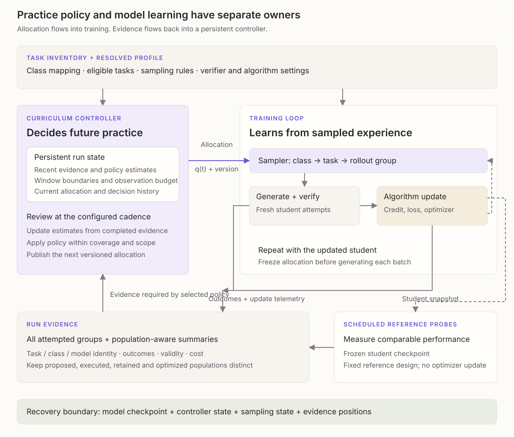

# Adaptive curriculum profiles from task classes

**Theoretical proposal · Draft 23 · 11 September 2026**  
**Status:** research draft for review; public contracts remain proposed.  
**Source checkpoint:** Posttrain revision 3f3fdd95f5aec290b315f1669db08e78895539fe.  

## 1. The hidden cost of a fixed mixture

### 1.1 Average reward can hide missing skills

An LLM trained on a shuffled pool of math problems can show rising average reward while remaining weak at geometry and probability.

Suppose a 10,000-problem collection contains 7,000 arithmetic problems and 1,000 each in algebra, geometry, and probability. Uniform record sampling gives arithmetic 70% of the task budget. An evaluation with the same proportions can improve through arithmetic gains alone:

| Category within the collection | Share of problems | Earlier success | Later success |
| --- | --- | --- | --- |
| Arithmetic | 70% | 60% | 95% |
| Algebra | 10% | 40% | 40% |
| Geometry | 10% | 10% | 10% |
| Probability | 10% | 30% | 30% |
| Overall, weighted by collection share | 100% | 50% | 74.5% |

Overall success rises from 50% to 74.5%, although three categories make no progress. Per-class measurements show which skills improved and which stayed weak.

Class assignments also make coverage explicit. Geometry can receive practice even when the source collection contains few geometry problems. The reference shares should match the intended use; equal shares are one reasonable baseline. Per-task adaptation can work without semantic categories, but it cannot report or preserve category-level coverage by itself.

### 1.2 Classes expose imbalance

Assigning classes and sampling each equally gives every category 25% of the task budget. Separate measurements reveal how the student responds.

Those fixed shares can become poorly matched to training. Arithmetic may be reliably solved, algebra improving, probability inconsistent, and geometry repeatedly unsuccessful. Each still receives the same budget.

The allocation should preserve arithmetic, support algebra while it improves, revisit probability if it regresses, and keep a bounded budget for geometry while the failure mode is diagnosed. Labels make those decisions observable; the controller still has to make them.

The lowest score is not enough. An all-failure group gives vanilla GRPO no relative outcome signal, while sampling only mixed-success problems can neglect coverage. A small controller can combine coverage with observed signal; success and progress measurements then test whether its choices actually help.

### 1.3 Observed outcomes drive allocation

A hierarchical adaptive curriculum adds a persistent controller around training. The controller collects student outcomes, updates class state, and periodically reallocates a bounded share of the budget.

The controller should direct practice toward measured learning opportunities, revisit declining classes, and preserve coverage. Its operating constraints are configurable; current priorities and allocations come from observed outcomes. The proposed sampler favors credible recent progress, stays close to the intended class balance, and reserves exploration. Mixed-group sampling remains a comparison baseline.

The curriculum should be evaluated against a fixed mixture on the same final population and total budget, including observation and controller costs.

Each task has a problem statement, a class, and an outcome checker:

| Class | Concrete task | What counts as success |
| --- | --- | --- |
| Arithmetic | What is 15% of 80? | The answer is 12 |
| Algebra | Solve $3x+5=20$ | The answer is $x=5$ |
| Geometry | A rectangle has perimeter 30 and length 9. What is its area? | The width is 6 and the area is 54 square units |
| Probability | A bag holds 3 red and 2 blue balls. Draw two without replacement. What is the probability both are red? | The answer is $3/10$ |

A class contains varied problems: algebra includes one-step equations and systems of equations. These examples use answer checks; proof or process claims require suitable verifiers.

*Figure 1. The controller owns its evidence window, policy estimates, and allocation; the training loop owns generation and model updates. The selected policy reviews completed evidence at the configured cadence. Training counts support the mixed-group baseline; reference probes support comparable progress measurements. Recovery aligns model, controller, sampler, and evidence state.*

The HTML embeds a [playable mechanism walkthrough](simulations/curriculum-machinery.html) in place of this static diagram. A compact inventory shows task labels, recorded variance, success history, and conditional sampling shares. Colors represent observed state rather than class identity; task hover details include counts and the last observation step. Separate generation, verification, and model-update stages animate inside the training loop. The evidence return records outcomes, refreshes task history, and revises future allocation. Across four illustrated steps, the variance-aware variant reduces extra practice on zero-contrast tasks and revisits them through exploration. Scripted observations illustrate the machinery; consistent success in this example is not a statistical claim of saturation.

## 2. Classes form the sampling tree

The hierarchy is the path the sampler follows to reach a concrete problem. The smallest useful form needs only task classes:

~~~text
Math training population
  ├── class: arithmetic
  │     ├── What is 15% of 80? → repeated student solutions
  │     └── What is 3/4 of 28? → repeated student solutions
  ├── class: algebra
  │     ├── Solve 3x + 5 = 20 → repeated student solutions
  │     └── Solve x + y = 7 and x - y = 1 → repeated student solutions
  ├── class: geometry
  │     ├── Find a rectangle's area → repeated student solutions
  │     └── Find an angle in a circle → repeated student solutions
  └── class: probability
        ├── Draw two red balls without replacement → repeated student solutions
        └── Find the probability of at least one six → repeated student solutions
~~~

The sampler allocates groups across classes, then draws problems within each class.

Broader LLM mixtures can organize those categories into a tree. Every node is still represented internally as a class:

~~~text
Training population
  ├── class: mathematical reasoning
  │     ├── child class: arithmetic
  │     ├── child class: algebra
  │     ├── child class: geometry
  │     └── child class: probability
  ├── class: coding
  │     ├── child class: implementation
  │     ├── child class: debugging
  │     └── child class: test reasoning
  └── class: reading comprehension
        ├── child class: factual retrieval
        ├── child class: inference
        └── child class: summarization
~~~

A category is represented internally as a class. Every node uses this abstraction, whether it represents mathematics, algebra, or linear equations. The manifest records the tree and any explicit budgets. A flat list of classes is sufficient.

A class can also be constructed from two or three stable task dimensions. For example:

~~~text
topic = algebra
skill = linear-equation
response_form = numeric

class_id = algebra / linear-equation / numeric
~~~

Use only `topic = algebra` when finer cells are too sparse. Version the mapping and merge rare combinations where needed.

Initially, assign each task to one sampling class and keep other labels as analysis slices. If tasks can belong to more than one class, normalize path probabilities so multiple labels do not multiply the task's budget.

The manifest stores class identity; run state stores the student's performance, observation windows, and inference conditions.

The minimum input is runnable tasks with stable references, class assignments, and meaningful outcomes. Without outcome evidence, fixed coverage remains possible but performance-driven allocation does not.

## 3. Vanilla GRPO under adaptive sampling

One problem is a task; one generated solution is an attempt. GRPO compares a group of $G$ fresh attempts at the same task under one frozen generating policy. A batch contains $M$ groups. Rewards are normalized within each task's group.

If four attempts fail, succeed, fail, and succeed, the successes receive positive relative credit and the failures negative credit. Identical rewards provide no outcome preference among attempts.

Let $i$ identify the task, $j$ an attempt in its group, and $r_{ij}$ the valid reward for that attempt. First calculate the group's average reward $\bar r_i$, its sample variance $s_i^2$, and the standardized relative advantage $A_{ij}$:

$$
\bar r_i=\frac{1}{G}\sum_{j=1}^{G}r_{ij},
\qquad
s_i^2=\frac{1}{G-1}\sum_{j=1}^{G}(r_{ij}-\bar r_i)^2,
\qquad
A_{ij}=\frac{r_{ij}-\bar r_i}{s_i+\epsilon}.
$$

Here $s_i$ is the sample standard deviation and $\epsilon$ stabilizes division. Each attempt's advantage applies to its sampled policy tokens, following outcome-GRPO in [DeepSeekMath](https://arxiv.org/html/2402.03300v3#S4.SS1.SSS2).

GRPO compares token probabilities under the updated model $\pi_\theta$ and generating model $\pi_{\theta_{\mathrm{old}}}$. Clipping limits the surrogate incentive for large changes; a reference-model penalty discourages drift.

For sampled token $a_{ij\ell}$ at token position $\ell$ with context $h_{ij\ell}$, the probability ratio is:

$$
u_{ij\ell}(\theta)=
\frac{\pi_\theta(a_{ij\ell}\mid h_{ij\ell})}
{\pi_{\theta_{\mathrm{old}}}(a_{ij\ell}\mid h_{ij\ell})}.
$$

Let $T_{ij}$ be the number of eligible policy tokens in attempt $j$, $\varepsilon$ the clipping width, $\beta$ the reference-penalty weight, and $k_{ij\ell}$ the selected token-level KL estimator. The clipped objective, averaged across $M$ groups and their attempts, is:

$$
J_t(\theta)=
\frac{1}{M}\sum_i\frac{1}{G}\sum_j
\frac{1}{T_{ij}}\sum_{\ell=1}^{T_{ij}}
\left[
\min\left(u_{ij\ell}A_{ij},
\operatorname{clip}(u_{ij\ell},1-\varepsilon,1+\varepsilon)A_{ij}\right)
-\beta k_{ij\ell}
\right].
$$

Tools, observations, and padding are excluded from $T_{ij}$ and are not policy targets.

During interval $t$, tasks come from distribution $q_t$. The curriculum changes this distribution while retaining the GRPO update, including constant-reward groups.

When testing adaptive allocation, keep $G$, generation settings, and the learning rule fixed.

## 4. Student performance is measured, not assigned

### 4.1 Repeated attempts reveal usable signal

Start with the base class mixture and sample tasks within each class.

For a four-attempt group, $G=4$:

| Task | Observed rewards | Mean success | Sample variance | Interpretation |
| --- | --- | --- | --- | --- |
| A: calculate 15% of 80 | 1, 1, 1, 1 | 1.00 | 0 | All observed attempts succeeded |
| B: solve $3x+5=20$ | 0, 1, 0, 1 | 0.50 | 1/3 | A mixed group with relative outcome signal |
| C: find the rectangle's area from its perimeter and length | 0, 0, 0, 0 | 0.00 | 0 | All observed attempts failed |

Task B has advantages approximately $[-0.866,0.866,-0.866,0.866]$. Tasks A and C both have zero outcome advantages. A reference-KL term may still contribute to their update, but neither group supplies a task-reward preference.

Four attempts establish neither mastery nor impossibility. Mean and variance must be interpreted together.

For binary success $y_{ij}\in\{0,1\}$ with group mean $\bar y_i$, the sample variance is:

$$
s_i^2=\frac{G}{G-1}\bar y_i(1-\bar y_i).
$$

The sample-variance factor $G/(G-1)$ allows values above the Bernoulli population-variance bound of 0.25.

### 4.2 Variation has two meanings

Two algebra classes can each average 50% success yet offer different learning signals. In X, half the tasks always succeed and half always fail. In Y, every task succeeds independently half the time.

Within-task variation measures differences between attempts at one problem. Between-task variation measures differences between problem success rates. For reward $Y$ in class $c$:

$$
\operatorname{Var}(Y\mid c)=
\mathbb E_{i\mid c}[\operatorname{Var}(Y\mid i)]
+\operatorname{Var}_{i\mid c}(\mathbb E[Y\mid i]).
$$

X has zero within-task variance and between-task variance 0.25; Y has the reverse. Their total variance is identical, but only Y produces mixed outcome groups. These are idealized population patterns, not conclusions from four attempts.

Retain task/group identity to measure within-task variation. Pooled class variance loses that distinction, and finite-sample variance of task means also contains estimation noise.

*Figure 2. The scheduler needs grouped observations as well as class averages and pooled variance.*

### 4.3 Informative groups are counted directly

Report informative groups directly: "80 of 100 groups contained different rewards." For outcome-GRPO, these groups provide a relative reward signal. Mark a group when its reward range exceeds a meaningful threshold:

$$
z_i=\mathbf 1\left[\max_j r_{ij}-\min_j r_{ij}>\tau_r\right].
$$

For binary rewards, use $\tau_r=0$: a group is informative when it contains both success and failure. For continuous rewards, $\tau_r$ is a declared meaningful difference, chosen with verifier noise in mind.

For independent binary attempts with task success probability $p_i$:

$$
\Pr(z_i=1)=1-p_i^G-(1-p_i)^G.
$$

At $G=4$, the probability is 0.875 for $p_i=0.5$, about 0.0394 for $p_i=0.99$, and also about 0.0394 for $p_i=0.01$. Once again, informativeness alone cannot distinguish mastered tasks from unsuccessful ones.

$\Phi_c$ estimates informative-group frequency on the class reference population. It measures available reward contrast, not expected learning gain; noisy verifiers can also produce contrast.

### 4.4 Performance estimates age

Observed performance changes while task identity stays stable:

| Observation window | Successful attempts | Interpretation |
| --- | --- | --- |
| Early training | 2/20 | Low observed success, with uncertainty |
| Later training | 14/20 | Higher observed success; assess comparable evidence before declaring progress |
| Further training | 19/20 | High observed success; not by itself a mastery declaration |
| Long gap since observation | No fresh attempts | Current performance needs reassessment |

Estimate current success from valid attempts in a recent window. Optional age weights emphasize newer observations:

$$
\widehat p_i(t)=
\frac{\sum_{o\in\mathcal W_i(t)}w_o(t)y_o}
{\sum_{o\in\mathcal W_i(t)}w_o(t)},
\qquad w_o(t)\ge0.
$$

Here an observation $o$ is a valid attempt at task $i$, $y_o$ is its success indicator, and $\mathcal W_i(t)$ contains compatible observations in the configured window. Uniform weights give an ordinary success fraction; decreasing weights implement a declared decay policy. If no positive-weight observations remain, the estimate is unavailable, not zero.

Record window boundaries, task/model revisions, inference/verifier conditions, counts, age, and uncertainty. A window spanning checkpoints estimates recent performance; frozen-checkpoint probes estimate the current student. Missing or invalid scores are excluded.

Short windows respond quickly but are noisy; long windows can hide recent change. Decay reduces old evidence's influence without making it fresh. Uncertainty methods must account for weights and dependence; exact unweighted binomial intervals apply only to a compatible probe design (Section 5.4).

Success, variation, progress, coverage, and freshness serve distinct purposes. Compare performance on consistent populations so that a shift toward easier-to-solve tasks cannot appear as learning.

## 5. Evidence for curriculum decisions

The controller should not act on raw averages alone. It needs evidence that answers three questions for each class: how the current student performs, whether that performance is changing, and whether the observations are fresh enough to trust.

Training rollouts provide cheap evidence because they already happen during optimization. They are also biased by the sampler: once the controller changes exposure, the observed tasks no longer represent the original class population. Reference probes repair that problem by measuring the current student on a declared comparison population.

### 5.1 Separate training evidence from reference probes

Training telemetry records every executed group's class, task, policy revision, outcomes, variance, costs, validity, and selection probability.

Reference probes evaluate the current student on a fixed-design class population without updating the model from those rollouts.

Record model, task, verifier, generation, starting-state, and environment conditions. Changes in these conditions or environmental randomness can alter outcomes independently of learning.

Adaptive sampling changes the population represented by training telemetry. Reference probes support comparable progress estimates. Without representative evidence, allocation can remain heuristic, but mastery and saturation remain uncertain.

Three populations have distinct purposes:

| Population | Use |
| --- | --- |
| Adaptive training population | Parameter updates and immediate telemetry |
| Controller reference population | Progression, forgetting, and sampling decisions |
| Final held-out qualification population | Final assessment; never used to tune the controller |

A fixed panel supports paired comparisons; a refreshable portion checks broader coverage and panel-specific overfitting. Both follow declared source-family splits. Repeated attempts at one task do not count as many independent tasks.

### 5.2 Reference-weighted class estimates

Average tasks according to the reference design. Two equally weighted tasks with success rates 100% and 0% give 50%, regardless of how often training revisits the first.

For a uniformly sampled panel $P_c$ of $n_c$ distinct tasks, estimate class success $\widehat\mu_c$, mean within-task variance $\widehat V_c$, and informative-group frequency $\widehat\Phi_c$:

$$
\widehat\mu_c(t)=\frac{1}{n_c}\sum_{i\in P_c}\bar y_i(t),
\quad
\widehat V_c(t)=\frac{1}{n_c}\sum_{i\in P_c}s_i^2(t),
\quad
\widehat\Phi_c(t)=\frac{1}{n_c}\sum_{i\in P_c}z_i(t).
$$

Use declared reference weights for a nonuniform design. Summarize at the task/window level before aggregation so repeated visits do not dominate.

Keep recent-window estimates separate from lifetime exposure counts.

### 5.3 Progress, forgetting, uncertainty

These measurements support evaluation and later controller experiments. The minimal sampler in Section 7 does not combine them into a weighted priority.

An algebra gain from 50% to 65% is 15 percentage points. A gain interval of +5 to +25 supports improvement; −5 to +25 is inconclusive; −15 to −5 supports forgetting.

For comparable observations separated by $L$ decision intervals:

$$
\widehat\Delta_c(t)=\widehat\mu_c(t)-\widehat\mu_c(t-L).
$$

With a matched panel, compute per-task changes:

$$
d_i=\bar y_i(t)-\bar y_i(t-L),
\qquad
\widehat\Delta_c=\frac{1}{n_c}\sum_i d_i.
$$

A simple large-sample interval is:

$$
\widehat\Delta_c\ \pm\
z_{1-\alpha/2}\frac{s_d}{\sqrt{n_c}}.
$$

Use tasks, or source families for related tasks, as the independent units. Small, skewed, or clustered samples need a suitable task/family interval method. Zero sample error in a small all-success panel does not establish certainty.

Let $[L^\Delta_c,U^\Delta_c]$ be that interval. Define bounded progress and forgetting signals:

$$
P_c=\operatorname{clip}\left(\frac{\max(0,L^\Delta_c)}{\delta_P},0,1\right),
\qquad
F_c=\operatorname{clip}\left(\frac{\max(0,-U^\Delta_c)}{\delta_F},0,1\right).
$$

$\delta_P$ and $\delta_F$ are changes large enough to count as full-strength signals. Progress and forgetting are separated rather than counting negative change twice through an absolute-progress term.

Report uncertainty, task coverage, and observation age separately. A wide interval, a narrow sample of task families, and old evidence describe different limitations. The base controller does not compress them into another priority score.

Pointwise confidence intervals do not guarantee validity across repeated adaptive decisions. Predeclare decision frequency and use sequential methods or adjusted error budgets when stronger guarantees are needed.

### 5.4 Binary probes need boundary-aware intervals

Four successes are insufficient to establish 95% reliability. Exact binomial intervals provide one boundary-aware option for a compatible binary probe design.

For a simple reference design, independently draw task occurrences from the fixed class population at a frozen checkpoint and designate the first rollout in each group as the success probe. Those designated outcomes estimate the same population success probability as the all-attempt mean, using less information but a simple Bernoulli observation model. Use exact binomial intervals for that designated success count and for the mixed-group indicators. Report distinct-task/source coverage separately; repeated identities do not increase coverage because another occurrence was drawn.

For $x=n$ successes, the two-sided confidence interval with error level $\alpha$ has lower endpoint $(\alpha/2)^{1/n}$, not 1. For $x=0$, its upper endpoint is $1-(\alpha/2)^{1/n}$. Interior counts use the corresponding beta-distribution quantiles. If the sampling design or dependence assumptions differ, use an interval appropriate to that design instead of calling these exact.

A conservative progress interval is $[L^\mu_{\rm now}-U^\mu_{\rm before},\ U^\mu_{\rm now}-L^\mu_{\rm before}]$, with error budget split between the two success intervals. It does not require independence between the two rounds. Paired task-level methods may be more efficient, but need their own boundary handling.

For 256/256 designated successes, the 95% lower bound is about 0.9857. Two all-success rounds using 97.5% intervals yield a conservative 95% progress interval of about $[-0.0170,0.0170]$, inside a 0.02 flatness band. The probe budget constrains which decisions the evidence can support.

## 6. Interpreting class performance

A class can succeed consistently, improve, stall, or lose previously learned behavior. These descriptions help explain a run. They do not need to become separate control modes with separate sampling thresholds.

Arithmetic with consistently correct answers needs little extra outcome-GRPO practice. Algebra with both correct and incorrect attempts supplies within-group distinctions. Geometry with consistently incorrect answers also supplies little distinction, but remains an unresolved weakness. Coverage keeps both arithmetic and geometry eligible for fresh observations.

Success and progress measurements from Section 5 distinguish those cases. A decline on comparable reference tasks supports a forgetting diagnosis. Missing observations support no performance conclusion. Parent-class reports must show child results: strong arithmetic cannot establish that geometry has been learned.

The base sampler below uses none of these diagnoses as a gate. Mastery thresholds belong to a project's assessment requirements; they should not be required just to choose the next training batch. More elaborate maintenance and stalling rules remain research alternatives.

## 7. Learning progress, balance, and exploration

Start with equal class shares unless the project specifies another base mixture. Give extra practice to classes showing credible recent improvement. As improvement slows, their extra share falls and other productive classes can receive more practice. Preserve exploration throughout: an initially unsuccessful class may become learnable after the student improves elsewhere.

This is a progress-driven scheduling hypothesis. Observed improvement does not prove that practice in the same class caused it; transfer between classes can contribute. The sampler uses a practice-priority estimate, not a claim of causal learning value.

### 7.1 Measuring progress per class

Compare performance on the same reference population under two identified student checkpoints. For class $c$, let $\widehat\mu_c^{\rm old}$ and $\widehat\mu_c^{\rm new}$ be the success estimates. For observations separated by $d_c>0$ completed optimizer steps, estimate progress per step:

$$
\widehat g_c=
\frac{\widehat\mu_c^{\rm new}-\widehat\mu_c^{\rm old}}{d_c}.
$$

The denominator puts comparisons of different durations on a common scale; it does not measure how often the class was trained or establish attribution. Use a bounded comparison span because a long-span average can hide recent change. Section 5 describes comparable populations and uncertainty methods.

If $[L_c^\Delta,U_c^\Delta]$ is an interval for the performance change, define the conservative practice priority:

$$
s_c=\max(0,L_c^\Delta/d_c).
$$

A class receives a positive priority when its evidence supports positive progress. Fresh evidence with insufficient precision produces no positive bonus. Missing evidence is recorded as unavailable and also receives no bonus; this is a sampling fallback, not a measured zero gain. Exploration continues in both cases. Pointwise intervals provide a heuristic decision input; repeated adaptive decisions require sequentially valid methods before making repeated-testing guarantees.

Maintain evidence separately for each class. Retain bounded recent task observations, track distinct tasks or source families, and require two compatible checkpoint estimates for a progress comparison. Record sample amount, coverage, uncertainty, and age separately. Training steps bound evidence age and comparison duration; they never certify class coverage.

The first estimator uses scheduled fixed-design reference observations. Existing compatible evaluations may supply them. Allocate reference opportunities with a rotating class schedule independent of current training shares, accumulating observations across steps and checkpoints with their identities intact. Rotate task draws within classes as well. A short run may end before some classes have usable comparisons; it can still train from the base mixture and any supported priorities.

Training outcomes continue to supply variance and coverage diagnostics. Pooling outcomes from different student checkpoints does not turn them into a current-checkpoint reference estimate.

### 7.2 Allocating extra practice

Let $b(c)>0$ be the base class shares, summing to one. With $C$ classes, the default is $b(c)=1/C$. Choose an adaptive distribution $a_t$ that favors current progress while penalizing large departures from those shares:

$$
a_t=\arg\max_{a\in\Delta_C}
\left\{\sum_c a(c)s_c(t)-\tau D_{\rm KL}(a\|b)\right\},
\qquad \tau>0.
$$

Here $\Delta_C$ is the probability simplex. The temperature $\tau$ controls responsiveness and has the same units as progress per step. The solution is:

$$
a_t(c)=
\frac{b(c)\exp(s_c(t)/\tau)}
{\sum_j b(j)\exp(s_j(t)/\tau)}.
$$

Larger $\tau$ keeps allocation closer to the base mixture; smaller $\tau$ responds more strongly to differences in progress. Its scale must be calibrated to the estimator, not to the total run budget.

Reserve a fraction $\epsilon\in(0,1]$ for exploration:

$$
q_t(c)=\epsilon b(c)+(1-\epsilon)a_t(c).
$$

The resulting distribution is normalized and satisfies $q_t(c)\ge\epsilon b(c)$. Equal priorities return exactly $b$, including when all priorities are unavailable or zero. A class's adaptive odds relative to another are its base odds multiplied by $\exp((s_c-s_j)/\tau)$. These properties follow directly from the rule.

Recompute from recent estimates rather than accumulating a lifetime progress score. Early success must not permanently lock in a large share. Neither $\tau$ nor $\epsilon$ is scheduled as a fraction of the run remaining.

### 7.3 How allocation corrects itself

Algebra may initially improve quickly and attract extra practice. As its progress slows, that preference weakens. Geometry still receives exploration and can attract more practice if it begins improving. Several classes can improve together; there is no required sequence of promotions or saturation states.

When all progress vanishes, allocation returns to the base mixture. Success estimates distinguish classes that are solved from those that are stalled. Zero progress alone establishes neither mastery nor impossibility.

The learning algorithm changes model weights; fresh outcomes then change progress estimates and sampling. The sampler is one part of this feedback loop. Negative progress remains visible as a forgetting diagnostic. The positive-progress rule does not automatically boost a declining class: its exploration share provides opportunities for recovery, but explicit retention protection would require a separately evaluated extension.

### 7.4 Variable run lengths and convergence

The rule is anytime: it uses completed evidence and current state without needing a final training budget. With identical initial conditions, random draws, and observation schedules, runs follow the same prefix until one stops. A longer run continues that process. Changing the per-step batch size or observation schedule changes the experiment; prefix equivalence applies to changing the stopping point alone.

For fixed positive $b$ and $\epsilon$, the probability of omitting class $c$ from the next $n$ categorical group draws is at most

$$
(1-\epsilon b(c))^n.
$$

This follows by conditioning on the history at each draw; independence of the evolving allocations is unnecessary. It implies repeated class sampling almost surely in an indefinitely continuing run. It does not promise coverage within a short run or successful learning.

One sufficient learning model illustrates the additional assumptions. Suppose class error after its $m$th valid practice group is $e_c(m)\ge0$, every such group contracts it by a fixed factor $0<r_c<1$, and updates on other classes never increase it. Then $e_c(m)\le r_c^m e_c(0)$; if sampled groups yield infinitely many valid practice groups, continued coverage implies $e_c\to0$. This is a conditional argument, not a property established for GRPO or neural networks. Fixed balancing would also converge under these assumptions. The adaptive sampler must earn its value through faster learning at finite stopping points.

Impossible classes, interference, unreliable observations, and updates with no useful gradient can violate these assumptions. The allocation guarantees survive; a model-convergence guarantee does not.

### 7.5 Classes and tasks

The first progress policy adapts leaf-class shares and holds task sampling fixed within each leaf:

$$
q_t(i)=q_t(c(i))b(i\mid c(i)).
$$

A class tree organizes the population; parent probabilities are sums of descendant leaf probabilities. Two or three category dimensions can construct class IDs without adding controller stages. Sparse combinations may require a coarser mapping.

The framework can also support task-only and combined adaptation through compatible policies. Those policies must define task evidence, conditional coverage, and corrections for a changing within-class population. They are separate experiments from this class-level rule; unsupported scopes must be rejected explicitly.

### 7.6 Variance-aware class and task selection

The walkthrough also shows a separate signal-seeking variant: repeated zero-contrast tasks lose extra practice, other tasks receive more, and exploration later revisits the original tasks with the updated student. This variant adapts both classes and individual tasks. It is an alternative to the progress priority, not an implicit behavior of the class-only progress policy.

For binary rewards in a group of size $G$, use the normalized empirical within-task variance $z_i=4G^{-1}\sum_j(r_{ij}-\bar r_i)^2$. It lies in $[0,1]$; all-success and all-failure groups both give zero, while a half-success group gives one. For vanilla outcome GRPO, constant rewards give zero outcome-relative advantage, although KL or other groups can still affect the model update. Variance across different tasks is not a substitute for this statistic.

Let $h_i$ average fresh valid group scores for task $i$. Estimate each class score with fixed within-class task weights, $s_c=\sum_{i\in c}b(i\mid c)h_i$, so repeatedly selecting one task does not itself inflate the class score. Adequate representative evidence is required; unavailable scores are not observed zeros. With insufficient support, use the base distribution at that selection level.

When scores are available and their sum is positive, allocate classes and tasks using the same rule at each level:

$$
q(c)=\epsilon b(c)+(1-\epsilon)\frac{b(c)s_c}{\sum_d b(d)s_d},
\qquad
q(i\mid c)=\epsilon b(i\mid c)+(1-\epsilon)\frac{b(i\mid c)h_i}{\sum_{j\in c}b(j\mid c)h_j}.
$$

All-zero scores return the corresponding base distribution. The two floors compose: $q(i)\ge\epsilon^2 b(c(i))b(i\mid c(i))$. Revisit opportunities persist across steps; no fixed revisit deadline follows from a probability floor. Expire stale evidence, gather fresh groups, and update scores before changing future probabilities. Do not discard and refill a generated zero-contrast group under the vanilla-GRPO example.

In the scripted example, Geometry's share is 25% and geometry/001 has 10% within Geometry, giving 2.5% overall. Later comparable evidence shows renewed variance, raising the shares to 45% and 63.3%, or about 28.5% overall. These values illustrate the rule, not measured learning. Persistent verifier noise can also attract this policy; progress and success measurements must test whether its extra practice helps.

## 8. Training loop with controller state

The controller retains its evidence window, policy-specific estimates, current allocation, and remaining observation budget across optimizer steps. Each batch uses an allocation computed before its outcomes were observed. Evidence accumulates after every batch; allocation changes only at the configured review cadence.

~~~text
Resolve the profile defaults and explicit controller overrides.
Initialize class and task shares from the resolved base mixture.

For each training batch:
  1. Freeze the current class allocation.
  2. Draw classes, then tasks using the resolved adaptation scope.
  3. Generate fresh same-task groups with the current student.
  4. Record every attempted group; exclude invalid scores from estimates.
  5. Apply the independently selected learning algorithm.
  6. Update per-class evidence records; retain checkpoint identity, counts,
     coverage, uncertainty, and age.
  7. When review is due, compute supported recent progress priorities.
     Use zero bonus for unavailable comparisons; calculate the next allocation.
     Enforce coverage and scope constraints before publishing it.
  8. Save the allocation, evidence window, and sampling state.

On the reference-observation schedule, at the configured rate:
  Measure class success and progress on the reference population.
  Make completed measurements available to policies that consume them.
  Report weaknesses, forgetting, uncertainty, and evidence health.
~~~

For the initial GRPO example, each batch has $M$ task groups and $G$ fresh attempts per group. Categorical class draws have expected counts $Mq_t(c)$; a probability floor does not promise that every class appears in every batch. Small classes or short runs may receive too little coverage to draw conclusions.

The learning algorithm owns advantages, normalization, clipping, KL, and any declared retention behavior. The controller changes future draws. It does not refill constant-reward groups or reweight their gradients.

Reference probes have a separate, counted budget and never reuse historical outcomes as fresh measurements. Resume restores controller and sampling state consistently with the model checkpoint. Observation-only profiles record the same available evidence while retaining their existing sampling behavior.

## 9. Allocation and simulation

[Play the adaptive learning simulation](simulations/adaptive-learning-player.html)

The HTML reading copy embeds this player. Play, pause, step forward, or scrub through the history. Compare learning, an unlearnable class, and sudden regression; increase the exploration reserve to 100% to see fixed equal sampling. The animation uses idealized reference observations and assumed learning curves, not measured LLM results. Its assumptions are available below the controls.

### 9.1 Progress shifts the class mixture

Suppose all four math classes start with equal shares. Their conservative progress priorities divided by temperature are $(0,1,0,0.5)$ for arithmetic, algebra, geometry, and probability. These are dimensionless relative priorities, not success rates. The adaptive shares are proportional to $(1,e,1,e^{0.5})$, or approximately $(0.157,0.427,0.157,0.259)$. With a 20% exploration reserve, the training shares are approximately $(0.176,0.392,0.176,0.257)$.

Algebra receives extra practice while geometry retains opportunities despite no supported progress. If algebra's priority later falls to zero and probability stays at 0.5, the shares become approximately $(0.222,0.222,0.222,0.334)$. If every priority reaches zero, all shares return to 25%. These are arithmetic illustrations of the new rule, not simulation results.

### 9.2 Mixed-group baseline

For this earlier baseline, weights are $v_c=\epsilon+(1-\epsilon)\widehat\Phi_c$ and shares are proportional to $b(c)v_c$. Suppose the recent mixed-group frequencies for arithmetic, algebra, geometry, and probability are $(0.02,0.80,0,0.80)$. With equal base shares and $\epsilon=0.2$:

$$
v=(0.216,0.840,0.200,0.840),
\qquad
q=v/2.096\approx(0.103,0.401,0.095,0.401).
$$

A 40-group batch therefore has expected counts of approximately 4.1, 16.0, 3.8, and 16.0. Geometry retains coverage despite zero mixed groups. Arithmetic's high success and geometry's failure remain visibly different in the performance report even though both receive little extra practice.

If arithmetic's frequency rises to 0.60 after a performance decline, its next share becomes approximately 26.6%, assuming the other frequencies remain unchanged. Recovery depends on observing that change; the controller cannot react before the evidence arrives.

### 9.3 Existing baseline simulations

The [simulation script](simulations/curriculum_feedback.py) compares fixed class balancing with the earlier mixed-group rule under equal generation budgets. It does not implement or validate the progress-driven sampler in Section 7. Each run uses four classes, 200 batches, 40 groups per batch, and four attempts per group: 32,000 generated attempts. Forty seeds are used per scenario. The simulator evaluates the mean of the four latent class success probabilities; those probabilities are never given to the sampler.

The assumed learning law increases a learnable class's success probability in proportion to the number of mixed groups and its remaining headroom. This favors signal-based sampling by construction. Two exceptions deliberately break the assumption: an impossible class and a class with irreducible 50% success. Other cases start a class near perfect success, abruptly reduce a class's success halfway through training, or remove one class's verifier scores temporarily. Invalid attempts still consume budget.

| Scenario | Fixed final success | Adaptive final success | Difference, percentage points |
| --- | --- | --- | --- |
| All classes learnable | 99.26% | 99.27% | +0.01 |
| One class already mastered | 99.37% | 99.42% | +0.05 |
| Abrupt forgetting | 99.13% | 99.17% | +0.03 |
| One impossible class | 74.54% | 74.57% | +0.02 |
| One irreducibly random class | 87.04% | 86.78% | −0.26 |
| Temporary verifier outage | 99.21% | 99.20% | −0.01 |

Differences use unrounded means. [Full results](simulations/curriculum_feedback_results.json) include seed variation, late class shares, and a sweep over three coverage strengths and three window lengths.

These results do not establish a training advantage. Most learnable classes approach the simulator's ceiling under either policy. The noise case demonstrates wasted allocation; the outage case tests missing-evidence behavior, not operational recovery. The simulator has no neural network, gradient interference, task heterogeneity within a class, token costs, or learned verifier.

The candidate is small enough to test and falsify. Before choosing it as a default, compare learning curves and cost to target in real runs, include abrupt all-failure collapse and misleading verifier signals, and test whether a progress-driven alternative improves outcomes across seeds. Tune on separate scenarios and evaluate at matched total cost, including reference probes.

## 10. What a profile specifies

The profile selects a controller policy with defaults. Users can adjust its operating controls without rewriting its decision rule. The controller computes current priorities and probabilities; the user specifies the task population, intended coverage, adaptation scope, and resource constraints.

Selecting a manifest and controller is enough to use the preset. The following expanded example shows the optional overrides, using the proposed progress policy:

~~~yaml
profile:
  extends: olmo@<revision>
  curriculum:
    manifest: math-tasks@<immutable-revision>
    controller: class-progress@1
    mode: adaptive
    base_mixture: uniform-classes
    scope: classes
    coverage_reserve: 0.20
    response_temperature: <preset-value-in-progress-per-step-units>
    evidence: class-reference-progress@1
    update_every_batches: 1
    reference_observation:
      schedule: rotating-classes@1
      attempts_per_training_step: <preset-value>

algorithm:
  id: grpo
  math_revision: <compatible-explicit-revision>
~~~

This is proposal notation, not an existing framework schema. The preset supplies estimator requirements, response temperature, and observation rate; these require calibration before adoption. The 20% reserve is illustrative. Evidence settings distinguish per-class observation limits and minimum coverage from maximum age and comparison span. Insufficient evidence falls back to exploration and base allocation without blocking training. An existing compatible evaluation schedule can supply reference observations; their cost must still be counted. No final run length is needed.

The controller controls have distinct purposes:

| Control | Meaning and default behavior |
| --- | --- |
| Mode | Fixed, observe-only, or adaptive; observe-only preserves the inherited sampler |
| Base mixture | Manifest weights unless overridden; uniform classes and explicit project weights are supported choices |
| Coverage reserve | Minimum protected share relative to the base mixture; the baseline uses $\epsilon=0.2$ |
| Adaptation scope | Classes, tasks, or both, subject to policy support; the progress policy starts with classes |
| Evidence policy | Per-class sample support, uncertainty, maximum age, and comparison span; age alone does not establish coverage |
| Response temperature | How strongly progress differences change allocation; resolved in progress-per-step units |
| Update cadence | How often new allocations are published; the baseline uses every completed batch |
| Observation rate | Reference opportunities per completed training step, independent of the intended stopping point; optional resource caps preserve explicit insufficient-evidence fallback |

The coverage reserve is a probability guarantee, not an exact fraction of realized batches. In the progress policy, $q(c)\ge\epsilon b(c)$; the adaptive component can provide additional coverage. At both adaptation levels, policies must explain how conditional reserves compose into task probabilities.

Defaults resolve in order: manifest population and weights, inherited profile settings, controller preset, then explicit compatible overrides. Observe-only mode rejects sampling overrides that would change the inherited behavior. Record the final values and their provenance with the run. A numerical override changes the resolved configuration identity; a different formula or evidence interpretation changes the policy version.

Advanced policy-specific controls may include estimator choice, uncertainty treatment, allocation change limits, or cost sensitivity. Each must have a defined effect and a reason to exist. They are optional research controls rather than a required checklist. A controller cannot accept a setting and silently ignore it.

Generation budgets, group size, verifier retries, and model-update mathematics retain their existing owners. Project success thresholds govern assessment and stopping. They become controller inputs only when the selected decision policy explicitly uses them.

Selection, sampling, and evidence tracking remain usable without this controller. An OLMo-style extension must preserve its declared retention semantics and expose both proposed and retained populations. An SFT profile can track classes and coverage, but cannot use a mixed-outcome controller without suitable fresh grouped evaluations. Compatibility should be explicit.

## 11. Profiles and algorithms remain separate

A run combines a practice profile with a learning algorithm. The profile determines which tasks are eligible, how they are sampled, and which evidence the controller maintains. The algorithm determines how generated experience changes model parameters.

| Layer | Responsibility | Math example |
| --- | --- | --- |
| Data selection | Define the eligible population and class mapping | Use the training split; group problems by topic; exclude held-out families |
| Sampling | Allocate groups across classes and choose tasks | Begin with equal quotas, then apply bounded evidence-driven shares |
| Evidence | Preserve task-group outcomes and estimate current behavior | Separate variation across solutions to one problem from differences across problems |
| Profile | Configure compatible selection, sampling, evidence, retention, and controller policies | Add class adaptation to a vanilla or OLMo-style profile |
| Algorithm | Define reward transformation, advantages, loss, normalization, clipping, and credit | Vanilla GRPO or an explicitly named weighted-GRPO variant |

*Figure 3. Selection, sampling, and evidence are reusable framework capabilities. A profile configures them; the learning algorithm remains separately identifiable.*

### 11.1 Shared capabilities

Profiles compose shared selection, sampling, and evidence capabilities with an optional versioned controller.

Evidence requirements depend on the learning rule; SFT needs separate rollouts to supply outcome-GRPO statistics.

### 11.2 Profile extensions preserve algorithm identity

Select class-adaptive profile + GRPO, or add class adaptation to an OLMo-style profile while retaining its resolved learning rule.

Adaptive exposure changes the training population. Keeping advantages, clipping, masks, and KL unchanged preserves the learning rule, but does not make the resulting training equivalent to a fixed mixture.

The shared sampler chooses candidates before generation. Active retention may filter groups after outcomes arrive. Track both populations; retained-only statistics can hide constant-reward groups.

If ten algebra and ten geometry groups yield eight retained algebra groups and two geometry groups, a 50/50 proposal becomes an 80/20 update population. Report both shares and all generation costs. One owner enforces the resolved refill bound.

Extensions declare their scope, overrides, and compatibility with base retention and mathematical settings. The resolved profile exposes the resulting behavior.

### 11.3 Weighted updates are algorithm variants

Weighting each algebra group's update changes the gradient even for an unchanged batch. This requires a separately identified algorithm variant.

For example, doubling a group's clipped policy contribution while leaving KL unchanged changes its relative penalty. Apply a class coefficient after normalization:

$$
\widetilde A_{ij}=h_c(t)A_{ij},\qquad h_c(t)>0.
$$

For example, choose history-only bounded coefficients:

$$
h_c(t)=h_{\min}+(h_{\max}-h_{\min})
\operatorname{clip}(v_P P_c+v_F F_c,0,1).
$$

All members of a group share the coefficient; it is frozen before the batch and is not differentiated through. The weighted surrogate is:

$$
J_t^{\rm weighted}=
\frac1M\sum_i
\left[h_{c(i)}(t)\,L_i^{\rm clip}(\theta)
-\beta K_i(\theta)\right].
$$

$L_i^{\rm clip}$ is the group-averaged clipped policy term from Section 3 and $K_i$ its group-averaged KL term. This variant changes the update, so it must have an explicit algorithm identity and independent validation. Scaling rewards before normalization would generally cancel; this formula deliberately operates afterward.

For a frozen controller and finite population, the expected policy term becomes:

$$
\sum_i q_t(i)h_{c(i)}L_i
=Z_t\sum_i q'_t(i)L_i,
\quad
q'_t(i)=\frac{q_t(i)h_{c(i)}}{Z_t},
\quad
Z_t=\sum_i q_t(i)h_{c(i)}.
$$

Thus much of the weighting resembles further resampling plus a scale change. Combining it with adaptive sampling can double-emphasize the same class. Keeping KL unweighted also changes relative KL pressure by class. Finite batches, optimization, and the KL population prevent treating the full procedures as automatically identical.

Evaluate this weighting with the data profile held fixed to test whether it adds value beyond sampling.

## 12. Transfer to other algorithms

The controller consumes a declared evidence summary and proposes exposure. The chosen algorithm owns data eligibility, its learning signal, and any internal admission/filtering.

| Algorithm or existing recipe | Reusable curriculum parts | Signal or constraint that differs |
| --- | --- | --- |
| SFT | Class allocation, coverage, progress, rehearsal | Requires accepted targets; use validation improvement and declared loss summaries, not outcome variance as a substitute for learning signal |
| DPO | Class/pair exposure, coverage, held-out progress | Requires genuine preference pairs; one correct answer is insufficient |
| GRPO | Full base recipe | Fresh same-task groups and chosen group normalization |
| DAPO | Outer class/task allocation | Internal dynamic sampling changes which proposed groups are retained |
| OLMo3 profile in current code | Shared selection, outer exposure, and evidence history | Preserve declared active retention; identify normalization separately in the resolved learning rule |
| GDPO | Class allocation and structured evidence summaries | Independent reward-component normalization; scalar total variance can hide useful component variation |
| SAMPO | Class allocation and competence/rehearsal | Hierarchical episode/turn credit needs native state and turn identity |
| CAPO | Exposure and task competence | Requires critiques aligned to current sampled tokens; local error evidence differs from outcome variance |
| On-policy distillation | Task allocation and probe-based progress | Requires fresh student trajectories and compatible teacher token scores |

The progress policy requires comparable class-performance measurements, independently of the learning rule. Its transfer across algorithms still needs evaluation. The mixed-group comparison baseline additionally requires meaningful grouped outcome contrasts. Required evidence cannot be replaced by a metric with a different interpretation.

Every profile should report proposed groups, executed groups, valid groups, retained groups, and optimized groups. If class $c$ is proposed with probability $q(c)$ and retained with probability $a(c)$, its approximate retained share under a stationary acceptance model is:

$$
q_{\rm retained}(c)=
\frac{q(c)a(c)}{\sum_{c'}q(c')a(c')}.
$$

Real retention may depend on the individual task and outcome; this class-level formula is an explanatory approximation. It shows why an outer 20% share does not guarantee 20% of updates after inner filtering.

[DAPO](https://arxiv.org/abs/2503.14476) supplies the relevant algorithmic distinction. Its dynamic sampling should not be silently added to the vanilla-GRPO baseline. Bounded invalid-evidence admission and reward-based filtering are different operations.

On-policy trajectories do not imply an unchanged task objective. Adaptive exposure optimizes on $q_t$, while final assessment may target $\rho$. Correcting the task distribution would require explicit importance weights such as $\rho(i)/q_t(i)$ under adequate support and the actual sampling law. The base curriculum does not include that correction, and it does not solve outcome-dependent retention automatically.

## 13. Merits and limits

Class-based control can preserve coverage, reduce repeated work on mastered classes, and detect forgetting using student evidence alone.

The main limitations:

- Variation is not causal learning value. Mixed rewards can come from stochastic tools, verifier noise, or reward gaming.
- Progress attribution is incomplete. Improvement in class A may come from training class B. A class-specific gain-per-cost score is a heuristic unless interventions establish attribution.
- The controller changes its own observations. Without representative reassessment, success and progress estimates can become artifacts of sampling.
- Sparse-reward failure remains possible. A student with no successful trajectories may need different supervision, budgets, or task scaffolds; sampling alone does not guarantee escape.
- Class boundaries can be poor. Broad classes can hide heterogeneous tasks; fine classes can make estimates too sparse. More dimensions are not automatically better.
- Control can oscillate. Fast reweighting, stale evidence, and noisy saturation tests can cause repeated promotion and demotion.
- Probe cost can exceed savings. Statistical confidence, breadth, and cheap operation are a tradeoff.

Learning-progress and forgetting-based scheduling have precedent in [Teacher-Student Curriculum Learning](https://arxiv.org/abs/1707.00183). Its teacher is a selection mechanism, not a required large language model. That supports the separation here, without proving gains in these environments.

A useful sequence of comparisons is:

| Comparison | What it isolates |
| --- | --- |
| Uniform tasks vs fixed class balancing | Whether semantic balancing helps at all |
| Fixed class balancing vs adaptive classes | Value of the outer controller |
| Adaptive classes vs adaptive classes and tasks | Value of the second selection level |
| Informativeness-only vs competence/progress/coverage controller | Whether richer state avoids zero-variance and noise traps |
| Controller with/without reference probes | Bias control versus probe expense |
| Same adaptive profile with GRPO vs the optional weighted-GRPO variant | Whether modifying credit adds beyond sampling |
| Short vs long observation windows; uniform vs age-decayed history | Responsiveness, uncertainty, and stale-evidence effects |
| Later: identical base recipe with/without teacher enrichment | Incremental teacher value |

Use a fixed final task population, repeated seeds where feasible, and separate per-class outcomes. Compare both final performance at matched total cost and cost to reach a predeclared target. Include failed attempts, discarded groups, probes, verification, and all optional teacher work.

For claims about a broad parent class, retain critical-child requirements. A rising training reward, a higher fraction of mixed groups, or a lower loss is not by itself successful curriculum learning.

## 14. Curriculum manifest

A separate preparation job publishes a curriculum manifest containing task references, class assignments, optional parent-child mapping, splits, and evidence compatibility. The provisional operation name is `data.prepare_curriculum`.

In the class-only path:

~~~text
Existing tasks + class mapping
    → validate inventory, identities, splits, and class coverage
    → publish immutable curriculum manifest
    → many training runs initialize their own student state
~~~

Existing valid class assignments allow deterministic indexing and validation without teacher generation.

Three objects remain separate:

| Object | Changes when |
| --- | --- |
| Immutable manifest/data release | Task source, class mapping, splits, targets, or published enrichment changes |
| Versioned recipe/controller policy | Sampling rules, thresholds, signals, or compatibility changes |
| Run-owned student state | The student produces outcomes and the controller makes decisions |

Student pass rates and saturation flags do not mutate the shared release. Two students can use the same manifest and derive different curricula.

The manifest covers the task inventory, including unresolved tasks. It may reference an SFT dataset when accepted existing demonstrations are present. Class labels alone do not create SFT targets.

Publication records source identities, output digests, producer run, class coverage, missing fields, and compatibility. An interrupted preparation can retain work, but cannot present an incomplete release as complete. The system should reuse the existing dataset materialization manifest for content identity and native traces for execution evidence rather than create duplicate stores.

## 15. Teacher enrichment

A teacher can add verified demonstrations, annotations, or task variants to the prepared data.

### 15.1 Teacher labels are provenance

External labels and other models' measurements remain provenance. They neither initialize student success estimates nor control allocation. Teacher outcomes describe that teacher's conditions.

Calibrate the actual student after preparation or SFT. Classes and accepted targets are reusable; performance estimates belong to the student's run.

### 15.2 Teacher generation as data preparation

When teacher generation is useful, extend preparation:

~~~text
Original task
    → one selected teacher attempts it in the declared environment
    → acceptance is checked
    → accepted solution and native trace are retained
    → optional retrospective metadata and training projections are created
    → a new immutable release is published
~~~

One teacher can solve and annotate in separate recorded calls. Prefer independent acceptance checks; self-verification can repeat the solver's errors.

Teacher outputs may add demonstrations, observed operations, candidate dependencies, resource profiles, or independently validated task variants. A retrospective outline is an interpretation of a solution, not verified internal reasoning or a proven prerequisite graph.

Budget repeated teacher attempts explicitly. One accepted solution supplies a demonstration, not a pass-rate curve or p90 cost estimate. Retain failures for audit; validate any use as preference negatives.

### 15.3 Teacher outputs enter declared channels

| Enrichment | Entry point |
| --- | --- |
| Accepted demonstrations | Optional SFT before the online curriculum |
| Suggested operations or dimensions | A revised class mapping, evaluated against the simpler mapping |
| Candidate prerequisites | Soft exposure preferences or explicit scaffold experiments |
| Resource profile | Later cost diagnostics or a compatible cost objective |
| Validated variants | Expanded task inventory with inherited source-family split |

Teacher-selected passages, intermediate answers, and solution summaries must not leak into ordinary student rollouts. Supplying them creates a declared scaffolded task. Derived tasks require their own usable input and target/verifier, and remain in the source family's split.

Saved teacher completions can support SFT; they are not fresh student trajectories for GRPO or on-policy distillation. Student history still begins with calibration of the actual starting model, including after SFT.

## 16. Reliability before efficiency

High success can leave room for lower resource use. Measure efficiency as an additional objective with its own progress criteria.

Efficiency can use a project budget, frozen successful student history, or optional compatible teacher evidence. It does not require a teacher. Choose costs appropriate to the task: unnecessary tool calls, generated tokens, or another measurable operating burden. Final-answer length is not a substitute for completeness.

For binary acceptable outcomes, a bounded scalar example is:

$$
R=g(1+\lambda E),\qquad
g\in\{0,1\},\quad E\in[-1,1],\quad0\le\lambda<1.
$$

Every accepted rollout then has a greater raw reward than a valid failed rollout. This is a raw-ordering guarantee, not a guarantee that training retains accuracy.

When every rollout succeeds, group standardization can cancel $\lambda$:

$$
A_j=
\frac{\lambda(E_j-\bar E)}
{\lambda s_E+\epsilon}
\approx\frac{E_j-\bar E}{s_E}.
$$

Thus turning a coefficient from zero to a small positive value can introduce a substantial normalized signal. This issue is analyzed in [Training Language Models to Reason Efficiently](https://arxiv.org/html/2502.04463v1#S5.SS4). Efficiency activation needs an algorithm-specific experiment; confidence that "the bonus is only 10%" is not enough.

GDPO additionally normalizes components before weighting. A signed gated cost channel can rank a failed rollout at zero above an inefficient accepted rollout with a negative component. Nonnegative gated utility avoids that particular reversal, but does not guarantee priority in the combined normalized update. The [GDPO paper](https://arxiv.org/html/2601.05242v1#S3.SS2) discusses component weighting and conditioned rewards.

Freeze cost references before the interval using them. Record tokenizer and measurement conventions; unavailable reasoning-token counts remain unavailable. Teacher cost is an observed strategy, not an optimum that the student must match.

Report quality and cost independently on a fixed population, including costs of failed attempts. A model that fails expensive cases can look cheaper among its successes. Add separate cost-progress criteria if defining efficiency saturation; preserve the original success criteria.

## 17. Framework boundaries and decisions

Selection, sampling, and variance tracking should be shared framework capabilities configured by profiles. Runs record the resolved profile and a separate algorithm revision. These contracts require approval before implementation.

| Existing boundary | Role in this proposal |
| --- | --- |
| Environment binding | Own task meaning, class exposure, task resolution, and verification |
| Standard job composition | Wire preparation and compatible curriculum/training selections |
| Data materialization | Publish immutable inventories and optional supervised/preference projections |
| Shared selection, sampling, and evidence capabilities (proposed) | Resolve eligible populations, allocate exposure, and calculate population-aware grouped statistics |
| Profile composition (proposed) | Reuse or extend these capabilities with visible overrides and compatibility constraints |
| Training algorithm | Own fresh-trajectory requirements, normalization, clipping, and credit |
| Run evidence | Retain actual outcomes, controller state, and allocation history |
| Observatory | Explain the decisions through read-only views |

The public GRPO input remains the environment. A curriculum manifest must not silently become a second public prompt-dataset seat. A future implementation must establish a compatible way for the environment-owned task population to honor the allocation policy.

The current source includes separate dynamic/active group-sampling settings for DAPO and OLMo3, as well as structured reward paths. Their presence is useful evidence of boundaries, not proof that this controller is implemented or that every combination is qualified.

Relevant sources at the inspected checkpoint:

- [Canonical workflow](../../post-training/01-workflow.md), [primitives](../../post-training/02-primitives.md), and [work/evidence](../../post-training/03-work-and-evidence.md).
- [Framework ownership](../../post-training/04-framework.md), [public APIs](../../post-training/05-apis.md), and [observation/lineage](../../post-training/06-observation-and-lineage.md).
- [Training profiles](../../../packages/train/src/posttrain/train/profiles.py), [structured advantage construction](../../../packages/train/src/posttrain/train/reward_advantages.py), and [standard jobs](../../../packages/jobs/src/posttrain/jobs/definitions.py).
- [Dataset materialization](../../post-training/dataset-management.md) and [native-trace-to-SFT projection](../../../packages/data/src/posttrain/data/adapters/verifiers.py).
- [GDPO/CAPO plan](../../plan/gdpo-capo-dual-backend-support.md), whose qualification boundaries remain separate from this proposal.

Before implementation, resolve:

1. Adopt selection, sampling, and variance tracking as reusable framework capabilities, with class-only metadata as the minimum categorization.
2. Separate the resolved profile from algorithm identity; select the initial base/reference distributions and fixed-$G$ profile with vanilla GRPO.
3. Test the minimal controller against fixed balancing and a learning-progress alternative at matched total cost; select numerical defaults only after sensitivity and failure-case evaluation.
4. Keep within-class sampling fixed in the first experiment; evaluate task adaptation separately.
5. Evaluate the sampling-profile extension, including compatibility with existing profiles, before adopting a separate update-rule algorithm variant.
6. Add teacher preparation and efficiency only as measured extensions; keep current student performance grounded in its own observations.

Any new public contract or preparation job requires a canonical-baseline amendment before implementation.

## Appendix A. Notation reference

| Symbol | Meaning |
| --- | --- |
| $c$ | A task class; $c_0$ denotes a parent class in an aggregate calculation |
| $i$ | A concrete task, including its relevant starting state |
| $j$ | An attempt within a same-task group |
| $\ell$ | An eligible sampled-token position |
| $t$ | A curriculum decision interval |
| $k$ | An optimizer step; $\theta_k$ is the student state at that step |
| $M$ | Number of task groups in a training batch |
| $G$ | Number of fresh attempts at the same task in one group |
| $r_{ij}$ | Valid task reward for attempt $j$ at task $i$ |
| $y_{ij}$ | Binary success indicator for that attempt |
| $q_t$ | Training-task distribution frozen for curriculum interval $t$ |
| $b$ | Fixed base distribution used for coverage and fallback |
| $\rho$ | Fixed reference population or its normalized weights |
| $\widehat\mu_c$ | Estimated success for class $c$ on the reference population |
| $\widehat V_c$ | Estimated mean within-task reward variance for class $c$ |
| $\widehat\Phi_c$ | Estimated frequency of informative, nonconstant groups in class $c$ |
| $\widehat\Delta_c$ | Estimated change in class performance across comparable observations |
| $P_c,F_c$ | Bounded progress and forgetting signals for the optional algorithm experiment |
| $\epsilon$ | Coverage parameter; the candidate experiment uses 0.2 |
| $v_c$ | Bounded class weight in the earlier mixed-group baseline |
| $s_c$ | Conservative recent progress per optimizer step, used as practice priority |
| $\tau$ | Response temperature, in the same units as practice priority |
| $a_t$ | Adaptive class distribution before mixing in reserved exploration |
