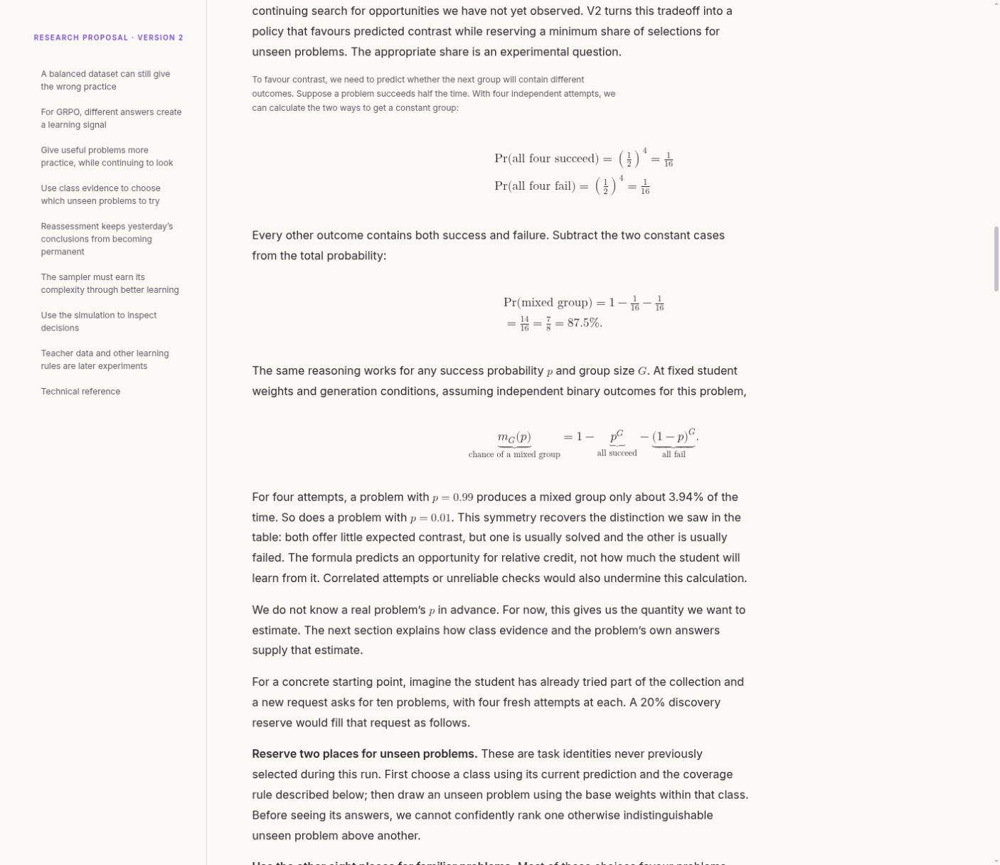
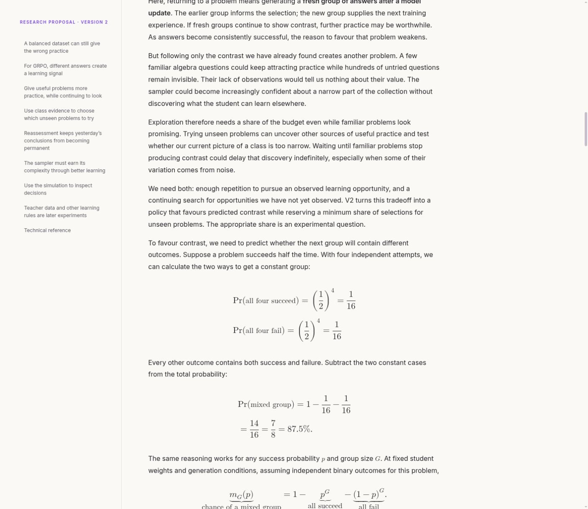
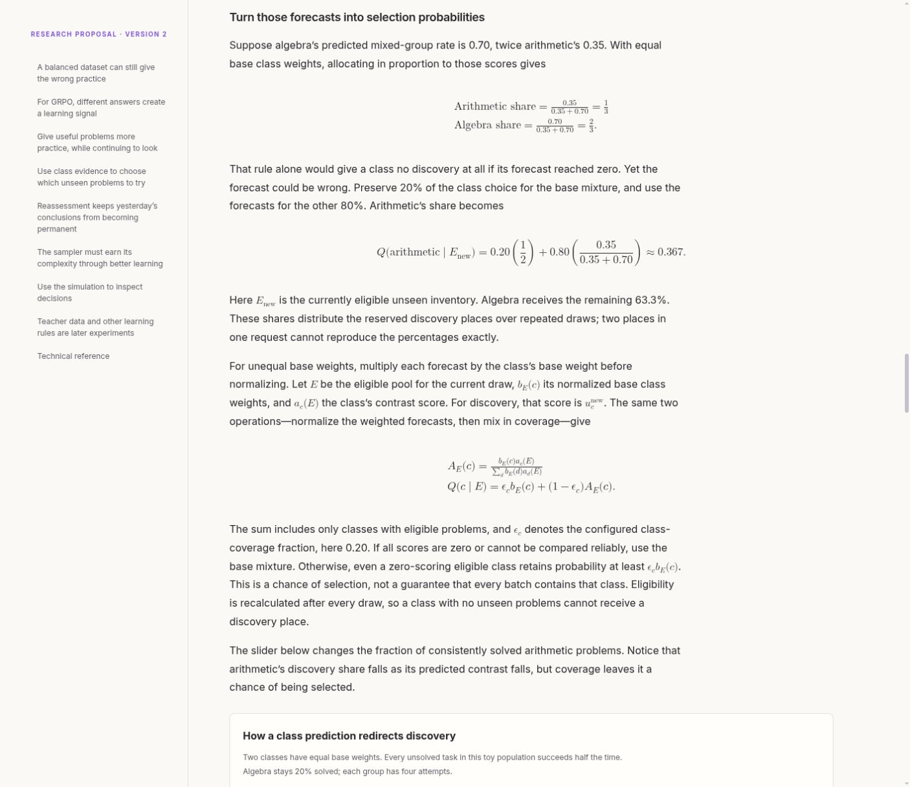
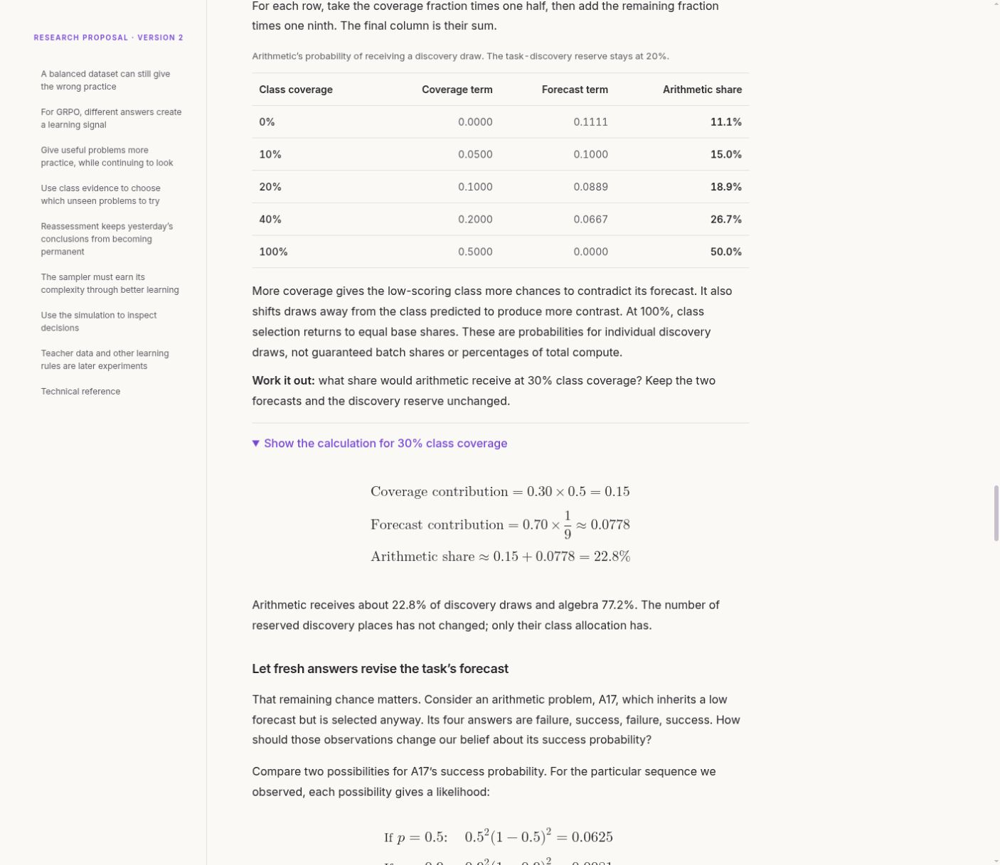
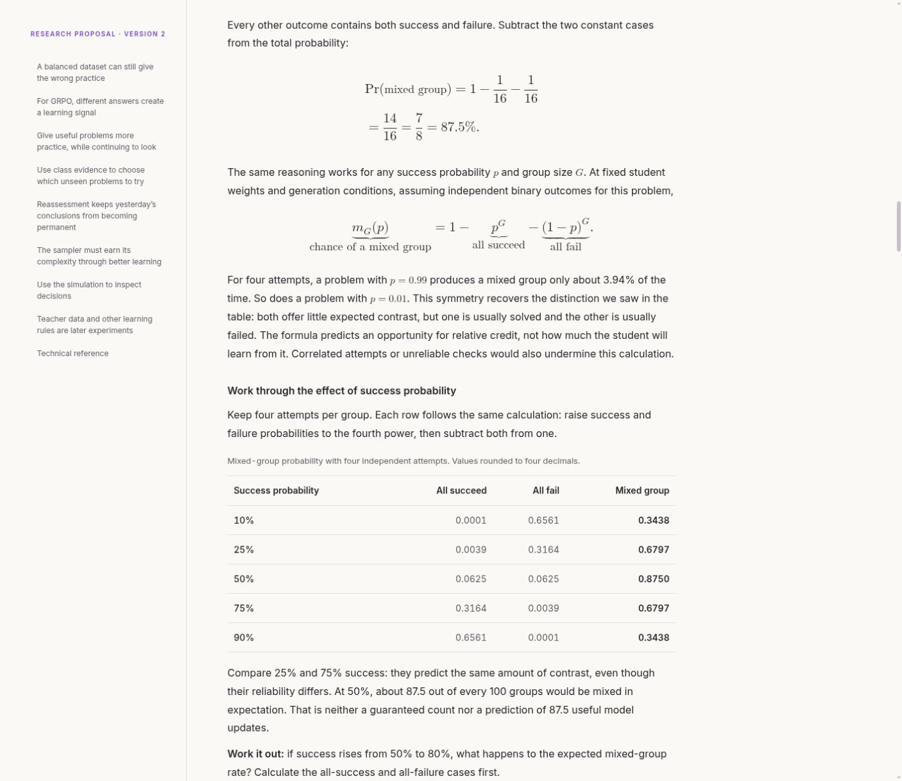

# Mathematical reading experience: visual review

14 September 2026. Scope: the v2 report's worked derivations, class allocation equations, and calculation examples in the existing in-app Browser. Screenshots below were captured and inspected during this review. This is a scoped visual and interaction review, not an accessibility certification.

## 1. Follow the mixed-group derivation — improved

The original display equations were centered across a 940px region while prose occupied roughly 707px. The reader's eye had to move sideways on every transition from prose to math. Multi-line MathML cells used text-style fractions, making their numerators and denominators smaller than adjacent display equations. Spacing directives in the TeX source were not preserved in the generated MathML.

A separate CSS issue made the introduction to this derivation 12px instead of the normal 16px: the inherited caption selector matched paragraphs with one emphasized element even when they also contained ordinary text. The same issue affected the introductory GRPO paragraph.

The revised reading column is 704px for both prose and equations. Main display equations use a 21px base size, explicit display-style MathML cells, and padding between rows. The main narrative overrides the accidental caption treatment. Equations remain unboxed, consistent with the reader's stated preference.

## 2. Trace class allocation — improved

The allocation section showed the same loss of fraction size in multi-line expressions. Its symbolic calculation was present, but the reader had no adjacent table for comparing the effect of different coverage settings.

The new coverage example holds arithmetic's forecast at 0.0875, algebra's at 0.70, and both base weights at one half. It separates the coverage contribution from the adaptive contribution for five settings. The text states that the discovery reserve remains fixed and that the output is a probability for a discovery draw. A 30% coverage exercise reveals the calculation yielding approximately 22.8% arithmetic allocation.

## 3. Compare success with contrast — added and verified

The new table calculates all-success, all-failure, and mixed-group probabilities for five task success probabilities at four independent attempts per group. Numeric columns use tabular digits and right alignment; the result column has stronger weight. Minimal horizontal rules replace a card enclosure.

The accompanying exercise asks readers to compute contrast at 80% success, then reveals the answer: 58.88%, down 28.62 percentage points from the 50%-success case. The explanation distinguishes predicted contrast from learning gain and expected counts from guarantees.

## Validation and limits

- Recomputed all ten table rows independently from their stated formulas; displayed rounding agrees.
- Regenerated HTML successfully, with MathML rendering checks and no whitespace errors from `git diff --check`.
- Verified that mathematical display cells explicitly use display style, that the corrected introduction is 16px, and that prose and equations both occupy 704px.
- Both answer disclosures opened successfully; the contrast answer was also opened using Enter. Tables have captions, row/column header scopes, and focusable named scroll regions.
- Every `aria-labelledby` target was found in the rendered page. These checks do not establish how a screen reader will pronounce the formulas.
- Captures use the current desktop Browser viewport. Mobile reflow, browser zoom, screen-reader output, and print layout were not visually qualified in this review. Wide tables retain horizontal scrolling rather than compressing their numeric columns.

The HTML remains generated by `../render_curriculum_v2.py` from the reading Markdown and the preserved technical specification. This change concerns presentation and explanatory examples; it does not change the sampling policy.
