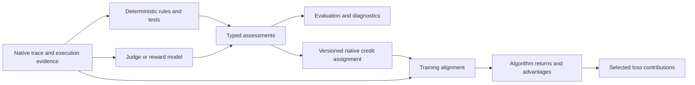

# Assessment, credit assignment, and training alignment in Verifiers

Design proposal, revised 2026-10-03. Initial source review used Verifiers `84ab782391bbfe1ac4f4ca32fa612e56d01b5b81` and framework pin `e6a3d9bbfe6959b97878f451fc721793a232cd5f`. Local candidate work now includes assessment records, restricted observation contexts, a custom-message chat adapter, lifecycle integration, and partial token projection. That work is not a published or fully qualified implementation of this design. Names in API sketches below remain proposed unless explicitly identified as current. The execution runbook records implementation and qualification status.

Execution order and migration gates are maintained in `docs/plan/verifiers-assessment-api-and-environment-migration-runbook.md`: qualify the generic API enough for safe Luna collection, collect verified references and implement/test AutomationBench reward redesign, repair exposed shared API gaps, then migrate all maintained environments. Benchmark Qwen on the Luna-verified subset, prepare separate 2B/4B curricula, and retain ten fresh 4B attempts per selected task. Luna-based episode/turn reward redesign is the primary AutomationBench goal. Execution stops after the trace bank. This proposal also describes eventual training-consumer qualification; training and further bank-based reward iteration are outside the active runbook. Luna provides reference evidence rather than teacher supervision or distillation.

## Recommendation

**Authoring revision, 2026-10-03:** the selected system must support new tasks
through manifests and task data alone. Use the
[manifest architecture and requirement preservation audit](verifiers-manifest-assessment-architecture.md)
for reusable operators, environment evidence adapters, expected check instances
and migration. The manifest engine is currently scoped to AutomationBench and
lives in its environment package; no cross-environment contracts engine or
other-environment pilot is required. Existing native assessor and alignment
capabilities remain independent of the initial manifest operator subset.
Earlier references below to Python rules describe reusable native
implementations and the historical candidate; they do not authorize bespoke
task evaluators in the replacement system. Native assessor internals remain
flexible, and existing assessment, credit and alignment requirements remain.

Use three durable native records: execution traces, assessments, and credit assignments. Deterministic rules, tests, state-transition verifiers, learned reward models, and hosted judges share an assessment envelope. Native assignment rules decide which actions receive a selected signal. A separate training-alignment service maps those recipients to original sampled tokens and then consumer coordinates. Training algorithms own returns, advantages, population normalization, and objectives. Evaluation remains useful without tokens, assignments, or an optimizer.

Current provenance qualification gap (2026-10-04): AutomationBench can reconcile
unique SDK/native call populations for bounded coverage, but that does not join
calls to sampled tokens. Native sampled-call/harness receipts are linked, while
MCP server invocation IDs are independently generated and retries can multiply
effects. Qualify the actual routing/coverage or a host-owned parent execution and
attempt link before relying on server-action recipients for native student token
credit. Never backfill historical metadata or infer attribution from count/order.
The owning runbook tracks this gate; no new public record is established here.

Selected runtime implementation (2026-10-04): the validated harness dispatch
may carry an MCP destination (server namespace, raw tool name and canonical
parsed arguments). The interception host issues an opaque episode-local
dispatch ticket only after accepting that original call's dispatch. The bundled
MCP client supplies the ticket, parent harness execution ID and a strict
transport-attempt index in reserved request metadata, outside policy arguments.
The tool server copies this into its receipts together with its own namespace;
the host validates the ticket, destination, arguments and accepted parent before
acknowledging dispatch, so invalid links cannot authorize handler execution.
Dispatch and terminal receipts retain the same parent/attempt. One transport
attempt cannot authorize a second physical invocation; retries get distinct
indices and invocation IDs. Gaps in attempt indices are allowed when a request
never reaches the server. No token coordinates are derived from those indices.

Trace/source admission revalidates the retained relation against the original
harness dispatch and host decision. Missing metadata remains unlinked; it is
never reconstructed from order, names or matching content. Source visibility
still controls which parents can be resolved. Before-hook rejection creates no
server link; after-hook rewriting preserves physical action provenance and
keeps raw/delivered results separate. Linking several effects to one call does
not choose their reward aggregation or infer original token spans.

The authoring interface should be simple: identify the subject, define the signal, supply a value or an explicit unavailable status, and cite retained evidence. Runtime helpers should attach identities, producer configuration, observed input, and execution records. Authors should not construct a dozen hashes or trainer masks for every check.



Keep four questions independent: what was found, what evidence supports it, which decisions receive credit, and where those decisions occur in training tokens. Correct coordinates do not prove a correct assessment or causal attribution. None of these records alone proves optimizer use. Task manifests compose bounded typed operators; Python implements reusable capabilities and environment adapters. A manifest selecting a bespoke task evaluator does not satisfy the authoring contract.

## Initial source baseline and candidate implementation

The table describes the initial reviewed source, not the complete dirty candidate. Candidate modules `verifiers/v1/assessments.py`, `assessment_runtime.py`, `assessment_source.py`, `assessment_projection.py`, and `chat_assessor.py` implement parts of the proposed boundary. In particular, `ChatAssessor` accepts a custom `build_messages(request, context)` callback and retains request/response evidence. Its current runtime permits exactly one declared view per invocation. The richer preparation contract below remains an implementation requirement; this document does not claim it is already available.

Paths in this section are relative to `/home/hammad/projects/verifiers` unless prefixed with `rl/`.

| Source | Existing behavior | Design consequence |
| --- | --- | --- |
| `verifiers/v1/task.py`, `utils/decorators.py` | `@reward` methods and configured functions return floats or named scalar mappings; `Task.score` writes weighted trace rewards | Preserve this small scalar interface. Do not reinterpret dictionary keys as turn IDs |
| `verifiers/v1/judge.py` | `Judge.score` returns float or scalar mapping; `complete` is an OpenAI-compatible chat helper and records requests/responses and usage | Useful adapter, not the required superclass for deterministic or non-chat assessors |
| `verifiers/v1/trace.py` | Named `Reward(score, weight)`, arbitrary `info`, exact physical branches, model calls, judge call records | Metadata storage exists; typed subject, scope, coverage, and assessment validity do not |
| `verifiers/v1/episode.py`, `env.py` | Episode contains multiple agent traces; `Env.finalize` is the existing cross-agent composition surface | Episode and trace are distinct subjects; cross-agent credit must be explicit |
| `verifiers/v1/graph.py` | Nodes retain token IDs, sampled mask, compact sampled-token advantages, and named full-node loss-weight arrays | Token transport exists. These fields are consumer outputs, not source reward assessments |
| `verifiers/v1/clients/train.py:106` | Converts parsed tool calls into ID/name/arguments, dropping parser token-span metadata and filtering some malformed/unknown calls | Preserve original parser spans and malformed generated actions before discarding execution-ineligible calls |
| `verifiers/v1/interception/tool.py` | Candidate hooks optionally carry execution identity, call arguments and explicit lifecycle reports; legacy phase/message hooks remain readable | Native receipts retain original payload and policy decisions; benchmark state transitions and non-bundled harness coverage remain separate |
| `verifiers/v1/types.py` | `SamplingMask` represents decoding vocabulary support | It is not the policy loss mask; use unambiguous terminology |
| `rl/packages/train/src/posttrain/train/turn_rewards.py` | Builds exact assistant-turn token maps and validates named per-turn evidence | Reuse its invariants; current turn IDs are projection-specific, not universal identities |
| `rl/packages/train/src/posttrain/train/reward_evidence.py` | Typed validity, `SpanAssessment`, observed-input identity/scope, finite values | Native contract should remove adapter-specific metadata conventions without importing Posttrain |
| `rl/packages/train/src/posttrain/train/update_process_credit.py` | Assessor and external credit estimator are already separate | Preserve this separation; avoid forcing all algorithms into one reward-to-advantage rule |

`MessageNode.mask` is aligned to every token in that node, including unsampled scaffold. `advantages` is compact over sampled tokens. `loss_weights` uses the full-node layout. A generic Boolean “token mask” without a coordinate system is therefore unsafe even before branches or batching enter the picture.

Record serialization rounds token float streams by default and excludes some training tensors. Source text and usage from hosted evaluation are not sufficient to recreate exact training state. Qualification must distinguish the native in-memory/wire representation from persisted records and explicitly retained lossless artifacts.

## One assessment model, several producers

Use a generic `Assessor` protocol and proposed `@vf.assessment` authoring hook. A pure Python function checking world state is a first-class assessor. A chat judge can reuse existing `Judge.complete`. A Jev adapter can call its own typed-decision endpoint. A local neural reward model can use a batched inference adapter. No base contract requires an API key, natural-language rationale, model name, token usage, or probability.

The user-supplied [Trajectory Judge Bake-off](https://claude.ai/artifact/1ZRmDgY6CV9Lu7nfE69qFo) motivates episode, turn, and individual-call subjects, and mixtures of deterministic checks and model scores. Its reported comparisons are not qualification evidence for this API. Jev's official [primitives documentation](https://docs.typesafe.ai/primitives) distinguishes choice distributions, ordinal scores, and yes/no probabilities, with caller-supplied question IDs. The adapter must preserve that meaning rather than treating every number between zero and one as a reward or confidence.

A deterministic predicate can emit a verified violation indicator of 1. A model can emit an estimated violation probability of 0.9. Both use the same envelope, but different signal definitions. “No newly satisfied goal” is not equivalent to “useless action”; uncertain usefulness must not become a valid zero.

### Composing deterministic and model assessments

One rollout, turn, call, or span may receive both deterministic and model-derived assessments. The system must support this directly. For a wrong-row update, code can establish the applied row and guard violation; a judge can assess grounding or self-correction; code can measure repeated calls and excess usage. These components describe different properties of the same behavior and need not be collapsed into one correctness score.

Composition has three supported patterns. Independent components retain separate definitions and enter the consumer recipe separately. Gated assessment calls a model only when a declared deterministic condition requires it. Derived assessment combines existing results through a versioned rule and records every dependency. Start with ordinary plugin code and a typed derivation record, rather than a new general workflow engine or configuration language.

Each derived record names its input assessment IDs, transform/rule revision, validity propagation, and output definition. Preserve the original observations. A rule can, for example, cap a model's action-correctness grade when an authoritative task predicate proves a wrong target. Such precedence is declared for that task/component; deterministic execution success is not authoritative proof of task correctness, and a failing verifier implementation is not a true guard violation. A deterministic scorer error cannot silently activate a judge fallback unless the configured fallback is semantically equivalent and identified in provenance.

Model input can include validated deterministic findings in a declared observation view. Distinguish an independent model opinion from one conditioned on those findings. Never claim their agreement is independent corroboration. If a model result is used by a deterministic transform, that does not make the resulting claim independently verified ground truth.

Optional model grading can fail while deterministic guard evidence remains valid. A component requiring both sources becomes unavailable when a required parent is missing; unrelated components remain usable. Conditional non-execution records its gate result and inapplicable status, rather than a fabricated score. Retry and cache identities include all upstream evidence and view revisions.

Validate derivations as an acyclic dependency graph: every parent and gate-decision ID must resolve to an immutable accepted record. Cross-task or cross-snapshot dependencies are rejected unless explicitly declared by the transform. A valid numeric derived value cannot inherit a failed required input; it propagates an unavailable status and reason. Optional inputs require transform-defined handling. Reassessment creates a new upstream revision and a new derived result; it never mutates old evidence in place.

The scorer may compose evidence into a named domain signal. Native assignment rules select recipients and declare local allocation and overlap semantics. The trainer explicitly selects compatible channels and computes rewards/returns/advantages under its algorithm. Do not use a universal average of deterministic correctness and model confidence. No domain assignment silently changes the trainer's normalization or loss.

## Proposed public contracts

### 1. SourceSnapshot and SubjectRef: what is being assessed

An immutable `SourceSnapshot` identifies the source episode/trace revision and retained inputs before assessment records are appended. Hash only the declared source data, excluding later assessments, advantages, and loss weights. Otherwise adding an assessment invalidates its own reference. A live prefix can be frozen without ending the rollout; a later graph revision produces another snapshot.

`SubjectRef` is a tagged reference: episode, trace, assistant turn, generated tool call, execution occurrence, retained semantic span, or an explicitly grouped selection. A turn means one retained sampled assistant message/model response, not an arbitrary user-facing exchange or an ordinal in the displayed transcript. A tool-call subject includes its owning trace/node and call occurrence, not only the provider call ID. Reused IDs across branches, retries, and agents must be disambiguated.

An execution occurrence is distinct from a generated call. The isolated candidate
now exposes `ExecutionRef`: its stable identity includes episode, trace, reporter
origin and invocation ID; its evidence binding includes the exact lifecycle-prefix
digest, event count and phase. Payloads stay in the sealed source and explicitly
selected views, rather than producer-facing identity metadata. Trace and episode
snapshots retain the occurrence manifest, and episode resolution requires exactly
one matching child. Different invocations with identical arguments remain
different actions.

`capture_execution_view` may assess a completed occurrence using only its earlier
dispatch evidence. The cutoff governs selected evidence payload; subject metadata
may identify the completed phase. It does not reconstruct actual model conditioning
or isolate arbitrary Python callbacks from ambient data. Native source capture
validates graph/state acknowledgements where available; standalone indexing proves
only its declared receipt invariants. Assessment and semantic credit remain useful
without tokens: projection returns explicit unsupported status until the
execution-to-generated-call-to-original-token relation is qualified. See
[candidate qualification](verifiers-assessment-qualification/execution-occurrence-candidate/README.md)
for the tested contract and remaining integration limits. This is local candidate
qualification, not publication or training acceptance.

Use `(trace_id, node_index, node_content_digest)` against the snapshot for existing graph nodes. Do not use mutable branch ordinal as primary identity. A graph rewrite requires explicit remapping and a new projection; it cannot silently retarget old labels. A grouped selection has one assessment, not one duplicated scalar per included token or call.

An explicit span references a declared source representation. Token spans are half-open node-local full-token intervals, bound to token/renderer identity. Text spans name the exact content field and coordinate units, such as UTF-8 byte offsets, with its digest. They are semantic candidates until projected. A judge may choose catalogued span IDs or propose text evidence; its output does not establish token alignment.

### 2. Assessor context and prepared input: what it may read and what it actually saw

The assessment subject does not constrain input size or shape. A whole episode, several agent traces, task instructions, tool schemas, call arguments, results, and before/after state can be needed to assess one turn. Conversely, one input can support assessments of several subjects. The subject can itself be an episode, state, grouped selection, or comparison; it is not necessarily an action. Keep four independent references: assessed subject, permitted context, actual prepared input, and cited evidence. Credit recipients are separate again.

Expose a read-only `AssessmentContext` with typed access to explicitly permitted source views and accepted upstream findings. Environment authors choose the visibility policy and implement input builders. Provide reusable helpers for selecting history, resolving subjects and call results, rendering chat messages, and retaining state/artifact inputs. Do not mandate one prompt template, transcript layout, role arrangement, or one-call-per-turn pattern. Deterministic assessors can consume structured state directly; chat assessors can assemble their own system/user/assistant messages; other adapters can prepare tensors or typed provider requests.

The local native candidate additionally exposes `context.retrospective_source()`
for deterministic source authentication. The executor privately anchors the
validated supplied `SourceSnapshot`; the accessor returns a freshly admitted
copy and requires every input view to have retrospective scope. It is unavailable
outside native execution and for prefix or action-result contexts. The anchor is
not serialized as extra assessor input. Thus custom transformed views remain
free to differ, while a deterministic adapter can prove that its claimed raw
world projection matches the actual sealed source before publishing a finding.
Recapturing evidence from a transformed input alone does not establish that
identity. This accessor is a supported visibility boundary, not a sandbox for
arbitrary untrusted Python plugin code.
The context's serialized fields and source schema version are unchanged;
the executor anchor is ephemeral invocation state, not a second persisted source
store. Replay continues to use the archived native `SourceSnapshot`.

The assessor owns its internal workflow. It may freely transform working copies of available raw material, construct arbitrary messages or structured requests, call several models, run deterministic checks, and interpret arbitrary provider output. Do not require a `prepare → call → parse` lifecycle, a `PreparedAssessmentInput` return type, a fixed judge response schema, or use of the chat adapter. The original source evidence remains immutable. Provide independently usable helpers for source access, message rendering, invocation recording, parsing, and publishing findings; these are conveniences, not mandatory stages.

The strict contract is the publication boundary: published assessments must identify their subjects, signal definitions, valid typed values or explicit unavailable states, producer identity, and supporting provenance. Raw model output may be prose, JSON, a distribution, a ranking, or another retained representation. Assessor-owned interpretation converts it into declared findings and records that interpretation's revision. A separate explicit mapping is required when turning a probability or preference into a reward. Malformed output cannot silently become a valid zero.

Recording is orthogonal to authoring freedom. Retain actual inference requests and raw responses/usage before interpretation, with invocation IDs linking them to published findings; retain structured inputs for deterministic checks. Multi-call and hybrid assessors retain their dependency trail, including failed and cancelled attempts. Helpers should make this easy without forcing authors through a workflow engine. Custom execution paths must provide equivalent receipts to claim replayable evidence; incomplete capture is explicit and may fail a consumer's admission policy rather than inventing provenance.

The input builder may select, reorder, summarize, or truncate permitted evidence. Record these transformations and their revisions; a model-generated summary is a separate inference dependency with its own input/output receipts and usage. Record the final adapter-visible request, including injected templates and output schema, rather than assuming the builder output is the whole request. Provider-internal hidden context cannot be claimed as captured. Supplied rubric text/examples are versioned configuration. Any external retrieval must become a declared retained input before it can support reproducible assessment.

Full available context is legitimate unless an explicit visibility policy restricts it. A subject never implicitly limits what the assessor can read. One permitted view can contain the whole call context or several structured sources; the present single-view runtime need not mean a single message or a narrow window. Source access preserves immutable originals while allowing arbitrary transformations of working copies. For explicitly selected prefix-only judging, restrictions apply to supplied raw context, not merely to final messages. Trusted Python callbacks are not a security sandbox: APIs can restrict supplied visibility, but cannot prevent ambient file reads or captured variables. Undeclared reads invalidate a restricted-view claim.

Retain the actual scorer input or an immutable artifact reference, plus the view-builder revision, source references, and digest. Declare prefix, through-action-results, or retrospective scope relative to the subject. The scope describes observation timing, not causal certainty. A label for turn 3 may legitimately use evidence from turn 8, but that future evidence must never enter turn 3's policy conditioning context.

Distinguish three references: the assessed subject, the observed view, and cited evidence. Evidence may include unsampled tool messages, private verifier artifacts, or another agent's output. Those references do not automatically belong in the loss mask. For a deterministic scorer, the observed view may be before/after world snapshots rather than prose.

Scorer visibility and policy visibility are separately enforced. Labeling an input as “prefix” without actually restricting the scorer's input is invalid. Legacy plugins receiving a mutable full `Trace` cannot claim enforced restricted visibility; a new read-only context supplies only selected views.

### 3. AssessmentRun and Assessment: result, meaning, and coverage

An `AssessmentRun` binds producer ID/revision, configuration and rubric identities, source snapshot, requested subject/signal coverage, invocation/attempt IDs, input/output evidence, and completion status. It records which requested items returned valid, inapplicable, abstained, or failed. Required versus optional coverage is selected by the consumer. An absent result is not a valid zero; an intentionally sparse request need not assess every turn.

An `Assessment` binds a subject, observation view, signal definition, typed status, optional finite value, and evidence references. A valid numeric assessment requires a finite value, including zero; other statuses carry no numeric substitute. Optional reason codes describe machine-readable failure or abstention. Rationale is optional and cannot be fabricated for a model that returns no prose.

A `SignalDefinition` identifies the rubric/units, allowed range if bounded, and meaning: outcome, state quality, incremental progress, cost, probability, or other versioned semantics. It must distinguish a cumulative state score from a reward increment to prevent repeated counting. Direction and interpretation are declared, but the record does not prescribe a centering rule, return estimator, discount, loss coefficient, or normalization population.

Preserve nonnumeric provider results and distributions as typed producer evidence. Converting a choice or ordinal distribution into a scalar requires an identified mapping, retained as derivation provenance. Do not hard-code Jev's answer schema into Verifiers core. A probability near 0.5 is uncertainty about the defined event, not automatically half progress. Confidence cannot universally be multiplied into the reward.

Different assessors may legitimately disagree on the same subject. Keep their records distinct; no last-writer-wins behavior. A selected aggregation or adjudication policy produces a separately versioned derived assessment with parent references. Retry attempts likewise remain distinct; the accepted attempt selection is explicit and cannot cherry-pick the largest reward.

### 4. CreditAssignment: which decisions receive a signal

A versioned native rule consumes accepted assessments and emits assignments. Each assignment retains parent assessment IDs, source snapshot, rule/configuration identity, recipient references and branch occurrences when applicable, signal meaning, validity, and attribution strength. Evidence and recipients may differ: a later tool result may justify negative credit for an earlier send action. One finding may have several recipients, or no justified recipient. Preserve unknown attribution instead of silently spreading it over a turn or episode.

Keep reward increments, cumulative state scores, guard costs, probabilities, and preferences distinguishable. A numeric assignment identifies its units and transformation; preferences retain alternatives and relation rather than receiving an implicit scalar conversion. The first implementation may support only numeric assignments, but must reject unsupported signal forms without losing their source evidence. Do not require every algorithm to consume every form.

Recipient support answers where; allocation answers how much. Distinguish a turn-boundary reward, a fixed total distributed over eligible tokens, and a broadcast local coefficient. Record the chosen allocation and gates explicitly, separately from the raw signal and from trainer loss weighting/normalization. Overlap is rejected or combined by a named rule, never an implicit sum. Episode and local signals remain separate channels until a selected composition prevents double counting. Shared prefixes may have branch-specific assignments without overwriting native source arrays.

Assignments remain meaningful without token alignment. Exact call support is admitted to training only after alignment qualifies it; unsupported alignment does not erase the finding or become zero credit. Domain rules execute in Verifiers, while group-relative centering, discounting, learned baselines, preference objectives, reduction denominators, and optimizer behavior remain trainer-owned.

Credit planning also needs an explicit scoring-call boundary. `CreditPlanningContext`
contains the source identity, the current assessment plan's run/invocation/attempt
identities, and prior native credit assignments. `Task.plan_credit(source,
assessments, context)` and `Env.plan_credit(source, assessments, context)` see
retained trace or episode assessment history plus that boundary. Their
default delegates to existing `credit_requests` implementations. A domain planner
can select this call's completed attempts and decline already-consumed evidence;
a failed current attempt must not silently fall back to an older success. The
runtime validates source and episode/trace ownership, but does not select the
newest attempt, deduplicate domain obligations or impose once-only credit. This
context is ephemeral: referenced runs and assignments remain the native evidence
authority rather than creating a second journal.

### 5. ProjectionResult: training alignment to original tokens

The alignment service accepts assignment recipients (or independently selected subjects for inspection) and a selected projector revision. It performs two explicit mappings: semantic references to canonical node-local intervals, then those intervals to the selected consumer sample layout. It returns status and fidelity: exact action, exact turn, explicit coarse turn fallback, absent from selected branch, unsupported, or failed. It binds source token IDs/digest, sampled-mask identity, renderer/parser revision, and model-call conditioning identity. It neither changes signal values nor decides responsibility.

Projection fidelity describes coordinate alignment only. An exactly located turn can still have an incorrect judge label or uncertain causal attribution; those qualities are recorded and qualified independently.

For RL policy credit, every selected interval must be inside original sampled assistant positions. Prompt tokens, tool outputs, padding, and synthetic context are ineligible. Refuse an action projection that crosses unsampled scaffold. A general annotation may target tool evidence, but it cannot become an actor policy mask merely because it has tokens. Other objectives, such as separately selected supervised observation training, require their own eligibility policy.

Whole-turn projection is the first qualified implementation. Call-level projection preserves renderer/parser completion spans before normalization, including malformed calls. The conversion from completion-relative span to node-local token intervals must account for generation scaffold. Multiple calls with identical JSON remain distinct occurrences. Partially parsed or overlapping parser spans require declared treatment; no substring search or reserialization fallback can claim exactness.

Branch export resolves these canonical intervals into consumer tensor positions. Shared-prefix nodes are assessed once. A trainer may produce branch-conditioned credits for the same sampled prefix, so source assessments cannot be stored as one overwritten advantage vector on that node. The trainer retains contribution/branch-specific credit or explicitly defines aggregation and multiplicity before populating native convenience arrays.

### 6. Execution evidence: why an action is labeled

A deterministic transition scorer needs an execution record binding action occurrence, arguments/input digest, result, before/after state revisions, actual execution order, and outcome status. Candidate native hooks now retain occurrence-bound lifecycle reports and source correlation, but do not guarantee benchmark state transitions or domain outcomes. Environment-owned ledgers around actual tools supply that additional evidence. A reported return is distinct from verified task success, and receipt order is distinct from mutation order.

The ledger distinguishes generated calls, dispatched calls, successful executions, and environment rejections. Unknown or malformed generated calls can be assessed even when never dispatched. Repeated execution attempts need identities separate from the original sampled call. Concurrent mutations may only support joint attribution; the API must allow that result rather than crediting each call with the whole observed change.

Attribution strength is explicit: isolated transition, jointly observed transition, retrospective association, or unavailable. Neither a model score nor a before/after correlation establishes counterfactual necessity. For example, a correct retrieval can be associated with later success without proving that it caused success.

## Proposed authoring experience

The following is an API sketch for review, not runnable current code. It shows the intended amount of environment-specific work; helpers fill the provenance and coverage envelope.

```python
class AutomationTask(vf.Task):
    @vf.reward
    async def outcome(self, trace):
        return official_score(trace)

    @vf.assessment
    async def action_effects(self, ctx):
        for event in ctx.execution_events():
            yield ctx.assess(
                subject=event.action,
                signal=GOAL_PROGRESS_V1,
                result=check_goal_transition(event.before, event.after),
                evidence=event.evidence_refs,
            )
            yield ctx.assess(
                subject=event.action,
                signal=GUARD_VIOLATION_V1,
                result=check_guard_event(event),
                evidence=event.evidence_refs,
            )
```

The underlying proposed protocol is `async assess(request: AssessmentRequest, context: AssessmentContext) -> AssessmentBatch`. The task decorator is convenience syntax that collects records into a batch. Do not implement two different semantics for yielded results and plugin batches. Runtime validation checks the requested subject/signal coverage, status, finite values, identities, and input-view provenance before publishing the batch.

A model assessor receives requested subjects and their permitted observation views. It can batch many questions against one shared input, or make separate bounded calls. The number of network requests is not the number of turns or assessments. Invocation evidence maps responses back to requested subject/signal IDs. A deterministic assessor uses the same interface without inference usage. Runtime cost/latency accounting is separate from policy rewards.

## Lifecycle and backward compatibility

Keep `@reward`, `@metric`, `Judge.score`, and existing weighted `Trace.reward` behavior. Add a sibling assessment phase and configured assessor plugins rather than expanding scalar return unions with guessed meanings. Existing judge adapters can implement assessment capability explicitly; deterministic assessors do not subclass `Judge`.

Capture live state-transition evidence while the environment exists. Finalization seals the retained ledger; terminal task assessment runs against a frozen source. Cross-agent/episode assessment composes at the environment level after selected traces are ready. Prefix assessments can be materialized at declared live boundaries, and later assessments produce new records instead of mutating earlier labels. Failed/truncated episodes can still have valid prefix evidence; each algorithm decides whether to admit it.

Trace-local assessment batches live with native traces. Cross-trace batches belong to the native episode. Large raw provider/state artifacts may be referenced from the native artifact bundle, with integrity checks and transport support; they do not form a competing authoritative score database. The schema must survive in-process, server wire, disk, resume, and offline rescoring paths. Stable trace/snapshot references prevent merge-order changes from altering subjects.

During training, tracking receives a results-only projection: values/statuses, signal and subject identities, producer revisions, attempt identity, coverage, source digests, and archive references. Full assessment sources, input views, judge transcripts, rationales, state evidence, and token masks remain in native filesystem records and compressed published artifacts. Trackio can expose the artifact reference for offline inspection but does not index its assessment trace contents. This projection must not modify the authoritative records or internal consumer inputs. Episode results are emitted once; progress snapshots and retries are not extra rewards. Archive publication status is explicit, with integrity verification and safe retry. Ordinary solver rollout tracking and evaluation retention are separate policies.

No automatic sum of all assessments into `Trace.reward`. A named compatibility reducer can intentionally derive a legacy scalar, with source selection, validity policy, and aggregation revision recorded. Otherwise episode, turn, and call scores would count the same success repeatedly.

## How algorithms consume the same evidence

| Consumer | Selected interpretation |
| --- | --- |
| Evaluation | Display raw outcomes and assessments; no tokens or optimizer required |
| GRPO-style outcome training | Explicit outcome/reducer, complete sibling groups, algorithm-owned centering |
| GDPO | Named components, specified reductions and independent normalization; no native automatic mean across turns |
| SAMPO | Turn rewards from explicit component composition, anchor identity and complete required comparisons |
| CAPO or local process loss | Qualified error/action support plus the algorithm's own credit and clipping semantics |
| Learned value/advantage estimator | Declared value semantics and state/observation scope; estimator owns returns and baseline |
| Completion-gated efficiency | Raw outcome/guard gate plus separate measured usage/budgets; retain successful groups with useful efficiency differences |

Consumer settings select evidence, projection, estimator, policy support, ratio support, KL support, reduction denominator, and population requirements. These choices are not assessor defaults. The native API should not promise that every algorithm supports every combination.

A guard indicator can be valid while its centered advantage is zero. A negative local cost can be outweighed by positive episode credit. The API makes those stages inspectable; correcting that behavior requires a separately named and tested credit recipe. Multiplying masks and increasing weights are also distinct changes.

## Adversarial review and decisions

An independent code-review agent examined the fork and challenged the design. The resulting changes to the proposal are recorded here.

**“A turn reward plus a Boolean mask is enough.”** Rejected. The current code already has several incompatible token layouts, physical branches share nodes, and a tool response can be evidence without being policy support. Use typed subjects and separately verified projection.

**“Extend Judge as the universal scorer.”** Rejected. Its current helper assumes chat completion, while deterministic state checks and Jev-style decisions have different execution interfaces. Use an assessor protocol with optional judge adapters.

**“Use branch number and turn number as stable IDs.”** Rejected. Branches are derived physical views; compaction and subagents affect them. Anchor subjects to source snapshot and native nodes, then export branch mappings.

**“One trace advantage array can serve every branch.”** Rejected for branch-conditioned credit. Shared physical nodes cannot hold two different return values in one vector. Preserve contribution-specific credit outside the source assessment record.

**“Tool hooks already prove call causality.”** Rejected. The current payload lacks a complete execution/state relation. An environment ledger is necessary, and ambiguous parallel mutations remain jointly attributed.

**“Require a score for every turn.”** Rejected as a universal rule. Dense SAMPO coverage may require that, but selective guard checks, episode-only grading, and batched typed questions have different valid coverage. A request declares its expected subjects/signals.

## Qualification before API adoption

Exercise one deterministic AutomationBench scorer, one chat judge adapter, and one typed-decision adapter against the same request/result contract. Real provider qualification follows fixture validation; no provider accuracy or learning claim follows from schema validity. Provider-specific credentials and request schemas remain adapter-owned.

Also qualify their combination on the same subjects: a deterministic guard violation with a positive model grade, a failed optional judge with valid deterministic evidence, a model conditioned on deterministic findings, a versioned cap preserving both raw inputs, a skipped conditional judge, and invalidation after an upstream assessment changes. The composed path is a required acceptance case, not an optional extension.

Required evidence tests include valid zero versus unavailable; missing/duplicate/extra target replies; two producers disagreeing; retry records; prefix and retrospective views of the same turn; an assessment on an unsampled tool result; exact turn support with scaffold; two identical calls; malformed calls discarded from dispatch; mixed good/bad calls in one turn; concurrent writes; duplicate provider IDs across traces; graph append and rewrite; two branches sharing a prefix but needing different credit; multiple agents; tokenless hosted traces; multimodal views; serialization and lossless coordinate round-trip; and interrupted/resumed scoring.

Coverage validation must identify which component is missing without rejecting unrelated valid assessments automatically. Consumer admission declares whether that component is required. Test that no unavailable value turns into zero and no assessment silently enters a scalar total.

Before freezing the shared API, exercise episode-level GRPO admission, turn-reward return estimation, and masked local credit alongside a separate guard-cost channel. Include a preference comparison to prove that nonnumeric evidence survives without an implicit scalar conversion; preference training support is not implied. Test these consumer contracts without updating model weights. These three local consumer fixtures now pass through existing estimators; the runbook retains the remaining source/conditioning, call-span and release gates. Later training qualification must check the actual loss derivative, contribution denominator, and optimizer-used evidence before online learning claims.

Input preparation acceptance includes the same turn assessed with a prefix and with the entire episode, a custom multi-message rubric, one input grading several targets, deterministic state inputs, mixed deterministic/model dependencies, and a multi-call assessor. Round-trip exact prepared payloads and invocation/result links. Prove forbidden future context is unavailable to a prefix builder through the supplied API. Verify truncation, summaries, parsing failures, and cancellation retain their evidence; no model-call transcript enters policy conditioning or becomes policy support.

## Delivery boundaries and open decisions

User clarification, 2026-10-03: the native deliverable includes credit assignment, not only assessment storage and token projection. Verifiers needs a versioned assignment interface that turns accepted findings into branch-specific turn/action/token contributions with explicit support masks, weights, gates, overlap rules, and validity. Environment rules supply domain meaning; the shared executor validates the assignment and preserves source/rule lineage. Exact coordinates alone do not establish causal relevance. Trainer-specific advantage estimation and optimizer objectives remain downstream. Semantic assignment records, explicit planners, optional task/episode hooks and persistence are implemented locally; complete original-token alignment and algorithm consumers remain unqualified. The runbook's Gate 2 remains open before environment migration acceptance.

Implement generic records, source views, native persistence, assessment lifecycle, and projection capability reporting in the Verifiers fork. Preserve renderer parser spans in its training-client bridge; if the renderer lacks adequate spans, improve the maintained renderer package separately and pin it explicitly. Implement AutomationBench rules and calibration in `automationbench_v1`. Adapt Posttrain's existing turn/span contracts to the native schema and keep all estimator/objective decisions in train.

Before code, resolve exact naming and registration with the fork's minimal-config convention; verify how episode-level assessor configuration composes with task-local hooks; document supported serialization/artifact versions; and decide the narrow first qualification matrix. These are bounded implementation decisions, not reasons to defer the source/assessment/projection distinction.

The AutomationBench reference collection starts after the parent runbook's API and environment migration gates, followed by its own harness/evidence gate. Evaluation assessments do not require exact tokens; call-mask training does require qualified student-token alignment and consumer support. The canonical baseline amendment dated 2026-10-03 clarifies native domain assignment versus trainer-owned algorithm credit. It accepts this ownership boundary, not implementation or backend qualification.
# Native parent-call resolver checkpoint (2026-10-04)

The local candidate now exports `resolve_execution_parent(source, ref)`.
It returns the exact host-authorized sampled dispatch prefix for a linked MCP
invocation, or `None` for historical unlinked receipts. The server invocation
and physical retry identities remain distinct from the parent call. This is
an inspectable execution relation; exact token support still requires separate
generation-span qualification. Details and real local integration evidence:
[native parent link checkpoint](verifiers-assessment-qualification/reward-candidate/native-parent-link-checkpoint.md).

The local execution projector now reuses exact generated-call spans through that
relation, preserving original execution subjects and separate retry contributions.
Coordinate fixtures qualify admission/transport; production renderer versions
and algorithm consumers remain separate. See the
[execution token alignment checkpoint](verifiers-assessment-qualification/reward-candidate/execution-token-alignment-checkpoint.md).
