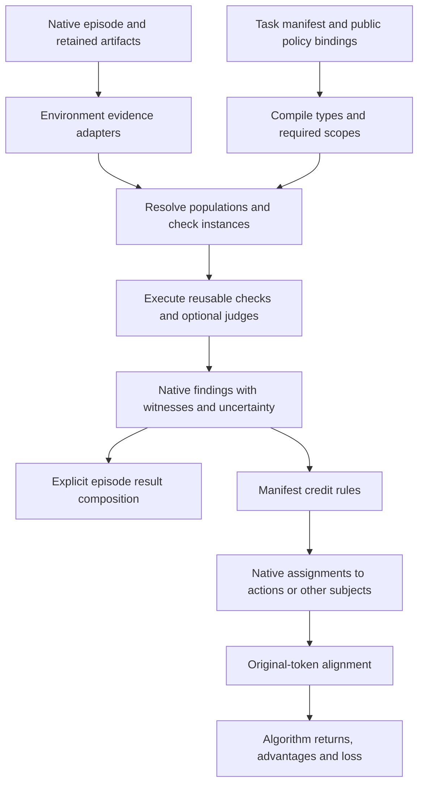

# AutomationBench manifest-based assessment and credit architecture

Current implementation direction (2026-10-04): extend the existing environment
engine with finite evidence operations rather than another framework API. The
public-requirement opportunity matrix covers all 105 reviewed tasks; Simple
fixtures no longer determine shared-work order. The first addition is closed
filtered COUNT/SUM in `contracts/aggregates.py`. Its strict specification names
one existing typed initial collection or sheet source, an existing predicate,
`count` or `sum`, a unit and an optional exact value expression. Evaluation
recaptures the source; published results retain source/selector/spec digests,
contributing scoped native identities and paths, and raw numeric evidence.
Unknown eligibility or incomplete membership prevents an exact aggregate.
Native scoped sheet row IDs are identities; array positions are not invented
substitutes. Results are evidence, not automatic action rewards.

The implementation path is standalone source/evidence qualification, followed
by manifest compiler admission, prepared native assessment transport, fresh
recapture at publication, replay/reload/rescore, and independently reviewed task
declarations. Integration is not qualified merely because the standalone module
passes tests. The native Verifiers assessment/assignment/alignment boundaries
and downstream trainer ownership remain unchanged.

Two-sided relations, extrema and temporal prerequisites are distinct later
increments. Existing exact lookups cannot enumerate the union of two key sets
or prove counterpart absence. A relation must preserve duplicate ambiguity;
extrema must preserve ties and unknown competitors. An explicit read prerequisite
needs authoritative read completion before action dispatch, not just increasing
state revisions, and must abstain when historical capture cannot prove it.
Business-specific correction precedence, eligibility and units stay in reviewed
manifest data. Full report facts and output guards remain independent gates.
See [the opportunity analysis](./verifiers-assessment-qualification/reward-candidate/capability-opportunities-105.md)
and the living calibration plan for execution and acceptance.

The current local manifest catalog has thirteen reviewed development components.
`manifest_created_assessments.py` now transports the shared retained-new-object
operator through native source admission, assessment records and current-attempt
credit planning. Accessibility Audit and the historical retired-content append
guard are installed after public-policy review, recorded replay and alternatives.
Whole-task qualification and published dependency readiness remain open.

Consumed credit uses a frozen manifest revision within an episode replay ledger.
`manifest_credit_history.py` checks retained valid contributions from every
registered manifest credit family before planning new requests. Once any such
contribution exists, a different canonical manifest digest requires a fresh
replay ledger. Empty attempts do not freeze the ledger; valid partial outputs
still do, even after failure or cancellation. This avoids inventing equivalence
between renamed checks, source aliases or regrouped policies. Domain-specific
once keys still consume unchanged obligations; the fixed-record policy must not
make a newly selected execution recipient a new obligation.

Authored assistant text has a separate environment-local evidence source,
`contracts/authored_outputs.py`, using `assistant.outputs@1`. It extracts sampled
native assistant message content or completed SDK agent-message items from exact
retained artifact bytes. The task source builder retains the raw selected material
for independent rederivation. Known text and inventory completeness are separate;
missing artifacts or unfinished streams cannot establish silence. Prompt history,
tool returns, reasoning and SDK deltas are not authored assistant text. This
source does not interpret summary prose or close external message/record channels.
Supported deterministic summary checks and any bounded semantic fallback remain
separate from this factual source; no new native API or storage product is needed.

External output coverage uses two environment-local layers. The planned shared
`contracts/invocation_inventory.py` reconciles native dispatch, terminal receipt,
local capture and state ACK for each invocation. For SDK episodes it additionally
checks the entire sealed MCP call inventory against native calls using exact
tool, declared server, type-sensitive arguments and returned payload. Only the
installed `search_tools` default `top_k=5` may be filled. The first slice requires
unique matches; ambiguous repeats stay unavailable. This is coverage evidence,
not sampled-call attribution, temporal ordering or a replacement for the
archive's unqualified SDK/native identity join. Server admission binds the exact
controller-retained aliases and approved tools; arbitrary server labels alone
cannot prove authority. Native-only model provenance remains unavailable in this
initial increment. Native host-issued dispatch tickets now link physical MCP
invocations to original sampled calls, including multiple retries. The
environment's reduced source still lacks the full emitted-call and harness
lifecycle population needed to establish native-only closure. Retain and
reconcile that population before Qwen use; never hydrate historical archives
into an invented link.

Native reconciliation receives the executor's sealed `SourceSnapshot` as an
optional keyword, forwarded through invocation capture, external output capture
and summary preparation/evaluation. The native bridge obtains it directly from
`AssessmentContext.retrospective_source()`. It is never read from a prepared
view or judge response, and full source/token arrays are not copied into evidence.
`native_invocation_source.py` derives original emitted-call/model-call facts and
public-resolver parent relationships from that snapshot. Coverage must compare
selected task/event/write material with the sealed source, account for every
original emitted call and exact harness lifecycle, and retain all distinct
physical attempts. Missing original calls, unmatched parents and incomplete
generation/lifecycle evidence leave closure unavailable. Historical SDK capture
keeps its separate coverage-only path. Native core and actual HTTP/MCP operation
qualification are separate acceptance gates.

`contracts/external_outputs.py` classifies each admitted invocation against
audited installed handlers. Its initial scope covers search/discovery, Gmail
find/list/get, Salesforce find, and Contact assistant-field updates. Reads must
have an unchanged captured world; updates must prove original record identity,
submitted/result/persisted value agreement and only permitted world changes.
Known text and action relations survive unrelated missing coverage. Every
submitted supported string is retained as a contextual record-field fact, even
for a no-op: field names do not establish absence of prose. Unknown operations,
other fields, failed/pending calls and SDK/native inventory gaps leave coverage
open. Broader sends, notes, drafts and record fields are shared capability work
when encountered; no task-specific evaluator or combined adapter-complete flag
can substitute for this inventory.

For a later conditional-summary check, the public rule is the authority. A
summary is optional unless explicitly requested. Its evidence must include
verified action relations and their values, not a whitelist of mutated object
names: updating Rachel's assistant field to Kevin legitimately lets a summary
mention both people. A bounded semantic check may interpret wording and cite
exact output spans, but cannot invent action facts or repair incomplete capture.
Do not add an unrelated factuality requirement to a policy that only prohibits
narrating exclusions. Externally sent messages and free-form record fields need
their own authored-output coverage before claiming the complete public guard.

The local shared operator `SummaryExclusionCheck` (`summary_exclusions@1`)
is implemented in `contracts/summary_policy.py`. It binds the exact public rule,
assistant and external output inventories, and qualified action relations.
Each output is assessed independently as compliant, violating, inapplicable or
abstained. Deterministic code verifies identities, field-value relations,
capture completeness and citation coordinates. Reviewed structured output or
an explicitly qualified summary grammar may supply deterministic certificates;
unmatched prose requires bounded semantic assessment or remains unknown.
The existing native assessment interface supplies caller-prepared context and
raw judge evidence; no additional judge transport API is proposed.
`manifest_summary_assessments.py` registers the check in native planning and
scoring. Composition supplies an optional `SummaryBackend` registry; manifests
cannot instantiate inference clients. The backend owns message preparation and
arbitrary response parsing, journals the actual request before awaiting its
execution, and returns the original exchange before parsing. Whole-output
coverage is declared by the trusted adapter independently of model output.
Identity, parser/rubric revision and a nonempty canonical execution selection
are pinned to the manifest. Controlled backend tests qualify this transport,
not prose judgment accuracy. Without a qualified backend, unknown nonempty
prose abstains. No implicit inference is added.

The local `summary_action_negative_once@1` policy now separates field findings
from action penalties. `manifest_summary_actions.py` recaptures authored fields
and groups them by the original physical execution occurrence. Planning these
groups does not depend on a valid policy binding: if the public policy changed,
the publisher can still abstain every previously declared target without
calling a backend. Historical SDK assistant text has no qualified action
recipient and remains unassigned.

One assessment run declares the trace-compliance target and the physical-action
targets before execution. One retained semantic exchange supplies field-level
findings; the deterministic reducer produces each action's harm result. Any
admitted offending field establishes harm, even if another field is unavailable
or a later action repairs it. A neutral action result requires complete local
field capture and admissible nonviolating decisions for every member. Global
trace compliance additionally requires the complete output inventories.

`manifest_summary_credit.py` authenticates the retained request, exchange,
configuration, findings and native parents, then parses the retained exchange
without another inference call. Its hook recaptures the original recipient and
issues one negative contribution per episode, contract, check, physical action,
channel and signal. The consumption key excludes assessment-run IDs and field
lists, so rescoring cannot create another penalty. Distinct physical retries
may contribute to the same sampled call under explicit `sum` overlap semantics;
duplicate assignment of the same physical action is rejected. Native alignment
and training still own token support and advantage computation respectively.
These are local candidate interfaces; semantic accuracy, actual assistant-token
alignment and complete-task qualification remain separate gates.

Native assessment execution retains already yielded findings if an assessor
later fails or is interrupted. The native credit executor can authenticate
those exact records; a globally complete run is not a universal prerequisite.
The current AutomationBench summary planner conservatively excludes failed
assessment runs. This is an environment policy, not a Verifiers limitation.
Its current producer records the full evaluation before returning findings,
and parser failures already preserve independently valid known harm. No current
production loss from that exclusion has been reproduced. If assessment becomes
streamed, qualify local-target admission explicitly: a completed harm target
may survive peer failure only when its current sealed request, raw exchange,
decision and action receipt are complete and authenticated. Test actual
yield-then-failure/cancellation; never borrow a previous successful run or turn
missing required receipts into a zero/compliance result.

A known violation survives unrelated capture gaps. Compliance requires both
output inventories closed and every output compliant or inapplicable. Closed
silence passes because no summary is required. A judge cannot close missing
capture. Preserve the actual relation graph: Rachel's assistant field set to
Kevin can justify both names in a summary, while narrating that Rachel was
skipped can still violate policy. Required reads can support claims about the
read; mutation-only facts cannot turn a valid read summary into a failure.
Incidental discovery of an excluded item does not authorize narrating that
exclusion. Assess wording against the public policy and requested workflow
rather than treating any read as permission to enumerate every participant.
An unresolved relation remains abstained rather than implying a skipped item.

Before whole Contact acceptance, test actual archived output, valid paraphrases,
closed silence, excluded-item prose in assistant and record fields, quotes and
negated wording, legitimate field values, ambiguous references, incomplete
capture and invalid/failed semantic results. Whole acceptance then combines the
explicit Find observation, both terminal field goals, this public guard and
the separate public prohibition on asking clarifying questions.
No additional notification or required-summary policy is introduced. Semantic
backend qualification and authored-output credit alignment remain separate.

Successful full return of an original Gmail message is a separately qualified
evidence capability. `contracts/gmail_observations.py` exposes `GmailObservationSource`
with adapter `gmail.message_reads@1` and kind `read_message`, qualifying installed handlers
against their native execution receipt, strict response identity and the
captured message record. It must distinguish full returned sender/body from
an ID-only result or snippet. Limited observations remain factual, with absent
body fields; the adapter must never fill those fields from backend snapshots.
Manifests use the existing required-occurrence
operator to express an explicit Find obligation; queries and a fixed action
sequence are not task policy. This is evidence of a successful tool read,
not proof of comprehension or exact model conditioning. Token-level admission
continues to require separately qualified native alignment. Closed read scope
must account for supported alternatives and missing receipts; a known positive
read may survive unrelated unavailable action coverage.

The reviewed Contact assistant task requests this read and two fields on the
original Contact. It does not request an additional notification or mandatory
summary. Whole-task acceptance must audit the applicable public instructions,
including conditional summary restrictions, rather than invent extra steps.

The public system prompt also says not to ask clarifying questions. The summary
rubric does not cover that rule. Add the bounded `no_clarification@1` operator
with its own pinned rubric, using existing output/invocation capture, strict
citation admission, retained exchanges and native lifecycle. Extract only those
shared mechanics; preserve existing summary wire identities and behavior.
Private reasoning, search queries and incoming quotations are context, not
automatically requests for clarification. Assess an outward request's purpose
against the public task and actual audience; business questions explicitly
requested by the user remain valid alternatives. Unknown purpose or capture
stays unavailable. Deterministic closure and exact-empty checks precede any
semantic call; no punctuation or field-name heuristic establishes compliance.
The first increment is an outcome guard with per-output evidence, not invented
token credit for historical SDK messages. A known request survives later repair
and unrelated gaps. Its own contrast campaign and combined-task replay must
pass before complete Contact acceptance. Concrete proposed code surfaces and
adversarial cases: [no-clarification proposal](verifiers-assessment-qualification/reward-candidate/no-clarification-capability-proposal.md).

The local implementation shares mechanics without renaming the existing wire
models. `contracts/no_clarification.py` defines the finite check and thin
preparation/reduction wrappers; private helpers in `contracts/summary_policy.py`
retain the actual operator-bearing check digest. `contracts/models.py` and
`contracts/engine.py` admit the declaration. Native publication uses a private,
code-owned output-policy profile in `manifest_summary_assessments.py`, with
`manifest_no_clarification_assessments.py` supplying separate producer, signal,
request, exchange and result identities. Composition binds the independent
`no_clarification_backends` registry. These internal callbacks cannot be supplied
by a manifest. The clarification profile creates one trace outcome and no action
credit targets. The SDK backend shares transport/parser mechanics through a
fixed profile while selecting its own pinned rubric and assessor; existing
summary identities and request bytes must stay unchanged. Controlled certificates
qualify admission and lifecycle only. Actual prose accuracy and complete Contact
acceptance remain separate gates.

`contracts/populations.py` resolves declared initial collections from the
installed `WorldState` schema. A direct list of typed records with canonical
string IDs is a reusable capability; a per-service name allowlist is unnecessary.
Admission never calls constructors, invents defaults, uses aliases or traverses
untyped action buckets. The same selector/schema digests, explicit raw identities
and fresh source recapture bind the projection. Missing collections remain
unavailable, while observed empty collections can be closed. This expands
obligation context and lookup populations; it does not implicitly add effects,
guard support for other populations or fresh-object semantics.

The qualified local outcome lane is `records.retained_when@1`, implemented inside
the AutomationBench package. `contracts/retained_records.py` pairs a declared
typed initial collection with its finalized terminal collection by service,
collection and original native ID. It will reuse explicit field projections,
predicates, selector/schema digests and raw recapture. Initial eligibility stays
frozen; terminal values can change. An already-correct state may pass the outcome
without claiming an action caused it. A missing terminal collection or unfinished
episode remains unavailable; a closed inventory that lacks the original object
fails retention. Duplicates and missing fields affect the relevant entity, while
independently known entities remain assessable. A replacement with the same
business name cannot inherit the original obligation.

Declared projection fields must satisfy the installed schema without coercing
the recorded values. A numeric literal requires the exact native scalar type;
`true` cannot establish the integer `1`. Numeric validation must also remain
finite after validation. Missing or malformed fields remain unavailable, while
independent known fields can still support findings. The manifest compiler
resolves predicate aliases back to canonical schema paths, rejecting undeclared
projections and children of scalar fields before execution. For a named public
target, bind its authoritative initial inventory; a population with no applicable
members must never be converted into a successful named-task outcome.

`manifest_record_retained_assessments.py` prepares evidence and publishes bounded
per-object findings and use executor-sealed source admission through the existing
native APIs. `contracts/models.py` and `engine.py` will register the new check;
`manifest_assessments.py` will dispatch its current attempts separately from
record-transition evaluations. This outcome-only increment has no completion
credit policy. A separate narrow `contracts/zendesk_effects.py` will qualify
requested ticket/status changes against local success, native ACK/revisions,
response identity and persisted before/after ticket state before any action
contribution is enabled. No generic PATCH semantics or endpoint-derived causal
claim is inferred.

The public solved-ticket component of `simple.zendesk_resolve_email` is installed
after 34 actual/core/native cases, with preserved recorded evidence, damage/repair,
replacement, duplicate IDs, missing ACK and noops. The required resolution email
remains a separate obligation. Generic terminal findings improve goal evidence;
they do not complete the credit-assignment objective until qualified mutations
and original execution/token provenance connect useful actions to that goal.

`contracts/zendesk_effects.py` qualifies exact installed status-update
handlers into effect facts. `contracts/record_retained_credit.py` selects
`records_retained_completion_once@1`: an explicitly earliest observed qualified
false-to-true transition on the original native ID, with a known initially false
baseline and a currently satisfied terminal goal. Initial and final selectors
must project the same goal aliases and canonical paths for this first policy.
Only requested and actually changed goal fields can establish completion.
Already-correct baselines, noops, unknown acknowledgements and ambiguous order
cannot acquire recipients. Native planning and projection must rederive the
source, accepted current outcome, baseline and selected effect before consuming
the obligation once. The stable consumption key excludes effect identity, so
repair or rescoring cannot create another contribution. Existing Sheets policy
selection behavior is unchanged; this new policy names its earliest selection
explicitly.

Valid yielded contributions remain consumed even if their native assignment
later fails or is interrupted. Assignment lifecycle status cannot erase a valid
contribution already retained in history. A different manifest, selector or signal
meaning for the same episode/check/native-ID/channel must fail closed against
that ledger; intentional reward redesign uses an explicitly fresh replay ledger.
The framework's current complete-attempt selection remains conservative: it
does not train from interrupted valid contributions. Durability and prevention
of duplicate credit are native evidence guarantees, distinct from an algorithm's
explicit downstream admission policy. No global partial-reward relaxation is
introduced by this repair.

The qualifier “observed qualified” matters when unrelated execution capture is
incomplete: this policy verifies a known completing action without claiming that
unknown earlier actions did not exist. Tied ordering abstains. A status regression
is a factual change; it becomes a harmful-action penalty only through an authored
guard grounded in public policy, rather than through an implicit generic rule.

Policy bindings include full relevant message and speaker inventories where
compiled instructions depend on them. Authentic source capture alone cannot
establish that a formerly reviewed instruction is still authoritative after a
new message appears. Inventory changes invalidate the declaration conservatively;
candidate rows and expected outcomes remain dynamic unless the public policy
itself requires freezing them.

Private native validation proof reuse is an implementation in qualification, not
a reward primitive. One trusted scoring/execution owner may reuse only successful
intrinsic source/view checks for identical immutable input strings and complete,
type-sensitive metadata. Each fresh top-level execution owns a separate scope;
its bounded cache is cleared on exit and closed contexts cannot reuse or insert
proofs. Parent/current-run membership, accepted evidence, source comparisons,
execution visibility and credit recipients are still checked every time.
Coordinates must remain exact integers before re-admission; JSON coercion cannot
turn a copied boolean into a trusted token or node coordinate. Implement and
measure this separately from environment policy and archive-load caching.

Design and local implementation checkpoints, 2026-10-03–04. Architecture direction follows the user's requirement that
adding a task must require manifests and task data only. This document specifies
the replacement authoring layer. Record and bounded guard increments are implemented
and qualified locally; library-wide reward coverage remains open. Execution remains in the existing assessment runbook and calibration
plan. Astra reviewed the current candidates; critic and efficiency review inform
the decisions below. The native API proposal remains authoritative for evidence,
assessment, credit and token-alignment semantics. The latest scope is
AutomationBench only: the engine stays inside its environment package. Proving
the design against other environments or extracting a general framework is not
a prerequisite for this work.

The three commitments are a small manifest schema with reusable operations,
results that retain their evidence and uncertainty, and credit assignment kept
separate from checking. Build enough machinery to implement those commitments;
defer a visual editor, universal ontology, query optimizer and template system.

The exact-value layer now lives in environment-owned `contracts/values.py`.
Manifest inputs explicitly declare numeric, decimal-text, USD-text, date or
offset-timestamp formats. Arithmetic uses exact rational intermediates; rounding
requires a scale and tie rule. Invalid dates, missing fields, zero divisors,
unsupported formats and unresolved rounding ties stay unavailable. No host
clock, currency conversion, policy extraction or row selection is inferred.
`contracts/predicates.py` accepts a `derived` operand containing one such
expression. Comparisons require compatible typed derivations on both sides,
keeping a raw string from silently becoming money or a date. Field references
inside derived expressions participate in the same obligation context and
observed-baseline validation as ordinary fields. Original raw values and paths
remain in value results; native assessment sources preserve the full context.

`contracts/sheet_effects.py` qualifies acknowledged append/update occurrences
with returned row identity, exact scope and persisted cells. Before/after values
and changed fields remain distinct from `capture_sheet_retention`, which reports
terminal state. A noop can satisfy an explicitly declared occurrence check but
does not earn new progress credit. Unique native omitted-target resolution is
accepted; ambiguity stays unavailable. Guard input restoration rederives tables
and effects from raw source material once per validated view, preventing cached
labels from replacing execution evidence. Guard and obligation capture retain
only the sources actually required by their respective checks.

Both check contexts now expose reserved `candidate.identity`, a typed list
from the retained population member. Its structure is adapter-defined: Sheets
rows use `[spreadsheet_id, worksheet_id, row_id_type, row_id]`. This permits
exact action-to-row matching even if cells are renamed. Manifest lookup aliases
cannot shadow `candidate`. User cell values remain under `request`; native
identity is not synthesized from a display label or fixed per-row fixture list.
Row position is not record identity: deleting a row and appending another can
reuse its number. Entity-specific row-update guards must match
`candidate.native_record_id` against the captured effect's native record ID.
Once that identity is proven, movement of the original object must not erase
its obligations or known harms: match native ID and service scope, rather than
also requiring its original row position. Missing identity evidence remains
unavailable. Omitted initial IDs now bind only
through acknowledged revision-zero before snapshots with exact supplied fields,
unique scoped rows/native IDs and agreement across captures. The same proof
reconciles public initial fixtures with hydrated Sheets state without regenerating
IDs. The bounded prepaid guard is installed after native replay and replacement
qualification; its positive outcomes and full task coverage remain open.

Calendar-month offsets require an explicit invalid-day policy and integral month
count. They compose with declared interval endpoints; no coverage period or
business calendar is inferred. Retained terminal checks must stay separate from
occurrence checks so later damage cannot preserve a false completion claim.

The terminal-row increment is `contracts/retained.py`, with
`RetainedRowCheck(operator="sheets.retained_when@1")`. It evaluates source-bound
initial `required_when` and a `retained_when` predicate over the same original
native record's final cells. Context roots are `request`, `candidate`, declared
initial lookups, and `retained` for the final predicate only. Both population
and terminal projections are rederived from the exact raw source before use.
A finalized, closed population can prove that the original record is absent;
that is failure, while missing original identity or final fields is unavailable.
Moving the same native record preserves identity; replacing its row position
does not. Known terminal state does not require a complete action inventory.
Scope completeness is independent of whether the goal predicate succeeds.
An optional supported_when predicate uses only frozen initial context. Once a
member is required, false or unknown support keeps it in the inventory with an
unavailable outcome and no completion credit. It never becomes inapplicable.
This lets declarations admit known accounting interpretations explicitly without
inventing a cap or rounding order. Its absent default preserves earlier check
serialization and digests; the existing native publisher retains the reason and
evidence paths.
Duplicate native final identities and mixed scopes fail receipt admission.
Logical-name uniqueness is a separate policy condition, not implicitly assumed
by a per-record outcome check. Native publication and completion-action credit
remain separate qualification steps; this check itself assigns no action credit.
Native outcome publication is locally qualified with source authentication,
source-bound replay, archive/reload and zero-credit rescoring.
`manifest_retained_assessments.py`
seals per-member and scope results and validates current complete receipts.
Positive completion allocation is implemented locally in
`contracts/retained_credit.py` and `manifest_retained_assessments.py` under
`retained_completion_once@1`. A manifest names the relevant goal fields. The
selector requires an initially unmet goal, a verified retained success and an
acknowledged original-record update whose requested, changed goal fields take
the predicate from false to true. It selects the latest qualified completing
transition; unresolved ties abstain. The consumption key identifies the original
obligation independently of repair position or a newly captured snapshot, so
rescoring and repair cannot repeatedly earn credit. No action is inferred from
final state alone. Allocation carries the existing authenticated full native
source snapshot, and the projector recomputes the selection rather than trusting
a copied witness. Across planners, shared execution/channel overlaps require
explicit aggregation. The combined suite passed 348 cases before the latest
Contact and typed-value additions; later checkpoint evidence supersedes that
measurement. Dense completion-scale performance remains unqualified.

Typed value inputs now admit optional numeric constraints (integral value and
exclusive lower bound) and a specified calendar day. Unsupported inputs produce
unavailable results instead of being mislabeled as inapplicable. Calendar
coverage yields a typed boolean usable with strict boolean equality; numeric
0/1 cannot substitute for it. These are generic manifest operations inside the
AutomationBench package, not task-name branches.

Current authoring follows frozen public-input batches of ten plus a final five.
All eleven batches cover 105 reviewed tasks. Four earlier bounded components and two
Contact state-goal declarations are installed locally;
these do not establish complete reward coverage of those tasks. Source-bound
declarations and counterexamples remain mandatory before catalog installation.

## What changes

Keep the native records and replace handwritten task evaluators with a typed
manifest engine. A manifest declares sources, policy, populations, checks and
credit composition. Reusable operators execute those declarations. AutomationBench
service adapters supply observations with qualified meaning, such as an acknowledged
message send or record update. Adding a task cannot introduce a Python
function, task-name branch or a plugin that implements only that task.



The manifest language describes verification, not an agent's required action
sequence. A valid alternative solution can satisfy the same obligations through
different actions. Exact public target IDs and requested values are legitimate
task data; a golden list of who should succeed is not a substitute for evaluating
the declared policy.

## Ownership and concrete implementation surfaces

All new checking machinery belongs in the external AutomationBench package at
`environments/automationbench_v1/src/automationbench_v1/`. The local candidate is
`/home/hammad/projects/verifiers-environments-reward-candidate-20261003/environments/automationbench_v1`.
Do not create `verifiers/v1/contracts/`, a new Posttrain package or a shared
cross-environment engine. Reuse native `Assessment`, `AssessmentRun`,
`CreditAssignment` and source/alignment APIs from the existing Verifiers candidate.

The code layout is deliberately small. The record-update subset exists locally;
conditional and population operations below remain subsequent increments:

| File under `automationbench_v1/` | Responsibility |
| --- | --- |
| `contracts/models.py` | Validated manifest, check, evidence-result and credit-spec values. Reject unknown fields and invalid numeric or operator parameters. |
| `contracts/loader.py` | Load packaged JSON and task-to-manifest catalog; validate versions and calculate the resolved configuration identity. No dynamic imports or per-task dispatch code. |
| `contracts/operators.py` | Small explicit registry of reusable selection, comparison, condition, aggregation and effect-check operations. Each operation declares its inputs and unknown handling. |
| `contracts/engine.py` | Validate dependencies, bind required populations/checks, evaluate each shared expression once and produce an immutable evaluation result. |
| `contracts/evidence.py` | Read native receipts and snapshots through existing qualified service helpers; expose values, witnesses and scope availability. |
| `contracts/credit.py` | Apply manifest credit policies to accepted results and witnesses. No re-evaluation of task logic or advantage calculation. |
| `contracts/base.py` | Shared immutable model base and identifiers; prevents source-spec import cycles. |
| `contracts/tables.py` | Explicit finite worksheet evidence and exact lookups, with row identities and qualified scope. |
| `contracts/predicates.py` | Bounded three-valued manifest expressions, field domains/allowed values and safe whole-text source interpolation. |
| `contracts/effects.py` | Acknowledged Asana occurrence facts with separate completeness; no business-purpose interpretation. |
| `contracts/guards.py` | Conditional candidate/effect findings, stable instance keys, compliance scope and explicit negative selection. Native guard transport is qualified locally; full task declarations remain open. |
| `contracts/notification_effects.py` | Shared acknowledged Gmail send facts, including recipients and content. Policy remains in manifests; unsupported operations retain unavailable evidence. |
| `contracts/hubspot_objects.py` | Native Contact/Deal inventories and acknowledged creation/association receipts. Preserve native IDs, amount zero and gaps independently; require an existing Contact for a qualified association. No task-specific eligibility rules. |
| `contracts/created_objects.py` | Fresh retained-object outcomes and separately selected completing actions. Explicit Jira/HubSpot source dispatch; a private predicate view normalizes field access without changing native evidence. Credit requires an acknowledged birth or a relevant false-to-true transition. |
| `manifest_created_assessments.py` | Source-bound native publication, fresh raw recapture and typed evidence restoration; authenticate the exact witness/recipient before once-only completion credit. |
| `contracts/tasks/*.json` and `contracts/catalog.json` | Task parameters, public policy bindings, sources, checks and selected credit policies; task identity selects data only. |
| `manifest_assessments.py` | Neutral `AutomationBenchTask` subclass connecting the engine to native assessment and credit hooks. |

These files now exist in the local candidate. Split modules further only when implementation size
requires it. Existing `notification_evidence.py`, `docusign_evidence.py`,
`asana_evidence.py` and `effect_index.py` supply reusable mechanics. Extract
record-service normalization from `record_update_evidence.py` without retaining
its exact-prompt admission or named task logic. Source-specific evaluators remain
temporary migration tests; migrated tasks cannot call them as fallbacks.

Adapters describe service behavior. `message.sent` may establish recipient and
delivery evidence; it does not decide that Finance was prohibited. `task.created`
does not mean access was provisioned. An adapter may know Salesforce schemas and
supported operations, but cannot know a benchmark task ID or expected winner.
The implementation can use AutomationBench world snapshots and receipts directly.
It does not need filesystem, mathematics or non-tool environment adapters now.

The shared implementation now includes `contracts/obligations.py` for
`effects.required_when@1` and `contracts/populations.py` for frozen initial
service-record collections. Their schemas are registered; native positive
transport qualification remains in progress. Existing Sheets evidence keeps its native worksheet identities;
other services must retain their own collection scope and typed record IDs.
Adding a generic population cannot relabel Gmail messages as spreadsheet rows.

Required-effect checking plans one obligation per initial candidate, then
evaluates public conditional policy and effect matches. A required-false
candidate is neutral. A qualified occurrence can establish an observed action
even with incomplete later capture; absence establishes failure only when the
relevant inventory and matches are complete. Occurrence satisfaction does not
establish terminal state retention: a later deleted object needs a distinct
state goal. Preserve all witnesses, but select useful progress at most once per
obligation. An already-satisfied initial goal earns outcome credit without
inventing action credit. Unknown baseline satisfaction cannot silently become
false to enable learning credit.

`ContractSpec` and the existing assessment dispatcher now admit these checks.
`manifest_obligation_assessments.py` publishes exact native subjects and binds
output receipts through the same
source/selector/view identities used by guards. Domain credit selection remains
separate from goal evaluation. Public task manifests supply the policy; shared
modules supply mechanisms. Full-task reward eligibility requires the complete
reviewed goal/guard inventory, beyond acceptance of one bounded notification
check.

For fresh-action requests, manifests may explicitly choose `new_occurrence`.
This requires a new acknowledged simulator occurrence within the episode;
historical objects never discharge it. It does not manufacture a false initial
state. The default `occurrence` mode retains baseline-sensitive credit and
unknown-baseline suppression. The fresh mode rejects a contradictory initial
satisfaction predicate. A recipient-only delivery finding cannot establish that
the message serves the requested purpose; useful action credit must await the
relevant purpose/content check rather than reward arbitrary mail to that person.

Catalog admission requires at least one bound public prompt/initial-world source;
final-state bindings cannot supply normative policy. Authoring prepares batches
of ten using `calibration/manifest_authoring.py`. Its public-input packs exclude
hidden assertions, answers and scorer results; source hashes and recorded trace
references support separate qualification. The current eleven packs cover 105
development tasks. Proposals still need independent semantic review and actual
native tests before installation; batch generation does not certify coverage.

Posttrain selects manifests and versions through its environment configuration.
Training owns advantage estimation, normalization and optimizer objectives.
Trackio receives results and archive references; native archives retain manifests,
resolved plans, evidence, assessor exchanges and assignments.

Native archive storage uses owner-local source and inline-view pools in
`verifiers/v1/assessment_archive.py`. Trace and episode JSON serializers write
exact references; admission restores fully validated source/view objects before
normal native checks. Standalone records and legacy inline archives remain
supported. This preserves complete arbitrary assessor inputs while avoiding
one large input copy per lifecycle record. Training results export removes the
raw pools and retains compact provenance. The measured dense replay now peaks
at about 458 MiB; its roughly 72-second runtime leaves validation efficiency
open. See [checkpoint](verifiers-assessment-qualification/reward-candidate/native-archive-and-notification-checkpoint.md).

## Authoring and execution contracts

`ContractSpec` contains schema version, parameters, authority bindings, adapter
and operator versions, source declarations, expression nodes, check templates,
episode result composition and credit rules. Use JSON first, with existing
Pydantic validation. YAML is optional future authoring support, not a new parser
dependency needed for the pilot.
No imports, Python expressions, custom task callbacks or recursive programs are
allowed. The registry resolves installed, versioned capabilities, not arbitrary
paths supplied by a manifest.

`CompiledContract` contains a typed, acyclic plan. Compilation checks fields,
units, cardinalities, dependencies, bounded iteration, visibility and supported
capabilities before scoring. It does not run outcome checks to discover which
checks ought to exist. Unsupported capabilities produce identified diagnostics.

`ResolvedContract` binds the compiled plan to a task instance, authoritative
sources and candidate inventories. It retains unresolved candidates and required
scope coverage. A failed directory join cannot remove an access request. New
observations may resolve unknowns without changing the identity of an obligation.

`EvidenceSet[T]` carries typed values, native evidence references, scope,
snapshot/window, known members, completeness and observation/derivation origin.
A deterministic comparison of model-extracted values retains that model dependency.
Completeness is supplied by qualified adapter evidence, not by `complete: true`
in task data. Proven order uses receipt/revision or causal edges, not array order.

`CheckInstance` gives an obligation or prohibition a stable identity: task instance,
check ID, entity key and business period/scope. Snapshot, attempt and manifest
revision are separate coordinates. Uniqueness must not depend on row order.
Population templates are planned before outcome evaluation; effect-triggered
instances expand from the relevant occurrence inventory regardless of pass/fail.
An unresolved inventory leaves an explicit scope result, never an empty success.

Keep check-instance identity in the environment's resolved evaluation and native
evidence references. There is one narrow compatibility issue to resolve during
bridge implementation: current native `Assessment.key` contains subject and signal
but no independent check-instance key. Multiple obligations for one subject/signal
must survive publication without collision. First exercise the existing native
batch/target contract. If it cannot represent those obligations faithfully, make
the smallest explicit native extension with compatibility tests; do not invent a
general contracts package or silently collapse results. Entity identity must not
be confused with sampled-token subject identity.

The runtime evaluates a resolved plan once against immutable evidence and retains
derivations and witnesses. Publishing and credit selection use that validated
evaluation artifact; they do not repeatedly invoke domain checks to rediscover
results. Independent reassessment remains available for qualification and replay.

## How one score call runs

The intended high-level Python interfaces are below. Names describe the planned
implementation, not an already available SDK. The validated records can remain
ordinary Pydantic models; no new framework lifecycle is required.

```python
contract = load_contract(manifest_bytes, task_parameters)
plan = compile_contract(contract, supported_operators)
evidence = capture_evidence(native_source, plan.source_requirements)
resolved = bind_checks(plan, evidence)  # includes missing or ambiguous candidates
evaluation = evaluate_checks(resolved, evidence)
batch = publish_assessments(evaluation, native_request)
assignments = assign_credit(contract.credit, evaluation, batch, credit_context)
```

At task loading, `taskset.py` resolves the catalog entry to manifest data and
constructs `ManifestAssessmentTask`. Its configuration uses a manifest selection
instead of adding another `reviewed_<task>_assessments` Boolean per slice. Validate
the complete manifest and operator versions before execution. A missing manifest
is an explicit selection error or an explicit official-only mode chosen by the
caller, never an automatic fallback after redesigned scoring fails.

At assessment time, use `assessment_source` to capture the public task inputs,
retained state and execution receipts. Hidden benchmark assertions stay outside
manifest evaluation. The native runtime seals this source. `assessment_requests`
resolves expected checks from declared populations and policy inputs, retaining
an unresolved entry for failed joins. It does not run outcome predicates to decide
which targets to request. Effect-based checks expand over all relevant recorded
occurrences; separate scope checks state whether that inventory is complete.

The existing `assessment_requests` hook is synchronous. Loading, compilation and
population binding must therefore be pure operations over already retained local
evidence. Collect required external evidence before source sealing or declare it
unavailable; do not hide asynchronous retrieval or judging inside the planner.
Optional judge calls execute in the assessment hook after expected targets are
fixed. Unknown population membership remains an explicit scope gap rather than
letting a model's successful output determine the requested target set.

The native assessment hook evaluates the resolved plan and publishes its results.
Request `ObservationView` records retain the exact manifest, resolved input plan
and input identity. Retain the evaluation and its witnesses as post-assessment
output evidence or an immutable native artifact, linked to that request and run.
Never append results to the sealed source or mutate/add request views after
execution. The credit hook resolves that immutable output evaluation, verifies it
belongs to the current accepted assessment
attempt, and selects recipients. It does not trust a mutable task-global cache or
rerun all checks to find the same recipients. Reassessment deliberately constructs
a new attempt from retained source and records the selected revision.

Internal check results contain `check_id`, `entity_key`, `status`, `value`,
`reason`, `evidence_refs` and `witness_refs`. A valid zero is distinct from an
unknown result; unknown and error results have no invented number. Source scope
and completeness explain what a result can establish. The neutral bridge maps
these into native statuses and signal definitions. Credit refers to published
assessment IDs and native execution occurrences, not display labels or row indexes.

The following is an illustrative record-update declaration, to be finalized with
the first implementation. It shows the authoring boundary rather than a new
task-specific verifier:

```json
{
  "schema_version": 1,
  "manifest_id": "opportunity-stage-update",
  "sources": {
    "target": {
      "adapter": "salesforce.record@1",
      "object_type": "Opportunity",
      "id": "006002"
    }
  },
  "checks": [
    {
      "id": "requested-stage",
      "role": "goal",
      "operator": "record.fields_equal@1",
      "source": "target",
      "snapshot": "final",
      "expected": {"stage_name": "Proposal/Price Quote"}
    }
  ],
  "credit": [
    {
      "check": "requested-stage",
      "policy": "verified_transition_once@1",
      "baseline": "initial",
      "recipient": "effect_witness"
    }
  ]
}
```

The target and desired value are task data. `record.fields_equal` only checks
state. The Salesforce adapter qualifies operation, returned identity and persisted
change; `verified_transition_once` decides whether that change earns action
credit. An initially correct state can therefore pass the check without an action
recipient. Public authority/source citations and any baseline preconditions are
additional required declarations where task meaning depends on them. The example
is intentionally a single goal, not a whole-task guard inventory or admission proof.

Compilation collects the union of evidence requirements from checks and credit
policies. In this example the final-state check needs the target's final fields,
while the credit policy additionally requires the initial state and qualified
transition history. Capture those dependencies once. Credit selects from retained
transition facts; a true final-state check alone cannot identify a responsible
action. Missing transition evidence leaves the outcome usable and attribution
unavailable.

## Reusable operations and their limits

Start with record/source selection, comparisons, conditions, aggregation and effect
checks needed by the first migrated tasks. Add joins, membership, exact decimal
arithmetic or temporal comparisons when access/conversion/report tasks require
them. Do not implement an entire proposed algebra in advance. Iteration is bounded
by declared finite inventories; joins state cardinality, and numeric units,
rounding and interval boundaries are explicit. Conditional and milestone manifests
compose these same operations instead of selecting a new evaluator for each task.

Unknown inputs remain unknown unless a logical result has a sufficient witness:
one observed prohibited send proves a violation despite unrelated missing sends;
proving no prohibited send requires complete relevant history. An error is not
false. A fully established empty population follows the manifest's declared empty
population semantics; an empty query response alone cannot establish that state.

Manifests can define terminal state goals, event goals, event prohibitions, state
invariants, regressions and repair findings. These have different semantics.
Restoring a state does not erase an earlier prohibited event. Baseline satisfaction
does not earn fresh progress, and a damage/repair cycle cannot mint a new goal.
Partial credit uses an explicit declared composition and denominator; unresolved
obligations cannot silently disappear from that denominator. Guard channels remain
inspectable even if an explicitly selected scalar reducer combines components.

Authority bindings name applicable policy sources, scope, time and precedence.
Policy interpretation is separately authored and reviewed. Hashes establish source
identity and replay integrity; they cannot prove that an interpretation is correct.
Quoted or superseded policy cannot become active by matching a phrase. For existing
prose, a manifest may include reviewed structured interpretations with citations;
unresolved clauses stay unresolved. For owned tasks, generate public instructions
and manifests from the same structured policy where practical.

The pilot freezes authority and obligations at the task boundary. General native
prefix assessment remains supported. Tasks requiring dynamic policy or population
changes need explicit versioned transition semantics before migration; their
requirements cannot be dropped to fit the pilot.

## Judges and credit retain their existing flexibility

Reusable assessor strategies may read permitted full context, transform working
copies, construct arbitrary messages or non-chat inputs, call several models and
interpret arbitrary outputs. Manifests supply rubrics, prompt/configuration data, schemas and
composition. The native publication boundary stays strict, while internal
assessor workflows remain implementation-owned. A fixed three-stage prompt API
or one-call-per-turn schema would violate the existing requirement.

New Python strategies must implement a reusable capability rather than a named
task. Arbitrary task-specific transformation needs a reusable operator/strategy
or remains an explicit migration gap; it is not silently approximated. Raw
responses, invocation dependencies and interpretation versions remain retained.
Deterministic findings, judge opinions and their disagreements remain distinct.
A judge cannot supply missing authority, prove an unobserved send or average away
verified harm. Optional judge failure need not invalidate independent checks.

Credit rules select accepted findings, recipients, channels, transformations,
allocation and overlap policies. A witnessed effect can support direct action
attribution. Earlier reasoning, useful reads and distributed responsibility need
their own declared evidence/estimator; a generic dependency graph does not prove
causality. Joint recipients and unknown attribution remain first-class outcomes.

Goal contributions use obligation identity and channel; harm contributions use
prohibition and execution-occurrence identity. Repeated assessment does not create
new rewards. Identical arguments in two real invocations remain two occurrences.
Changed manifests or scorers create alternative interpretations; selection of an
accepted revision is explicit, never a sum or highest-score choice. Contributions
already consumed by a trainer require a separately qualified correction protocol.

The manifest selects semantic support; it does not invent tokenizer offsets.
Native alignment resolves original eligible sampled positions separately. Evidence
may cite tool output without putting tool tokens into policy loss. Unsupported
exact-call alignment remains explicit, including tokenless Luna reference traces.

## Requirement preservation audit

The replacement is incomplete until every row needed by migrated AutomationBench
tasks is demonstrated. Existing native capabilities remain preserved contracts;
the manifest pilot need not newly implement every unused native pathway. Broader
native compatibility/release gates remain a separate workstream. The manifest
pilot is a subset of implementation work, not a reduced final contract.

| Previously required detail | Preservation requirement and acceptance case |
| --- | --- |
| Episode, trace, turn, generated call, execution, span, group and cross-agent assessment | Retain native subjects; score one turn from several traces without duplicating episode results. A malformed or rejected generated call can have a call-level finding without an execution or effect witness; never invent an execution recipient. |
| Arbitrary assessor preparation and outputs | Reusable multi-call and non-chat strategies; retain exact inputs, raw outputs, parsing failures and interpretation provenance. |
| Full-context and prefix-only assessment | Subject does not restrict context; explicit visibility does. Future evidence cannot enter policy conditioning or a declared prefix input. |
| Deterministic, model and hybrid signals | Preserve dependencies, disagreement and partial failure; model-derived facts cannot become verified facts merely through arithmetic. |
| Partial credit, goals and guards | Declare all required obligations, explicit denominators and separate harm; incomplete joins cannot manufacture completion. |
| Temporal guards, progress and repair | Proven order, baseline satisfaction, repeated harm and restoration counterexamples must retain their distinct meanings. |
| Turn and token credit | Retain witnesses, multiple/joint recipients, allocation, overlap and unsupported alignment; never substitute a whole-turn mask silently. |
| Multi-step completion | Declare distinct milestone obligations and their witnesses; composition must not pay the same accomplishment again under a second name. |
| Claims made during execution | Evaluate against the proven state available at claim time; later effects cannot retroactively support an earlier claim. |
| Efficiency gating | Retain outcome/required-guard gates and measured budgets; activating the training incentive remains outside this campaign. |
| Rescoring, branches and multiple agents | Stable obligation/occurrence identities, explicit accepted versions, branch-aware native coordinates and no duplicate reward. |
| Non-numeric evidence | Preserve probabilities, preferences, rankings and arbitrary provider artifacts; scalar conversion remains explicit and versioned. |
| Async and cancellation | Bound adapter/model concurrency, retain per-component failures, share immutable evidence once and preserve partial valid findings. |
| Tracking and archives | Training Trackio contains results/references only; full evidence, manifests and masks round-trip through compressed native archives. |
| Luna calibration and budgets | Original 16K accounting, verified eligibility, measured token/tool usage and provisional budgets remain separate from reward correctness. |
| Downstream campaign | Preserve Qwen 9B/4B/2B eligible-subset benchmarks, separate 2B/4B curricula and ten fresh 4B attempts. This manifest engine is not being generalized to other environments. Existing native API/release compatibility gates are a separate workstream. |

There are current gaps, not proven parity: the manifest engine covers record updates only;
exact execution-to-token projection remains unqualified; live population/policy
transitions need semantics if required by a migrated task. The interrupted HR
repair has two failing tests and cannot be used as a correctness oracle unchanged.

## Executable semantic contrast qualification

This is a calibration tool inside AutomationBench, not another task evaluator.
The locally implemented `calibration/summary_cases.py` prepares sources and the separate
`calibration/summary_qualification.py` executes the existing native assessment
path. Preparation/runner admission and lifecycle gates pass 59 independent
tests; broad regression and actual semantic collection remain required. The
26-case recipes prepare executable source-bound fixtures, while their expected
labels remain agent-reviewed proposals rather than human-validated gold.

Preparation preserves immutable original episode/artifact hashes. Unchanged
cases retain their raw material; counterfactual cases declare each authored
change and its fixture provenance. A small typed set of edits replaces or
removes assistant text, changes declared initial fields, or replays declared
operations through installed handlers. It must not accept executable snippets,
overwrite reducer verdicts, or assert capture closure. Fresh captured sources,
contracts, views and prepared contexts are validated before dispatch. Expected
labels and original reviewer explanations live outside assessor inputs.

The runner calls `summary_requests` and `vf.execute_assessment_plan` with an
explicit development contract and local backend registry. It must not patch
the global task-contract loader: concurrent cases may use different contexts.
Composition supplies the approved preparation and corpus hashes explicitly;
computing a hash from arbitrary incoming material does not prove review.
The runner verifies those original bytes, binds every prepared case to that
selection, and pins it in the campaign manifest before reserving an attempt.
Admission reconstructs the full retrospective view, including its original
trace subject, builder revision and content identity, and validates typed task
configuration. Source/context coherence and reviewed case selection are distinct
checks. Expected labels stay in a separate reporting artifact.
It reuses `CodexSdkSummaryBackend` unchanged, including its request-before-call
journal, schema, exact aliases, original exchange retention, bounded process
cleanup and 16,384 reported-output threshold. Empty or unavailable output
inventories are tested by deterministic reduction without inventing a target
or forcing a model call. A case with other nonempty fields still assesses those
fields through the normal path.

Collection owns a bounded rolling queue with configured concurrency ten,
immediate slot refill, one recorded attempt per case and no automatic retries.
Freeze case sources and execution selection before starting; persist an
exclusive campaign owner and each start before dispatch. A terminated campaign
may resume only never-started cases under the same frozen configuration.
Interrupted or artifact-lost attempts remain consumed. A deliberate new attempt
needs its own manifest and identity rather than overwriting earlier evidence.
Authentication, source drift or unusable transport stop new scheduling; a
well-retained semantic abstention is a result, not a retry trigger.
Verify the archived source-snapshot identity against the frozen identity before
any start, not only the live filesystem identity. Task construction failures
must be caught and retained after a reservation; known invalid task inputs are
rejected by preflight before reservation. Cases already admitted when scheduling
stops keep their original attempt identities and retained evidence.

Report per-case transport completion, parser/citation admission, target and
aggregate decisions, abstentions, source coverage and reported usage separately.
Evaluate determinate labels separately from intentionally ambiguous cases and
from unavailable-capture controls. Preserve every original exchange, including
failures. Do not add reasoning tokens to an output count that already includes
them, infer monetary cost from subscription usage, or claim token alignment
from these tokenless SDK fixtures. Actual harmful cases and clean contrasts
must pass review before a complete task manifest can be installed.

## Migration and validation

Implement the operator core and neutral native publisher, then express record
updates, access routing and conversion tracking through manifests. Use retained
Luna failures as negative examples and direct simulator executions for valid
alternatives. Require changed names, IDs, thresholds, dates and reordered rows to
work with manifest/data edits only. Unrelated policy meaning must not change.
Prove reuse across materially different AutomationBench tasks. There is no IFEval
or other-environment requirement for this engine. Existing broader native API
compatibility work must not grow the manifest implementation's scope.

Compare old and new findings where old semantics are sound. For known HR draft
and authority bugs, require corrected behavior rather than parity. Test through
native score, serialization, reload and reassessment. Add explicit missing-target,
partial-inventory, policy-conflict, baseline, duplicate-send, temporal ambiguity,
joint-credit and judge-failure cases. No migrated production task can fall back
to a bespoke evaluator. Remove that routing only after the task's acceptance gate.

Measure engine changes needed per new task, manifest size/repeated fragments,
authoring/review effort, and replay cost. A giant line-for-line YAML translation
does not demonstrate reuse. New operators require a task-independent contract
and evidence of use across materially different cases. Code review remains needed
to identify disguised special cases; naming rules alone cannot prove generality.

Compile/cache by manifest and operator versions. Cache evidence by source and
adapter revision, and dependency nodes by exact inputs. Resolve shared facts once.
Async I/O benefits independent adapters and judge calls; pure in-memory arithmetic
does not become faster simply by using asyncio. Bound joins and fan-out, cancel
dependent work precisely and retain unrelated valid results.

## Evidence and revision history

### Implementation checkpoint: 2026-10-04

The focused record-update checkpoint now passes 215 tests, scoped Ruff/Pyright,
and diff checks. It includes ten source-hash-verified Luna replays through native
scoring, reload, and duplicate-consumption prevention. See
[qualification evidence](verifiers-assessment-qualification/reward-candidate/manifest-record-checkpoint.md).

The candidate environment now contains `contracts/models.py`, `loader.py`,
`evidence.py`, `operators.py`, `engine.py`, and `credit.py`, plus ten packaged
Opportunity manifests. These are local implementation candidates, not a published
dependency or a qualified complete reward contract.

`ManifestAssessmentTask` captures shared record evidence once, then creates one
native assessment run per declared check. This preserves independent obligations
when they share a subject and signal. Each run retains its evaluation using
`AssessmentContext.record_evidence`; assessment outputs do not mutate its input
view. Credit planning validates current runs and their retained evaluations,
combines the findings, and applies the declared attribution policy.

The first policies are `verified_transition_once@1` and
`joint_verified_transition_once@1`. Joint credit requires all declared parents to
pass and identify the same verified completion action; it emits one contribution
with every parent ID. This version requires those parents to share a signal
definition. Different signals need an explicit composition meaning before they
can produce one scalar contribution. Separate policies that overlap on an action
and channel are rejected rather than summed implicitly.

Manifests may bind reviewed input fragments by a generic path and canonical JSON
digest. A changed or missing fragment leaves the declared checks unavailable.
This verifies the reviewed input revision; it does not infer what prose means.
The packaged manifests bind the public user request in this way.

Independent review exposed three attribution hazards that must pass regression
tests before this checkpoint is accepted: evidence reused across different
sources, a state change credited to an action that did not request that field,
and repair credit derived from an incomplete initial record. Captured facts must
therefore retain source and selector identities, declared initial fields, and
normalized requested fields. Outcome checking remains separate: a correct final
record can establish success even when no action has enough evidence for credit.

The taskset's opt-in `manifest_assessments` setting selects registered tasks from
the packaged catalog. Unregistered tasks retain their existing scoring path;
failure of a selected manifest does not silently switch to a bespoke evaluator.
Native scoring, replay, duplicate-consumption prevention, and the counterexamples
above remain acceptance gates. Conditional guards and multi-step families follow
only after this record-update checkpoint passes.

The next increment should establish finite structured collections and exact-key
lookups, conditional predicates, per-occurrence effect matching, and closed-scope
absence checks. A missing service or collection is unavailable evidence, never
an empty collection. A guard violation attaches to the offending occurrence and
survives later repair; it needs its own harm policy rather than the positive
transition policy above. Access-request purpose and conversion policy sometimes
live in prose. Do not hide task-specific prose heuristics inside an adapter to
claim manifest generality. Begin with structured guard slices and qualify a
reusable extraction boundary before accepting those entire task families.

The component part of that increment is now implemented: tables, predicates,
Asana effects and conditional guards. The combined record/component suite passes
345 tests with scoped lint and typing clean. Native per-instance publication and
negative-credit transport now also pass their local checkpoint: 384 focused tests
and one full-fidelity recorded replay. A single registered manifest hook dispatches
record and guard checks, avoiding unsupported hooks on tasks that use only one
check family. See [component evidence](verifiers-assessment-qualification/reward-candidate/manifest-guard-components.md)
and [native guard evidence](verifiers-assessment-qualification/reward-candidate/manifest-native-guard-checkpoint.md).

The native guard module is `manifest_guard_assessments.py`: input capture and
restoration bind table/action selectors, inventory planning fixes expected
instances before verdicts, checking emits strict per-instance output receipts,
and a separate planner validates current findings and derives negative credit.
Harm=1 retains its factual meaning; the derived penalty signal carries -1.
Failed/interrupted current assessor runs cannot authorize earlier partial output.

The original per-instance journal repeated full sources and views. The recorded
six-row/fourteen-effect example creates 85 runs and initially reached approximately
7.5 GB RSS. Exact native source/view pools now reduce peak RSS to 468,672 KiB;
the replay still takes 71.44 seconds. Further validation efficiency must preserve
independent instances, missing findings, original source authority and recovery.
Do not replace distinct candidates with one coarse result solely to reduce cost.

Breadth qualification now includes a frozen 105-task development sample: fifteen
in each of seven categories. The coverage ledger distinguishes raw transport,
reviewed manifest checks, action credit and complete task coverage. Library-wide
authoring follows shared capability qualification; named-task Python remains
outside the accepted design.

Conditional field operands declare a type and, when relevant, allowed values.
Present `null`, booleans or unsupported enum values cannot silently turn a
condition false. Exact lookup supplies context only from a unique qualified
match. Candidate row identity and declared logical key both participate in
qualification: a processed and pending row sharing an indistinguishable key
must not cause speculative harm credit. Unrelated ambiguity does not erase a
separately identifiable violation.

The action-to-candidate relation is also explicit: guards default to
`match_cardinality=unique_candidate`, requiring one definite match and no unknown
potential matches. Different composite row keys do not disambiguate an email-only
action. A manifest may declare per-candidate semantics deliberately; overlap
aggregation remains explicit. Raw enumeration completeness is separate from
fully qualified row identities so unrelated ambiguity need not erase an
independently identifiable violation.

The following is the implementation baseline, not a fresh all-suite qualification:

| Current piece | Status and consequence for the new implementation |
| --- | --- |
| Native assessment/credit planning | Last focused run: 75 tests pass; credit module typing fixed. Reuse the API rather than replace it. Exact call-to-token alignment still has qualification gaps. |
| Access and ten Opportunity updates | Last coordinated record/access/operations batch: 96 tests pass. These provide replay inputs and comparison cases; they are not manifest implementations. |
| Existing task coverage | Snapshot reports 23 bounded slices across 11 of 46 families, with no family fully qualified. Do not describe a slice as an entire task's accepted reward contract. |
| HR repair | Last observed focused run: 25 pass, 2 fail. Partial edits are retained and unaccepted; use the draft/SENT-label and quoted-policy cases as counterexamples, not a correct baseline. |
| Conversion/weighted implementation | Interrupted candidate work is not accepted. Partial Google Ads helper is unvalidated; no complete conversion manifest or evaluator is claimed. |
| Manifest engine | Not implemented. This revision supplies code ownership, runtime flow and migration requirements before source edits. |
| Luna collection | 800 starts consumed, 790 episodes retained; 700 retained development traces and nine unavailable development entries. Preserve originals and use linked reassessments. |

Implement in three increments. First load and validate manifests, expose record
evidence and run the existing ten Opportunity requests through the neutral native
bridge, including score/reload and already-correct-state cases. Second add the
operators required for conditional access and conversion workflows, proving that
policy and candidate changes require only manifest/data edits. Third migrate the
remaining AutomationBench checks in batches, qualify partial credit and guard
coverage, and freeze the accepted source revision for Luna re-verification.

Each increment must leave a runnable test path. Add tests alongside the package
under `tests/test_manifest_contracts.py`, `tests/test_manifest_engine.py`,
`tests/test_manifest_credit.py` and `tests/test_manifest_assessments.py` as their
interfaces are implemented. The runnable local command is:

In the first increment, include two obligations sharing a native subject/signal
and two accepted findings assigning credit to the same execution/channel. Distinct
findings must survive; any credit combination must follow an explicit rule.
Resolve native target-key compatibility before broader migration rather than
hiding entity identity in signal names.

```sh
# Working directory: the isolated automationbench_v1 environment candidate
PYTHONPATH=/home/hammad/projects/verifiers-credit-candidate-20261003:src .venv/bin/python -m pytest tests/test_manifest_contracts.py tests/test_manifest_engine.py tests/test_manifest_credit.py tests/test_manifest_assessments.py -q
```

The four named test files now exist and include retained native Luna replay.
Run existing relevant replay tests alongside each migration, then package lint,
typing and wheel-resource checks. A wheel must contain the packaged manifests.
No publication, dependency pin update or claim of full qualification follows from
this architecture revision.

Inspected native candidate base: `84ab782391bbfe1ac4f4ca32fa612e56d01b5b81`.
Environment candidate base: `a6d779fc1fdfde23f86e297125b3381b140cec2f`.
Both have substantial uncommitted candidate work. The current 23 bounded slices
are migration evidence, not manifest-engine implementation or full qualification.

## New-object obligations and Jira state fidelity

The next parallel evidence lane is Slack channel-message/direct-message capture
in `contracts/slack_effects.py`, qualified with real installed handlers. Reuse
the existing effect protocol; canonical message identity is channel plus
timestamp, not an optional message ID. Resolve channel/user identities uniquely
from native state, reconcile successful result, ACK and persisted message, and
preserve occurrences after later edits/deletions. Scheduled sends remain
unsupported until the handler actually implements them. Delivery does not prove
announcement/reminder content. Keep semantic facts, channel creation, membership
and generated-ID joins as separate declared gaps. Root integrates the source
union/dispatcher only after the standalone adapter passes review.

Maintain the 105-task goal/guard inventory as the finite qualification gate:
attach each unsupported obligation to a named shared capability and executable
acceptance case; update coverage from native test receipts, not dependency counts.
Slack appears as a missing dependency in nineteen reviewed tasks across all
seven categories, and Jira in four tasks. These counts do not mean completed
tasks. No family expands beyond the development sample until its obligations
and guard semantics are qualified.

An authored request is a population member, not an existing simulated object.
The shared `contracts/requests.py` adapter uses `public.request@1`, one stable
`request_key`, strict scalar fields and exact public source bindings. Its
`capture_request_population(source, spec, bindings)` operation retains one
unavailable member when authority is missing; missing evidence cannot erase an
obligation. Integrate this source into `ContractSpec` and the native obligation
capture/restore path for `new_occurrence` only. Reject `initially_satisfied_when`
for authored requests. Initial-state populations retain their existing meaning.
This supports declarative creation goals without adding task-specific code.

Jira needs a separate simulator repair before issue retention can be assessed.
At sibling commit `e193bce99af1ea7cca272644a2b3a1676a587b4a`, creation appends an
action but does not persist an issue. Repair shared issue/project resolution and
create/update/read behavior in `/home/hammad/projects/automationbench` under
`automationbench/schema/jira.py`, `tools/zapier/jira/actions.py` and
`tools/api/impl/jira.py`. Persist canonical issue identity separately from audit
identity; resolve projects uniquely from actual records or legacy lookup
parameters, rejecting lookup wrapper IDs. Preserve audit parameters and legacy
dictionary loading. Implement only supported update arguments; do not invent a
patch language in `format_info`. API and Zapier operations use the same state.

Qualify that simulator change first with create/read/update/reload, missing and
ambiguous projects, failed-mutation atomicity, distinct identities and legacy
records. Then root refreshes the exact vendor files in the environment candidate
and records source hashes. Only afterward add issue evidence and manifests.
Historical action-only episodes remain action-only: never synthesize issues
during replay. Returning issue identity instead of audit identity is an explicit
compatibility change requiring versioned adapter evidence. Local work does not
publish a fork or update framework pins; the later publication gate commits and
pushes the simulator and environment before consumer/lock updates.

For a creation task, add a bounded retained-new-object check rather than making
an occurrence finding silently mean terminal success. The Jira evidence adapter
in `contracts/jira_effects.py` exposes receipt-backed create/status-update
transitions, true issue ID, distinct audit ID, canonical before/after fields and
the final issue inventory. A manifest's `objects.created_and_retained@1` check
uses an authored request population, proven fresh identity and a final-field
predicate. Initially matching issues cannot discharge a fresh creation request.
Historical audit-only episodes cannot provide creation provenance.

Outcome and action credit remain separate. A source-bound final state can pass
while attribution is unavailable. A separate completion selector requires an
acknowledged false-to-true transition linked to retained final success and consumes
once per episode/contract/check/authored request identity. Repeated creates and
noops do not multiply obligations. A valid repair can receive completion credit
when a supported operation completes the predicate; current Zapier Jira update
changes status only, so do not invent summary/project/type repair support.
Implement this in shared environment modules, with all task parameters in JSON;
reuse native source, findings, credit and alignment APIs.

The first implementation is `CreatedRetainedCheck` in
`contracts/created_objects.py`, with `required_when` over the authored request
and `retained_when` over request plus canonical retained fields. Keep existential
outcome separate from completion candidates: multiple distinct matching new
issues establish success without an invented duplicate prohibition. The credit
declaration explicitly selects the earliest qualified completion; equal revision
ties abstain. It consumes the authored obligation, excluding generated object
and witness identities from the key. Updates additionally require a requested
and changed goal-field intersection. Missing predicate fields are unknown,
never a false baseline. Qualified creation proves native absence before birth.
Episode-new identity additionally requires complete global initial ID membership,
before any project projection. A later birth alone cannot prove that an ID was
absent at episode start. Public explicit IDs or an authenticated revision-zero
installed-schema binding can establish that initial membership; UUID likelihood
and old action logs cannot. Preserve a known birth fact even when episode
freshness remains unavailable.

## Communication evidence before certifying a prohibited request

The v2 clarification campaign retained all 28 cases and passed 26 proposal
predicates. A counterbalanced pair exposed a concrete admission gap: the judge
called identical words a prohibited request both when stored in a Salesforce
field and when genuinely emailed to Rachel. The field's qualified write proves
storage. The email's qualified send and persisted recipient/body prove outward
communication. The existing rubric already states this distinction, so prompt
wording alone is insufficient.

Keep two facts separate: what the words mean, and whether the action communicated
them as a request. The existing assessor can judge purpose and quotation adoption.
The environment must recapture a communication basis before accepting a proposed
harm certificate. Recognized outward assistant output or an audited same-action
message send/presentation can supply that basis. A generic structured-field write
does not establish audience. Reading by a human is not required for a qualified
send, and no synthetic audience or channel flag may be invented.

Implement this as a narrow no-clarification certificate-admission helper in
`src/automationbench_v1/contracts/no_clarification.py`, consuming the existing
source-bound output, invocation and action-relation evidence. Reuse audited
handlers in `contracts/external_outputs.py` for delivery facts. Bind any witness
to the same output/action and the same immutable source. Keep raw judge decisions
and their cited material in execution evidence. Unsupported communication basis
must publish unknown with a specific rejection reason, without certifying harm
or compliance and without erasing independent known violations. Ordinary literal
values can still receive a resolved non-request finding. This is not a blanket
record-field exemption: later portal/comment adapters may prove communicative
use where their actual schemas and receipts support it.

Before activation, test wrong-action and foreign-recipient witness substitution,
stored/sent identical wording, missing or failed sends, qualified assistant text,
literal fields, partial capture, repair and retained replay. Preserve raw NC25a
and NC10 results rather than changing historical labels. The implementation and
mutation regressions are independently qualified locally as of 2026-10-04;
finite semantic results, actual-task acceptance and activation remain pending.

Select this changed admission meaning explicitly with `no_clarification@2`.
Keep the existing class and archived default `@1` behavior; contract/check/context
digests bind the chosen operator. Calibration must select the same revision in
its reviewed preparation, prepared check and frozen campaign manifest. Reject
cross-version resume before execution rather than upgrading archived inputs.

Compute communication bases immediately after strict context recapture and
before consuming any optional producer iterable. Certificate admission must use
those immutable witnesses, not reread mutable raw material later. The critic
demonstrated an iterator adding native generation evidence between capture and
admission, manufacturing harm against an old source digest. The private shared
reducer may prepare a version-specific admission closure at that boundary while
its default summary/`@1` path remains unchanged. This is an internal execution
seam, not a manifest callback or a new public judge primitive.

The implemented factory is `prepare_admission(context)`: it constructs a frozen
set of proven output keys before producer readmission, decision iteration or
coverage iteration. Each output is checked independently so a malformed peer
cannot erase an already proven communication. The callback reads that set only;
it never consults caller-owned raw material after preparation. Explicit `@2`
selection also propagates through case preparation, qualification manifests,
native requests and cross-version resume checks.

2026-10-03: initial architecture following Astra review and the user's manifest-only
constraint. Added an explicit preservation audit so a smaller prototype cannot
silently discard previously agreed assessment, credit or operational requirements.

2026-10-03: incorporated the user's simplification and AutomationBench-only scope.
Moved proposed implementation into the environment package; removed cross-environment
engine and pilot requirements. Added high-level modules, score-call flow, manifest
example, concrete migration/test path and current partial-work limitations.
